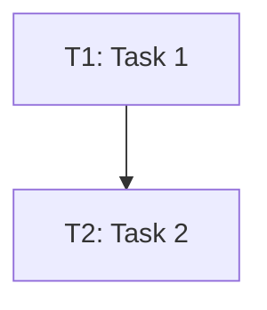

# Specification Templates

This document contains templates for task specifications and output formats used by the spec-generator-skill.

## Task Specification Template

```markdown
## Task N: [Task Name]

**Priority**: [High/Medium/Low]
**Estimated Effort**: [Small/Medium/Large]
**Dependencies**: [Task IDs, comma-separated]

### Description
[Clear, implementable description in 2-3 sentences]

### Acceptance Criteria
- [ ] Criterion 1 - specific, testable condition
- [ ] Criterion 2 - specific, testable condition
- [ ] Criterion 3 - specific, testable condition

### Implementation Notes
- [Technical detail or constraint]
- [API contract or interface to implement]
- [Edge case to handle]
- [Error handling requirement]

### Files to Create/Modify
- `path/to/file1.py` - [purpose]
- `path/to/file2.py` - [purpose]

### Testing Requirements
- Unit tests for [specific functions/modules]
- Integration tests for [specific flows]
- Edge cases to cover: [list]

### Definition of Done
- [ ] Code implemented and follows style guide
- [ ] All tests passing
- [ ] Documentation updated
- [ ] Code reviewed by at least one peer
```

## Output File Template (spec-output.md)

```markdown
# Project Specification: [Project Name]

**Generated**: [YYYY-MM-DD HH:MM:SS]
**Source**: [Description of requirements source]
**Total Tasks**: [N]

## Executive Summary

[2-3 paragraph overview of what will be built]

### Component Overview

| Component | Tasks | Priority Distribution |
|-----------|-------|----------------------|
| Component A | N | H:M:L |
| Component B | N | H:M:L |

## Task Dependency Graph



## Task Breakdown

### T1: Task Name 🔴

**Priority**: High | **Effort**: Medium | **Component**: Component Name

**Dependencies**: T2, T3

#### Description
[Description]

#### Acceptance Criteria
- [ ] Criterion

#### Implementation Notes
- Note

#### Files to Create
- `file.py`

#### Testing Requirements
- Test requirement

---

## Implementation Order

1. **T1**: Task Name (no dependencies)
2. **T2**: Task Name (depends on T1)
...

## Risk Assessment

- **Risk**: [Description] - [Mitigation]

---

*Generated by spec-generator-skill v1.0.0*
```

## Agent-Skill-Creator Format Template

```markdown
# Task: [Task Name]

**Project**: [Project Name]
**Task ID**: [T1]
**Priority**: [High/Medium/Low]
**Effort**: [Small/Medium/Large]
**Component**: [Component Name]

**Dependencies**: [T2, T3]

## Description

[Task description]

## Requirements

- Requirement 1
- Requirement 2

## Files to Create

- `path/to/file.py`

## Testing

- Test requirement
```

## Component Task Templates

### Data Layer

| Task | Description | Files |
|------|-------------|-------|
| Design database schema | Define tables, relationships, indexes | `schema.sql`, `migrations/` |
| Create data models | Implement ORM models/entities | `models/user.py`, `models/order.py` |
| Implement repository pattern | Data access abstraction | `repositories/user_repo.py` |
| Add data validation | Schema validation, constraints | `validators/` |
| Create migration scripts | Schema version management | `migrations/v1_*.sql` |

### Authentication

| Task | Description | Files |
|------|-------------|-------|
| Implement user registration | Sign-up with email verification | `auth/register.py` |
| Implement login functionality | Credential validation | `auth/login.py` |
| Create token generation | JWT/OAuth token creation | `auth/tokens.py` |
| Add password hashing | Secure password storage | `auth/passwords.py` |
| Implement session management | Session lifecycle | `auth/session.py` |
| Add OAuth2 support | Third-party auth | `auth/oauth.py` |

### API Layer

| Task | Description | Files |
|------|-------------|-------|
| Define API endpoints | RESTful route definitions | `api/routes.py` |
| Create request/response schemas | Validation and serialization | `api/schemas.py` |
| Implement route handlers | Business logic integration | `api/handlers.py` |
| Add request validation | Input sanitization | `api/validators.py` |
| Create error handling middleware | Consistent error responses | `api/errors.py` |
| Implement rate limiting | Request throttling | `api/rate_limit.py` |

### Business Logic

| Task | Description | Files |
|------|-------------|-------|
| Implement business rules | Domain logic | `services/rules.py` |
| Create service layer | Orchestration | `services/order_service.py` |
| Add business validations | Domain constraints | `services/validators.py` |
| Implement transactions | Atomic operations | `services/transactions.py` |
| Create workflow handlers | Multi-step processes | `services/workflows.py` |

### User Interface

| Task | Description | Files |
|------|-------------|-------|
| Design UI components | Reusable components | `components/Button.tsx` |
| Create form handlers | Input management | `forms/LoginForm.tsx` |
| Implement state management | Application state | `store/` |
| Add responsive styling | Mobile/responsive | `styles/` |
| Implement user feedback | Notifications, loading | `components/Toast.tsx` |
| Create navigation | Routing | `pages/`, `router.ts` |

## Customization

### Adding Custom Components

To add a custom component template, modify `task_breakdown.py`:

```python
COMPONENT_TASK_TEMPLATES = {
    "CustomComponent": {
        "base_tasks": [
            "Task 1",
            "Task 2",
        ],
        "files_pattern": "src/custom/",
        "effort": "Medium"
    }
}
```

### Modifying Task Templates

Task descriptions can be customized by editing the `descriptions` dictionary in `task_breakdown.py`:

```python
descriptions = {
    "ComponentName": {
        "TaskName": "Custom description here"
    }
}
```

### Output Format Options

Configure output in `config.json`:

```json
{
  "include_mermaid": true,
  "include_toc": true,
  "include_risk_assessment": true,
  "output_format": "standard"  // or "agent-format"
}
```
