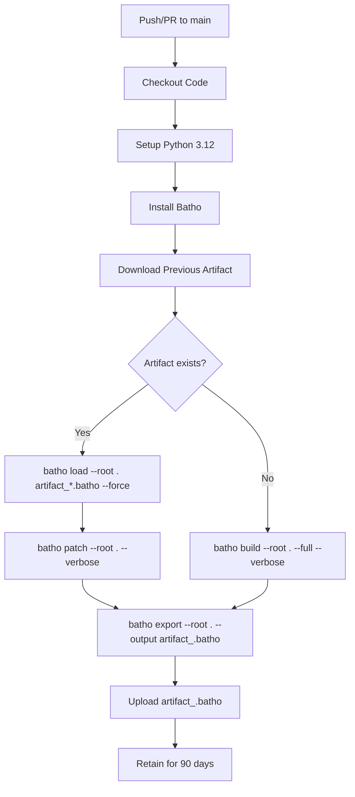
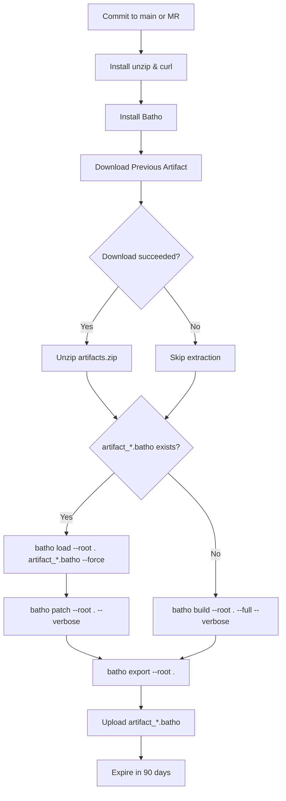

# CI/CD: Batho Fleet Indexer

## Overview

Batho's CI/CD integration provides automated code graph indexing for fleet-scale repositories. The workflows maintain an up-to-date Arrow IPC bundle (`.batho`) on every push or pull request, enabling AI agents to download pre-built code graphs without local indexing.

**Storage format**: Batho uses Apache Arrow IPC File format for its at-rest graph store (`bsg/current/*.ipc`) — plain, memory-mappable files with zero decompression overhead. The transport artifact (`artifact_*.batho`) is a ZIP of zstd-compressed IPC files, produced by `batho export` and consumed by `batho load`.

Two platform-specific configurations are provided: GitHub Actions and GitLab CI. Both implement the same incremental patching strategy:
1. Download previous artifact → `batho load` to restore the graph store
2. `batho patch` to re-index only changed files
3. `batho export` to produce the new transport artifact
4. Upload for subsequent runs and AI agent access

## Files Covered

| Filename | Purpose |
|---|---|
| `github-batho.yaml` | GitHub Actions workflow for automated Batho indexing |
| `gitlab-batho.yaml` | GitLab CI pipeline for automated Batho indexing |

## Workflow Specifications

### GitHub Actions (`github-batho.yaml`)

| Section | Key | Value | Purpose |
|---|---|---|---|
| **Trigger** | `on.push.branches` | `main` | Runs on pushes to main branch |
| **Trigger** | `on.pull_request.branches` | `main` | Runs on PRs targeting main |
| **Job** | `update-code-graph` | Single job | Orchestrates Batho indexing |
| **Runner** | `runs-on` | `ubuntu-latest` | Standard GitHub Actions runner |
| **Permissions** | `actions` | `read` | Download previous workflow artifacts |
| **Permissions** | `contents` | `read` | Checkout repository code |
| **Step 1** | `actions/checkout@v7` | - | Clone repository |
| **Step 2** | `actions/setup-python@v6` | `python: 3.12` | Install Python runtime |
| **Step 3** | `pip install batho` | - | Install Batho CLI |
| **Step 4** | `dawidd6/action-download-artifact@v21` | `artifact_<repo>.batho` | Download previous `.batho` artifact |
| **Step 5** | `batho load / build` | conditional | Restore graph or full index |
| **Step 5** | `batho patch` | if artifact existed | Incremental re-index |
| **Step 5** | `batho export --output` | always | Export Arrow IPC graph into transport artifact |
| **Step 6** | `actions/upload-artifact@v7` | `artifact_<repo>.batho` | Upload transport artifact |
| **Retention** | `retention-days` | `90` | Keep artifact for 90 days |

### GitLab CI (`gitlab-batho.yaml`)

| Section | Key | Value | Purpose |
|---|---|---|---|
| **Stages** | `stages` | `index` | Single-stage pipeline |
| **Job** | `batho-indexer` | `index` stage | Orchestrates Batho indexing |
| **Image** | `image` | `python:3.11` | Python 3.11 Docker image |
| **Rules** | `CI_COMMIT_BRANCH == "main"` | - | Run on main branch commits |
| **Rules** | `CI_PIPELINE_SOURCE == "merge_request_event"` | - | Run on merge requests |
| **Before Script** | `apt-get install unzip curl` | - | Install artifact extraction tools |
| **Before Script** | `pip install batho` | - | Install Batho CLI |
| **Script** | `curl` artifact download | conditional | Download previous `.batho` artifact |
| **Script** | `unzip` extraction | conditional | Extract downloaded artifact |
| **Script** | `batho load / build` | conditional | Restore graph or full index |
| **Script** | `batho patch` | if artifact existed | Incremental re-index |
| **Script** | `batho export` | always | Export Arrow IPC graph into transport artifact |
| **Artifacts** | `paths` | `artifact_*.batho` | Upload transport artifact |
| **Expiration** | `expire_in` | `90 days` | Keep artifact for 90 days |

---

## Execution Flow

### GitHub Actions Flowchart



### GitLab CI Flowchart



---

## Incremental Patching Strategy

Both workflows implement the same four-phase strategy:

### Phase 1: Artifact Retrieval

- **GitHub**: Uses `dawidd6/action-download-artifact@v21` to fetch the most recent `artifact_<repo>.batho` artifact from the same branch
- **GitLab**: Uses `curl` with `CI_JOB_TOKEN` to download artifacts from the last successful pipeline on the same branch
- **First Run**: Both platforms gracefully handle the absence of a previous artifact (GitHub via `continue-on-error: true`, GitLab via `curl --fail` with fallback)

### Phase 2: Load or Build

```bash
if ls artifact_*.batho 1> /dev/null 2>&1; then
    echo "✅ Found existing Batho artifact. Running incremental patch..."

    # Restore the Arrow IPC graph store from the transport artifact
    batho load --root . artifact_*.batho --force
    # Re-index only changed files
    batho patch --root . --verbose
else
    echo "⚠️ No existing artifact found. Running full build..."

    # Build the Arrow IPC graph from scratch (one-time setup)
    batho build --root . --full --verbose
fi
```

- **`batho load`**: Unpacks the transport ZIP, restores `artifact/` IPC tables and `bsg/current/` plain IPC graph store (memory-mappable, zero-copy reads)
- **`batho patch`**: Computes file hashes, compares against snapshot metadata, and only re-indexes changed files
- **`batho build --full`**: Creates the Arrow IPC graph from scratch, parsing all files in the repository

### Phase 3: Export Transport Artifact

```bash
# Always run after build or patch
batho export --root . --output "artifact_${REPO_NAME}.batho"
```

`batho export` produces `artifact_<dirname>.batho` — a ZIP containing:
- `<table>.ipc.zst` — zstd-compressed Arrow IPC for each active bundle table (`agent_views`, `rels_views`, `file_tracking`, etc.)
- `bsg/<name>.ipc.zst` — zstd-compressed `bsg/current/` plain IPC files (`entities`, `relationships`, `entity_dict`, `dangling`)

### Phase 4: Artifact Upload

- **GitHub**: Uploads `artifact_<repo>.batho` with 90-day retention
- **GitLab**: Uploads `artifact_*.batho` with branch-specific naming and 90-day expiration
- **AI Agent Access**: Agents run `batho load` to restore the full graph store without local indexing

---

## Platform-Specific Notes

### GitHub Actions

- **Workflow Filename**: Must match the `workflow` parameter in the download step (currently `github-batho.yaml`)
- **Artifact Naming**: Repo-based `artifact_<repo>.batho` name, consistent across runs for reliable downloads
- **Permissions**: Requires `actions: read` and `contents: read` for artifact access
- **Runner**: Uses `ubuntu-latest` with pre-installed Git and Python toolchain

### GitLab CI

- **Artifact API**: Uses GitLab's job artifacts API with `CI_JOB_TOKEN` for authentication
- **Branch Handling**: Downloads from `CI_COMMIT_REF_NAME` to support branch-specific artifact chains
- **Job Name**: Artifact download URL references `CI_JOB_NAME` (must match the job definition)
- **Image**: Uses official `python:3.11` Docker image with system package manager access

---

## Configuration Requirements

### Repository Setup

1. **Copy the appropriate workflow file** to your CI/CD configuration directory:
   - GitHub: `.github/workflows/github-batho.yaml` (copy from `cicd/github-batho.yaml`)
   - GitLab: `.gitlab-ci.yml` (rename from `gitlab-batho.yaml`)

2. **Install Batho** in your environment:
   - PyPI: `pip install batho`
   - Custom registry: Adjust the install command in the workflow

3. **Configure branch protection** (optional but recommended):
   - Require CI checks to pass before merging
   - Enable required status checks for the indexing job

### Environment Variables

No additional environment variables are required. Both workflows use platform-provided defaults:
- GitHub: `GITHUB_TOKEN` (automatically provided)
- GitLab: `CI_JOB_TOKEN`, `CI_API_V4_URL`, `CI_PROJECT_ID`, `CI_COMMIT_REF_NAME`, `CI_COMMIT_SHORT_SHA`

---

## Usage Patterns

### Fleet-Scale Indexing

For organizations managing multiple repositories:

1. **Standardize workflow names** across repositories for consistent artifact naming
2. **Centralize artifact storage** (optional) using GitHub/GitLab artifact APIs
3. **Configure longer retention** for frequently accessed repositories
4. **Monitor artifact size** to ensure storage quotas are not exceeded

### AI Agent Integration

Agents can download and load pre-built code graphs:

**GitHub:**
```bash
# Download latest artifact from main branch
gh api \
  /repos/{owner}/{repo}/actions/artifacts \
  --jq '.artifacts[] | select(.name|startswith("artifact_") and endswith(".batho")) | .id' \
  | xargs -I {} gh api \
  /repos/{owner}/{repo}/actions/artifacts/{}/zip \
  --output batho-artifact.zip
unzip batho-artifact.zip

# Restore the Arrow IPC graph store (fast-path: bsg/current/ extracted directly)
batho load --root . artifact_*.batho
```

**GitLab:**
```bash
# Download latest artifact from main branch
curl --header "JOB-TOKEN: $CI_JOB_TOKEN" \
  "${CI_API_V4_URL}/projects/${CI_PROJECT_ID}/jobs/artifacts/main/download?job=batho-indexer" \
  --output batho-database.zip
unzip batho-database.zip

# Restore the Arrow IPC graph store
batho load --root . artifact_*.batho
```

---

## Troubleshooting

### Common Issues

| Issue | Cause | Resolution |
|---|---|---|
| **Artifact download fails** | First run (no previous artifact) | Expected behavior; workflow continues with full build |
| **Artifact download fails** | Workflow filename mismatch | Ensure `workflow` parameter matches actual filename (GitHub) |
| **Artifact download fails** | Insufficient permissions | Verify `actions: read` permission (GitHub) or token scope (GitLab) |
| **`batho load` fails** | Schema version mismatch | Delete artifact to trigger full rebuild with `batho build --full` |
| **`batho patch` fails** | Corrupted or missing `bsg/current/`| Re-run `batho load` with `--force`, then `batho patch` |
| **Build timeout** | Large repository | Increase job timeout or split into multiple jobs |
| **Artifact size quota** | Bundle exceeds storage limits | Implement cleanup strategy or use external storage |

### Debug Mode

Both workflows support `--verbose` flag for detailed logging:

```yaml
# In the script section
batho patch --root . --verbose
# or
batho build --root . --full --verbose
```

---

## Best Practices

1. **Branch Strategy**: Run indexing on main branch and all merge requests to catch issues early
2. **Artifact Retention**: Balance retention period (90 days default) with storage costs
3. **Incremental First**: Always prefer `batho load` + `batho patch` over full builds for faster CI cycles
4. **Monitor Performance**: Track job duration to identify repositories needing optimization
5. **Version Pinning**: Pin Python version (`3.11`) and Batho version for reproducible builds
6. **Artifact Naming**: Use consistent naming conventions for cross-repository tooling
7. **Security**: Review permissions regularly; principle of least privilege for token access
