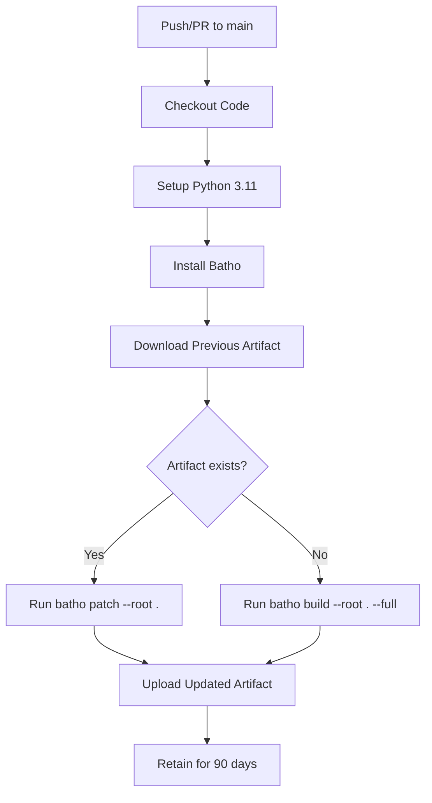
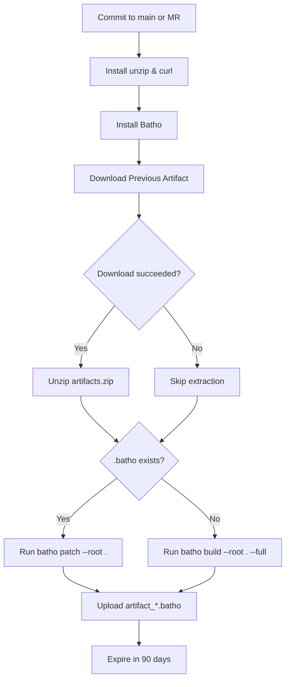

# CI/CD: Batho Fleet Indexer

## Overview

Batho's CI/CD integration provides automated code graph indexing for fleet-scale repositories. The workflows maintain an up-to-date SQLite database (`.batho`) on every push or pull request, enabling AI agents to download pre-built code graphs without local indexing. Two platform-specific configurations are provided: GitHub Actions and GitLab CI. Both implement the same incremental patching strategy—downloading the previous artifact, running hash-based incremental updates, and uploading the refreshed database for subsequent runs.

## Files Covered

| Filename | Size (bytes) | Purpose |
|---|---|---|
| `github-batho.yaml` | 2 560 | GitHub Actions workflow for automated Batho indexing |
| `gitlab-batho.yaml` | 2 048 | GitLab CI pipeline for automated Batho indexing |

## Workflow Specifications

### GitHub Actions (`github-batho.yaml`)

| Section | Key | Value | Purpose |
|---|---|---|---|
| **Trigger** | `on.push.branches` | `main` | Runs on pushes to main branch |
| **Trigger** | `on.pull_request.branches` | `main` | Runs on PRs targeting main |
| **Job** | `update-code-graph` | Single job | Orchestrates Batho indexing |
| **Runner** | `runs-on` | `ubuntu-latest` | Standard GitHub Actions runner |
| **Permissions** | `actions` | `read` | Download previous workflow artifacts |
| **Permissions** | `contents` | `read` | Checkout repository code |
| **Step 1** | `actions/checkout@v4` | - | Clone repository |
| **Step 2** | `actions/setup-python@v5` | `python: 3.11` | Install Python runtime |
| **Step 3** | `pip install batho` | - | Install Batho CLI |
| **Step 4** | `dawidd6/action-download-artifact@v6` | `batho-database` | Download previous `.batho` artifact |
| **Step 5** | `batho patch / build` | conditional | Incremental or full index |
| **Step 6** | `actions/upload-artifact@v4` | `batho-database` | Upload updated `.batho` |
| **Retention** | `retention-days` | `90` | Keep artifact for 90 days |

### GitLab CI (`gitlab-batho.yaml`)

| Section | Key | Value | Purpose |
|---|---|---|---|
| **Stages** | `stages` | `index` | Single-stage pipeline |
| **Job** | `batho-indexer` | `index` stage | Orchestrates Batho indexing |
| **Image** | `image` | `python:3.11` | Python 3.11 Docker image |
| **Rules** | `CI_COMMIT_BRANCH == "main"` | - | Run on main branch commits |
| **Rules** | `CI_PIPELINE_SOURCE == "merge_request_event"` | - | Run on merge requests |
| **Before Script** | `apt-get install unzip curl` | - | Install artifact extraction tools |
| **Before Script** | `pip install batho` | - | Install Batho CLI |
| **Script** | `curl` artifact download | conditional | Download previous `.batho` artifact |
| **Script** | `unzip` extraction | conditional | Extract downloaded artifact |
| **Script** | `batho patch / build` | conditional | Incremental or full index |
| **Artifacts** | `paths` | `artifact_*.batho` | Upload updated `.batho` |
| **Expiration** | `expire_in` | `90 days` | Keep artifact for 90 days |

---

## Execution Flow

### GitHub Actions Flowchart



### GitLab CI Flowchart



---

## Incremental Patching Strategy

Both workflows implement the same three-phase strategy:

### Phase 1: Artifact Retrieval

- **GitHub**: Uses `dawidd6/action-download-artifact@v6` to fetch the most recent `batho-database` artifact from the same branch
- **GitLab**: Uses `curl` with `CI_JOB_TOKEN` to download artifacts from the last successful pipeline on the same branch
- **First Run**: Both platforms gracefully handle the absence of a previous artifact (GitHub via `continue-on-error: true`, GitLab via `curl --fail` with fallback)

### Phase 2: Conditional Execution

```bash
# Both platforms execute this logic
if ls artifact_*.batho 1> /dev/null 2>&1; then
    echo "✅ Found existing Batho database. Running incremental patch..."
    batho patch --root . --verbose
else
    echo "⚠️ No existing database found. Running full build..."
    batho build --root . --full --verbose
fi
```

- **Incremental Patch**: `batho patch` computes file hashes, compares against snapshot metadata, and only re-indexes changed files
- **Full Build**: `batho build --full` creates the database from scratch, parsing all files in the repository

### Phase 3: Artifact Upload

- **GitHub**: Uploads `artifact_*.batho` as `batho-database` with 90-day retention
- **GitLab**: Uploads `artifact_*.batho` with branch-specific naming and 90-day expiration
- **AI Agent Access**: Agents can download the pre-built database to avoid local indexing overhead

---

## Platform-Specific Notes

### GitHub Actions

- **Workflow Filename**: Must match the `workflow` parameter in the download step (currently `batho-ci.yml`)
- **Artifact Naming**: Consistent `batho-database` name across runs for reliable downloads
- **Permissions**: Requires `actions: read` and `contents: read` for artifact access
- **Runner**: Uses `ubuntu-latest` with pre-installed Git and Python toolchain

### GitLab CI

- **Artifact API**: Uses GitLab's job artifacts API with `CI_JOB_TOKEN` for authentication
- **Branch Handling**: Downloads from `CI_COMMIT_REF_NAME` to support branch-specific artifact chains
- **Job Name**: Artifact download URL references `CI_JOB_NAME` (must match the job definition)
- **Image**: Uses official `python:3.11` Docker image with system package manager access

---

## Configuration Requirements

### Repository Setup

1. **Copy the appropriate workflow file** to your CI/CD configuration directory:
   - GitHub: `.github/workflows/batho-ci.yml` (rename from `github-batho.yaml`)
   - GitLab: `.gitlab-ci.yml` (rename from `gitlab-batho.yaml`)

2. **Install Batho** in your environment:
   - PyPI: `pip install batho`
   - Custom registry: Adjust the install command in the workflow

3. **Configure branch protection** (optional but recommended):
   - Require CI checks to pass before merging
   - Enable required status checks for the indexing job

### Environment Variables

No additional environment variables are required. Both workflows use platform-provided defaults:
- GitHub: `GITHUB_TOKEN` (automatically provided)
- GitLab: `CI_JOB_TOKEN`, `CI_API_V4_URL`, `CI_PROJECT_ID`, `CI_COMMIT_REF_NAME`, `CI_COMMIT_SHORT_SHA`

---

## Usage Patterns

### Fleet-Scale Indexing

For organizations managing multiple repositories:

1. **Standardize workflow names** across repositories for consistent artifact naming
2. **Centralize artifact storage** (optional) using GitHub/GitLab artifact APIs
3. **Configure longer retention** for frequently accessed repositories
4. **Monitor artifact size** to ensure storage quotas are not exceeded

### AI Agent Integration

Agents can download pre-built code graphs:

**GitHub:**
```bash
# Download latest artifact from main branch
gh api \
  /repos/{owner}/{repo}/actions/artifacts \
  --jq '.artifacts[] | select(.name=="batho-database") | .id' \
  | xargs -I {} gh api \
  /repos/{owner}/{repo}/actions/artifacts/{}/zip \
  --output batho-database.zip
unzip batho-database.zip
```

**GitLab:**
```bash
# Download latest artifact from main branch
curl --header "JOB-TOKEN: $CI_JOB_TOKEN" \
  "${CI_API_V4_URL}/projects/${CI_PROJECT_ID}/jobs/artifacts/main/download?job=batho-indexer" \
  --output batho-database.zip
unzip batho-database.zip
```

---

## Troubleshooting

### Common Issues

| Issue | Cause | Resolution |
|---|---|---|
| **Artifact download fails** | First run (no previous artifact) | Expected behavior; workflow continues with full build |
| **Artifact download fails** | Workflow filename mismatch | Ensure `workflow` parameter matches actual filename (GitHub) |
| **Artifact download fails** | Insufficient permissions | Verify `actions: read` permission (GitHub) or token scope (GitLab) |
| **Patch command fails** | Corrupted database artifact | Delete artifact manually to trigger full rebuild |
| **Build timeout** | Large repository | Increase job timeout or split into multiple jobs |
| **Artifact size quota** | Database exceeds limits | Implement cleanup strategy or use external storage |

### Debug Mode

Both workflows support `--verbose` flag for detailed logging:

```yaml
# In the script section
batho patch --root . --verbose
# or
batho build --root . --full --verbose
```

---

## Best Practices

1. **Branch Strategy**: Run indexing on main branch and all merge requests to catch issues early
2. **Artifact Retention**: Balance retention period (90 days default) with storage costs
3. **Incremental First**: Always prefer `batho patch` over full builds for faster CI cycles
4. **Monitor Performance**: Track job duration to identify repositories needing optimization
5. **Version Pinning**: Pin Python version (`3.11`) and Batho version for reproducible builds
6. **Artifact Naming**: Use consistent naming conventions for cross-repository tooling
7. **Security**: Review permissions regularly; principle of least privilege for token access
