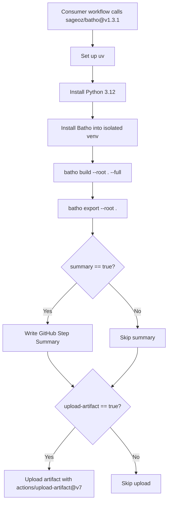

# Composite Action: Batho Index

The composite action (`action.yml`) is a self-contained GitHub Action that sets up Batho, indexes your repository, and uploads the transport artifact. It can be invoked directly from any workflow.

## How It Works



## Inputs

| Input | Type | Required | Default | Description |
|---|---|---|---|---|
| `root` | string | No | `.` | Path to the repo root to index (relative to `GITHUB_WORKSPACE`). |
| `python-version` | string | No | `3.12` | Python version to install via uv. |
| `batho-ref` | string | No | `""` | How to install Batho:<br/>- `""` — from the action's own checkout<br/>- git ref — `"git+https://github.com/sageoz/batho@<ref>"`<br/>- `"pypi"` — install from PyPI via `pip install batho` |
| `verbose` | string | No | `false` | Run Batho in verbose/debug mode (`true` or `false`). |
| `max-workers` | string | No | `""` | Max parallel workers for parsing (default: CPU count). |
| `max-file-size-kb` | string | No | `""` | Skip files exceeding this size in kilobytes. |
| `artifact-name` | string | No | `batho-index` | Name of the uploaded workflow artifact. |
| `artifact-retention-days` | string | No | `7` | How long (in days) to retain the uploaded artifact. |
| `upload-artifact` | string | No | `true` | Upload the output ZIP as a workflow artifact (`true` or `false`). |
| `summary` | string | No | `true` | Write a GitHub Step Summary (`true` or `false`). |

## Outputs

| Output | Description |
|---|---|
| `zip-path` | Absolute path to the produced `.batho` ZIP package. |
| `output-dir` | Absolute path to the directory containing the ZIP package. |
| `index-id` | The Batho index run ID produced by this build. |

## Usage Example

```yaml
name: Index Repository

on:
  push:
    branches: [main]

jobs:
  batho:
    runs-on: ubuntu-latest
    steps:
      - name: Checkout
        uses: actions/checkout@v7
        with:
          fetch-depth: 0

      - name: Run Batho Index
        uses: sageoz/batho@v1.3.1
        with:
          root: "."
          python-version: "3.12"
          batho-ref: "pypi"
          verbose: "false"
          artifact-name: batho-index
          artifact-retention-days: "7"
          upload-artifact: "true"
          summary: "true"

      - name: Use output path
        run: |
          echo "Batho artifact: ${{ steps.batho.outputs.zip-path }}"
          echo "Index ID: ${{ steps.batho.outputs.index-id }}"
```

## Installation Modes

### Mode 1: From Action Checkout (default)

Leave `batho-ref` empty. The action installs Batho from its own checkout using `uv pip install`:

```yaml
with:
  batho-ref: ""
```

### Mode 2: From PyPI

Set `batho-ref` to `"pypi"` to install the latest published version:

```yaml
with:
  batho-ref: "pypi"
```

### Mode 3: From Git Ref

Pin a specific commit, tag, or branch:

```yaml
with:
  batho-ref: "v1.3.1"
```

## Step Summary

When `summary: "true"`, the action writes a markdown summary to the GitHub Step Summary panel:

| Metric | Value |
| --- | --- |
| **Files indexed** | 1,247 |
| **Entities extracted** | 8,932 |
| **Relationships** | 24,105 |
| **Transport ZIP** | `artifact_repo.batho` |
| **ZIP Size** | 4.2 MiB |

This is useful for quickly verifying index health in the Actions UI without downloading artifacts.
