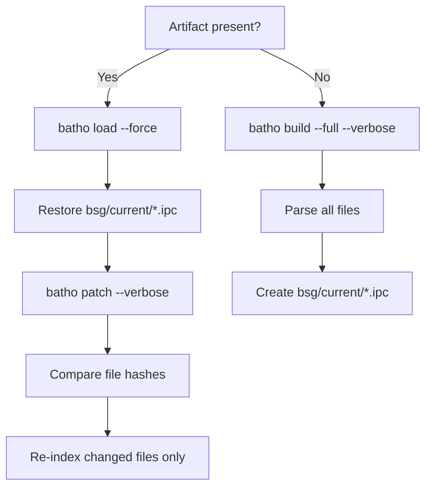
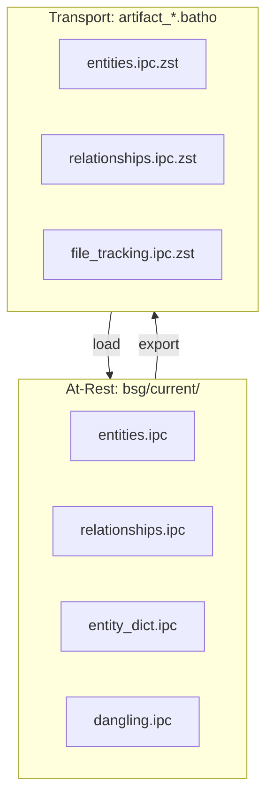

# Fleet Indexer Deep Dive

Both GitHub Actions and GitLab CI implement the same four-phase incremental patching strategy. This page explains the internals, data flow, and troubleshooting.

## Four-Phase Strategy

### Phase 1: Artifact Retrieval

- **GitHub**: `dawidd6/action-download-artifact@v21` fetches the most recent `artifact_<repo>.batho` artifact from the same branch.
- **GitLab**: `curl` with `CI_JOB_TOKEN` downloads from the last successful pipeline.
- **First run**: Both gracefully handle missing artifacts and fall through to a full build.

### Phase 2: Load or Build

- **`batho load`**: Unpacks the transport ZIP, restores `artifact/` tables and `bsg/current/` plain IPC store.
- **`batho patch`**: Computes file hashes, compares against snapshot metadata, re-indexes only changed files.
- **`batho build --full`**: Creates the graph from scratch.

### Phase 3: Export

`batho export` produces a ZIP containing:

- `<table>.ipc.zst` — compressed bundle tables (`agent_views`, `rels_views`, `file_tracking`, etc.)
- `bsg/<name>.ipc.zst` — compressed graph store files (`entities`, `relationships`, `entity_dict`, `dangling`)

### Phase 4: Upload

- **GitHub**: `actions/upload-artifact@v7` as `artifact_<repo>.batho`, 90-day retention.
- **GitLab**: `artifacts.paths`, branch-specific name, 90-day expiration.
- **Agents**: Run `batho load` to restore the graph without local indexing.

## Incremental vs Full Build

| Scenario | Runs | Time |
|---|---|---|
| First run | `build --full` | O(all files) |
| Small change | `load` + `patch` | O(changed files) |
| Large refactor | `load` + `patch` | O(changed files) |
| Schema upgrade | `build --full` (delete old artifact first) | O(all files) |

## Patch Internals

1. Read previous snapshot from `.batho/artifact/meta.json`.
2. Compute content hash for every tracked file.
3. Compare against stored hashes.
4. Re-index only files with differing hashes.
5. Write new snapshot with updated hashes.

## Storage Format

- **At-rest**: Plain Arrow IPC — zero decompression, memory-mappable.
- **Transport**: zstd-compressed ZIP for efficient network transfer.

## Troubleshooting

| Issue | Cause | Resolution |
|---|---|---|
| Artifact download fails | First run (no previous artifact) | Expected — falls through to full build |
| Workflow filename mismatch | `workflow` param doesn't match file | Ensure `workflow: github-batho.yaml` matches your filename |
| `batho load` fails | Schema version mismatch | Delete artifact to trigger full rebuild |
| `batho patch` fails | Corrupted `bsg/current/` | Re-run `batho load --force`, then `batho patch` |
| Build timeout | Large repository | Increase `timeout-minutes` / `timeout` |
| Artifact size quota | Bundle exceeds storage limits | Implement cleanup or use external storage |

## Best Practices

1. **Branch strategy**: Run on `main` and all merge requests to catch issues early.
2. **Retention**: Balance 90-day default with storage costs.
3. **Incremental first**: Always prefer `load` + `patch` over full builds.
4. **Version pinning**: Pin Python (`3.12`) and Batho (`v1.2.0`) for reproducible builds.
5. **Monitor performance**: Track job duration to identify repositories needing optimization.
