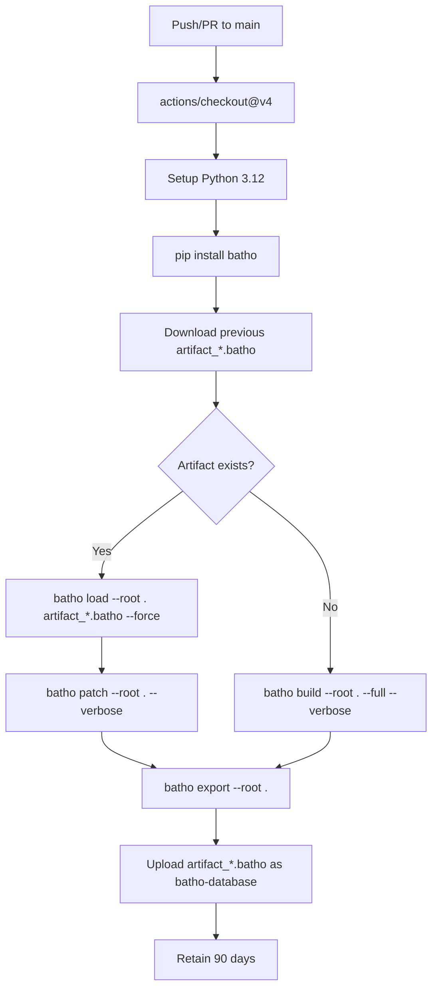

# GitHub Actions Fleet Indexer

The GitHub Actions workflow (`github-batho.yaml`) automatically indexes your repository on every push and pull request to `main`, using an incremental patching strategy to keep CI cycles fast.

## Workflow



## Full Workflow YAML

Copy the following into `.github/workflows/batho-ci.yml`:

```yaml
name: Batho Fleet Indexer

on:
  push:
    branches:
      - main
  pull_request:
    branches:
      - main

concurrency:
  group: batho-fleet-${{ github.workflow }}-${{ github.ref }}
  cancel-in-progress: true

jobs:
  update-code-graph:
    runs-on: ubuntu-latest
    timeout-minutes: 30
    permissions:
      actions: read    # Required to download previous artifacts
      contents: read   # Required to checkout code

    steps:
      - name: Checkout Code
        uses: actions/checkout@v4

      - name: Setup Python
        uses: actions/setup-python@v5
        with:
          python-version: '3.12'

      - name: Install Batho
        run: pip install batho

      - name: Download Previous Batho Artifact
        # Fetches the artifact from the last successful run on this branch
        uses: dawidd6/action-download-artifact@v6
        continue-on-error: true # Will fail on the very first run, which is expected
        with:
          github_token: ${{ secrets.GITHUB_TOKEN }}
          workflow: batho-ci.yml # MUST match the filename of this yaml file
          branch: ${{ github.ref_name }}
          name: batho-database
          path: .

      - name: Run Batho (Patch or Build)
        run: |
          # Batho stores the code graph as Arrow IPC files packed into artifact_<dirname>.batho
          if ls artifact_*.batho 1> /dev/null 2>&1; then
            echo "✅ Found existing Batho artifact. Running incremental patch..."
            batho load --root . artifact_*.batho --force
            batho patch --root . --verbose
          else
            echo "⚠️ No existing artifact found. Running full build..."
            batho build --root . --full --verbose
          fi
          # Export the updated .batho/ bundle into a transport artifact
          batho export --root .

      - name: Upload Updated Artifact
        uses: actions/upload-artifact@v4
        with:
          name: batho-database
          path: artifact_*.batho
          retention-days: 90
```

## Key Configuration

| Key | Value | Purpose |
|---|---|---|
| **Triggers** | `push` + `pull_request` to `main` | Run on every commit and PR |
| **Concurrency** | `cancel-in-progress: true` | Prevent redundant overlapping runs |
| **Timeout** | `30 minutes` | Fail fast if something hangs |
| **Runner** | `ubuntu-latest` | Standard GitHub-hosted runner |
| **Permissions** | `actions: read`, `contents: read` | Minimal permissions principle |
| **Install** | `pip install batho` | Pulls latest stable from PyPI |
| **Artifact name** | `batho-database` | Consistent across runs for reliable downloads |
| **Retention** | `90 days` | Long enough for agent access |

## First-Run Behavior

On the very first run there is no previous artifact, so the download step fails gracefully (`continue-on-error: true`) and the workflow falls through to a full `batho build --full`.

## AI Agent Access

Agents can download and restore the graph:

```bash
# Download latest artifact from main branch
gh api \
  /repos/{owner}/{repo}/actions/artifacts \
  --jq '.artifacts[] | select(.name=="batho-database") | .id' \
  | xargs -I {} gh api \
  /repos/{owner}/{repo}/actions/artifacts/{}/zip \
  --output batho-database.zip
unzip batho-database.zip

# Restore the Arrow IPC graph store
batho load --root . artifact_*.batho
```

## Troubleshooting

| Issue | Cause | Resolution |
|---|---|---|
| Artifact download fails | First run (no previous artifact) | Expected — workflow continues with full build |
| Workflow filename mismatch | `workflow` parameter doesn't match actual filename | Ensure `workflow: batho-ci.yml` matches your file |
| `batho load` fails | Schema version mismatch | Delete artifact to trigger full rebuild |
| Build timeout | Very large repository | Increase `timeout-minutes` or split into multiple jobs |
