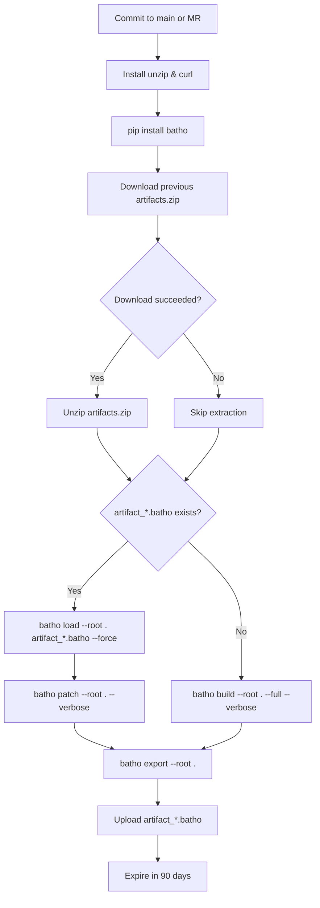

# GitLab CI Fleet Indexer

The GitLab CI pipeline (`gitlab-batho.yaml`) provides the same incremental patching strategy as the GitHub Actions workflow, adapted for GitLab's CI/CD system.

## Pipeline Flow



## Full Pipeline YAML

Copy the following into `.gitlab-ci.yml`:

```yaml
stages:
  - index

batho-indexer:
  stage: index
  image: python:3.12
  timeout: 30 minutes
  rules:
    # Run on changes to main, or on any Merge Request
    - if: '$CI_COMMIT_BRANCH == "main"'
    - if: '$CI_PIPELINE_SOURCE == "merge_request_event"'
  before_script:
    # Install unzip for extracting GitLab artifacts, then install Batho
    - apt-get update && apt-get install -y unzip curl
    - pip install batho
  script:
    - echo "Attempting to download previous Batho artifact..."
    - |
      # Fetch the artifact zip from the last successful pipeline on this branch
      # Uses --fail to silently skip if this is the very first run
      curl -s --fail --location --output artifacts.zip \
        --header "JOB-TOKEN: $CI_JOB_TOKEN" \
        "${CI_API_V4_URL}/projects/${CI_PROJECT_ID}/jobs/artifacts/${CI_COMMIT_REF_NAME}/download?job=${CI_JOB_NAME}" || echo "No previous artifact found."

    - |
      # Extract the database if the download was successful
      if [ -f artifacts.zip ]; then
        echo "Unzipping previous artifact..."
        unzip -o artifacts.zip
        rm artifacts.zip
      fi

    - |
      # Batho stores the code graph as Arrow IPC files packed into artifact_<dirname>.batho
      if ls artifact_*.batho 1> /dev/null 2>&1; then
        echo "✅ Found existing Batho artifact. Running incremental patch..."
        batho load --root . artifact_*.batho --force
        batho patch --root . --verbose
      else
        echo "⚠️ No existing artifact found. Running full build..."
        batho build --root . --full --verbose
      fi

      # Export the updated .batho/ bundle into a transport artifact
      batho export --root .

  artifacts:
    name: "batho-database-$CI_COMMIT_SHORT_SHA"
    paths:
      - artifact_*.batho
    expire_in: 90 days
```

## Key Configuration

| Key | Value | Purpose |
|---|---|---|
| **Stage** | `index` | Single-stage pipeline |
| **Image** | `python:3.12` | Official Python Docker image |
| **Timeout** | `30 minutes` | Fail fast if indexing hangs |
| **Rules** | `main` branch + MR events | Run on commits and merge requests |
| **Before script** | `apt-get install unzip curl` | Install artifact extraction tools |
| **Install** | `pip install batho` | Pulls latest stable from PyPI |
| **Artifact name** | `batho-database-$CI_COMMIT_SHORT_SHA` | Unique per commit |
| **Expiration** | `90 days` | Long enough for agent access |

## First-Run Behavior

On the first pipeline run, the artifact download (`curl --fail`) returns a 404 and the script continues to a full `batho build --full`.

## AI Agent Access

Agents can download and restore the graph:

```bash
# Download latest artifact from main branch
curl --header "JOB-TOKEN: $CI_JOB_TOKEN" \
  "${CI_API_V4_URL}/projects/${CI_PROJECT_ID}/jobs/artifacts/main/download?job=batho-indexer" \
  --output batho-database.zip
unzip batho-database.zip

# Restore the Arrow IPC graph store
batho load --root . artifact_*.batho
```

## Platform Notes

- **Branch Handling**: Downloads from `CI_COMMIT_REF_NAME` to support branch-specific artifact chains.
- **Job Name**: The artifact download URL references `CI_JOB_NAME` — it must match the job definition (`batho-indexer`).
- **Token**: Uses `CI_JOB_TOKEN` for authenticated artifact access — no extra secrets needed.

## Troubleshooting

| Issue | Cause | Resolution |
|---|---|---|
| Artifact download fails | First run (no previous artifact) | Expected — pipeline continues with full build |
| `batho load` fails | Schema version mismatch | Delete artifact to trigger full rebuild |
| Build timeout | Large repository | Increase `timeout` or split into multiple jobs |
| Artifact size quota | Bundle exceeds storage limits | Implement cleanup or use external storage |
