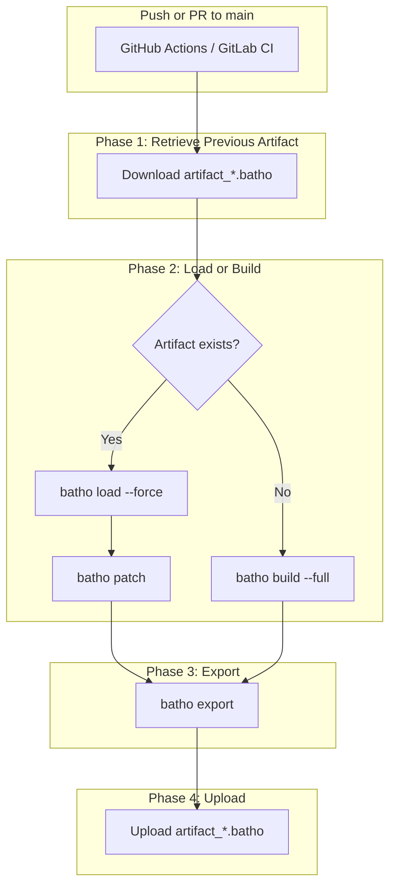

# CI/CD Integration

Batho's CI/CD integrations let you automatically build, patch, and store code graph indexes on every commit. This enables fleet-scale repository indexing and gives AI agents instant access to pre-built code graphs without local parsing.

## What It Solves

- **No local indexing**: AI agents download a pre-built `.batho` transport artifact instead of parsing the entire repository.
- **Incremental updates**: Only changed files are re-indexed, keeping CI cycles fast.
- **Cross-platform**: Works on both GitHub Actions and GitLab CI.
- **Zero-config for consumers**: Drop a starter workflow into your repo and go.

## Architecture Overview

## Integration Options

| Approach | Best For | File |
|---|---|---|
| **GitHub Fleet Indexer** | Repositories you control | [`github-batho.yaml`](/docs/cicd/github-actions) |
| **GitLab CI Fleet Indexer** | GitLab-hosted repos | [`gitlab-batho.yaml`](/docs/cicd/gitlab-ci) |
| **Composite Action** | Reusable, configurable indexing | [`action.yml`](/docs/cicd/composite-action) |
| **Reusable Workflow** | One-liner consumer integration | [`batho-index.yml`](/docs/cicd/reusable-workflow) |
| **Starter Template** | Quick copy-paste setup | [`starter-batho.yml`](/docs/cicd/starter-template) |

## Storage Format

Batho stores the code graph as Apache Arrow IPC files (`bsg/current/*.ipc`) — plain, memory-mappable files with zero decompression overhead. The transport artifact (`artifact_*.batho`) is a ZIP of zstd-compressed IPC files, produced by `batho export` and consumed by `batho load`.

## Next Steps

- **[GitHub Actions](/docs/cicd/github-actions)** — Set up fleet indexing on GitHub
- **[GitLab CI](/docs/cicd/gitlab-ci)** — Set up fleet indexing on GitLab
- **[Composite Action](/docs/cicd/composite-action)** — Deep dive into the Batho Index action
- **[Reusable Workflow](/docs/cicd/reusable-workflow)** — Call Batho from any repo in one line
- **[Starter Template](/docs/cicd/starter-template)** — Copy-paste into your repo
- **[Fleet Indexer Deep Dive](/docs/cicd/fleet-indexer)** — Understand the incremental patching strategy
