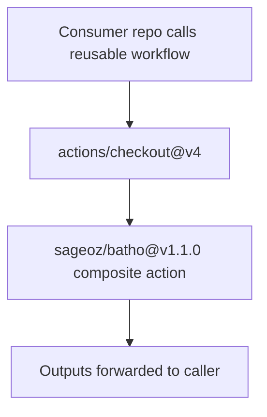

# Reusable Workflow

The reusable workflow (`batho-index.yml`) wraps the composite action into a callable workflow. Consumer repositories can invoke it in a single line, with no need to manage steps manually.

## How It Works



## Calling Syntax

Add this to any workflow in a consumer repository:

```yaml
jobs:
  batho:
    uses: sageoz/batho/.github/workflows/batho-index.yml@v1.1.0
    with:
      root: "."
      python-version: "3.12"
      batho-ref: "pypi"
      verbose: "false"
      artifact-name: batho-index
      artifact-retention-days: "7"
      upload-artifact: "true"
      summary: "true"
      runs-on: "ubuntu-latest"
```

## Inputs

The reusable workflow accepts all inputs from the composite action, plus one extra:

| Input | Type | Required | Default | Description |
|---|---|---|---|---|
| `root` | string | No | `.` | Path to the repo root to index. |
| `python-version` | string | No | `3.12` | Python version to install. |
| `batho-ref` | string | No | `""` | Git ref of Batho to install, or empty for action checkout. |
| `verbose` | string | No | `false` | Run in verbose mode. |
| `max-workers` | string | No | `""` | Max parallel workers for parsing. |
| `max-file-size-kb` | string | No | `""` | Skip files exceeding this size. |
| `artifact-name` | string | No | `batho-index` | Name of the uploaded artifact. |
| `artifact-retention-days` | string | No | `7` | Artifact retention in days. |
| `upload-artifact` | string | No | `true` | Upload the output ZIP. |
| `summary` | string | No | `true` | Write a GitHub Step Summary. |
| `runs-on` | string | No | `ubuntu-latest` | Runner label for the job. |

## Outputs

| Output | Description |
|---|---|
| `zip-path` | Absolute path to the produced `.batho` ZIP package. |
| `output-dir` | Absolute path to the directory containing the ZIP package. |
| `index-id` | Batho index run ID produced by this build. |

## Complete Consumer Example

```yaml
name: Batho Index

on:
  push:
    branches: [main]
  pull_request:
    branches: [main]

permissions:
  contents: read

jobs:
  batho:
    uses: sageoz/batho/.github/workflows/batho-index.yml@v1.1.0
    with:
      root: "."
      python-version: "3.12"
      batho-ref: "pypi"
      artifact-name: batho-index
      artifact-retention-days: "7"
```

## Permissions

The reusable workflow declares:

```yaml
permissions:
  contents: read
```

Consumer workflows only need `contents: read` to check out the repository. The composite action handles artifact upload internally.

## Why Use the Reusable Workflow?

- **One-liner integration**: No step definitions needed.
- **Always up to date**: Pin to a tag (`v1.1.0`) or follow `main` for latest features.
- **Centralized defaults**: Batho maintainers can update defaults without touching consumer repos.
