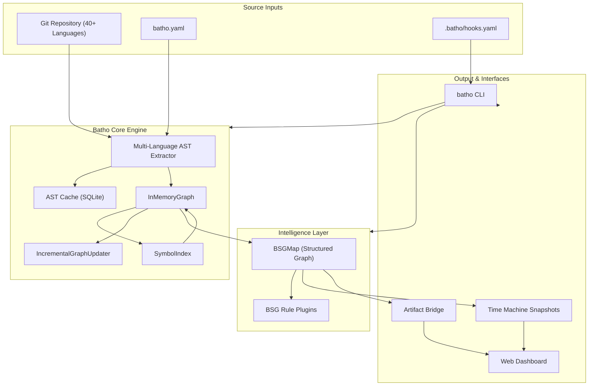

# Batho Documentation

**Batho** (Bidirectional AST Traversal & Hypergraph Orchestrator) is a deterministic, production-grade code intelligence engine that transforms raw codebases into queryable, time-aware structured hypergraphs.

## What Batho Does

| Capability | Description |
|-----------|-------------|
| **AST Extraction** | Parse 40+ languages via tree-sitter into structured entities and relationships |
| **Code Graph** | Build in-memory hypergraphs with cross-file symbol resolution |
| **BSG Compression** | Compress code intelligence into token-budgeted formats for LLM injection |
| **Time Machine** | Snapshot, diff, and incrementally patch code intelligence over time |
| **Git Hooks** | Enterprise-grade client-side hook automation with YAML configuration |
| **Dashboard** | Interactive web UI for exploring hypergraphs, files, metrics, and snapshots |
| **Artifact Bridge** | REST API + MCP server for IDE and tool integrations |

## Quick Links

- [Getting Started](./getting-started/quick-start) — Install and run Batho in 30 seconds
- [Whitepaper](./whitepaper) — Deep technical reference for every subsystem
- [CLI Reference](./cli-reference) — Complete command documentation
- [GitHub](https://github.com/sageoz/batho) — Source code and issues
- [PyPI](https://pypi.org/project/batho/) — Install from Python Package Index

## Architecture at a Glance

## Status

| Metric | Value |
|--------|-------|
| Supported Languages | 40+ via tree-sitter |
| Context Compression | Up to 10x for LLM injection |
| Incremental Patch Speed | 10–100x faster than full re-index |
| Test Coverage | 859+ automated tests |
| Cache Hit Rate | >95% on typical PR-sized changes |
| Snapshot Retention | 90 days default, configurable |
| Max Indexed Files | 200,000 per repository |

---

Ready to dive in? Start with the [Quick Start Guide](./getting-started/quick-start).
