# Batho MCP Server

The Batho MCP (Model Context Protocol) server exposes your codebase's structural intelligence to AI agents. Instead of agents issuing dozens of `grep` and `read` calls to understand your code, they query pre-built Arrow IPC artifacts with sub-millisecond latency and minimal token consumption.

## What It Does

| Capability | Description |
|-----------|-------------|
| **Zero-copy reads** | Memory-mapped Arrow IPC — no database, no parsing at query time |
| **Dual-output** | Compact markdown for the model (34–38% fewer tokens) + structured JSON for programmatic use |
| **10 tools** | `list_repos`, `add_repo`, `remove_repo`, `graph_overview`, `graph_query`, `get_entity`, `trace_path`, `get_file_graph`, `search_entities`, `get_delta` |
| **Community detection** | Leiden clustering produces architectural summaries at build time |
| **Multi-repo registry** | Register multiple repos via `add_repo` tool — one MCP config entry serves all repos |
| **Incremental updates** | After `batho patch`, the server serves the latest generation — no restart needed |
| **Token budgeting** | 25K token default with automatic truncation and pagination hints |

## Architecture

```mermaid
%%{init: {'theme': 'base', 'themeVariables': { 'primaryColor': '#e3f2fd', 'primaryTextColor': '#1565c0', 'primaryBorderColor': '#1976d2', 'lineColor': '#42a5f5', 'secondaryColor': '#f3e5f5', 'tertiaryColor': '#e8f5e9'}}}%%
flowchart LR
    Code["Source Code"] --> Build["batho build"]
    Build --> Arrow["Arrow IPC Artifacts"]
    Arrow --> MCP["MCP Server (stdio)"]
    Registry["~/.batho/mcp-repos.json"] --> MCP
    MCP --> Agent["AI Agent"]
    Agent -->|add_repo / list_repos| Registry

    style Code fill:#e3f2fd,stroke:#1976d2,stroke-width:2px
    style Build fill:#e8f5e9,stroke:#388e3c,stroke-width:2px
    style Arrow fill:#fff3e0,stroke:#f57c00,stroke-width:2px
    style MCP fill:#fce4ec,stroke:#c2185b,stroke-width:2px
    style Agent fill:#f3e5f5,stroke:#7b1fa2,stroke-width:2px
    style Registry fill:#e8f5e9,stroke:#388e3c,stroke-width:2px
```

Architecture diagram showing the MCP data flow: source code is built by batho build into Arrow IPC artifacts, the MCP server reads a registry of repos, and serves queries to AI agents over stdio. Agents can add/remove repos via the registry.

## Tool Matrix

| Tool | Purpose | Key Parameters |
|------|---------|---------------|
| [`list_repos`](/docs/mcp/tools-reference#list_repos) | List all registered repos with artifact status and entity counts | — |
| [`add_repo`](/docs/mcp/tools-reference#add_repo) | Register a repository in the MCP registry | `name`, `path` |
| [`remove_repo`](/docs/mcp/tools-reference#remove_repo) | Remove a repository from the registry | `name` |
| [`graph_overview`](/docs/mcp/tools-reference#graph_overview) | High-level codebase summary: entity counts, relationship breakdown, communities | `repo`, `response_format`, `max_tokens` |
| [`graph_query`](/docs/mcp/tools-reference#graph_query) | Filtered graph query with file/type/name/pattern filters | `repo`, `file_path`, `entity_types`, `name_pattern`, `limit`, `offset` |
| [`get_entity`](/docs/mcp/tools-reference#get_entity) | Detailed info for a single entity including relationships | `entity_id`, `repo`, `include_source` |
| [`trace_path`](/docs/mcp/tools-reference#trace_path) | Shortest path between two entities via BFS | `source_entity_id`, `target_entity_id`, `repo`, `max_depth` |
| [`get_file_graph`](/docs/mcp/tools-reference#get_file_graph) | All entities and relationships within a file | `file_path`, `repo`, `include_cross_file_refs` |
| [`search_entities`](/docs/mcp/tools-reference#search_entities) | Substring/regex search across entity names | `query`, `repo`, `entity_types`, `limit` |
| [`get_delta`](/docs/mcp/tools-reference#get_delta) | Incremental changes from the latest patch run | `repo`, `run_id`, `change_kind`, `file_path` |

## How It Works

1. **Build** — Run `batho build --root /path/to/repo` to create Arrow IPC artifacts in `.batho/artifact/`
2. **Start** — Run `batho mcp` to start the stdio-based MCP server (auto-loads `~/.batho/mcp-repos.json`)
3. **Connect** — Your AI agent (Claude Desktop, Cursor, Windsurf) connects via MCP protocol — one-time config
4. **Register** — The agent calls `add_repo(name, path)` to register repos in the registry
5. **Query** — The agent calls tools with `repo="name"` to explore specific repos without reading raw files

The server reads artifacts using zero-copy memory-mapped I/O. No database process, no network calls, no file parsing at query time. Each tool returns dual output: markdown `content` for the model and JSON `structuredContent` for programmatic consumers.

## Next Steps

- [Setup Guide](/docs/mcp/setup) — Configure the MCP server for your environment
- [Single-Repo Guide](/docs/mcp/single-repo) — Step-by-step walkthrough for one repository
- [Multi-Repo Guide](/docs/mcp/multi-repo) — Working with multiple repositories
- [Tools Reference](/docs/mcp/tools-reference) — Complete parameter and response documentation
- [CLI Reference](/docs/cli-reference/mcp-cmd) — `batho mcp` command documentation
