# Batho MCP Server

The Batho MCP (Model Context Protocol) server exposes your codebase's structural intelligence to AI agents. Instead of agents issuing dozens of `grep` and `read` calls to understand your code, they query pre-built Arrow IPC artifacts with sub-millisecond latency and minimal token consumption.

## What It Does

| Capability | Description |
|-----------|-------------|
| **Zero-copy reads** | Memory-mapped Arrow IPC — no database, no parsing at query time |
| **Dual-output** | Compact markdown for the model (34–38% fewer tokens) + structured JSON for programmatic use |
| **19 tools total (15 default)** | 12 read-only + 3 destructive (default) + 4 admin (opt-in). See [Tool Matrix](#tool-matrix) below. |
| **Tool gating** | Secure-by-default: 4 admin tools disabled. Enable via `batho.yaml`, `--enable-tool` flag, or allowlist. See [Tool Gating](#tool-gating). |
| **File watcher engine** | Optional per-repo filesystem monitoring with debounced auto-patching. Enable via `add_repo(watch=true)`. See [File Watcher](#file-watcher-engine). |
| **Relationship filtering** | `symbol_roles`, `confidence_threshold`, and `relation_direction` filters on `graph_query`, `trace_path`, `search_entities`. See [Tools Reference](/docs/mcp/tools-reference#relationship-filtering). |
| **Community detection** | Greedy modularity clustering (`networkx`) produces architectural summaries at build time |
| **Multi-repo registry** | Register multiple repos via `add_repo` tool — one MCP config entry serves all repos. Registry v3 schema with stable IDs, status tracking, and auto-migration. |
| **Incremental updates** | After `batho patch`, the server serves the latest generation — no restart needed |
| **Token budgeting** | 25K token default with automatic truncation and pagination hints |

## Architecture

```mermaid
%%{init: {'theme': 'base', 'themeVariables': { 'primaryColor': '#e3f2fd', 'primaryTextColor': '#1565c0', 'primaryBorderColor': '#1976d2', 'lineColor': '#42a5f5', 'secondaryColor': '#f3e5f5', 'tertiaryColor': '#e8f5e9'}}}%%
flowchart LR
    Code["Source Code"] --> Build["batho build"]
    Build --> Arrow["Arrow IPC Artifacts"]
    Arrow --> MCP["MCP Server (stdio)"]
    Registry["~/.batho/mcp-repos.json"] --> MCP
    MCP --> Agent["AI Agent"]
    Agent -->|add_repo / list_repos| Registry

    style Code fill:#e3f2fd,stroke:#1976d2,stroke-width:2px
    style Build fill:#e8f5e9,stroke:#388e3c,stroke-width:2px
    style Arrow fill:#fff3e0,stroke:#f57c00,stroke-width:2px
    style MCP fill:#fce4ec,stroke:#c2185b,stroke-width:2px
    style Agent fill:#f3e5f5,stroke:#7b1fa2,stroke-width:2px
    style Registry fill:#e8f5e9,stroke:#388e3c,stroke-width:2px
```



<div class="sr-only">Architecture diagram showing the MCP data flow: source code is built by batho build into Arrow IPC artifacts, the MCP server reads a registry of repos, and serves queries to AI agents over stdio. Agents can add/remove repos via the registry.</div>

## Tool Matrix

### Default-Enabled Tools (15)

| Tool | Purpose | Key Parameters |
|------|---------|---------------|
| [`list_repos`](/docs/mcp/tools-reference#list_repos) | List all registered repos with artifact status and entity counts | — |
| [`add_repo`](/docs/mcp/tools-reference#add_repo) | Register a repository in the MCP registry | `name`, `path`, `watch`, `debounce_ms` |
| [`remove_repo`](/docs/mcp/tools-reference#remove_repo) | Remove a repository from the registry | `name` |
| [`graph_overview`](/docs/mcp/tools-reference#graph_overview) | High-level codebase summary: entity counts, relationship breakdown, communities, ambiguous edge count | `repo`, `response_format`, `max_tokens` |
| [`graph_query`](/docs/mcp/tools-reference#graph_query) | Filtered graph query with file/type/name/role/confidence/direction filters | `repo`, `file_path`, `entity_types`, `relation_types`, `symbol_roles`, `confidence_threshold`, `relation_direction`, `name_pattern`, `limit`, `offset` |
| [`get_entity`](/docs/mcp/tools-reference#get_entity) | Detailed info for a single entity including relationships | `entity_id`, `repo`, `include_source` |
| [`trace_path`](/docs/mcp/tools-reference#trace_path) | Shortest path between two entities via BFS with role/confidence/direction filters | `source_entity_id`, `target_entity_id`, `repo`, `max_depth`, `relation_types`, `symbol_roles`, `confidence_threshold`, `relation_direction` |
| [`get_file_graph`](/docs/mcp/tools-reference#get_file_graph) | All entities and relationships within a file | `file_path`, `repo`, `include_cross_file_refs` |
| [`search_entities`](/docs/mcp/tools-reference#search_entities) | Substring/regex search across entity names with optional role filter | `query`, `repo`, `entity_types`, `symbol_roles`, `limit` |
| [`get_delta`](/docs/mcp/tools-reference#get_delta) | Incremental changes from the latest patch run | `repo`, `run_id`, `change_kind`, `file_path` |
| [`batho_status`](/docs/mcp/tools-reference#batho_status) | Artifact and watcher status for one or all repos (read-only) | `repo` |
| [`batho_list_runs`](/docs/mcp/tools-reference#batho_list_runs) | List patch/build run IDs for a repo (read-only) | `repo`, `limit` |
| [`batho_diff`](/docs/mcp/tools-reference#batho_diff) | Query node-level changes across runs, entities, or files (read-only) | `repo`, `run_id`, `entity_id`, `file_path`, `since` |
| [`batho_patch`](/docs/mcp/tools-reference#batho_patch) | Run an incremental patch on an existing artifact (destructive) | `repo`, `max_file_size_kb`, `graph_backend` |
| [`batho_fix`](/docs/mcp/tools-reference#batho_fix) | Run integrity verification and repair (destructive) | `repo`, `deep`, `dry_run`, `target`, `phase`, `parallel` |

### Admin Tools (4, disabled by default)

| Tool | Purpose | Key Parameters |
|------|---------|---------------|
| [`batho_build`](/docs/mcp/tools-reference#batho_build) | Run a full index build (destructive — deletes artifact) | `repo`, `full`, `max_workers`, `max_file_size_kb`, `graph_backend` |
| [`batho_export`](/docs/mcp/tools-reference#batho_export) | Export a JSON view or Pack artifact (destructive — writes files) | `repo`, `view`, `output`, `index_id`, `filter_pattern`, `category`, `token_budget`, `json_mode`, `include_relationships` |
| [`batho_load`](/docs/mcp/tools-reference#batho_load) | Unpack a transport artifact ZIP (destructive — overwrites artifact) | `artifact_path`, `repo`, `force` |
| [`batho_gc`](/docs/mcp/tools-reference#batho_gc) | Run garbage collection and maintenance (destructive — may delete runs) | `repo`, `subcommand`, `run_uuid`, `older_than` |

## How It Works

1. **Build** — Run `batho build --root /path/to/repo` to create Arrow IPC artifacts in `.batho/artifact/`
2. **Start** — Run `batho mcp` to start the stdio-based MCP server (auto-loads `~/.batho/mcp-repos.json`)
3. **Connect** — Your AI agent (Claude Desktop, Cursor, Windsurf) connects via MCP protocol — one-time config
4. **Register** — The agent calls `add_repo(name, path)` to register repos in the registry
5. **Query** — The agent calls tools with `repo="name"` to explore specific repos without reading raw files

The server reads artifacts using zero-copy memory-mapped I/O. No database process, no network calls, no file parsing at query time. Each tool returns dual output: markdown `content` for the model and JSON `structuredContent` for programmatic consumers.

## Tool Gating

Batho uses a **secure-by-default** tool registration model. Of the 19 total tools, 4 administrative tools are disabled by default to keep the agent's tool surface focused on retrieval and diagnostics:

**Disabled by default** (Tier-3 admin tools):
- `batho_build` — full rebuild (deletes artifact)
- `batho_export` — writes export files to disk
- `batho_load` — overwrites artifact directory
- `batho_gc` — may delete old run artifacts

### Enabling Admin Tools

**Option 1: `batho.yaml` (blocklist)**

```yaml
mcp:
  tools:
    disabled: []  # Enable all tools (empty blocklist)
    # Or selectively: disabled: ["batho_gc"]  # keep gc disabled, enable others
```

**Option 2: `batho.yaml` (allowlist)**

```yaml
mcp:
  tools:
    enabled: ["graph_overview", "graph_query", "batho_build"]  # ONLY these register
```

When `enabled` is set, it takes precedence over `disabled` — only the allowlisted tools register.

**Option 3: CLI flag**

```bash
batho mcp --enable-tool batho_build --enable-tool batho_export
```

### Why Secure-by-Default?

Admin tools can delete artifacts, overwrite files, or trigger expensive builds. In agent-driven workflows, an AI accidentally calling `batho_build --full` could wipe a carefully maintained artifact. The default-disabled set ensures agents can only read and diagnose until you explicitly grant write/destructive permissions.

## File Watcher Engine

Batho includes an optional file watcher engine (`BathoWatcherEngine`) that monitors registered repositories for filesystem changes and automatically triggers `batho patch` runs after a configurable debounce period.

### Enabling the Watcher

Enable per-repo at registration time:

```
add_repo(name="myapp", path="/projects/myapp", watch=true, debounce_ms=2000)
```

| Parameter | Default | Description |
|-----------|---------|-------------|
| `watch` | `false` | Enable filesystem monitoring for this repo |
| `debounce_ms` | `2000` | Milliseconds to wait after last change before patching |

### How It Works

1. **Monitor**: `watchdog` observes the repo root (respecting `.gitignore` and Batho's ignore spec)
2. **Debounce**: Rapid changes (e.g., a multi-file refactor) are batched — the patch only runs after `debounce_ms` of quiescence
3. **Patch**: A `batho patch` run is triggered automatically, producing a new artifact generation
4. **Serve**: All connected MCP server processes auto-detect the new generation on their next tool call — no restart needed

### Watcher Status

Check watcher state via `batho_status`:

```
batho_status(repo="myapp")
```

Returns watcher state (`active`/`inactive`), pending change count, last patch trigger time, and debounce timer status.

### When to Use

- **Active development**: Keep the watcher on so the graph stays fresh as you edit
- **CI/CD**: Leave the watcher off — let your pipeline control build/patch timing
- **Read-only analysis**: Leave the watcher off — no need for auto-updates if the codebase is static

## Registry v3 Schema

The repo registry (`~/.batho/mcp-repos.json`) uses a v3 schema with rich metadata per entry:

| Field | Type | Description |
|-------|------|-------------|
| `id` | string (uuid4 hex) | Stable identifier generated on add (used by dashboards and build lifecycle) |
| `name` | string | Repo name (unique key in registry) |
| `path` | string | Absolute path to repository root |
| `mode` | `local` \| `github` | Repo mode (default: `local`) |
| `branch` | string \| null | Tracked branch (optional) |
| `status` | `not_indexed` \| `indexing` \| `ready` \| `stale` \| `error` | Artifact status, derived from on-disk state |
| `last_built_at` | string (ISO 8601) \| null | Timestamp of last successful build |
| `created_at` | string (ISO 8601) | When the entry was added |
| `watch` | bool | Whether the file watcher is active for this repo |
| `debounce_ms` | int | Debounce interval for file watch events |
| `max_file_size_kb` | int \| null | Max file size override for this repo |

### Auto-Migration

Older registry entries (v2) are automatically migrated on load:
- Stable `id` fields are generated (uuid4)
- `status` is derived from the on-disk artifact (`ready` if artifact exists, `not_indexed` otherwise)
- `last_built_at` is inferred from the latest run's `completed_at` timestamp
- The migration is persisted to disk so IDs remain stable across processes

## Next Steps

- [Setup Guide](/docs/mcp/setup) — Configure the MCP server for your environment
- [Single-Repo Guide](/docs/mcp/single-repo) — Step-by-step walkthrough for one repository
- [Multi-Repo Guide](/docs/mcp/multi-repo) — Working with multiple repositories
- [Tools Reference](/docs/mcp/tools-reference) — Complete parameter and response documentation
- [CLI Reference](/docs/cli-reference/mcp-cmd) — `batho mcp` command documentation
