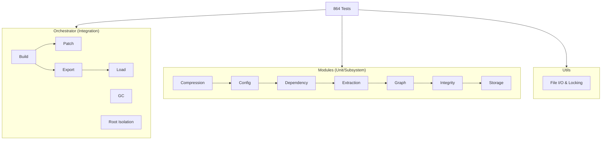

# Tests & Code Coverage

Batho features a comprehensive, multi-layered test suite to ensure the correctness, reliability, and security of its AST traversal and hypergraph orchestrator components.

:::info Test Suite Summary
- **Total Tests:** 864 tests
- **Primary Tooling:** `pytest` + `uv`
- **Minimum Target Coverage:** >60% line coverage across active v1.4.1 modules
:::

---

## How to Run the Test Suite

Batho uses `uv` for python environment and dependency management. To run the full test suite locally, execute:

```bash
# Run the entire test suite
uv run pytest

# Run with verbose output
uv run pytest -v

# Run with coverage report
uv run pytest --cov=batho --cov-report=term-missing
```

---

## Coverage & Testing Philosophy

Our testing strategy is organized around three pillars:

1. **Isolation & Determinism:** All tests run using temporary isolated directories (`tmp_path`) and mocked filesystems or network calls where appropriate, preventing environment leakage and ensuring tests can run in parallel without conflicts.
2. **Behavioral Integrity:** Rather than focusing purely on line coverage metrics, tests are designed to cover business scenarios, complex edge cases (like lock contention and case-insensitive collisions), and security boundaries.
3. **Subsystem Verification:** Each core module (storage, extraction, graph, etc.) has targeted unit tests, while the orchestrator contains integration tests validating end-to-end user workflows.

---

## Test Architecture



---

## Test Directory Layout

The tests are organized mirroring the core implementation directories to make it straightforward to locate test coverage for any subsystem:

```text
tests/
├── modules/              # Subsystem and unit tests
│   ├── compression/      # BSG map encoding and rules
│   ├── config/           # Configuration parsing & security traversal checks
│   ├── dependency/       # Manifest parser, indexer, popular packages, cache
│   ├── extraction/       # AST parser, phase 1 & 2 extractions, ast cache
│   ├── graph/            # Consistency, incremental updating, schemas
│   ├── integrity/        # Blob, graph, and state checkers & repairers
│   └── storage/          # Arrow bundle managers, BSG scratch store, unified cache
├── orchestrator/         # End-to-end integration and orchestration tests
└── utils/                # File lock manager, path utilities
```
