# Module Tests

### `tests/modules/compression/test_bsg_map.py`

tests/modules/compression/test_bsg_map.py

Unit tests for BSGMap: build, patch, from_dict, render_compressed,
render_full, render_hierarchical, render_delta, and render_storage views.

#### Class `TestBSGMapBuild`

##### `test_build_empty_graph`
*Verify building from an empty graph results in empty maps.*

<details>
<summary>View Test Details</summary>

**Scenario:**
An empty InMemoryGraph is provided to the builder.

**Execution Flow:**
1. Construct an InMemoryGraph with no entities.
    2. Invoke BSGMap.build with the empty graph.
    3. Verify that the files, dependencies, and relationships are empty.

**Flowchart:**

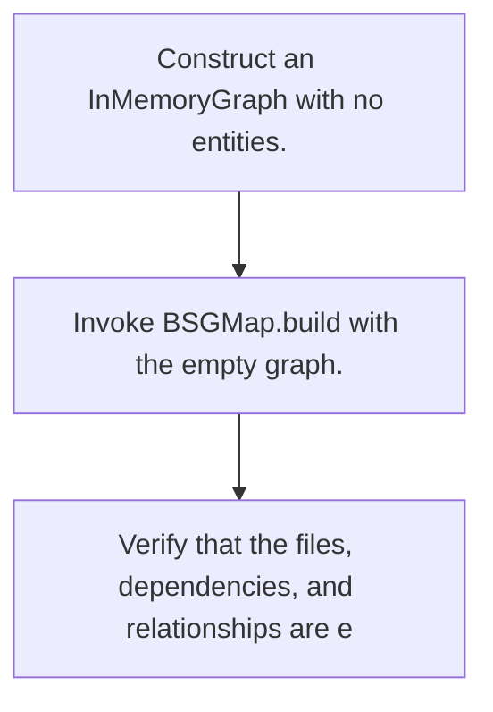

**Expectations:**
- _by_file mapping is empty.
    - _dependencies mapping is empty.
    - _relationships list is empty.

</details>

##### `test_build_groups_by_file`
*Verify building groups entities by their normalized relative file paths.*

<details>
<summary>View Test Details</summary>

**Scenario:**
Three entities across two files (a.py and b.py) are present in the graph.

**Execution Flow:**
1. Create three entities: two in a.py and one in b.py.
    2. Build the BSGMap.
    3. Assert that the grouped files are exactly "a.py" and "b.py" and contain the correct entities.

**Flowchart:**

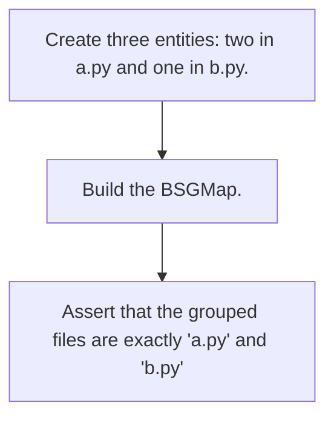

**Expectations:**
- The files mapped in BSGMap are exactly &#123;"a.py", "b.py"&#125;.
    - The entity names grouped under each file match the names of the input entities.

</details>

##### `test_build_entities_sorted_by_start_line`
*Verify entities grouped within a file are sorted by their starting lines.*

<details>
<summary>View Test Details</summary>

**Scenario:**
Two entities are added to the same file, with the later line entity defined before the earlier one.

**Execution Flow:**
1. Create a "late" entity with start_line=20.
    2. Create an "early" entity with start_line=5.
    3. Build the BSGMap.
    4. Assert that the entities are sorted so "early" comes before "late".

**Flowchart:**

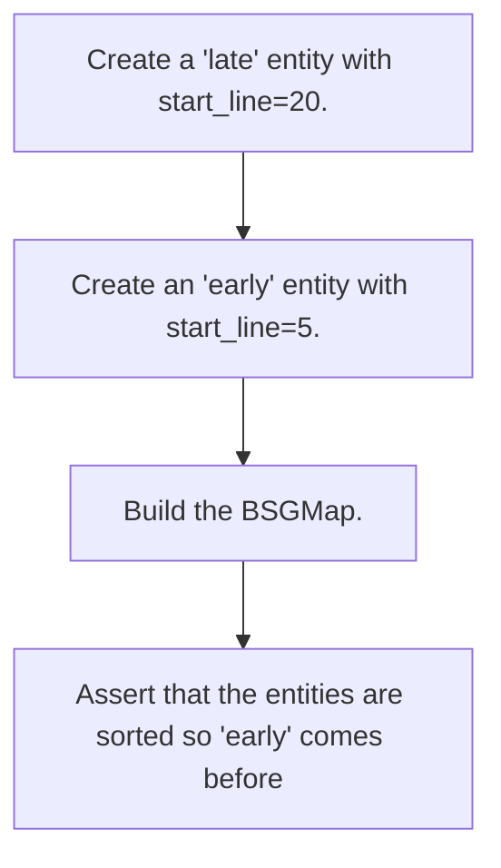

**Expectations:**
- The list of entities for the file is sorted in ascending order of start_line.

</details>

##### `test_build_captures_imports_as_dependencies`
*Verify IMPORTS relationship type is captured as cross-file dependencies.*

<details>
<summary>View Test Details</summary>

**Scenario:**
An entity in a.py imports an entity in b.py.

**Execution Flow:**
1. Create entities in a.py and b.py.
    2. Link them with an IMPORTS relationship.
    3. Build the BSGMap.
    4. Assert that b.py is a dependency of a.py.

**Flowchart:**

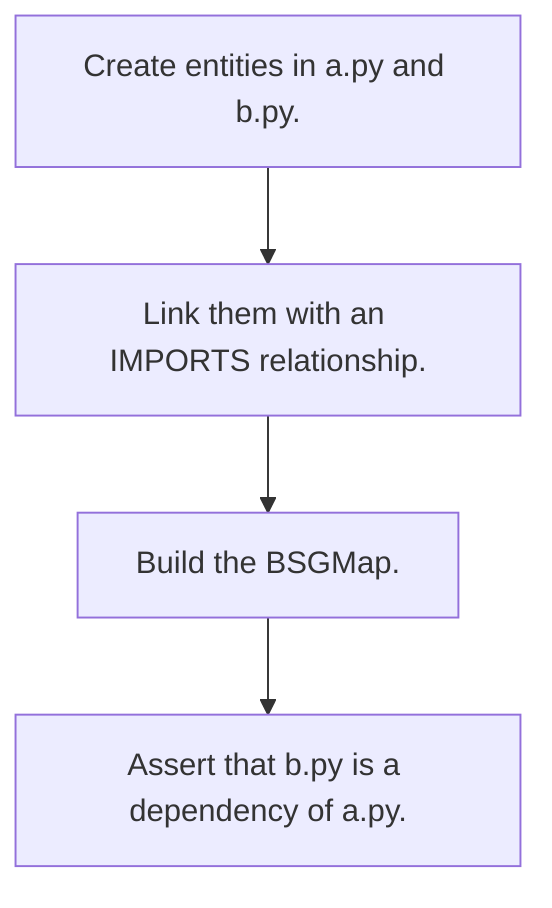

**Expectations:**
- "b.py" is in the dependencies list of "a.py".

</details>

##### `test_build_ignores_intra_file_relationships`
*Verify relationships within the same file are ignored for cross-file dependency mapping.*

<details>
<summary>View Test Details</summary>

**Scenario:**
Two entities in the same file a.py have a CALLS relationship.

**Execution Flow:**
1. Create two entities in a.py.
    2. Add a CALLS relationship between them.
    3. Build the BSGMap.
    4. Assert that a.py is not recorded as a dependency of itself.

**Flowchart:**

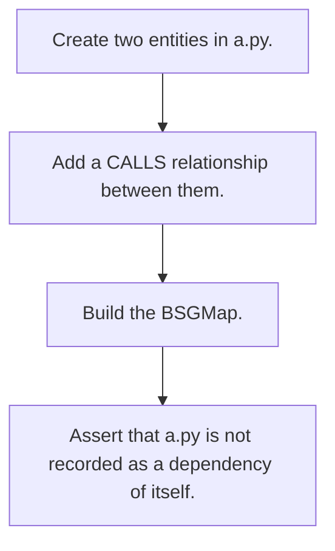

**Expectations:**
- "a.py" is not present in _dependencies.

</details>

##### `test_build_requires_inmemory_graph`
*Verify that BSGMap.build raises TypeError when not passed an InMemoryGraph.*

<details>
<summary>View Test Details</summary>

**Scenario:**
An invalid dictionary type is passed to BSGMap.build instead of InMemoryGraph.

**Execution Flow:**
1. Invoke BSGMap.build with a dict.
    2. Catch the expected TypeError.

**Flowchart:**

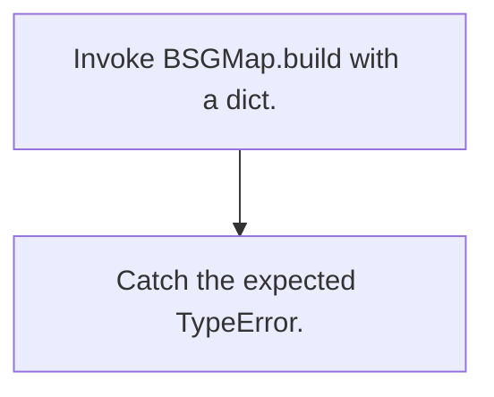

**Expectations:**
- A TypeError is raised containing "InMemoryGraph".

</details>

##### `test_build_root_normalised`
*Verify the root path is normalized and stripped from entity file paths.*

<details>
<summary>View Test Details</summary>

**Scenario:**
An entity is created at a subpath under the root repository.

**Execution Flow:**
1. Create an entity at f"&#123;ROOT&#125;/sub/c.py".
    2. Build the BSGMap.
    3. Assert that the key in _by_file is "sub/c.py".

**Flowchart:**

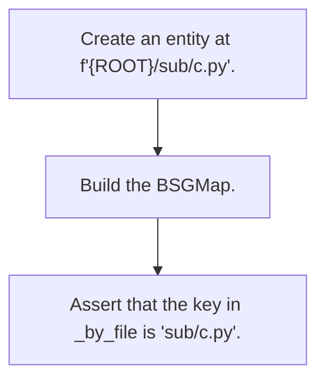

**Expectations:**
- The file key is normalized to "sub/c.py".

</details>

#### Class `TestBSGMapPatch`

##### `test_patch_updates_entities_for_changed_file`
*Verify patch updates entities for modified files.*

<details>
<summary>View Test Details</summary>

**Scenario:**
An entity in a file is modified, and the file change and the updated graph are passed to patch.

**Execution Flow:**
1. Build a BSGMap with the old entity in a.py.
    2. Define a modified file change for a.py and the new graph containing a new entity.
    3. Apply patch.
    4. Verify that the new entity is present in the file's list.

**Flowchart:**

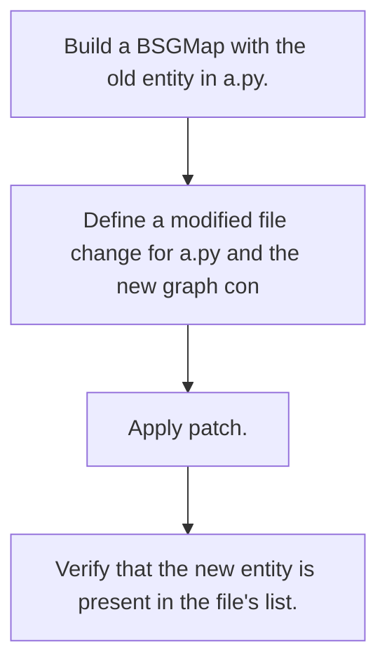

**Expectations:**
- The old entity is replaced by the new entity name "new_fn" in the _by_file mapping.

</details>

##### `test_patch_removes_deleted_file`
*Verify patch removes files from the map if they are deleted.*

<details>
<summary>View Test Details</summary>

**Scenario:**
A file is deleted, and its change type is DELETED.

**Execution Flow:**
1. Build a BSGMap containing a.py.
    2. Prepare a DELETED change for a.py and an empty graph.
    3. Call patch on the BSGMap.
    4. Check if "a.py" is removed from _by_file.

**Flowchart:**

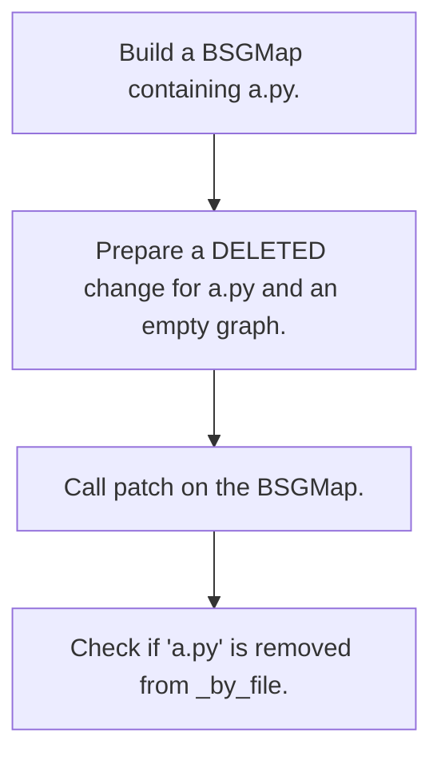

**Expectations:**
- "a.py" is no longer a key in _by_file.

</details>

##### `test_patch_leaves_unchanged_files_intact`
*Verify files not listed in file changes are left unchanged.*

<details>
<summary>View Test Details</summary>

**Scenario:**
A BSGMap contains two files, a.py and b.py, and only a.py is changed.

**Execution Flow:**
1. Build a BSGMap with entities in a.py and b.py.
    2. Call patch with a MODIFIED change for a.py.
    3. Verify b.py's entity is still intact.

**Flowchart:**

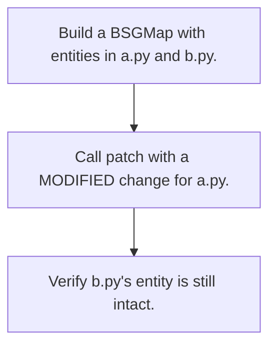

**Expectations:**
- The entity "fn_b" for "b.py" remains in the map.

</details>

##### `test_patch_updates_dependencies`
*Verify patch updates dependencies between files.*

<details>
<summary>View Test Details</summary>

**Scenario:**
An import dependency from a.py to b.py is removed in an update.

**Execution Flow:**
1. Build a BSGMap with an IMPORTS relationship from a.py to b.py.
    2. Update a.py to remove the import.
    3. Call patch.
    4. Verify that "b.py" is no longer listed as a dependency for "a.py".

**Flowchart:**

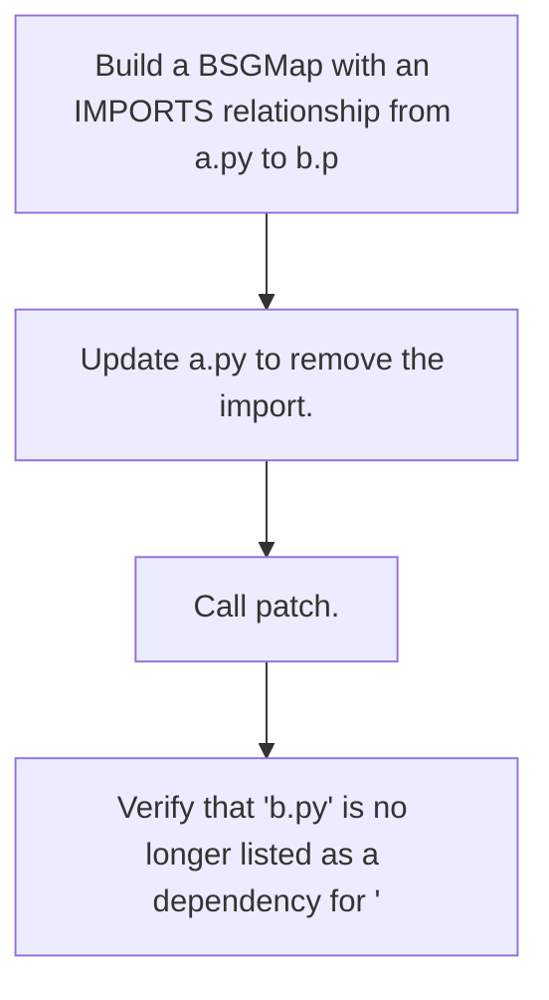

**Expectations:**
- "b.py" is removed from the dependencies of "a.py".

</details>

##### `test_patch_requires_inmemory_graph`
*Verify that patch raises TypeError when not passed an InMemoryGraph.*

<details>
<summary>View Test Details</summary>

**Scenario:**
An invalid dictionary type is passed to patch as the new graph.

**Execution Flow:**
1. Build a BSGMap.
    2. Invoke patch with a file change and a dict instead of InMemoryGraph.
    3. Verify TypeError is raised.

**Flowchart:**

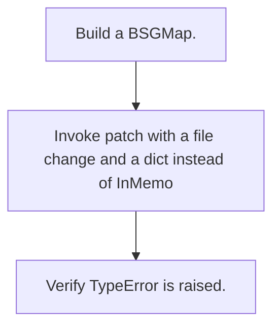

**Expectations:**
- A TypeError is raised containing "InMemoryGraph".

</details>

##### `test_patch_serialised_bsg_cleared`
*Verify patch clears the cached serialized representation.*

<details>
<summary>View Test Details</summary>

**Scenario:**
A cached serialized BSG exists, and patch is applied to the map.

**Execution Flow:**
1. Build a BSGMap and set a mock value in `_serialized_bsg`.
    2. Run patch.
    3. Check if `_serialized_bsg` is reset to None.

**Flowchart:**

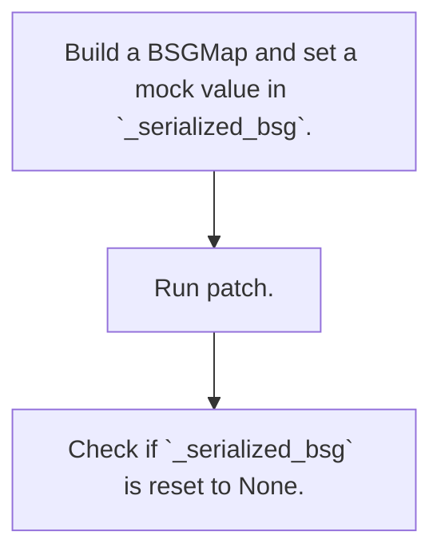

**Expectations:**
- `_serialized_bsg` is None.

</details>

#### Class `TestBSGMapFromDict`

##### `test_round_trip_empty`
*Verify BSGMap.from_dict initializes empty mapping on empty input.*

<details>
<summary>View Test Details</summary>

**Scenario:**
An empty dictionary is passed to BSGMap.from_dict.

**Execution Flow:**
1. Invoke BSGMap.from_dict with &#123;&#125;.
    2. Verify that _by_file is an empty dict.

**Flowchart:**

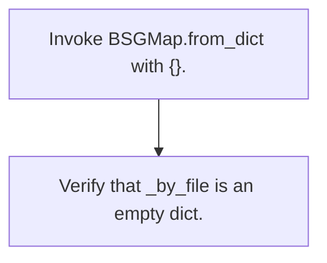

**Expectations:**
- The parsed map has an empty _by_file mapping.

</details>

##### `test_from_dict_node_list_format`
*Verify parsing a valid dict format populated with node dictionaries.*

<details>
<summary>View Test Details</summary>

**Scenario:**
A valid dictionary containing root and a list of serialized nodes is passed to BSGMap.from_dict.

**Execution Flow:**
1. Define a dictionary with root directory and a list containing a serialized function node.
    2. Parse it using BSGMap.from_dict.
    3. Verify the file and entity name are correctly mapped inside _by_file.

**Flowchart:**

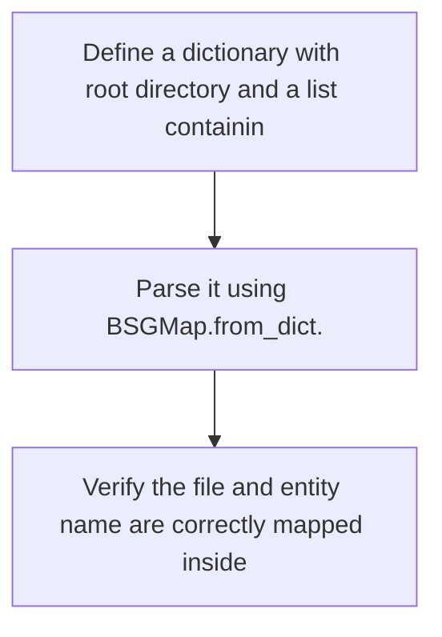

**Expectations:**
- The parsed map contains "src/mod.py" in _by_file.
    - The entity under "src/mod.py" has name "my_fn".

</details>

##### `test_from_dict_invalid_type_raises`
*Verify TypeError is raised when standard dict is not passed to from_dict.*

<details>
<summary>View Test Details</summary>

**Scenario:**
A string instead of a dictionary is passed to BSGMap.from_dict.

**Execution Flow:**
1. Call BSGMap.from_dict with a string.
    2. Catch TypeError.

**Flowchart:**

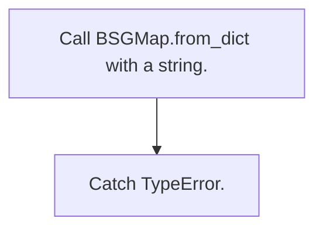

**Expectations:**
- A TypeError is raised.

</details>

##### `test_from_dict_skips_invalid_nodes`
*Verify invalid nodes in the nodes list are ignored during parsing.*

<details>
<summary>View Test Details</summary>

**Scenario:**
The input dictionary contains non-dict objects in the "nodes" list.

**Execution Flow:**
1. Construct a dictionary where the "nodes" key has invalid entries (string, None, integer).
    2. Invoke BSGMap.from_dict.
    3. Verify that _by_file remains empty.

**Flowchart:**

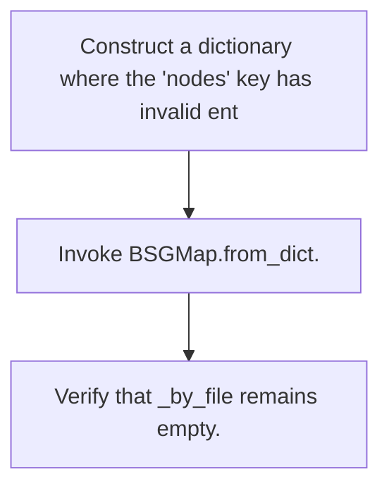

**Expectations:**
- No exceptions are raised, and the parsed _by_file map is empty.

</details>

#### Class `TestRenderCompressed`

##### `test_render_within_budget_returns_all`
*Verify render_compressed returns all entities when budget is sufficient.*

<details>
<summary>View Test Details</summary>

**Scenario:**
A BSGMap with two entities is rendered with a large token budget.

**Execution Flow:**
1. Build a BSGMap with 2 entities.
    2. Render the map with a budget of 10,000 tokens.
    3. Verify the rendered text contains both entities and stats show no truncated files.

**Flowchart:**

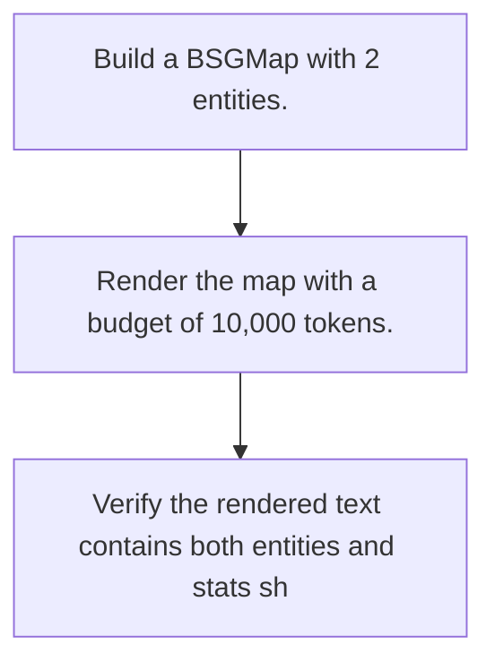

**Expectations:**
- Both entity names are present in the output text.
    - "truncated_files" count in stats is 0.

</details>

##### `test_render_overflow_raises_when_flag_set`
*Verify render_compressed raises ValueError on budget overflow if fail_on_overflow is set.*

<details>
<summary>View Test Details</summary>

**Scenario:**
A BSGMap with many entities is rendered with a tiny budget and fail_on_overflow=True.

**Execution Flow:**
1. Build a BSGMap with 50 entities.
    2. Invoke render_compressed with budget=1 and fail_on_overflow=True.
    3. Catch the expected ValueError.

**Flowchart:**

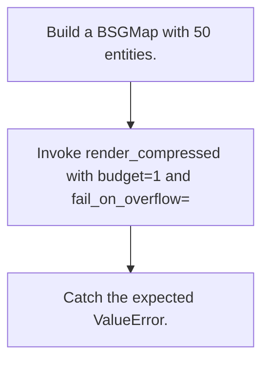

**Expectations:**
- A ValueError is raised containing "Token budget exceeded".

</details>

##### `test_render_overflow_soft_truncates`
*Verify render_compressed soft-truncates when budget is exceeded and fail_on_overflow is False.*

<details>
<summary>View Test Details</summary>

**Scenario:**
A BSGMap with 50 entities is rendered with a budget of 5 tokens and fail_on_overflow=False.

**Execution Flow:**
1. Build a BSGMap with 50 entities.
    2. Invoke render_compressed with budget=5 and fail_on_overflow=False.
    3. Verify the returned text indicates truncation and stats show truncated files.

**Flowchart:**

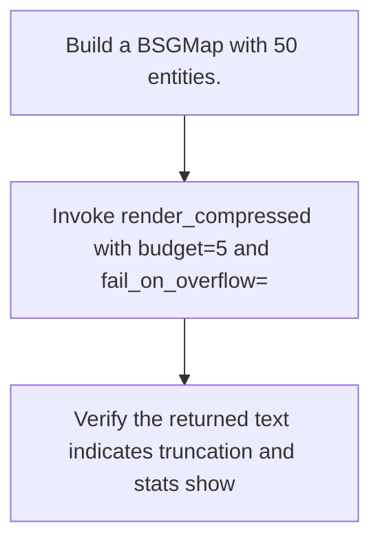

**Expectations:**
- The output contains the string "truncated".
    - "truncated_files" in stats is greater than 0.

</details>

##### `test_render_stats_keys_present`
*Verify all expected stats keys are returned in render_compressed.*

<details>
<summary>View Test Details</summary>

**Scenario:**
A standard BSGMap is rendered.

**Execution Flow:**
1. Build a BSGMap.
    2. Call render_compressed.
    3. Verify the presence of keys "tokens_used", "budget", and "truncated_files" in the returned stats dictionary.

**Flowchart:**

```mermaid
flowchart TD
    S0["Build a BSGMap."]
    S1["Call render_compressed."]
    S0 --> S1
    S2["Verify the presence of keys 'tokens_used', 'budget', and 'tr"]
    S1 --> S2
```

**Expectations:**
- All three key statistics are present in the returned dictionary.

</details>

#### Class `TestRenderDelta`

##### `test_delta_empty_when_identical`
*Verify render_delta returns empty addition/removal lists when maps are identical.*

<details>
<summary>View Test Details</summary>

**Scenario:**
Two BSGMaps built from the exact same graph are compared using render_delta.

**Execution Flow:**
1. Build bsg1 and bsg2 using identical graphs containing a single entity.
    2. Compute render_delta between them.
    3. Verify the "added" and "removed" sections in the returned delta are empty.

**Flowchart:**

```mermaid
flowchart TD
    S0["Build bsg1 and bsg2 using identical graphs containing a sing"]
    S1["Compute render_delta between them."]
    S0 --> S1
    S2["Verify the 'added' and 'removed' sections in the returned de"]
    S1 --> S2
```

**Expectations:**
- The "added" mapping is empty.
    - The "removed" list is empty.

</details>

##### `test_delta_detects_added_file`
*Verify render_delta detects added files when self has files not in other.*

<details>
<summary>View Test Details</summary>

**Scenario:**
bsg1 (self) has a.py and b.py, whereas bsg2 (other) only has a.py.

**Execution Flow:**
1. Build bsg1 with a.py and b.py.
    2. Build bsg2 with only a.py.
    3. Call bsg1.render_delta(bsg2).
    4. Verify that b.py is captured in "added".

**Flowchart:**

```mermaid
flowchart TD
    S0["Build bsg1 with a.py and b.py."]
    S1["Build bsg2 with only a.py."]
    S0 --> S1
    S2["Call bsg1.render_delta(bsg2)."]
    S1 --> S2
    S3["Verify that b.py is captured in 'added'."]
    S2 --> S3
```

**Expectations:**
- The "added" section of delta contains "b.py".

</details>

##### `test_delta_detects_removed_file`
*Verify render_delta detects removed files when other has files not in self.*

<details>
<summary>View Test Details</summary>

**Scenario:**
bsg1 (self) has only a.py, whereas bsg2 (other) has a.py and b.py.

**Execution Flow:**
1. Build bsg1 with only a.py.
    2. Build bsg2 with a.py and b.py.
    3. Call bsg1.render_delta(bsg2).
    4. Verify that b.py is captured in "removed".

**Flowchart:**

```mermaid
flowchart TD
    S0["Build bsg1 with only a.py."]
    S1["Build bsg2 with a.py and b.py."]
    S0 --> S1
    S2["Call bsg1.render_delta(bsg2)."]
    S1 --> S2
    S3["Verify that b.py is captured in 'removed'."]
    S2 --> S3
```

**Expectations:**
- The "removed" section of delta contains "b.py".

</details>

#### Class `TestRenderStorageViews`

##### `test_render_overview_json_schema_version`
*Verify that render_overview_json contains the correct schema version.*

<details>
<summary>View Test Details</summary>

**Scenario:**
A BSGMap is constructed.

**Execution Flow:**
1. Build BSGMap instance.
    2. Generate overview using render_overview_json().
    3. Assert schema_version equals "context-overview.v1".

**Flowchart:**

```mermaid
flowchart TD
    S0["Build BSGMap instance."]
    S1["Generate overview using render_overview_json()."]
    S0 --> S1
    S2["Assert schema_version equals 'context-overview.v1'."]
    S1 --> S2
```

**Expectations:**
- The schema_version is "context-overview.v1".

</details>

##### `test_render_overview_json_summary_totals`
*Verify render_overview_json returns accurate file and entity totals in its summary.*

<details>
<summary>View Test Details</summary>

**Scenario:**
A BSGMap contains 2 files and 2 entities.

**Execution Flow:**
1. Build a BSGMap.
    2. Call render_overview_json().
    3. Verify total_files is 2 and total_entities is 2 in overview["summary"].

**Flowchart:**

```mermaid
flowchart TD
    S0["Build a BSGMap."]
    S1["Call render_overview_json()."]
    S0 --> S1
    S2["Verify total_files is 2 and total_entities is 2 in overview["]
    S1 --> S2
```

**Expectations:**
- total_files equals 2.
    - total_entities equals 2.

</details>

##### `test_render_overview_json_directory_structure_present`
*Verify render_overview_json contains the directory structure node.*

<details>
<summary>View Test Details</summary>

**Scenario:**
A standard BSGMap is analyzed for directory structure layout.

**Execution Flow:**
1. Build a BSGMap.
    2. Invoke render_overview_json().
    3. Assert that "directory_structure" key exists and is of type "directory".

**Flowchart:**

```mermaid
flowchart TD
    S0["Build a BSGMap."]
    S1["Invoke render_overview_json()."]
    S0 --> S1
    S2["Assert that 'directory_structure' key exists and is of type "]
    S1 --> S2
```

**Expectations:**
- overview has "directory_structure".
    - The directory structure type field is "directory".

</details>

##### `test_render_overview_json_build_tree_no_duplicates`
*Verify render_overview_json builds directory tree without duplicate sibling nodes.*

<details>
<summary>View Test Details</summary>

**Scenario:**
20 entities are generated within nested subdirectories under the same "src/sub" prefix.

**Execution Flow:**
1. Build a BSGMap with entities in `src/sub/file_i.py`.
    2. Invoke render_overview_json().
    3. Retrieve the children of the root directory.
    4. Verify that "src" directory appears exactly once in the tree children.

**Flowchart:**

```mermaid
flowchart TD
    S0["Build a BSGMap with entities in `src/sub/file_i.py`."]
    S1["Invoke render_overview_json()."]
    S0 --> S1
    S2["Retrieve the children of the root directory."]
    S1 --> S2
    S3["Verify that 'src' directory appears exactly once in the tree"]
    S2 --> S3
```

**Expectations:**
- Only a single "src" child node is created at the top level of the directory structure tree.

</details>

##### `test_render_files_json_returns_dict`
*Verify render_files_json returns a dictionary.*

<details>
<summary>View Test Details</summary>

**Scenario:**
A standard BSGMap is rendered into file JSON format.

**Execution Flow:**
1. Build a BSGMap.
    2. Call render_files_json().
    3. Assert the result is an instance of dict.

**Flowchart:**

```mermaid
flowchart TD
    S0["Build a BSGMap."]
    S1["Call render_files_json()."]
    S0 --> S1
    S2["Assert the result is an instance of dict."]
    S1 --> S2
```

**Expectations:**
- The return value is a dict.

</details>

##### `test_to_dict_round_trip_has_nodes`
*Verify to_dict returns a serialization containing nodes.*

<details>
<summary>View Test Details</summary>

**Scenario:**
A standard BSGMap is serialized via to_dict().

**Execution Flow:**
1. Build a BSGMap.
    2. Call to_dict().
    3. Check that the output contains "nodes" or is a valid dict.

**Flowchart:**

```mermaid
flowchart TD
    S0["Build a BSGMap."]
    S1["Call to_dict()."]
    S0 --> S1
    S2["Check that the output contains 'nodes' or is a valid dict."]
    S1 --> S2
```

**Expectations:**
- The resulting object has a "nodes" key or is a dict.

</details>


---

### `tests/modules/compression/test_rules.py`

tests/modules/compression/test_rules.py

Unit tests for the BSG rules engine:
  - _apply_rule_actions (shared helper)
  - apply_bsg_rules_to_entities (per-file path)
  - apply_rule_plugins (full-graph path)
  - load_effective_rules (cache round-trip)
  - _detect_rule_conflicts
  - _plugin_validators (thread-safety smoke test)
  - detect_framework language-guard bug regression

#### Class `TestApplyRuleActions`

##### `test_sets_metadata_key`
*Verify _apply_rule_actions sets metadata key as specified by rule definition.*

<details>
<summary>View Test Details</summary>

**Scenario:**
An entity lacks a metadata key, and a rule defines a metadata output for it.

**Execution Flow:**
1. Create a rule that outputs &#123;"bsg.category": "SOURCE"&#125;.
    2. Call _apply_rule_actions on an entity with empty metadata.
    3. Verify the returned flag changed is True.
    4. Verify the metadata now has "bsg.category" equal to "SOURCE".

**Flowchart:**

```mermaid
flowchart TD
    S0["Create a rule that outputs {'bsg.category': 'SOURCE'}."]
    S1["Call _apply_rule_actions on an entity with empty metadata."]
    S0 --> S1
    S2["Verify the returned flag changed is True."]
    S1 --> S2
    S3["Verify the metadata now has 'bsg.category' equal to 'SOURCE'"]
    S2 --> S3
```

**Expectations:**
- The returned changed boolean is True.
    - The metadata dictionary contains &#123;"bsg.category": "SOURCE"&#125;.

</details>

##### `test_no_change_when_value_already_set`
*Verify _apply_rule_actions does not report a change when metadata already matches.*

<details>
<summary>View Test Details</summary>

**Scenario:**
An entity already contains the metadata key and value matching the rule action.

**Execution Flow:**
1. Create a rule outputting &#123;"bsg.category": "SOURCE"&#125;.
    2. Set the entity's metadata to already contain &#123;"bsg.category": "SOURCE"&#125;.
    3. Invoke _apply_rule_actions.
    4. Assert that the changed boolean returned is False.

**Flowchart:**

```mermaid
flowchart TD
    S0["Create a rule outputting {'bsg.category': 'SOURCE'}."]
    S1["Set the entity's metadata to already contain {'bsg.category'"]
    S0 --> S1
    S2["Invoke _apply_rule_actions."]
    S1 --> S2
    S3["Assert that the changed boolean returned is False."]
    S2 --> S3
```

**Expectations:**
- The changed boolean returned is False.

</details>

##### `test_add_usn_tags_merges`
*Verify add_usn_tags merges new tags into existing bsg.usn tags.*

<details>
<summary>View Test Details</summary>

**Scenario:**
An entity has an existing list of bsg.usn tags, and a rule specifies adding a new tag.

**Execution Flow:**
1. Construct a rule specifying add_usn_tags=("ApiBoundary",).
    2. Initialize an entity with existing tag ["AuthMiddleware"].
    3. Invoke _apply_rule_actions.
    4. Verify both tags exist in metadata["bsg.usn"] and "apiboundary" is returned in tags list.

**Flowchart:**

```mermaid
flowchart TD
    S0["Construct a rule specifying add_usn_tags=('ApiBoundary',)."]
    S1["Initialize an entity with existing tag ['AuthMiddleware']."]
    S0 --> S1
    S2["Invoke _apply_rule_actions."]
    S1 --> S2
    S3["Verify both tags exist in metadata['bsg.usn'] and 'apibounda"]
    S2 --> S3
```

**Expectations:**
- Changed is True.
    - Both "ApiBoundary" and "AuthMiddleware" are inside the updated metadata list.
    - The returned tag list contains "apiboundary".

</details>

##### `test_add_usn_tags_idempotent`
*Verify add_usn_tags is idempotent and reports no change if tag is already present.*

<details>
<summary>View Test Details</summary>

**Scenario:**
The entity's metadata already has the tag that the rule wants to add.

**Execution Flow:**
1. Construct a rule adding "ApiBoundary".
    2. Pass an entity already containing "ApiBoundary" in its "bsg.usn" metadata.
    3. Call _apply_rule_actions.
    4. Verify the changed flag is False.

**Flowchart:**

```mermaid
flowchart TD
    S0["Construct a rule adding 'ApiBoundary'."]
    S1["Pass an entity already containing 'ApiBoundary' in its 'bsg."]
    S0 --> S1
    S2["Call _apply_rule_actions."]
    S1 --> S2
    S3["Verify the changed flag is False."]
    S2 --> S3
```

**Expectations:**
- The changed boolean returned is False.

</details>

##### `test_truncate_docstring`
*Verify docstrings are truncated if truncate_docstring is enabled.*

<details>
<summary>View Test Details</summary>

**Scenario:**
An entity has a long docstring, and the rule specifies truncating to 10 characters.

**Execution Flow:**
1. Construct a rule with truncate_docstring=True and max_docstring_length=10.
    2. Construct an entity with a docstring of length 50.
    3. Call _apply_rule_actions.
    4. Verify the resulting docstring is truncated and appended with "...".

**Flowchart:**

```mermaid
flowchart TD
    S0["Construct a rule with truncate_docstring=True and max_docstr"]
    S1["Construct an entity with a docstring of length 50."]
    S0 --> S1
    S2["Call _apply_rule_actions."]
    S1 --> S2
    S3["Verify the resulting docstring is truncated and appended wit"]
    S2 --> S3
```

**Expectations:**
- Changed is True.
    - The length of the modified docstring is exactly 13 characters.

</details>

##### `test_truncate_docstring_no_op_when_short`
*Verify docstring is not truncated if its length is below the maximum limit.*

<details>
<summary>View Test Details</summary>

**Scenario:**
An entity has a short docstring, and the rule specifies a larger max_docstring_length.

**Execution Flow:**
1. Construct a rule with truncate_docstring=True and max_docstring_length=100.
    2. Construct an entity with a short docstring "Short.".
    3. Call _apply_rule_actions.
    4. Verify changed flag is False.

**Flowchart:**

```mermaid
flowchart TD
    S0["Construct a rule with truncate_docstring=True and max_docstr"]
    S1["Construct an entity with a short docstring 'Short.'."]
    S0 --> S1
    S2["Call _apply_rule_actions."]
    S1 --> S2
    S3["Verify changed flag is False."]
    S2 --> S3
```

**Expectations:**
- Changed is False.

</details>

##### `test_detect_framework_sets_framework`
*Verify detect_framework adds new frameworks and languages to metadata.*

<details>
<summary>View Test Details</summary>

**Scenario:**
An entity is matched by a rule containing detect_framework configuration.

**Execution Flow:**
1. Create a rule with detect_framework setting Django framework and python language.
    2. Invoke _apply_rule_actions on an entity.
    3. Assert that framework list contains "Django" and language is set to "python".

**Flowchart:**

```mermaid
flowchart TD
    S0["Create a rule with detect_framework setting Django framework"]
    S1["Invoke _apply_rule_actions on an entity."]
    S0 --> S1
    S2["Assert that framework list contains 'Django' and language is"]
    S1 --> S2
```

**Expectations:**
- Changed is True.
    - "Django" in metadata["bsg.frameworks"].
    - "python" in metadata["bsg.language"].

</details>

##### `test_detect_framework_language_not_updated_when_framework_already_present`
*Verify language is not updated when the framework is already present in metadata.*

<details>
<summary>View Test Details</summary>

**Scenario:**
The entity's metadata already has the framework "Django" listed.

**Execution Flow:**
1. Create a rule configuring "Django" framework.
    2. Provide metadata already containing "Django".
    3. Call _apply_rule_actions.
    4. Verify changed is False.

**Flowchart:**

```mermaid
flowchart TD
    S0["Create a rule configuring 'Django' framework."]
    S1["Provide metadata already containing 'Django'."]
    S0 --> S1
    S2["Call _apply_rule_actions."]
    S1 --> S2
    S3["Verify changed is False."]
    S2 --> S3
```

**Expectations:**
- Changed is False.

</details>

##### `test_derive_scope_tier_function`
*Verify derive_scope_tier determines scope tier for functions.*

<details>
<summary>View Test Details</summary>

**Scenario:**
A rule specifies derive_scope_tier=True for a standard function.

**Execution Flow:**
1. Create a rule with derive_scope_tier=True.
    2. Call _apply_rule_actions.
    3. Check if "bsg.scope_tier" key is added to metadata.

**Flowchart:**

```mermaid
flowchart TD
    S0["Create a rule with derive_scope_tier=True."]
    S1["Call _apply_rule_actions."]
    S0 --> S1
    S2["Check if 'bsg.scope_tier' key is added to metadata."]
    S1 --> S2
```

**Expectations:**
- The "bsg.scope_tier" key is present in the updated metadata dictionary.

</details>

##### `test_derive_service_tag_services_path`
*Verify derive_service_tag extracts service name from services directory structure path.*

<details>
<summary>View Test Details</summary>

**Scenario:**
An entity is located inside "/repo/services/auth/handler.py".

**Execution Flow:**
1. Construct a rule with derive_service_tag=True.
    2. Invoke _apply_rule_actions with file path "services/auth/handler.py".
    3. Verify the extracted service tag.

**Flowchart:**

```mermaid
flowchart TD
    S0["Construct a rule with derive_service_tag=True."]
    S1["Invoke _apply_rule_actions with file path 'services/auth/han"]
    S0 --> S1
    S2["Verify the extracted service tag."]
    S1 --> S2
```

**Expectations:**
- The metadata field "bsg.service_tag" is set to "auth".

</details>

#### Class `TestApplyBsgRulesToEntities`

##### `test_applies_rule_to_matching_entity`
*Verify rules are applied to entities that match the target entity type.*

<details>
<summary>View Test Details</summary>

**Scenario:**
An entity of type function is checked against a rule matching "function" type.

**Execution Flow:**
1. Create a rule matching "function" entity type and setting a metadata tag.
    2. Define a function entity.
    3. Apply rules to the entity using apply_bsg_rules_to_entities.
    4. Verify the metadata tag is set on the returned entity.

**Flowchart:**

```mermaid
flowchart TD
    S0["Create a rule matching 'function' entity type and setting a "]
    S1["Define a function entity."]
    S0 --> S1
    S2["Apply rules to the entity using apply_bsg_rules_to_entities."]
    S1 --> S2
    S3["Verify the metadata tag is set on the returned entity."]
    S2 --> S3
```

**Expectations:**
- The entity is updated with "bsg.tagged" set to "yes".

</details>

##### `test_does_not_apply_rule_to_non_matching_type`
*Verify rules are not applied if entity type does not match rule matches.*

<details>
<summary>View Test Details</summary>

**Scenario:**
A rule matching "class" is evaluated against a "function" entity type.

**Execution Flow:**
1. Define a rule matching only "class" entity types.
    2. Initialize an entity with type FUNCTION.
    3. Run apply_bsg_rules_to_entities.
    4. Verify the metadata tag is not set.

**Flowchart:**

```mermaid
flowchart TD
    S0["Define a rule matching only 'class' entity types."]
    S1["Initialize an entity with type FUNCTION."]
    S0 --> S1
    S2["Run apply_bsg_rules_to_entities."]
    S1 --> S2
    S3["Verify the metadata tag is not set."]
    S2 --> S3
```

**Expectations:**
- The entity's metadata for "bsg.tagged" is None.

</details>

##### `test_skips_bidirectional_rules`
*Verify bidirectional rules are skipped during single-file local rules evaluation.*

<details>
<summary>View Test Details</summary>

**Scenario:**
A rule is defined with bidirectional=True.

**Execution Flow:**
1. Construct a bidirectional rule.
    2. Run apply_bsg_rules_to_entities.
    3. Check if the metadata action has not been applied.

**Flowchart:**

```mermaid
flowchart TD
    S0["Construct a bidirectional rule."]
    S1["Run apply_bsg_rules_to_entities."]
    S0 --> S1
    S2["Check if the metadata action has not been applied."]
    S1 --> S2
```

**Expectations:**
- The bidirectional rule actions are not applied; metadata contains no update.

</details>

##### `test_detect_framework_bug_regression`
*Verify language is not overwritten if the framework already existed in metadata.*

<details>
<summary>View Test Details</summary>

**Scenario:**
An entity already possesses both the target framework and language metadata.

**Execution Flow:**
1. Initialize an entity with framework "FastAPI" and language "python".
    2. Apply a rule that detects framework "FastAPI".
    3. Check that the framework list and language value remain unmodified.

**Flowchart:**

```mermaid
flowchart TD
    S0["Initialize an entity with framework 'FastAPI' and language '"]
    S1["Apply a rule that detects framework 'FastAPI'."]
    S0 --> S1
    S2["Check that the framework list and language value remain unmo"]
    S1 --> S2
```

**Expectations:**
- Language is "python".
    - Frameworks list is ["FastAPI"].

</details>

##### `test_empty_inputs_return_empty`
*Verify apply_bsg_rules_to_entities returns empty lists/dicts on empty inputs.*

<details>
<summary>View Test Details</summary>

**Scenario:**
Empty entities and rules lists are provided.

**Execution Flow:**
1. Call apply_bsg_rules_to_entities with empty lists.
    2. Verify both output values are empty.

**Flowchart:**

```mermaid
flowchart TD
    S0["Call apply_bsg_rules_to_entities with empty lists."]
    S1["Verify both output values are empty."]
    S0 --> S1
```

**Expectations:**
- The returned updated entities list is empty.
    - The returned audit dict is empty.

</details>

##### `test_when_clause_gates_action`
*Verify when clause gates rule actions based on matching metadata condition.*

<details>
<summary>View Test Details</summary>

**Scenario:**
A rule has a when clause requiring "bsg.approved" to exist. Two entities are checked, only one having the key.

**Execution Flow:**
1. Create a rule containing a "when" clause requiring "bsg.approved" to exist.
    2. Create two entities: one without the metadata key, one with.
    3. Apply rules to both entities.
    4. Assert that the rule action was only applied to the second entity.

**Flowchart:**

```mermaid
flowchart TD
    S0["Create a rule containing a 'when' clause requiring 'bsg.appr"]
    S1["Create two entities: one without the metadata key, one with."]
    S0 --> S1
    S2["Apply rules to both entities."]
    S1 --> S2
    S3["Assert that the rule action was only applied to the second e"]
    S2 --> S3
```

**Expectations:**
- The entity without the metadata key is unmodified.
    - The entity with the metadata key is modified.

</details>

#### Class `TestDetectRuleConflicts`

##### `test_no_conflict_disjoint_entity_types`
*Verify no conflicts are reported for rules targeting disjoint entity types.*

<details>
<summary>View Test Details</summary>

**Scenario:**
Two rules write to the same metadata key, but one targets "function" and the other targets "class".

**Execution Flow:**
1. Define rule 1 for entity_types=("function",) setting key "k".
    2. Define rule 2 for entity_types=("class",) setting key "k".
    3. Detect conflicts using _detect_rule_conflicts.
    4. Verify no conflicts are reported.

**Flowchart:**

```mermaid
flowchart TD
    S0["Define rule 1 for entity_types=('function',) setting key 'k'"]
    S1["Define rule 2 for entity_types=('class',) setting key 'k'."]
    S0 --> S1
    S2["Detect conflicts using _detect_rule_conflicts."]
    S1 --> S2
    S3["Verify no conflicts are reported."]
    S2 --> S3
```

**Expectations:**
- The returned conflicts list is empty.

</details>

##### `test_conflict_detected_same_metadata_key`
*Verify a conflict is detected when multiple rules match the same entity/name and write different values to the same metadata key.*

<details>
<summary>View Test Details</summary>

**Scenario:**
Two rules match "function" and "get_*" name patterns, but specify different metadata output values for "bsg.category".

**Execution Flow:**
1. Define r1 for function + "get_*" setting "bsg.category" to "A".
    2. Define r2 for function + "get_*" setting "bsg.category" to "B".
    3. Detect conflicts using _detect_rule_conflicts.
    4. Verify that a conflict is reported with "bsg.category" overlapping.

**Flowchart:**

```mermaid
flowchart TD
    S0["Define r1 for function + 'get_*' setting 'bsg.category' to '"]
    S1["Define r2 for function + 'get_*' setting 'bsg.category' to '"]
    S0 --> S1
    S2["Detect conflicts using _detect_rule_conflicts."]
    S1 --> S2
    S3["Verify that a conflict is reported with 'bsg.category' overl"]
    S2 --> S3
```

**Expectations:**
- The conflicts list contains at least one conflict item.
    - The conflict overlap contains the conflicting metadata key "bsg.category".

</details>

##### `test_no_conflict_same_value`
*Verify no conflict is reported when overlapping rules set identical values.*

<details>
<summary>View Test Details</summary>

**Scenario:**
Two rules overlap on "auth_*" pattern and set "bsg.category" to the same value "SOURCE".

**Execution Flow:**
1. Define r1 setting "bsg.category" to "SOURCE".
    2. Define r2 setting "bsg.category" to "SOURCE".
    3. Run _detect_rule_conflicts.
    4. Verify no conflict is detected.

**Flowchart:**

```mermaid
flowchart TD
    S0["Define r1 setting 'bsg.category' to 'SOURCE'."]
    S1["Define r2 setting 'bsg.category' to 'SOURCE'."]
    S0 --> S1
    S2["Run _detect_rule_conflicts."]
    S1 --> S2
    S3["Verify no conflict is detected."]
    S2 --> S3
```

**Expectations:**
- The returned conflicts list is empty.

</details>

#### Class `TestLoadEffectiveRules`

##### `test_disabled_config_returns_empty`
*Verify load_effective_rules returns empty rules list if config specifies enabled=False.*

<details>
<summary>View Test Details</summary>

**Scenario:**
Rule configuration has &#123;"enabled": False&#125;.

**Execution Flow:**
1. Call load_effective_rules with enabled=False.
    2. Verify output rules list is empty and stats show enabled is False.

**Flowchart:**

```mermaid
flowchart TD
    S0["Call load_effective_rules with enabled=False."]
    S1["Verify output rules list is empty and stats show enabled is "]
    S0 --> S1
```

**Expectations:**
- Rules list is empty.
    - Stats show enabled flag is False.

</details>

##### `test_none_config_returns_empty`
*Verify load_effective_rules returns empty list when config is None.*

<details>
<summary>View Test Details</summary>

**Scenario:**
No rules configuration is provided.

**Execution Flow:**
1. Call load_effective_rules with rules_config=None.
    2. Verify the rules list is empty.

**Flowchart:**

```mermaid
flowchart TD
    S0["Call load_effective_rules with rules_config=None."]
    S1["Verify the rules list is empty."]
    S0 --> S1
```

**Expectations:**
- Rules list is empty.

</details>

##### `test_enabled_loads_builtin_plugins`
*Verify load_effective_rules loads builtin plugins when config is enabled.*

<details>
<summary>View Test Details</summary>

**Scenario:**
Config has enabled=True and auto_load_all_plugins=True.

**Execution Flow:**
1. Call load_effective_rules.
    2. Verify stats show enabled is True.
    3. Assert that rules count matches the recorded stats rules_loaded.

**Flowchart:**

```mermaid
flowchart TD
    S0["Call load_effective_rules."]
    S1["Verify stats show enabled is True."]
    S0 --> S1
    S2["Assert that rules count matches the recorded stats rules_loa"]
    S1 --> S2
```

**Expectations:**
- Stats enabled is True.
    - Rules list has size &gt; 0.
    - Rules count equals stats["rules_loaded"].

</details>

##### `test_cache_round_trip`
*Verify load_effective_rules caches rule loading results on subsequent calls.*

<details>
<summary>View Test Details</summary>

**Scenario:**
Rules are loaded twice consecutively.

**Execution Flow:**
1. Load rules for the first time.
    2. Load rules a second time.
    3. Assert that the second load hits the cache and returns the same number of rules.

**Flowchart:**

```mermaid
flowchart TD
    S0["Load rules for the first time."]
    S1["Load rules a second time."]
    S0 --> S1
    S2["Assert that the second load hits the cache and returns the s"]
    S1 --> S2
```

**Expectations:**
- The second load returns cache_hit=True in stats.
    - Both loads return the same number of rules.

</details>

##### `test_disabled_rule_excluded`
*Verify disabled rules can be excluded.*

<details>
<summary>View Test Details</summary>

**Scenario:**
A rule config specifies some rules to exclude (e.g. disabled_rules wildcard).

**Execution Flow:**
1. Setup a dummy cache dir.
    2. Call load_effective_rules with wildcard disabled_rules.
    3. Verify the returned rules is a list.

**Flowchart:**

```mermaid
flowchart TD
    S0["Setup a dummy cache dir."]
    S1["Call load_effective_rules with wildcard disabled_rules."]
    S0 --> S1
    S2["Verify the returned rules is a list."]
    S1 --> S2
```

**Expectations:**
- The returned rules is a list type.

</details>

#### Class `TestApplyRulePlugins`

##### `test_disabled_rules_returns_zero_updates`
*Verify apply_rule_plugins returns zero updates if rules are disabled in config.*

<details>
<summary>View Test Details</summary>

**Scenario:**
An InMemoryGraph with one entity is processed under a disabled rules configuration.

**Execution Flow:**
1. Setup a graph containing one function entity.
    2. Call apply_rule_plugins with rules_config=&#123;"enabled": False&#125;.
    3. Verify the number of updated entities returned in stats is 0.

**Flowchart:**

```mermaid
flowchart TD
    S0["Setup a graph containing one function entity."]
    S1["Call apply_rule_plugins with rules_config={'enabled': False}"]
    S0 --> S1
    S2["Verify the number of updated entities returned in stats is 0"]
    S1 --> S2
```

**Expectations:**
- stats["entities_updated"] is 0.

</details>

##### `test_enabled_rules_updates_entities`
*Verify apply_rule_plugins executes rule plugins and records entity updates.*

<details>
<summary>View Test Details</summary>

**Scenario:**
An InMemoryGraph is processed under an enabled rules configuration.

**Execution Flow:**
1. Setup directories and a function entity.
    2. Call apply_rule_plugins with rules_config enabled and auto_load_all_plugins set.
    3. Verify "entities_updated" and "rules_applied" keys are present in stats.

**Flowchart:**

```mermaid
flowchart TD
    S0["Setup directories and a function entity."]
    S1["Call apply_rule_plugins with rules_config enabled and auto_l"]
    S0 --> S1
    S2["Verify 'entities_updated' and 'rules_applied' keys are prese"]
    S1 --> S2
```

**Expectations:**
- The stats dictionary contains "entities_updated" key.
    - The stats dictionary contains "rules_applied" key.

</details>

##### `test_bidirectional_only_flag`
*Verify apply_rule_plugins respects the bidirectional_only flag filter.*

<details>
<summary>View Test Details</summary>

**Scenario:**
Rule plugins are executed with bidirectional_only flag set to True.

**Execution Flow:**
1. Create a function entity in a graph.
    2. Run apply_rule_plugins with bidirectional_only=True.
    3. Verify the entities_updated statistic is returned in the stats dictionary.

**Flowchart:**

```mermaid
flowchart TD
    S0["Create a function entity in a graph."]
    S1["Run apply_rule_plugins with bidirectional_only=True."]
    S0 --> S1
    S2["Verify the entities_updated statistic is returned in the sta"]
    S1 --> S2
```

**Expectations:**
- The stats dictionary contains the "entities_updated" key.

</details>

#### Class `TestPluginValidatorThreadSafety`

##### `test_concurrent_validator_fetch`
*Verify multiple threads fetching the plugin validator concurrently do not raise concurrency/state issues.*

<details>
<summary>View Test Details</summary>

**Scenario:**
16 threads concurrently access the _get_plugin_validator function to verify safety.

**Execution Flow:**
1. Initialize a thread-safe errors list.
    2. Launch 16 worker threads, each invoking _get_plugin_validator.
    3. Start and join all threads.
    4. Verify no exceptions were appended to the errors list.

**Flowchart:**

```mermaid
flowchart TD
    S0["Initialize a thread-safe errors list."]
    S1["Launch 16 worker threads, each invoking _get_plugin_validato"]
    S0 --> S1
    S2["Start and join all threads."]
    S1 --> S2
    S3["Verify no exceptions were appended to the errors list."]
    S2 --> S3
```

**Expectations:**
- The errors list is empty after all threads complete.

</details>

#### Standalone Tests

##### `test_is_safe_regex_escaped_redos`
*Verify that escaped backslashes in ReDoS patterns are not bypassed.*

<details>
<summary>View Test Details</summary>

**Scenario:**
A malicious user provides a regex rule mapping containing escaped characters designed
    to bypass safe regex checking, such as r'\\(a+)+'. The double backslash escapes the
    backslash itself, leaving the nested quantifiers active. The rules engine must reject this.

**Execution Flow:**
1. Call `_is_safe_regex(r'\\(a+)+')` and assert it is False.
    2. Call `_is_safe_regex(r'\\\\(a+)+')` and assert it is False.
    3. Call `_is_safe_regex(r'\\(abc)')` and assert it is True (safe literal group).
    4. Call `_is_safe_regex(r'\(a+)+')` and assert it is True (escaped group start, literal '(').

**Flowchart:**

```mermaid
flowchart TD
    S0["Call `_is_safe_regex(r'\\(a+)+')` and assert it is False."]
    S1["Call `_is_safe_regex(r'\\\\(a+)+')` and assert it is False."]
    S0 --> S1
    S2["Call `_is_safe_regex(r'\\(abc)')` and assert it is True (saf"]
    S1 --> S2
    S3["Call `_is_safe_regex(r'\(a+)+')` and assert it is True (esca"]
    S2 --> S3
```

**Expectations:**
- Escaped characters preceding a group are parsed correctly.
    - Active groups causing exponential backtracking (ReDoS) are caught regardless of escape styling.

</details>

##### `test_is_safe_regex_new_cases`
*Verify that _is_safe_regex handles character classes, optional quantifiers, and alternation with shared prefixes.*

<details>
<summary>View Test Details</summary>

**Scenario:**
Test robust boundary conditions of the ReDoS detection regex rule utility on both safe patterns
    (standard nested classes, api routes alternation) and unsafe patterns (nested quantifiers,
    shared prefix alternations that trigger exponential search space on failure).

**Execution Flow:**
1. Assert safe patterns return True:
       - "([a-z+])+"
       - "(api|auth)+"
    2. Assert unsafe patterns return False:
       - "([a-z]+)+" (nested quantifiers)
       - "(a?)+" (nullable group quantifier)
       - "(a|ab)+" (overlapping prefix alternation)
       - "(a|a)+" (duplicated choice alternation)

**Flowchart:**

```mermaid
flowchart TD
    S0["Assert safe patterns return True:"]
    S1["- '([a-z+])+'"]
    S0 --> S1
    S2["- '(api|auth)+'"]
    S1 --> S2
    S3["Assert unsafe patterns return False:"]
    S2 --> S3
    S4["- '([a-z]+)+' (nested quantifiers)"]
    S3 --> S4
    S5["- '(a?)+' (nullable group quantifier)"]
    S4 --> S5
    S6["- '(a|ab)+' (overlapping prefix alternation)"]
    S5 --> S6
    S7["- '(a|a)+' (duplicated choice alternation)"]
    S6 --> S7
```

**Expectations:**
- Accurate classification of safe vs unsafe patterns.
    - Prevents rules engine from loading catastrophic regexes.

</details>

##### `test_redos_pattern_detection`
*Verify that _is_safe_regex correctly classifies safe and unsafe regexes.*

<details>
<summary>View Test Details</summary>

**Scenario:**
Validates general classification, string length limits (&gt; 250 characters), and high
    quantifier count limits (&gt; 8 quantifiers) which can lead to CPU exhaustion.

**Execution Flow:**
1. Assert safe regexes return True:
       - "^prefix.*"
       - "[a-z]+_suffix"
       - "(api|auth)_.*"
       - "normal_pattern"
    2. Assert unsafe/overflowing regexes return False:
       - "(a+)+" / "(a*)*" / "([a-zA-Z]+)*" / "(a|b+)+"
       - "a*b*c*d*e*f*g*h*i*j*" (too many quantifiers &gt; 8)
       - "x" * 251 (too long regex)

**Flowchart:**

```mermaid
flowchart TD
    S0["Assert safe regexes return True:"]
    S1["- '^prefix.*'"]
    S0 --> S1
    S2["- '[a-z]+_suffix'"]
    S1 --> S2
    S3["- '(api|auth)_.*'"]
    S2 --> S3
    S4["- 'normal_pattern'"]
    S3 --> S4
    S5["Assert unsafe/overflowing regexes return False:"]
    S4 --> S5
    S6["- '(a+)+' / '(a*)*' / '([a-zA-Z]+)*' / '(a|b+)+'"]
    S5 --> S6
    S7["- 'a*b*c*d*e*f*g*h*i*j*' (too many quantifiers > 8)"]
    S6 --> S7
    S8["- 'x' * 251 (too long regex)"]
    S7 --> S8
```

**Expectations:**
- Prevents processing of excessively long regex patterns.
    - Limits the number of wildcard quantifiers to 8 per pattern.

</details>


---

### `tests/modules/config/test_config_loader.py`

Tests for batho.core.config.loader module.

#### Class `TestSetActiveRoot`
BUG-01: Verify cache is busted when active root changes.

##### `test_set_active_root_clears_config_cache`
*Verify that calling set_active_root clears the configuration lru_cache.*

<details>
<summary>View Test Details</summary>

**Scenario:**
An active root is set, populating the config cache. Then, the active root is changed.

**Execution Flow:**
1. Clear the config cache and populate it with initial tmp_path.
    2. Verify the cache size is at least 1.
    3. Switch active root by calling set_active_root(new_root).
    4. Verify the cache size is cleared (currsize == 0).
    5. Access cache with new root and verify it is re-populated.

**Flowchart:**

```mermaid
flowchart TD
    S0["Clear the config cache and populate it with initial tmp_path"]
    S1["Verify the cache size is at least 1."]
    S0 --> S1
    S2["Switch active root by calling set_active_root(new_root)."]
    S1 --> S2
    S3["Verify the cache size is cleared (currsize == 0)."]
    S2 --> S3
    S4["Access cache with new root and verify it is re-populated."]
    S3 --> S4
```

**Expectations:**
- The lru_cache for _get_config_cached_for_root is cleared on active root changes.
    - Cache size goes down to 0 after set_active_root, and increases on subsequent reads.

</details>

#### Class `TestSafeNestedHelpers`
BUG-10: _safe_get_nested and _safe_set_nested guard against invalid keys.

##### `test_safe_get_nested_missing_key_returns_default`
*Verify _safe_get_nested returns the default value when a nested key is missing.*

<details>
<summary>View Test Details</summary>

**Scenario:**
A dictionary with path `["a", "b"]` is queried for missing path `["a", "c"]` or non-existent path `["x", "y"]`.

**Execution Flow:**
1. Initialize dictionary d = &#123;"a": &#123;"b": 1&#125;&#125;.
    2. Call _safe_get_nested for ["a", "c"] with default "default".
    3. Call _safe_get_nested for ["x", "y"] with default None.

**Flowchart:**

```mermaid
flowchart TD
    S0["Initialize dictionary d = {'a': {'b': 1}}."]
    S1["Call _safe_get_nested for ['a', 'c'] with default 'default'."]
    S0 --> S1
    S2["Call _safe_get_nested for ['x', 'y'] with default None."]
    S1 --> S2
```

**Expectations:**
- Querying ["a", "c"] returns "default".
    - Querying ["x", "y"] returns None.

</details>

##### `test_safe_get_nested_non_dict_path_returns_default`
*Verify _safe_get_nested returns default if resolving hits a non-dictionary intermediate value.*

<details>
<summary>View Test Details</summary>

**Scenario:**
A dictionary d has a non-dict value under key "a", but path query is `["a", "b"]`.

**Execution Flow:**
1. Initialize dictionary d = &#123;"a": 42&#125;.
    2. Query path ["a", "b"] with default "default".

**Flowchart:**

```mermaid
flowchart TD
    S0["Initialize dictionary d = {'a': 42}."]
    S1["Query path ['a', 'b'] with default 'default'."]
    S0 --> S1
```

**Expectations:**
- Resolving intermediate non-dict "42" gracefully returns the default value "default".

</details>

##### `test_safe_set_nested_creates_missing_intermediates`
*Verify _safe_set_nested dynamically creates dicts for missing intermediate keys.*

<details>
<summary>View Test Details</summary>

**Scenario:**
An empty dictionary is updated at a deeply nested path `["a", "b", "c"]`.

**Execution Flow:**
1. Initialize empty dictionary.
    2. Call _safe_set_nested for ["a", "b", "c"] with value 42.

**Flowchart:**

```mermaid
flowchart TD
    S0["Initialize empty dictionary."]
    S1["Call _safe_set_nested for ['a', 'b', 'c'] with value 42."]
    S0 --> S1
```

**Expectations:**
- The final dictionary matches &#123;"a": &#123;"b": &#123;"c": 42&#125;&#125;&#125;.

</details>

##### `test_safe_set_nested_overwrites_non_dict_intermediate`
*Verify _safe_set_nested overwrites non-dictionary values when creating intermediate keys.*

<details>
<summary>View Test Details</summary>

**Scenario:**
A dictionary has key "a" pointing to integer 42, but a nested path `["a", "b"]` is written.

**Execution Flow:**
1. Initialize dictionary &#123;"a": 42&#125;.
    2. Call _safe_set_nested with path ["a", "b"] and value 99.

**Flowchart:**

```mermaid
flowchart TD
    S0["Initialize dictionary {'a': 42}."]
    S1["Call _safe_set_nested with path ['a', 'b'] and value 99."]
    S0 --> S1
```

**Expectations:**
- The intermediate non-dict "42" is replaced with a dictionary, resulting in &#123;"a": &#123;"b": 99&#125;&#125;.

</details>

#### Class `TestConfigSecurityAndRecovery`
Tests for validating path security and recovery mechanisms during config loading.

##### `test_config_path_traversal_rejection`
*Verify that configuration paths attempting to escape the project root are rejected.*

<details>
<summary>View Test Details</summary>

**Scenario:**
An attacker (or bad config file) configures Batho paths to escape the project repository
    root using relative (`../outside_dir`) or absolute (`/tmp/outside_dir`) references.
    This must trigger a `PathSecurityError` to prevent arbitrary file read/write.

**Execution Flow:**
1. Write a safe config and verify that `get_config_with_root` resolves paths within root.
    2. Write an absolute path-escaping config and verify that `get_config_with_root` raises `PathSecurityError`.
    3. Write a relative path-escaping config and verify that `get_config_with_root` raises `PathSecurityError`.

**Flowchart:**

```mermaid
flowchart TD
    S0["Write a safe config and verify that `get_config_with_root` r"]
    S1["Write an absolute path-escaping config and verify that `get_"]
    S0 --> S1
    S2["Write a relative path-escaping config and verify that `get_c"]
    S1 --> S2
```

**Expectations:**
- Any path attempting to escape the workspace root triggers a security exception.
    - Prevents directory traversal attacks via configurations.

</details>

##### `test_config_backup_recovery`
*Verify that an invalid config file is backed up to .yaml.bak and replaced with default config.*

<details>
<summary>View Test Details</summary>

**Scenario:**
A `batho.yaml` file exists but contains invalid values (e.g. integer where string logging level
    is expected). The loader must backup the corrupt config to `batho.yaml.bak` and cleanly
    recreate a correct, default `batho.yaml`.

**Execution Flow:**
1. Write invalid config content ("level: 12345") to `batho.yaml`.
    2. Invoke `get_config_with_root(tmp_path)`.
    3. Assert that backup file `batho.yaml.bak` is created and contains the original corrupt value.
    4. Assert that `batho.yaml` is regenerated with default values and is readable.

**Flowchart:**

```mermaid
flowchart TD
    S0["Write invalid config content ('level: 12345') to `batho.yaml"]
    S1["Invoke `get_config_with_root(tmp_path)`."]
    S0 --> S1
    S2["Assert that backup file `batho.yaml.bak` is created and cont"]
    S1 --> S2
    S3["Assert that `batho.yaml` is regenerated with default values "]
    S2 --> S3
```

**Expectations:**
- Automatic recovery from invalid configurations.
    - Keeps the backup of user's custom (even if broken) configuration to prevent data loss.

</details>


---

### `tests/modules/dependency/test_indexer.py`

Tests for the dependency indexer module.

#### Class `TestDependencyIndexStats`
Tests for DependencyIndexStats dataclass.

##### `test_default_values`
*Verify the default values of a newly initialized DependencyIndexStats.*

<details>
<summary>View Test Details</summary>

**Scenario:**
A new instance of DependencyIndexStats is created without custom arguments.

**Execution Flow:**
1. Initialize DependencyIndexStats.
    2. Assert that all counts/statistics default to 0 or empty structures.

**Flowchart:**

```mermaid
flowchart TD
    S0["Initialize DependencyIndexStats."]
    S1["Assert that all counts/statistics default to 0 or empty stru"]
    S0 --> S1
```

**Expectations:**
- manifests_found, deps_declared, deps_cached, deps_introspected, symbols_indexed, and stdlib_modules_indexed are 0.
    - duration_ms is 0.0.
    - errors is an empty list.

</details>

##### `test_with_values`
*Verify the custom values set in DependencyIndexStats initialization.*

<details>
<summary>View Test Details</summary>

**Scenario:**
An instance of DependencyIndexStats is created with non-default statistics.

**Execution Flow:**
1. Initialize DependencyIndexStats passing specific integers, floats, and lists.
    2. Assert that all properties match the arguments provided.

**Flowchart:**

```mermaid
flowchart TD
    S0["Initialize DependencyIndexStats passing specific integers, f"]
    S1["Assert that all properties match the arguments provided."]
    S0 --> S1
```

**Expectations:**
- Each property returns the value supplied during construction.

</details>

#### Class `TestDependencyIndexer`
Tests for DependencyIndexer class.

##### `test_init`
*Verify DependencyIndexer is initialized with correct attributes.*

<details>
<summary>View Test Details</summary>

**Scenario:**
DependencyIndexer is initialized with a project root directory, scope manager, and configuration.

**Execution Flow:**
1. Initialize DependencyIndexer.
    2. Assert that root, scope_manager, and cfg match the input values.

**Flowchart:**

```mermaid
flowchart TD
    S0["Initialize DependencyIndexer."]
    S1["Assert that root, scope_manager, and cfg match the input val"]
    S0 --> S1
```

**Expectations:**
- The initialized indexer attributes correctly store the parameters.

</details>

##### `test_init_with_cache_dir`
*Verify that DependencyIndexer creates a resolution cache in the correct custom directory.*

<details>
<summary>View Test Details</summary>

**Scenario:**
DependencyIndexer is initialized with a custom cache directory path.

**Execution Flow:**
1. Initialize DependencyIndexer with cache_dir="custom_cache".
    2. Assert that the underlying cache directory is resolved relative to the root path.

**Flowchart:**

```mermaid
flowchart TD
    S0["Initialize DependencyIndexer with cache_dir='custom_cache'."]
    S1["Assert that the underlying cache directory is resolved relat"]
    S0 --> S1
```

**Expectations:**
- The cache_dir is set to temp_dir / "custom_cache".

</details>

##### `test_run_empty_project`
*Verify the indexer run behavior on an empty project directory.*

<details>
<summary>View Test Details</summary>

**Scenario:**
DependencyIndexer runs on a directory that contains no package manifests.

**Execution Flow:**
1. Initialize DependencyIndexer.
    2. Execute run().
    3. Verify the returned stats show zero manifests.

**Flowchart:**

```mermaid
flowchart TD
    S0["Initialize DependencyIndexer."]
    S1["Execute run()."]
    S0 --> S1
    S2["Verify the returned stats show zero manifests."]
    S1 --> S2
```

**Expectations:**
- manifests_found is 0.
    - duration_ms is greater than 0.

</details>

##### `test_index_stdlib_python`
*Verify indexing of Python standard library modules.*

<details>
<summary>View Test Details</summary>

**Scenario:**
The Python standard library indexing function is executed.

**Execution Flow:**
1. Initialize DependencyIndexer.
    2. Call private _index_stdlib() method.
    3. Verify that the number of symbols indexed is greater than 0.

**Flowchart:**

```mermaid
flowchart TD
    S0["Initialize DependencyIndexer."]
    S1["Call private _index_stdlib() method."]
    S0 --> S1
    S2["Verify that the number of symbols indexed is greater than 0."]
    S1 --> S2
```

**Expectations:**
- stats.symbols_indexed is positive, indicating standard library modules were discovered and parsed.

</details>

##### `test_add_symbols_to_scope`
*Verify external symbols are added to the scope manager.*

<details>
<summary>View Test Details</summary>

**Scenario:**
A dependency spec and mapped symbols are processed for adding to scope.

**Execution Flow:**
1. Initialize DependencyIndexer.
    2. Define a DependencySpec for "requests" and a map of symbols.
    3. Call _add_symbols_to_scope.
    4. Verify add_external_symbol is called on scope manager.

**Flowchart:**

```mermaid
flowchart TD
    S0["Initialize DependencyIndexer."]
    S1["Define a DependencySpec for 'requests' and a map of symbols."]
    S0 --> S1
    S2["Call _add_symbols_to_scope."]
    S1 --> S2
    S3["Verify add_external_symbol is called on scope manager."]
    S2 --> S3
```

**Expectations:**
- The mock scope manager's add_external_symbol method is called 4 times (1 for the module, 3 for symbols).

</details>

##### `test_find_venv_priority`
*Verify virtual environment detection prioritizes .venv over venv.*

<details>
<summary>View Test Details</summary>

**Scenario:**
A project directory contains a virtual environment folder (.venv or venv).

**Execution Flow:**
1. Create a `.venv` directory and run _find_venv() to assert it is selected.
    2. Remove `.venv`, create `venv`, and run _find_venv() to assert it is selected.

**Flowchart:**

```mermaid
flowchart TD
    S0["Create a `.venv` directory and run _find_venv() to assert it"]
    S1["Remove `.venv`, create `venv`, and run _find_venv() to asser"]
    S0 --> S1
```

**Expectations:**
- `.venv` is returned when present.
    - `venv` is returned when `.venv` is absent.

</details>

##### `test_unique_deps_filtering`
*Verify that duplicate dependency specifications are filtered.*

<details>
<summary>View Test Details</summary>

**Scenario:**
A list containing duplicate DependencySpec declarations is evaluated.

**Execution Flow:**
1. Define multiple dependency specifications, with "requests" declared twice.
    2. Extract keys of unique dependencies using manager, name, and version.
    3. Verify the number of unique entries.

**Flowchart:**

```mermaid
flowchart TD
    S0["Define multiple dependency specifications, with 'requests' d"]
    S1["Extract keys of unique dependencies using manager, name, and"]
    S0 --> S1
    S2["Verify the number of unique entries."]
    S1 --> S2
```

**Expectations:**
- The deduplicated keys count is 2 (requests and numpy).

</details>

#### Class `TestBuildDependencyIndex`
Tests for build_dependency_index convenience function.

##### `test_function_signature`
*Verify the signature and parameters of build_dependency_index.*

<details>
<summary>View Test Details</summary>

**Scenario:**
The build_dependency_index helper function is inspected using inspect.

**Execution Flow:**
1. Inspect the function signature of build_dependency_index.
    2. Assert that the parameter names match expectations.

**Flowchart:**

```mermaid
flowchart TD
    S0["Inspect the function signature of build_dependency_index."]
    S1["Assert that the parameter names match expectations."]
    S0 --> S1
```

**Expectations:**
- Parameters are exactly ["root", "scope_manager", "cfg", "cache_dir"].

</details>

#### Class `TestParallelProcessing`
Tests for parallel dependency indexing.

##### `test_parallel_introspection`
*Verify that dependency introspection leverages parallel execution.*

<details>
<summary>View Test Details</summary>

**Scenario:**
Multiple package specifications are introspected in parallel.

**Execution Flow:**
1. Patch ThreadPoolExecutor to mock submit and futures behaviors.
    2. Initialize DependencyIndexer and mock return values for future executions.
    3. Perform introspection.

**Flowchart:**

```mermaid
flowchart TD
    S0["Patch ThreadPoolExecutor to mock submit and futures behavior"]
    S1["Initialize DependencyIndexer and mock return values for futu"]
    S0 --> S1
    S2["Perform introspection."]
    S1 --> S2
```

**Expectations:**
- ThreadPoolExecutor is utilized to parallelize introspection calls.

</details>


---

### `tests/modules/dependency/test_introspector.py`

Tests for the introspector module.

#### Class `TestThirdPartyIntrospector`
Tests for ThirdPartyIntrospector class.

##### `test_init_default_values`
*Verify the default mode and timeout settings of ThirdPartyIntrospector.*

<details>
<summary>View Test Details</summary>

**Scenario:**
ThirdPartyIntrospector is instantiated without any custom arguments.

**Execution Flow:**
1. Initialize ThirdPartyIntrospector.
    2. Assert that mode is "shallow" and timeout_seconds is 5.

**Flowchart:**

```mermaid
flowchart TD
    S0["Initialize ThirdPartyIntrospector."]
    S1["Assert that mode is 'shallow' and timeout_seconds is 5."]
    S0 --> S1
```

**Expectations:**
- Default values are applied correctly.

</details>

##### `test_init_custom_values`
*Verify the custom mode and timeout settings of ThirdPartyIntrospector.*

<details>
<summary>View Test Details</summary>

**Scenario:**
ThirdPartyIntrospector is instantiated with explicit mode and timeout arguments.

**Execution Flow:**
1. Initialize ThirdPartyIntrospector with mode="deep" and timeout_seconds=10.
    2. Assert that mode matches "deep" and timeout_seconds matches 10.

**Flowchart:**

```mermaid
flowchart TD
    S0["Initialize ThirdPartyIntrospector with mode='deep' and timeo"]
    S1["Assert that mode matches 'deep' and timeout_seconds matches "]
    S0 --> S1
```

**Expectations:**
- Custom values are correctly assigned to properties.

</details>

##### `test_introspect_script_template_format`
*Verify the introspect script template formatting behavior.*

<details>
<summary>View Test Details</summary>

**Scenario:**
A package name and mode are formatted into the python script template.

**Execution Flow:**
1. Format the template with package name "requests" and mode "shallow".
    2. Assert that the package name, mode, and typical python imports are contained within the output script.

**Flowchart:**

```mermaid
flowchart TD
    S0["Format the template with package name 'requests' and mode 's"]
    S1["Assert that the package name, mode, and typical python impor"]
    S0 --> S1
```

**Expectations:**
- Generated script contains "requests", "shallow", "import importlib", and "import inspect".

</details>

##### `test_introspect_python_success`
*Verify python package introspection when subprocess succeeds.*

<details>
<summary>View Test Details</summary>

**Scenario:**
A subprocess command successfully returns json output of package symbols.

**Execution Flow:**
1. Mock subprocess.run return value with returncode=0 and valid JSON stdout.
    2. Invoke introspect_python on "requests".
    3. Assert that the parsed dictionary is returned and subprocess.run was executed.

**Flowchart:**

```mermaid
flowchart TD
    S0["Mock subprocess.run return value with returncode=0 and valid"]
    S1["Invoke introspect_python on 'requests'."]
    S0 --> S1
    S2["Assert that the parsed dictionary is returned and subprocess"]
    S1 --> S2
```

**Expectations:**
- The returned dictionary matches the mocked JSON stdout.
    - subprocess.run is called exactly once.

</details>

##### `test_introspect_python_failure`
*Verify python package introspection failure behavior.*

<details>
<summary>View Test Details</summary>

**Scenario:**
A subprocess command fails to find the target module and returns a non-zero exit code.

**Execution Flow:**
1. Mock subprocess.run to return code 1 and a "Module not found" stderr.
    2. Invoke introspect_python on a nonexistent package.
    3. Assert that an empty dictionary is returned.

**Flowchart:**

```mermaid
flowchart TD
    S0["Mock subprocess.run to return code 1 and a 'Module not found"]
    S1["Invoke introspect_python on a nonexistent package."]
    S0 --> S1
    S2["Assert that an empty dictionary is returned."]
    S1 --> S2
```

**Expectations:**
- Returns an empty dictionary upon script execution failure.

</details>

##### `test_introspect_python_timeout`
*Verify python package introspection handles command timeout.*

<details>
<summary>View Test Details</summary>

**Scenario:**
A subprocess invocation times out during introspection.

**Execution Flow:**
1. Mock subprocess.run to raise a Timeout exception.
    2. Invoke introspect_python on a package.
    3. Assert that an empty dictionary is returned on failure/timeout.

**Flowchart:**

```mermaid
flowchart TD
    S0["Mock subprocess.run to raise a Timeout exception."]
    S1["Invoke introspect_python on a package."]
    S0 --> S1
    S2["Assert that an empty dictionary is returned on failure/timeo"]
    S1 --> S2
```

**Expectations:**
- Returns an empty dictionary gracefully instead of raising.

</details>

##### `test_introspect_python_with_venv`
*Verify introspection uses venv python when venv path is provided.*

<details>
<summary>View Test Details</summary>

**Scenario:**
An introspection request is made with a path to a virtual environment.

**Execution Flow:**
1. Create a temporary directory containing a bin/python file.
    2. Mock subprocess.run to return a valid JSON output.
    3. Call introspect_python with the venv path.
    4. Verify that the venv python executable was referenced in the subprocess call.

**Flowchart:**

```mermaid
flowchart TD
    S0["Create a temporary directory containing a bin/python file."]
    S1["Mock subprocess.run to return a valid JSON output."]
    S0 --> S1
    S2["Call introspect_python with the venv path."]
    S1 --> S2
    S3["Verify that the venv python executable was referenced in the"]
    S2 --> S3
```

**Expectations:**
- The executable path points to the Python binary in the provided venv directory.

</details>

##### `test_introspect_python_fallback_to_system`
*Verify introspection falls back to system Python if no venv python exists.*

<details>
<summary>View Test Details</summary>

**Scenario:**
A venv directory path is provided but it contains no Python executable.

**Execution Flow:**
1. Create a temporary directory without a Python executable.
    2. Call introspect_python with this path.
    3. Verify subprocess.run was executed.

**Flowchart:**

```mermaid
flowchart TD
    S0["Create a temporary directory without a Python executable."]
    S1["Call introspect_python with this path."]
    S0 --> S1
    S2["Verify subprocess.run was executed."]
    S1 --> S2
```

**Expectations:**
- System Python is used as fallback.
    - subprocess.run is called exactly once.

</details>

##### `test_introspect_python_venv_fallback_on_error`
*Verify falling back to system Python when venv Python fails.*

<details>
<summary>View Test Details</summary>

**Scenario:**
Venv python exists but execution fails with exit code 1.

**Execution Flow:**
1. Create a temporary venv directory and python file.
    2. Mock subprocess.run side_effects to fail on first call and succeed on second.
    3. Call introspect_python.
    4. Assert subprocess.run is called twice.

**Flowchart:**

```mermaid
flowchart TD
    S0["Create a temporary venv directory and python file."]
    S1["Mock subprocess.run side_effects to fail on first call and s"]
    S0 --> S1
    S2["Call introspect_python."]
    S1 --> S2
    S3["Assert subprocess.run is called twice."]
    S2 --> S3
```

**Expectations:**
- Introspection executes venv Python, fails, falls back to system Python, and returns the successful results.

</details>

##### `test_introspect_npm_placeholder`
*Verify npm package introspection placeholder behavior.*

<details>
<summary>View Test Details</summary>

**Scenario:**
An npm package introspection is requested.

**Execution Flow:**
1. Call introspect_npm.
    2. Assert that an empty dictionary is returned.

**Flowchart:**

```mermaid
flowchart TD
    S0["Call introspect_npm."]
    S1["Assert that an empty dictionary is returned."]
    S0 --> S1
```

**Expectations:**
- Current placeholder implementation returns an empty dictionary.

</details>

#### Class `TestIntrospectorScriptTemplate`
Tests for the introspection script template.

##### `test_template_valid_python`
*Verify that the introspection script template is syntactically valid Python.*

<details>
<summary>View Test Details</summary>

**Scenario:**
The script template is formatted and compiled.

**Execution Flow:**
1. Format the template using dummy arguments.
    2. Compile the string with `compile()`.

**Flowchart:**

```mermaid
flowchart TD
    S0["Format the template using dummy arguments."]
    S1["Compile the string with `compile()`."]
    S0 --> S1
```

**Expectations:**
- Compilation does not raise a SyntaxError, confirming the script is valid Python syntax.

</details>

##### `test_template_escaping`
*Verify that special characters in package names are properly handled in the template.*

<details>
<summary>View Test Details</summary>

**Scenario:**
A package name with dashes is formatted into the template.

**Execution Flow:**
1. Format the template using a dashed package name.
    2. Assert that the package name is present in the output.

**Flowchart:**

```mermaid
flowchart TD
    S0["Format the template using a dashed package name."]
    S1["Assert that the package name is present in the output."]
    S0 --> S1
```

**Expectations:**
- The name appears literally in the generated script.

</details>


---

### `tests/modules/dependency/test_manifest_parser.py`

Tests for the manifest parser module.

#### Class `TestCompiledRegexPatterns`
Tests for pre-compiled regex patterns.

##### `test_requirement_pattern_simple`
*Verify REQUIREMENT_PATTERN parses simple requirement definitions.*

<details>
<summary>View Test Details</summary>

**Scenario:**
A pip package requirement with a minimum version is parsed.

**Execution Flow:**
1. Apply REQUIREMENT_PATTERN regex to 'requests&gt;=2.31.0'.
    2. Assert that the pattern matches and capture groups extract the package name and version specifier.

**Flowchart:**

```mermaid
flowchart TD
    S0["Apply REQUIREMENT_PATTERN regex to 'requests>=2.31.0'."]
    S1["Assert that the pattern matches and capture groups extract t"]
    S0 --> S1
```

**Expectations:**
- The match is not None.
    - Capture group 1 is 'requests'.
    - Capture group 2 is '&gt;=2.31.0'.

</details>

##### `test_requirement_pattern_with_extras`
*Verify REQUIREMENT_PATTERN parses package requirements with extra options.*

<details>
<summary>View Test Details</summary>

**Scenario:**
A pip package requirement specifying extra dependencies is parsed.

**Execution Flow:**
1. Apply REQUIREMENT_PATTERN regex to 'requests[security]&gt;=2.31.0'.
    2. Assert that group 1 extracts the name with extras.

**Flowchart:**

```mermaid
flowchart TD
    S0["Apply REQUIREMENT_PATTERN regex to 'requests[security]>=2.31"]
    S1["Assert that group 1 extracts the name with extras."]
    S0 --> S1
```

**Expectations:**
- The match is not None.
    - Capture group 1 is 'requests[security]'.

</details>

##### `test_requirement_pattern_only_name`
*Verify REQUIREMENT_PATTERN parses requirements without version specifiers.*

<details>
<summary>View Test Details</summary>

**Scenario:**
A requirements entry contains only a package name.

**Execution Flow:**
1. Apply REQUIREMENT_PATTERN to 'requests'.
    2. Assert that the package name is extracted and version specifier is empty.

**Flowchart:**

```mermaid
flowchart TD
    S0["Apply REQUIREMENT_PATTERN to 'requests'."]
    S1["Assert that the package name is extracted and version specif"]
    S0 --> S1
```

**Expectations:**
- The match is not None.
    - Capture group 1 is 'requests'.
    - Capture group 2 is ''.

</details>

##### `test_toml_name_pattern`
*Verify TOML_NAME_PATTERN extracts project name from TOML.*

<details>
<summary>View Test Details</summary>

**Scenario:**
A project name declaration string in TOML format is searched.

**Execution Flow:**
1. Search 'name = "my-package"' using TOML_NAME_PATTERN.
    2. Assert that the package name is successfully matched.

**Flowchart:**

```mermaid
flowchart TD
    S0["Search 'name = 'my-package'' using TOML_NAME_PATTERN."]
    S1["Assert that the package name is successfully matched."]
    S0 --> S1
```

**Expectations:**
- The match is not None.
    - Capture group 1 is 'my-package'.

</details>

##### `test_toml_version_pattern`
*Verify TOML_VERSION_PATTERN extracts project version from TOML.*

<details>
<summary>View Test Details</summary>

**Scenario:**
A project version declaration string in TOML format is searched.

**Execution Flow:**
1. Search 'version = "1.0.0"' using TOML_VERSION_PATTERN.
    2. Assert that the version is successfully matched.

**Flowchart:**

```mermaid
flowchart TD
    S0["Search 'version = '1.0.0'' using TOML_VERSION_PATTERN."]
    S1["Assert that the version is successfully matched."]
    S0 --> S1
```

**Expectations:**
- The match is not None.
    - Capture group 1 is '1.0.0'.

</details>

#### Class `TestDependencySpec`
Tests for DependencySpec dataclass.

##### `test_creation`
*Verify correct initialization of DependencySpec properties.*

<details>
<summary>View Test Details</summary>

**Scenario:**
A DependencySpec object is instantiated with valid fields.

**Execution Flow:**
1. Construct a DependencySpec instance.
    2. Assert that properties match the provided argument values.

**Flowchart:**

```mermaid
flowchart TD
    S0["Construct a DependencySpec instance."]
    S1["Assert that properties match the provided argument values."]
    S0 --> S1
```

**Expectations:**
- The instantiated fields represent the correct dependency specification data.

</details>

##### `test_frozen_equality`
*Verify equality and hash behavior of the frozen DependencySpec dataclass.*

<details>
<summary>View Test Details</summary>

**Scenario:**
Two distinct DependencySpec instances with identical properties are compared.

**Execution Flow:**
1. Instantiate two duplicate DependencySpec objects.
    2. Assert that they are equal and produce the same hash.

**Flowchart:**

```mermaid
flowchart TD
    S0["Instantiate two duplicate DependencySpec objects."]
    S1["Assert that they are equal and produce the same hash."]
    S0 --> S1
```

**Expectations:**
- The equality check evaluates to True.
    - The hash values of both objects match.

</details>

#### Class `TestManifestParserRequirementsTxt`
Tests for requirements.txt parsing.

##### `test_parse_empty_requirements`
*Verify manifest parser behavior on an empty requirements.txt file.*

<details>
<summary>View Test Details</summary>

**Scenario:**
An empty requirements.txt file is processed by ManifestParser.

**Execution Flow:**
1. Create an empty requirements.txt file.
    2. Parse the file using _parse_requirements_txt().
    3. Assert that the returned list of specs is empty.

**Flowchart:**

```mermaid
flowchart TD
    S0["Create an empty requirements.txt file."]
    S1["Parse the file using _parse_requirements_txt()."]
    S0 --> S1
    S2["Assert that the returned list of specs is empty."]
    S1 --> S2
```

**Expectations:**
- Returns an empty list of dependencies.

</details>

##### `test_parse_simple_requirements`
*Verify requirements.txt parsing with simple dependencies.*

<details>
<summary>View Test Details</summary>

**Scenario:**
A requirements.txt containing two python package declarations is parsed.

**Execution Flow:**
1. Write a requirements.txt with two packages and version rules.
    2. Invoke _parse_requirements_txt().
    3. Assert that both dependencies are parsed with accurate details.

**Flowchart:**

```mermaid
flowchart TD
    S0["Write a requirements.txt with two packages and version rules"]
    S1["Invoke _parse_requirements_txt()."]
    S0 --> S1
    S2["Assert that both dependencies are parsed with accurate detai"]
    S1 --> S2
```

**Expectations:**
- Parser returns exactly two DependencySpec objects.
    - First package name is "requests" with "&gt;=2.31.0".
    - Second package name is "numpy".

</details>

##### `test_parse_requirements_with_comments`
*Verify requirements.txt parsing ignores lines starting with comments.*

<details>
<summary>View Test Details</summary>

**Scenario:**
A requirements.txt contains inline or block comments alongside valid packages.

**Execution Flow:**
1. Write requirements.txt with comment lines and a 'requests' dependency.
    2. Parse the file.
    3. Verify comment lines are ignored and only valid package specs are returned.

**Flowchart:**

```mermaid
flowchart TD
    S0["Write requirements.txt with comment lines and a 'requests' d"]
    S1["Parse the file."]
    S0 --> S1
    S2["Verify comment lines are ignored and only valid package spec"]
    S1 --> S2
```

**Expectations:**
- Returns a single dependency spec for "requests".

</details>

##### `test_parse_requirements_with_options`
*Verify requirements.txt parsing filters out pip command options.*

<details>
<summary>View Test Details</summary>

**Scenario:**
A requirements.txt contains command line flags (like -e).

**Execution Flow:**
1. Write requirements.txt with '-e .' option and 'requests' dependency.
    2. Parse requirements file.
    3. Assert that options are ignored.

**Flowchart:**

```mermaid
flowchart TD
    S0["Write requirements.txt with '-e .' option and 'requests' dep"]
    S1["Parse requirements file."]
    S0 --> S1
    S2["Assert that options are ignored."]
    S1 --> S2
```

**Expectations:**
- Only "requests" is returned.

</details>

#### Class `TestManifestParserPackageJson`
Tests for package.json parsing.

##### `test_parse_package_json`
*Verify package.json parsing for npm dependencies.*

<details>
<summary>View Test Details</summary>

**Scenario:**
A package.json file with production and development dependencies is parsed.

**Execution Flow:**
1. Write a package.json file with dependencies and devDependencies.
    2. Call _parse_package_json().
    3. Verify production and development packages are extracted.

**Flowchart:**

```mermaid
flowchart TD
    S0["Write a package.json file with dependencies and devDependenc"]
    S1["Call _parse_package_json()."]
    S0 --> S1
    S2["Verify production and development packages are extracted."]
    S1 --> S2
```

**Expectations:**
- Parser returns three specs.
    - express, lodash, and jest names are present in the returned list.

</details>

##### `test_parse_invalid_json`
*Verify parsing behavior on an invalid package.json format.*

<details>
<summary>View Test Details</summary>

**Scenario:**
An invalid json string is supplied in the package.json path.

**Execution Flow:**
1. Write invalid json string into package.json.
    2. Call _parse_package_json().
    3. Verify empty list is returned instead of raising JSONDecodeError.

**Flowchart:**

```mermaid
flowchart TD
    S0["Write invalid json string into package.json."]
    S1["Call _parse_package_json()."]
    S0 --> S1
    S2["Verify empty list is returned instead of raising JSONDecodeE"]
    S1 --> S2
```

**Expectations:**
- Returns an empty list of specifications.

</details>

#### Class `TestManifestParserDetectProjectMetadata`
Tests for project metadata detection.

##### `test_detect_npm_metadata`
*Verify detection of project name and version from package.json.*

<details>
<summary>View Test Details</summary>

**Scenario:**
A package.json containing name and version properties is in the root directory.

**Execution Flow:**
1. Write a package.json with name and version keys.
    2. Execute detect_project_metadata().
    3. Verify the metadata manager, name, and version fields.

**Flowchart:**

```mermaid
flowchart TD
    S0["Write a package.json with name and version keys."]
    S1["Execute detect_project_metadata()."]
    S0 --> S1
    S2["Verify the metadata manager, name, and version fields."]
    S1 --> S2
```

**Expectations:**
- The returned PackageMetadata is not None.
    - Name matches "my-project".
    - Version matches "2.0.0".
    - Manager is PackageManager.NPM.

</details>

##### `test_detect_no_metadata`
*Verify metadata detection returns None when no manifests exist.*

<details>
<summary>View Test Details</summary>

**Scenario:**
The target project directory is completely empty.

**Execution Flow:**
1. Execute detect_project_metadata() on the directory.
    2. Assert that the result is None.

**Flowchart:**

```mermaid
flowchart TD
    S0["Execute detect_project_metadata() on the directory."]
    S1["Assert that the result is None."]
    S0 --> S1
```

**Expectations:**
- Returns None indicating no project metadata could be discovered.

</details>

##### `test_detect_npm_missing_name`
*Verify project metadata detection fails if the name key is missing in package.json.*

<details>
<summary>View Test Details</summary>

**Scenario:**
A package.json exists but lacks the name property.

**Execution Flow:**
1. Write a package.json with only version.
    2. Execute detect_project_metadata().
    3. Assert that the result is None.

**Flowchart:**

```mermaid
flowchart TD
    S0["Write a package.json with only version."]
    S1["Execute detect_project_metadata()."]
    S0 --> S1
    S2["Assert that the result is None."]
    S1 --> S2
```

**Expectations:**
- Returns None because name is a required field.

</details>

#### Class `TestManifestParserParseManifests`
Tests for the main parse_manifests method.

##### `test_parse_multiple_manifests`
*Verify that parse_manifests parses both pip and npm dependencies.*

<details>
<summary>View Test Details</summary>

**Scenario:**
A project contains both a requirements.txt and a package.json.

**Execution Flow:**
1. Write requirements.txt with "requests".
    2. Write package.json with "express".
    3. Call parse_manifests() on the directory.
    4. Assert that dependencies from both managers are resolved.

**Flowchart:**

```mermaid
flowchart TD
    S0["Write requirements.txt with 'requests'."]
    S1["Write package.json with 'express'."]
    S0 --> S1
    S2["Call parse_manifests() on the directory."]
    S1 --> S2
    S3["Assert that dependencies from both managers are resolved."]
    S2 --> S3
```

**Expectations:**
- Two dependencies are parsed: "requests" and "express".

</details>

##### `test_parse_no_manifests`
*Verify parse_manifests behavior when no manifest files are present.*

<details>
<summary>View Test Details</summary>

**Scenario:**
The parsed directory has no requirements.txt or package.json.

**Execution Flow:**
1. Instantiate ManifestParser.
    2. Call parse_manifests() on the empty directory.
    3. Assert that the result is an empty list.

**Flowchart:**

```mermaid
flowchart TD
    S0["Instantiate ManifestParser."]
    S1["Call parse_manifests() on the empty directory."]
    S0 --> S1
    S2["Assert that the result is an empty list."]
    S1 --> S2
```

**Expectations:**
- Returns an empty list of package specifications.

</details>


---

### `tests/modules/dependency/test_popular_packages.py`

Tests for the popular packages database module.

#### Class `TestPopularPackagesDB`
Tests for PopularPackagesDB class.

##### `test_singleton_pattern`
*Verify that PopularPackagesDB follows the singleton pattern.*

<details>
<summary>View Test Details</summary>

**Scenario:**
Multiple instantiations of PopularPackagesDB are requested.

**Execution Flow:**
1. Construct two PopularPackagesDB instances pointing to the same file path.
    2. Assert that both instances refer to the exact same object in memory.

**Flowchart:**

```mermaid
flowchart TD
    S0["Construct two PopularPackagesDB instances pointing to the sa"]
    S1["Assert that both instances refer to the exact same object in"]
    S0 --> S1
```

**Expectations:**
- db1 and db2 are the identical object instance.

</details>

##### `test_load_yaml_data`
*Verify PopularPackagesDB correctly loads yaml configuration file data.*

<details>
<summary>View Test Details</summary>

**Scenario:**
PopularPackagesDB is initialized with a path to a valid YAML file.

**Execution Flow:**
1. Initialize the database object.
    2. Verify the raw parsed YAML content is loaded into the private attribute `_data`.

**Flowchart:**

```mermaid
flowchart TD
    S0["Initialize the database object."]
    S1["Verify the raw parsed YAML content is loaded into the privat"]
    S0 --> S1
```

**Expectations:**
- The loaded dictionary contains the "languages" key.
    - "python" configuration is nested under "languages".

</details>

##### `test_get_language_config`
*Verify retrieval of configuration map for a supported language.*

<details>
<summary>View Test Details</summary>

**Scenario:**
Language configuration for Python is requested.

**Execution Flow:**
1. Call get_language_config() with "python".
    2. Validate the structure of the returned dictionary.

**Flowchart:**

```mermaid
flowchart TD
    S0["Call get_language_config() with 'python'."]
    S1["Validate the structure of the returned dictionary."]
    S0 --> S1
```

**Expectations:**
- The returned config is not None.
    - The config dictionary contains the "packages" list.

</details>

##### `test_get_language_config_case_insensitive`
*Verify language config retrieval ignores case sensitivity.*

<details>
<summary>View Test Details</summary>

**Scenario:**
Language configuration for "PYTHON" is requested.

**Execution Flow:**
1. Call get_language_config() using uppercase "PYTHON".
    2. Assert that the configuration is found and returned.

**Flowchart:**

```mermaid
flowchart TD
    S0["Call get_language_config() using uppercase 'PYTHON'."]
    S1["Assert that the configuration is found and returned."]
    S0 --> S1
```

**Expectations:**
- Returns a valid config dictionary instead of None.

</details>

##### `test_get_packages`
*Verify package list retrieval for a supported language.*

<details>
<summary>View Test Details</summary>

**Scenario:**
All packages for Python are queried from the database.

**Execution Flow:**
1. Call get_packages() with "python".
    2. Validate length and first package name.

**Flowchart:**

```mermaid
flowchart TD
    S0["Call get_packages() with 'python'."]
    S1["Validate length and first package name."]
    S0 --> S1
```

**Expectations:**
- Returns exactly 3 package definitions.
    - The first package name is "requests".

</details>

##### `test_get_packages_with_limit`
*Verify limiting package count returned by get_packages.*

<details>
<summary>View Test Details</summary>

**Scenario:**
Packages for python are queried with a limit of 2.

**Execution Flow:**
1. Call get_packages() with language="python" and limit=2.
    2. Assert the length of the returned list.

**Flowchart:**

```mermaid
flowchart TD
    S0["Call get_packages() with language='python' and limit=2."]
    S1["Assert the length of the returned list."]
    S0 --> S1
```

**Expectations:**
- Returns a list containing exactly 2 packages.

</details>

##### `test_get_packages_unknown_language`
*Verify get_packages returns an empty list for unsupported languages.*

<details>
<summary>View Test Details</summary>

**Scenario:**
Packages are queried for an unregistered language.

**Execution Flow:**
1. Call get_packages() with "unknown".
    2. Assert that the output list is empty.

**Flowchart:**

```mermaid
flowchart TD
    S0["Call get_packages() with 'unknown'."]
    S1["Assert that the output list is empty."]
    S0 --> S1
```

**Expectations:**
- Returns an empty list.

</details>

##### `test_should_introspect_full_scan`
*Verify introspection is allowed for any package when full_scan is enabled.*

<details>
<summary>View Test Details</summary>

**Scenario:**
An introspection check is run for an unknown package with full_scan enabled.

**Execution Flow:**
1. Call should_introspect() with full_scan=True.
    2. Assert that the return value is True.

**Flowchart:**

```mermaid
flowchart TD
    S0["Call should_introspect() with full_scan=True."]
    S1["Assert that the return value is True."]
    S0 --> S1
```

**Expectations:**
- Introspection is allowed (returns True).

</details>

##### `test_should_introspect_popular_package`
*Verify introspection is allowed for a known popular package.*

<details>
<summary>View Test Details</summary>

**Scenario:**
An introspection check is run for "requests" with full_scan disabled.

**Execution Flow:**
1. Call should_introspect() for "requests" with full_scan=False.
    2. Assert that the return value is True.

**Flowchart:**

```mermaid
flowchart TD
    S0["Call should_introspect() for 'requests' with full_scan=False"]
    S1["Assert that the return value is True."]
    S0 --> S1
```

**Expectations:**
- Introspection is allowed because the package is in the popular package list.

</details>

##### `test_should_introspect_unpopular_package`
*Verify introspection is blocked for a package not in the popular package set.*

<details>
<summary>View Test Details</summary>

**Scenario:**
An introspection check is run for an unknown package with full_scan disabled.

**Execution Flow:**
1. Call should_introspect() for "unknown-package" with full_scan=False.
    2. Assert that the return value is False.

**Flowchart:**

```mermaid
flowchart TD
    S0["Call should_introspect() for 'unknown-package' with full_sca"]
    S1["Assert that the return value is False."]
    S0 --> S1
```

**Expectations:**
- Introspection is blocked (returns False).

</details>

##### `test_should_introspect_unknown_language`
*Verify introspection is blocked for unknown languages.*

<details>
<summary>View Test Details</summary>

**Scenario:**
An introspection check is run for a package under an unsupported language.

**Execution Flow:**
1. Call should_introspect() with language="unknown".
    2. Assert that the return value is False.

**Flowchart:**

```mermaid
flowchart TD
    S0["Call should_introspect() with language='unknown'."]
    S1["Assert that the return value is False."]
    S0 --> S1
```

**Expectations:**
- Introspection is blocked (returns False).

</details>

##### `test_should_introspect_o1_performance`
*Verify that popular package sets are indexed to ensure O(1) membership lookups.*

<details>
<summary>View Test Details</summary>

**Scenario:**
The internal `_package_sets` dictionary is inspected.

**Execution Flow:**
1. Initialize PopularPackagesDB.
    2. Assert that python and javascript sets exist.
    3. Check that package names are present in these sets.

**Flowchart:**

```mermaid
flowchart TD
    S0["Initialize PopularPackagesDB."]
    S1["Assert that python and javascript sets exist."]
    S0 --> S1
    S2["Check that package names are present in these sets."]
    S1 --> S2
```

**Expectations:**
- Lookups are set-based ensuring efficient constant time search.

</details>

##### `test_get_symbol_indexing_strategy_simple`
*Verify symbol indexing strategy lookup for a simple configuration.*

<details>
<summary>View Test Details</summary>

**Scenario:**
The indexing strategy for Python is requested.

**Execution Flow:**
1. Call get_symbol_indexing_strategy() with "python".
    2. Assert that the returned strategy matches "bundled_tables_only".

**Flowchart:**

```mermaid
flowchart TD
    S0["Call get_symbol_indexing_strategy() with 'python'."]
    S1["Assert that the returned strategy matches 'bundled_tables_on"]
    S0 --> S1
```

**Expectations:**
- Python strategy evaluates to "bundled_tables_only".

</details>

##### `test_get_symbol_indexing_strategy_nested`
*Verify symbol indexing strategy lookup for a nested configuration map.*

<details>
<summary>View Test Details</summary>

**Scenario:**
The indexing strategy for Javascript is requested.

**Execution Flow:**
1. Call get_symbol_indexing_strategy() with "javascript".
    2. Assert that the nested default strategy "introspection" is resolved.

**Flowchart:**

```mermaid
flowchart TD
    S0["Call get_symbol_indexing_strategy() with 'javascript'."]
    S1["Assert that the nested default strategy 'introspection' is r"]
    S0 --> S1
```

**Expectations:**
- Javascript strategy evaluates to "introspection".

</details>

##### `test_get_symbol_indexing_strategy_unknown`
*Verify default fallback strategy for unknown languages.*

<details>
<summary>View Test Details</summary>

**Scenario:**
The indexing strategy for an unsupported language is requested.

**Execution Flow:**
1. Call get_symbol_indexing_strategy() with "unknown".
    2. Assert that the default fallback strategy is returned.

**Flowchart:**

```mermaid
flowchart TD
    S0["Call get_symbol_indexing_strategy() with 'unknown'."]
    S1["Assert that the default fallback strategy is returned."]
    S0 --> S1
```

**Expectations:**
- Resolves to "bundled_tables_only".

</details>

#### Class `TestPopularPackagesDBEdgeCases`
Tests for edge cases.

##### `test_missing_db_file`
*Verify database initialization gracefully handles a missing YAML file.*

<details>
<summary>View Test Details</summary>

**Scenario:**
The database points to a non-existent YAML file path.

**Execution Flow:**
1. Create a reference path for a non-existent file.
    2. Instantiate PopularPackagesDB with the nonexistent path.
    3. Verify the initialized dataset is empty.

**Flowchart:**

```mermaid
flowchart TD
    S0["Create a reference path for a non-existent file."]
    S1["Instantiate PopularPackagesDB with the nonexistent path."]
    S0 --> S1
    S2["Verify the initialized dataset is empty."]
    S1 --> S2
```

**Expectations:**
- Database initializes successfully.
    - `_data` is an empty dictionary.

</details>

##### `test_empty_packages_list`
*Verify database behavior when the package list in YAML is empty.*

<details>
<summary>View Test Details</summary>

**Scenario:**
A database is configured with an empty list of packages for python.

**Execution Flow:**
1. Dump YAML containing an empty package list for python.
    2. Instantiate PopularPackagesDB.
    3. Call should_introspect() and assert it returns False.

**Flowchart:**

```mermaid
flowchart TD
    S0["Dump YAML containing an empty package list for python."]
    S1["Instantiate PopularPackagesDB."]
    S0 --> S1
    S2["Call should_introspect() and assert it returns False."]
    S1 --> S2
```

**Expectations:**
- `should_introspect` evaluates to False because the package set is empty.

</details>


---

### `tests/modules/dependency/test_resolution_cache.py`

Tests for the resolution cache module.

#### Class `TestResolutionCache`
Tests for ResolutionCache class.

##### `test_init_creates_directories`
*Verify that initializing ResolutionCache creates the necessary folders.*

<details>
<summary>View Test Details</summary>

**Scenario:**
ResolutionCache is initialized with a directory path.

**Execution Flow:**
1. Initialize ResolutionCache using `temp_cache_dir`.
    2. Check that the dependency directory and cache directory exist on disk.

**Flowchart:**

```mermaid
flowchart TD
    S0["Initialize ResolutionCache using `temp_cache_dir`."]
    S1["Check that the dependency directory and cache directory exis"]
    S0 --> S1
```

**Expectations:**
- Both `cache.dep_dir` and `cache.cache_dir` exist.

</details>

##### `test_put_and_get_symbols`
*Verify symbols can be successfully stored and retrieved from the cache.*

<details>
<summary>View Test Details</summary>

**Scenario:**
A package's symbols map is added to the cache and then retrieved.

**Execution Flow:**
1. Call `put_symbols` with a symbol mapping dictionary.
    2. Invoke `get_symbols` for the same package, version, and manager.
    3. Assert that the retrieved symbols match the stored ones.

**Flowchart:**

```mermaid
flowchart TD
    S0["Call `put_symbols` with a symbol mapping dictionary."]
    S1["Invoke `get_symbols` for the same package, version, and mana"]
    S0 --> S1
    S2["Assert that the retrieved symbols match the stored ones."]
    S1 --> S2
```

**Expectations:**
- The retrieved symbol dictionary matches the input symbols.

</details>

##### `test_get_symbols_missing`
*Verify get_symbols returns None for a non-cached package.*

<details>
<summary>View Test Details</summary>

**Scenario:**
A package which has not been cached is requested.

**Execution Flow:**
1. Invoke `get_symbols` with a nonexistent package name.
    2. Assert that the returned value is None.

**Flowchart:**

```mermaid
flowchart TD
    S0["Invoke `get_symbols` with a nonexistent package name."]
    S1["Assert that the returned value is None."]
    S0 --> S1
```

**Expectations:**
- Resolves to None.

</details>

##### `test_get_symbols_different_versions`
*Verify symbols are isolated and retrieved by specific package versions.*

<details>
<summary>View Test Details</summary>

**Scenario:**
Different versions of the same package are stored in the cache.

**Execution Flow:**
1. Save symbols for package v1.0.0.
    2. Save distinct symbols for package v2.0.0.
    3. Retrieve and assert symbols separately for both versions.

**Flowchart:**

```mermaid
flowchart TD
    S0["Save symbols for package v1.0.0."]
    S1["Save distinct symbols for package v2.0.0."]
    S0 --> S1
    S2["Retrieve and assert symbols separately for both versions."]
    S1 --> S2
```

**Expectations:**
- Symbols for v1.0.0 and v2.0.0 are stored and returned independently.

</details>

##### `test_get_symbols_different_managers`
*Verify symbols are isolated by package managers.*

<details>
<summary>View Test Details</summary>

**Scenario:**
The same package and version is cached via different package managers (pip and conda).

**Execution Flow:**
1. Cache pip-specific symbols.
    2. Cache conda-specific symbols.
    3. Retrieve and assert symbols for each manager independently.

**Flowchart:**

```mermaid
flowchart TD
    S0["Cache pip-specific symbols."]
    S1["Cache conda-specific symbols."]
    S0 --> S1
    S2["Retrieve and assert symbols for each manager independently."]
    S1 --> S2
```

**Expectations:**
- Stored symbols are isolated by manager.

</details>

##### `test_is_manifest_stale_new_file`
*Verify that a newly introduced manifest file is considered stale.*

<details>
<summary>View Test Details</summary>

**Scenario:**
An index staleness check is performed on a new manifest path.

**Execution Flow:**
1. Call `is_manifest_stale` with a new filepath and hash.
    2. Assert that the return value is True.

**Flowchart:**

```mermaid
flowchart TD
    S0["Call `is_manifest_stale` with a new filepath and hash."]
    S1["Assert that the return value is True."]
    S0 --> S1
```

**Expectations:**
- Returns True.

</details>

##### `test_mark_manifest_indexed`
*Verify marking a manifest file as indexed makes it not stale until modified.*

<details>
<summary>View Test Details</summary>

**Scenario:**
A manifest file is indexed and subsequent staleness is checked.

**Execution Flow:**
1. Call `mark_manifest_indexed` with a file path and hash.
    2. Check staleness with the same hash.
    3. Check staleness with a different hash.

**Flowchart:**

```mermaid
flowchart TD
    S0["Call `mark_manifest_indexed` with a file path and hash."]
    S1["Check staleness with the same hash."]
    S0 --> S1
    S2["Check staleness with a different hash."]
    S1 --> S2
```

**Expectations:**
- returns False for the same hash (not stale).
    - returns True for a different hash (stale).

</details>

##### `test_put_and_get_project_metadata`
*Verify storing and retrieving project metadata by filepath and hash.*

<details>
<summary>View Test Details</summary>

**Scenario:**
Metadata for a project config file is cached and retrieved.

**Execution Flow:**
1. Store project metadata with `put_project_metadata`.
    2. Retrieve metadata with `get_project_metadata`.
    3. Assert that retrieved values match the stored dict.

**Flowchart:**

```mermaid
flowchart TD
    S0["Store project metadata with `put_project_metadata`."]
    S1["Retrieve metadata with `get_project_metadata`."]
    S0 --> S1
    S2["Assert that retrieved values match the stored dict."]
    S1 --> S2
```

**Expectations:**
- Stored metadata is returned successfully.

</details>

##### `test_get_project_metadata_stale`
*Verify that querying project metadata with a modified hash returns None.*

<details>
<summary>View Test Details</summary>

**Scenario:**
Metadata is cached for a file hash but later queried using a new hash.

**Execution Flow:**
1. Save metadata for a file path with 'hash123'.
    2. Query metadata for the file path with 'different_hash'.
    3. Assert the result is None.

**Flowchart:**

```mermaid
flowchart TD
    S0["Save metadata for a file path with 'hash123'."]
    S1["Query metadata for the file path with 'different_hash'."]
    S0 --> S1
    S2["Assert the result is None."]
    S1 --> S2
```

**Expectations:**
- Stale metadata queries return None.

</details>

##### `test_get_project_metadata_missing`
*Verify retrieving missing project metadata returns None.*

<details>
<summary>View Test Details</summary>

**Scenario:**
Metadata is requested for a file path that was never cached.

**Execution Flow:**
1. Query `get_project_metadata` on a nonexistent path.
    2. Assert the result is None.

**Flowchart:**

```mermaid
flowchart TD
    S0["Query `get_project_metadata` on a nonexistent path."]
    S1["Assert the result is None."]
    S0 --> S1
```

**Expectations:**
- Returns None.

</details>

##### `test_compute_pkg_hash_deterministic`
*Verify that package hash computation is deterministic and of correct length.*

<details>
<summary>View Test Details</summary>

**Scenario:**
A package hash is computed multiple times for the same input.

**Execution Flow:**
1. Compute hashes for identical inputs.
    2. Assert that both hashes are identical and have length 16.

**Flowchart:**

```mermaid
flowchart TD
    S0["Compute hashes for identical inputs."]
    S1["Assert that both hashes are identical and have length 16."]
    S0 --> S1
```

**Expectations:**
- Deterministic hash output.
    - Length of the computed hash is exactly 16.

</details>

##### `test_compute_pkg_hash_different_inputs`
*Verify that package hash changes when inputs vary.*

<details>
<summary>View Test Details</summary>

**Scenario:**
Package hashes are computed with different names, versions, or managers.

**Execution Flow:**
1. Compute hash for requests-2.31.0-pip.
    2. Compute hash for requests-2.32.0-pip.
    3. Compute hash for requests-2.31.0-conda.
    4. Assert that the hashes are distinct.

**Flowchart:**

```mermaid
flowchart TD
    S0["Compute hash for requests-2.31.0-pip."]
    S1["Compute hash for requests-2.32.0-pip."]
    S0 --> S1
    S2["Compute hash for requests-2.31.0-conda."]
    S1 --> S2
    S3["Assert that the hashes are distinct."]
    S2 --> S3
```

**Expectations:**
- Varying inputs produce unique hash digests.

</details>

#### Class `TestResolutionCacheThreadSafety`
Tests for thread safety of ResolutionCache.

##### `test_concurrent_put_symbols`
*Verify thread safety when writing symbols concurrently.*

<details>
<summary>View Test Details</summary>

**Scenario:**
Multiple threads concurrently call `put_symbols` on the cache.

**Execution Flow:**
1. Spin up a ThreadPoolExecutor with 10 workers.
    2. Submit 50 concurrent put tasks.
    3. Assert that no exceptions/errors were raised.
    4. Verify all 50 entries were successfully written.

**Flowchart:**

```mermaid
flowchart TD
    S0["Spin up a ThreadPoolExecutor with 10 workers."]
    S1["Submit 50 concurrent put tasks."]
    S0 --> S1
    S2["Assert that no exceptions/errors were raised."]
    S1 --> S2
    S3["Verify all 50 entries were successfully written."]
    S2 --> S3
```

**Expectations:**
- Thread-safe storage without corruption or locks.
    - All cached symbols are retrieved successfully.

</details>

##### `test_concurrent_manifest_indexed`
*Verify thread safety when concurrently marking manifests as indexed.*

<details>
<summary>View Test Details</summary>

**Scenario:**
Multiple threads concurrently call `mark_manifest_indexed`.

**Execution Flow:**
1. Spin up a ThreadPoolExecutor.
    2. Submit 50 concurrent marking operations.
    3. Verify that all indexing records are stored and correct.

**Flowchart:**

```mermaid
flowchart TD
    S0["Spin up a ThreadPoolExecutor."]
    S1["Submit 50 concurrent marking operations."]
    S0 --> S1
    S2["Verify that all indexing records are stored and correct."]
    S1 --> S2
```

**Expectations:**
- No exceptions are thrown.
    - All manifests are accurately recorded as indexed.

</details>

#### Class `TestResolutionCacheMetadata`
Tests for metadata cache functionality.

##### `test_metadata_cache_lazy_load`
*Verify that the metadata cache is loaded lazily on demand.*

<details>
<summary>View Test Details</summary>

**Scenario:**
A new ResolutionCache is initialized and metadata loading is tested.

**Execution Flow:**
1. Initialize ResolutionCache.
    2. Assert that metadata_loaded is False.
    3. Invoke `_load_metadata_cache()`.
    4. Assert that metadata_loaded is True.

**Flowchart:**

```mermaid
flowchart TD
    S0["Initialize ResolutionCache."]
    S1["Assert that metadata_loaded is False."]
    S0 --> S1
    S2["Invoke `_load_metadata_cache()`."]
    S1 --> S2
    S3["Assert that metadata_loaded is True."]
    S2 --> S3
```

**Expectations:**
- Metadata is not loaded automatically during instantiation.
    - Calling the load function successfully updates load state.

</details>

##### `test_metadata_cache_persists`
*Verify that cached project metadata persists across different ResolutionCache instances.*

<details>
<summary>View Test Details</summary>

**Scenario:**
Metadata is cached in one instance and accessed via a second instance.

**Execution Flow:**
1. Write project metadata using `cache1`.
    2. Instantiate `cache2` referencing the same cache directory.
    3. Query and assert metadata from `cache2`.

**Flowchart:**

```mermaid
flowchart TD
    S0["Write project metadata using `cache1`."]
    S1["Instantiate `cache2` referencing the same cache directory."]
    S0 --> S1
    S2["Query and assert metadata from `cache2`."]
    S1 --> S2
```

**Expectations:**
- Metadata is persisted to disk and reloadable.

</details>


---

### `tests/modules/extraction/test_ast_cache.py`

Unit tests for Batho's AST extraction cache.

This module validates that the AST Cache system can:
1. Correctly clean up older cache entries based on a threshold number of days.
2. Stale content hash entries are automatically purged when file content changes.
3. Manifest operations are properly synchronized and thread-safe using a locking mechanism.

#### Standalone Tests

##### `test_ast_cache_clear_older_than_days`
*Verify that AstCache.clear(older_than_days) selectively deletes old entries and updates the manifest.*

<details>
<summary>View Test Details</summary>

**Scenario:**
The cache has one old entry (mtime set back 10 days) and one fresh entry.
    Calling `clear(older_than_days=5)` should delete the old entry's msgpack file,
    keep the fresh entry, and remove the old entry's reference from the manifest.

**Execution Flow:**
1. Initialize `AstCache` with `tmp_path`.
    2. Set AST for `foo.py` with content hash "hash1".
    3. Assert that the cache file exists on disk.
    4. Artificially backdate the mtime of `foo.py`'s cache file to 10 days ago.
    5. Set AST for `bar.py` with content hash "hash2" (representing a fresh entry).
    6. Assert both files exist.
    7. Invoke `cache.clear(older_than_days=5)`.
    8. Assert that the returned deleted count is 1.
    9. Assert that the old file is deleted and the fresh file remains.
    10. Load the manifest and assert that "foo.py" is removed while "bar.py" is still present.

**Flowchart:**

```mermaid
flowchart TD
    S0["Initialize `AstCache` with `tmp_path`."]
    S1["Set AST for `foo.py` with content hash 'hash1'."]
    S0 --> S1
    S2["Assert that the cache file exists on disk."]
    S1 --> S2
    S3["Artificially backdate the mtime of `foo.py`'s cache file to "]
    S2 --> S3
    S4["Set AST for `bar.py` with content hash 'hash2' (representing"]
    S3 --> S4
    S5["Assert both files exist."]
    S4 --> S5
    S6["Invoke `cache.clear(older_than_days=5)`."]
    S5 --> S6
    S7["Assert that the returned deleted count is 1."]
    S6 --> S7
    S8["Assert that the old file is deleted and the fresh file remai"]
    S7 --> S8
    S9["Load the manifest and assert that 'foo.py' is removed while "]
    S8 --> S9
```

**Expectations:**
- Only cache files older than the specified threshold are garbage-collected.
    - Manifest is kept in sync with the actual files remaining on disk.

</details>

##### `test_ast_cache_stale_purging`
*Verify that older content_hash entries are deleted from disk/manifest when a file's content changes.*

<details>
<summary>View Test Details</summary>

**Scenario:**
We write an AST cache entry for a file. Later, the file's content changes (new content hash).
    Writing the new AST entry should automatically purge the old content hash's cache file and
    manifest records to prevent unbounded disk growth.

**Execution Flow:**
1. Initialize `AstCache`.
    2. Set AST for `src/main.py` under "content_hash_1".
    3. Verify that the cache file and manifest entry exist.
    4. Set AST for `src/main.py` under a new hash "content_hash_2".
    5. Verify that the old cache file is deleted, the new cache file is created,
       and the manifest is updated to reference only the new key.

**Flowchart:**

```mermaid
flowchart TD
    S0["Initialize `AstCache`."]
    S1["Set AST for `src/main.py` under 'content_hash_1'."]
    S0 --> S1
    S2["Verify that the cache file and manifest entry exist."]
    S1 --> S2
    S3["Set AST for `src/main.py` under a new hash 'content_hash_2'."]
    S2 --> S3
    S4["Verify that the old cache file is deleted, the new cache fil"]
    S3 --> S4
    S5["and the manifest is updated to reference only the new key."]
    S4 --> S5
```

**Expectations:**
- Outdated cache entries for the same file path are deleted on new writes.
    - Manifest references are cleaned up.

</details>

##### `test_ast_cache_manifest_locking`
*Test that the manifest locking context manager serializes concurrent access.*

<details>
<summary>View Test Details</summary>

**Scenario:**
Multiple threads attempt to write to/access the AST cache manifest at the same time.
    The internal manifest lock must serialize these operations, ensuring that the start
    and end operations of a thread are never interleaved by another thread.

**Execution Flow:**
1. Define a worker function that acquires `ast_cache._lock_manifest()`, appends a start tag
       to a list, sleeps briefly, and then appends an end tag.
    2. Spin up 3 concurrent threads running this worker.
    3. Join all threads.
    4. Validate that the logged results list consists of paired contiguous start/end tags from
       the same thread (e.g., [T1-start, T1-end, T2-start, T2-end, ...]).

**Flowchart:**

```mermaid
flowchart TD
    S0["Define a worker function that acquires `ast_cache._lock_mani"]
    S1["to a list, sleeps briefly, and then appends an end tag."]
    S0 --> S1
    S2["Spin up 3 concurrent threads running this worker."]
    S1 --> S2
    S3["Join all threads."]
    S2 --> S3
    S4["Validate that the logged results list consists of paired con"]
    S3 --> S4
    S5["the same thread (e.g., [T1-start, T1-end, T2-start, T2-end, "]
    S4 --> S5
```

**Expectations:**
- Thread safety: manifest operations are fully serialized.
    - No race conditions or dirty interleavings occur during concurrent access.

</details>


---

### `tests/modules/extraction/test_fallback_parser.py`

Tests for fallback_parser entity extraction and deduplication.

#### Class `TestFallbackParserDeduplication`
BUG-06: Entities must be deduplicated by (name, type, start_line).

##### `test_distinct_types_same_name_preserved`
*Verify that entities of different types with the same name are both preserved.*

<details>
<summary>View Test Details</summary>

**Scenario:**
A class and a function in a Python source file share the exact same name.

**Execution Flow:**
1. Define file content with class 'Foo' and function 'Foo'.
    2. Run the fallback parser.
    3. Retrieve entities and check names and types.

**Flowchart:**

```mermaid
flowchart TD
    S0["Define file content with class 'Foo' and function 'Foo'."]
    S1["Run the fallback parser."]
    S0 --> S1
    S2["Retrieve entities and check names and types."]
    S1 --> S2
```

**Expectations:**
- Both entities are preserved (name 'Foo' occurs twice).
    - One entity is classified as CLASS and the other as FUNCTION.

</details>

##### `test_same_name_different_lines_preserved`
*Verify that entities with the same name but declared on different lines are both preserved.*

<details>
<summary>View Test Details</summary>

**Scenario:**
Two functions sharing the same name are declared on different lines of a file.

**Execution Flow:**
1. Define content with two 'helper' function definitions.
    2. Run fallback parser to parse the file.
    3. Verify both helper definitions are returned and have distinct start lines.

**Flowchart:**

```mermaid
flowchart TD
    S0["Define content with two 'helper' function definitions."]
    S1["Run fallback parser to parse the file."]
    S0 --> S1
    S2["Verify both helper definitions are returned and have distinc"]
    S1 --> S2
```

**Expectations:**
- Two entities named 'helper' are returned.
    - Their start line values are not equal.

</details>

##### `test_duplicate_exact_match_deduplicated`
*Verify that duplicate entities with identical name, type, and start line are deduplicated.*

<details>
<summary>View Test Details</summary>

**Scenario:**
A single line triggers multiple regex patterns (e.g. JS class patterns) resulting in duplicate extractions.

**Execution Flow:**
1. Define content with a single class definition.
    2. Run fallback parser on Javascript file.
    3. Verify the number of class entities matches 1.

**Flowchart:**

```mermaid
flowchart TD
    S0["Define content with a single class definition."]
    S1["Run fallback parser on Javascript file."]
    S0 --> S1
    S2["Verify the number of class entities matches 1."]
    S1 --> S2
```

**Expectations:**
- Exact duplicate entity records are filtered out, leaving exactly one.

</details>

##### `test_empty_content_returns_no_entities`
*Verify parsing empty file content returns no entities.*

<details>
<summary>View Test Details</summary>

**Scenario:**
An empty python file is analyzed by FallbackParser.

**Execution Flow:**
1. Call parse_file() with empty byte content.
    2. Assert that the returned entity list is empty and status is partial.

**Flowchart:**

```mermaid
flowchart TD
    S0["Call parse_file() with empty byte content."]
    S1["Assert that the returned entity list is empty and status is "]
    S0 --> S1
```

**Expectations:**
- Returned entities list is empty.
    - Parse status evaluates to 'partial'.

</details>

#### Standalone Tests

##### `test_malformed_syntax_fallback`
*Verify that parser / capture exceptions trigger the fallback parser and don't fail the build.*

<details>
<summary>View Test Details</summary>

**Scenario:**
The tree-sitter or main AST parser raises an unexpected exception (e.g. ValueError) during
    capture processing (malformed file syntax or parser bug).
    The build pipeline must catch this, log a warning, trigger the regular-expression based
    `FallbackParser` to retrieve whatever entities it can, and complete the build successfully.

**Execution Flow:**
1. Write a python file containing a class and method.
    2. Mock `ASTExtractor._process_captures` to raise a `ValueError`.
    3. Invoke `run_build` with full-force build options.
    4. Assert that `res.success` is True (build succeeded).
    5. Initialize `BathoBundle` and verify a valid, completed run ID is generated.

**Flowchart:**

```mermaid
flowchart TD
    S0["Write a python file containing a class and method."]
    S1["Mock `ASTExtractor._process_captures` to raise a `ValueError"]
    S0 --> S1
    S2["Invoke `run_build` with full-force build options."]
    S1 --> S2
    S3["Assert that `res.success` is True (build succeeded)."]
    S2 --> S3
    S4["Initialize `BathoBundle` and verify a valid, completed run I"]
    S3 --> S4
```

**Expectations:**
- Robustness against syntax or tree-sitter exceptions: build does not fail.
    - Gracefully falls back to the robust regex-based `FallbackParser`.

</details>


---

### `tests/modules/extraction/test_phase1.py`

#### Standalone Tests

##### `test_package_metadata_serialization`
*Verify that PackageMetadata serializes to string and dict correctly.*

<details>
<summary>View Test Details</summary>

**Scenario:**
A PackageMetadata object is created with known fields. Its string representation,
    dictionary export, and round-trip deserialization must all be consistent.

**Execution Flow:**
1. Create a PackageMetadata instance with manager PIP, name, version, and source.
    2. Assert its string representation matches the expected format.
    3. Export to dict and verify all fields are present.
    4. Reconstruct from dict and assert equality with the original.

**Flowchart:**

```mermaid
flowchart TD
    S0["Create a PackageMetadata instance with manager PIP, name, ve"]
    S1["Assert its string representation matches the expected format"]
    S0 --> S1
    S2["Export to dict and verify all fields are present."]
    S1 --> S2
    S3["Reconstruct from dict and assert equality with the original."]
    S2 --> S3
```

**Expectations:**
- PackageMetadata supports correct serialization, dict export, and round-trip deserialization.

</details>

##### `test_package_detector`
*Verify that the package detector recognizes project metadata files across ecosystems.*

<details>
<summary>View Test Details</summary>

**Scenario:**
Temporary directories are set up with various package manager config files
    (package.json, pyproject.toml, Cargo.toml, go.mod, pom.xml, build.gradle/settings.gradle).
    The detector must identify the correct manager, name, and version for each.

**Execution Flow:**
1. Create a temp directory with no config and assert detection returns None.
    2. For each package manager (NPM, Poetry, Cargo, Go, Maven, Gradle):
       a. Write the corresponding config file(s).
       b. Run detect_project_metadata.
       c. Assert the returned metadata matches the expected manager, name, and version.

**Flowchart:**

```mermaid
flowchart TD
    S0["Create a temp directory with no config and assert detection "]
    S1["For each package manager (NPM, Poetry, Cargo, Go, Maven, Gra"]
    S0 --> S1
    S2["a. Write the corresponding config file(s)."]
    S1 --> S2
    S3["b. Run detect_project_metadata."]
    S2 --> S3
    S4["c. Assert the returned metadata matches the expected manager"]
    S3 --> S4
```

**Expectations:**
- All supported package ecosystems are correctly detected with accurate metadata.

</details>

##### `test_symbol_role`
*Verify that SymbolRole enum behaviors and string representations are correct.*

<details>
<summary>View Test Details</summary>

**Scenario:**
Various SymbolRole combinations are created to test definition, reference,
    import detection, and combined flag string output.

**Execution Flow:**
1. Create a Definition role and assert it is a definition, not a reference or import.
    2. Create a combined ReadAccess+WriteAccess role and assert it is a reference.
    3. Create an Import+Generated role and assert it is an import.
    4. Verify string outputs for each combination.

**Flowchart:**

```mermaid
flowchart TD
    S0["Create a Definition role and assert it is a definition, not "]
    S1["Create a combined ReadAccess+WriteAccess role and assert it "]
    S0 --> S1
    S2["Create an Import+Generated role and assert it is an import."]
    S1 --> S2
    S3["Verify string outputs for each combination."]
    S2 --> S3
```

**Expectations:**
- is_definition, is_reference, is_import behave correctly for single and combined flags.
    - String representation lists combined flags in expected order.

</details>

##### `test_descriptor_suffix`
*Verify that build_descriptor applies correct suffixes and rejects invalid inputs.*

<details>
<summary>View Test Details</summary>

**Scenario:**
Various valid and invalid descriptor names are passed to build_descriptor
    with different suffix types.

**Execution Flow:**
1. Build descriptors with TERM, TYPE, METHOD, and NAMESPACE suffixes.
    2. Assert each produces the expected formatted string.
    3. Pass an empty name and an invalid name with hyphens.
    4. Assert both raise ValueError.

**Flowchart:**

```mermaid
flowchart TD
    S0["Build descriptors with TERM, TYPE, METHOD, and NAMESPACE suf"]
    S1["Assert each produces the expected formatted string."]
    S0 --> S1
    S2["Pass an empty name and an invalid name with hyphens."]
    S1 --> S2
    S3["Assert both raise ValueError."]
    S2 --> S3
```

**Expectations:**
- Valid descriptors are formatted with the correct suffix.
    - Empty and invalid names trigger ValueError.

</details>

##### `test_hierarchical_id_round_trip`
*Verify that hierarchical ID generation and parsing are inverse operations.*

<details>
<summary>View Test Details</summary>

**Scenario:**
A package metadata and descriptor chain are used to generate a hierarchical ID,
    which is then parsed back to reconstruct the original metadata and descriptors.

**Execution Flow:**
1. Create a PackageMetadata instance and a list of descriptors.
    2. Generate a hierarchical ID and assert it matches the expected format.
    3. Parse the hierarchical ID back into package metadata and descriptors.
    4. Assert all parsed fields match the originals.
    5. Repeat with None package metadata to test local-project fallback.

**Flowchart:**

```mermaid
flowchart TD
    S0["Create a PackageMetadata instance and a list of descriptors."]
    S1["Generate a hierarchical ID and assert it matches the expecte"]
    S0 --> S1
    S2["Parse the hierarchical ID back into package metadata and des"]
    S1 --> S2
    S3["Assert all parsed fields match the originals."]
    S2 --> S3
    S4["Repeat with None package metadata to test local-project fall"]
    S3 --> S4
```

**Expectations:**
- generate_hierarchical_id and parse_hierarchical_id are exact inverses.
    - Local project fallback generates the expected default package metadata.

</details>

##### `test_enclosing_range_python`
*Verify that the Python extractor captures correct enclosing ranges and relationships.*

<details>
<summary>View Test Details</summary>

**Scenario:**
A Python source snippet containing a decorated class with a method and docstring
    is parsed. The extractor must identify correct byte ranges, documentation entities,
    and CONTAINS relationships.

**Execution Flow:**
1. Obtain the Python extractor.
    2. Parse a source snippet with a class, method, and docstring.
    3. Verify the class entity's enclosing_start_byte points to the decorator.
    4. Verify the method's enclosing range covers its body.
    5. Verify the docstring is detected as a COMMENT_BLOCK with a CONTAINS relationship from the class.

**Flowchart:**

```mermaid
flowchart TD
    S0["Obtain the Python extractor."]
    S1["Parse a source snippet with a class, method, and docstring."]
    S0 --> S1
    S2["Verify the class entity's enclosing_start_byte points to the"]
    S1 --> S2
    S3["Verify the method's enclosing range covers its body."]
    S2 --> S3
    S4["Verify the docstring is detected as a COMMENT_BLOCK with a C"]
    S3 --> S4
```

**Expectations:**
- Enclosing byte ranges are accurate for classes and methods.
    - Docstrings are extracted as documentation entities linked via CONTAINS.

</details>

##### `test_read_write_states_python`
*Verify that the Python extractor identifies read and write symbol access roles.*

<details>
<summary>View Test Details</summary>

**Scenario:**
A Python function with variable assignments and reads is parsed.
    The resulting relationships must be tagged with WriteAccess and ReadAccess roles.

**Execution Flow:**
1. Obtain the Python extractor.
    2. Parse a function with assignments (a = 1, a += 1) and a read (b = a + 2).
    3. Filter relationships by WriteAccess and ReadAccess roles.
    4. Assert at least one write relationship and at least one read relationship exist.

**Flowchart:**

```mermaid
flowchart TD
    S0["Obtain the Python extractor."]
    S1["Parse a function with assignments (a = 1, a += 1) and a read"]
    S0 --> S1
    S2["Filter relationships by WriteAccess and ReadAccess roles."]
    S1 --> S2
    S3["Assert at least one write relationship and at least one read"]
    S2 --> S3
```

**Expectations:**
- Variable assignments are flagged with WriteAccess.
    - Variable reads are flagged with ReadAccess.

</details>

##### `test_read_write_states_javascript`
*Verify that the JavaScript extractor identifies read and write symbol access roles.*

<details>
<summary>View Test Details</summary>

**Scenario:**
A JavaScript function with variable declarations, reads, and reassignments is parsed.
    The resulting relationships must be tagged with WriteAccess and ReadAccess roles.

**Execution Flow:**
1. Obtain the JavaScript extractor.
    2. Parse a function with let declarations, a read, and a reassignment.
    3. Filter relationships by WriteAccess and ReadAccess roles.
    4. Assert at least one write relationship and at least one read relationship exist.

**Flowchart:**

```mermaid
flowchart TD
    S0["Obtain the JavaScript extractor."]
    S1["Parse a function with let declarations, a read, and a reassi"]
    S0 --> S1
    S2["Filter relationships by WriteAccess and ReadAccess roles."]
    S1 --> S2
    S3["Assert at least one write relationship and at least one read"]
    S2 --> S3
```

**Expectations:**
- Variable declarations/reassignments are flagged with WriteAccess.
    - Variable reads are flagged with ReadAccess.

</details>


---

### `tests/modules/extraction/test_phase2.py`

#### Standalone Tests

##### `test_scope_manager_basic`
*Verify that ScopeManager correctly pushes and pops nested scopes.*

<details>
<summary>View Test Details</summary>

**Scenario:**
A ScopeManager is used to enter and exit class and method scopes sequentially.
    The current scope path must reflect the nested hierarchy.

**Execution Flow:**
1. Initialize a ScopeManager and assert the initial scope is empty.
    2. Push a class scope "MyClass" and verify the current scope.
    3. Push a method scope "my_method" and verify the concatenated scope path.
    4. Pop the method scope and verify the scope returns to "MyClass".
    5. Pop the class scope and verify the scope returns to empty.

**Flowchart:**

```mermaid
flowchart TD
    S0["Initialize a ScopeManager and assert the initial scope is em"]
    S1["Push a class scope 'MyClass' and verify the current scope."]
    S0 --> S1
    S2["Push a method scope 'my_method' and verify the concatenated "]
    S1 --> S2
    S3["Pop the method scope and verify the scope returns to 'MyClas"]
    S2 --> S3
    S4["Pop the class scope and verify the scope returns to empty."]
    S3 --> S4
```

**Expectations:**
- Scope push/pop operations maintain a correct hierarchical path string.

</details>

##### `test_scope_manager_resolution`
*Verify that ScopeManager resolves symbols with correct scope precedence.*

<details>
<summary>View Test Details</summary>

**Scenario:**
Global and local symbols are defined in a ScopeManager. Local symbols must shadow
    globals within their scope, and after exiting the scope, global resolution must resume.

**Execution Flow:**
1. Define a global symbol "Database".
    2. Push a class scope and define a local symbol "local_var".
    3. Resolve "local_var" and assert it maps to the local definition.
    4. Resolve "Database" and assert it maps to the global definition.
    5. Shadow "Database" with a local variable in the class scope.
    6. Resolve "Database" again and assert it now returns the shadowed local.
    7. Pop the class scope and resolve "Database" — assert it returns the global again.

**Flowchart:**

```mermaid
flowchart TD
    S0["Define a global symbol 'Database'."]
    S1["Push a class scope and define a local symbol 'local_var'."]
    S0 --> S1
    S2["Resolve 'local_var' and assert it maps to the local definiti"]
    S1 --> S2
    S3["Resolve 'Database' and assert it maps to the global definiti"]
    S2 --> S3
    S4["Shadow 'Database' with a local variable in the class scope."]
    S3 --> S4
    S5["Resolve 'Database' again and assert it now returns the shado"]
    S4 --> S5
    S6["Pop the class scope and resolve 'Database' — assert it retur"]
    S5 --> S6
```

**Expectations:**
- Local symbols shadow globals within their scope.
    - Global symbols are restored after exiting the local scope.

</details>

##### `test_file_symbol_table_serialization`
*Verify that FileSymbolTable serializes to and deserializes from a dictionary correctly.*

<details>
<summary>View Test Details</summary>

**Scenario:**
A FileSymbolTable is constructed with symbols, imports, and package metadata.
    Its dictionary representation must be fully reversible.

**Execution Flow:**
1. Create a PackageMetadata instance and a SymbolDefinition with a descriptor chain.
    2. Create an ImportStatement and construct a FileSymbolTable.
    3. Serialize the table to a dict and verify all keys are present.
    4. Deserialize back to a FileSymbolTable object.
    5. Assert all fields (file_path, symbols, imports, package) match the originals.

**Flowchart:**

```mermaid
flowchart TD
    S0["Create a PackageMetadata instance and a SymbolDefinition wit"]
    S1["Create an ImportStatement and construct a FileSymbolTable."]
    S0 --> S1
    S2["Serialize the table to a dict and verify all keys are presen"]
    S1 --> S2
    S3["Deserialize back to a FileSymbolTable object."]
    S2 --> S3
    S4["Assert all fields (file_path, symbols, imports, package) mat"]
    S3 --> S4
```

**Expectations:**
- FileSymbolTable.to_dict and from_dict are exact inverses.

</details>

##### `test_dual_pass_indexing`
*Verify that dual-pass indexing resolves cross-file references and generates expected entities.*

<details>
<summary>View Test Details</summary>

**Scenario:**
A small Python project with a utils module and a main module importing from it
    is indexed. The graph must contain the correct entities, hierarchical IDs,
    and CALLS relationships including unresolved contextual stubs.

**Execution Flow:**
1. Create a temp directory with utils.py (Database class + connect method) and main.py (imports and calls).
    2. Run CodeGraphIndexer.build_graph on the root.
    3. Assert the Database class entity exists with a correct hierarchical ID.
    4. Assert the connect method entity exists.
    5. Assert at least two CALLS relationships exist.
    6. Verify one CALLS relationship targets the Database class and another targets an unresolved connect stub.
    7. Assert the unresolved stub has the correct format and entity type.

**Flowchart:**

```mermaid
flowchart TD
    S0["Create a temp directory with utils.py (Database class + conn"]
    S1["Run CodeGraphIndexer.build_graph on the root."]
    S0 --> S1
    S2["Assert the Database class entity exists with a correct hiera"]
    S1 --> S2
    S3["Assert the connect method entity exists."]
    S2 --> S3
    S4["Assert at least two CALLS relationships exist."]
    S3 --> S4
    S5["Verify one CALLS relationship targets the Database class and"]
    S4 --> S5
    S6["Assert the unresolved stub has the correct format and entity"]
    S5 --> S6
```

**Expectations:**
- Cross-file class and method references are indexed with correct hierarchical IDs.
    - Unresolved cross-file method calls generate contextual stub entities.

</details>

##### `test_scope_manager_strict_resolution`
*Verify that ScopeManager.strict resolution only matches exact symbol names.*

<details>
<summary>View Test Details</summary>

**Scenario:**
A global symbol is defined. Strict resolution must match the exact name,
    while fuzzy, short, or ignored names must return None.

**Execution Flow:**
1. Define a global symbol with a long descriptive name.
    2. Use resolve_symbol_strict with the exact name and assert a match.
    3. Use resolve_symbol_strict with a partial/substring name and assert None.
    4. Use resolve_symbol_strict with a common short keyword ("self") and assert None.

**Flowchart:**

```mermaid
flowchart TD
    S0["Define a global symbol with a long descriptive name."]
    S1["Use resolve_symbol_strict with the exact name and assert a m"]
    S0 --> S1
    S2["Use resolve_symbol_strict with a partial/substring name and "]
    S1 --> S2
    S3["Use resolve_symbol_strict with a common short keyword ('self"]
    S2 --> S3
```

**Expectations:**
- resolve_symbol_strict returns the symbol only for exact-name matches.
    - Fuzzy or short names are rejected to prevent false-positive resolutions.

</details>


---

### `tests/modules/graph/test_graph_consistency.py`

Tests for graph consistency helpers (cycles, orphan pruning).

#### Standalone Tests

##### `test_find_cycles_imports`
*Verify that cyclic import relationships are detected in the graph.*

<details>
<summary>View Test Details</summary>

**Scenario:**
Three entities form an import cycle (A imports B, B imports C, C imports A).
    The cycle detector must identify this closed loop.

**Execution Flow:**
1. Create an in-memory graph with entities A, B, and C.
    2. Add IMPORTS relationships forming a cycle.
    3. Invoke find_cycles on the graph.
    4. Assert that at least one cycle is found containing all three entities.

**Flowchart:**

```mermaid
flowchart TD
    S0["Create an in-memory graph with entities A, B, and C."]
    S1["Add IMPORTS relationships forming a cycle."]
    S0 --> S1
    S2["Invoke find_cycles on the graph."]
    S1 --> S2
    S3["Assert that at least one cycle is found containing all three"]
    S2 --> S3
```

**Expectations:**
- Cyclic import chains are correctly identified and returned.

</details>

##### `test_find_cycles_inherits_self_cycle`
*Verify that a self-inheritance loop is detected as a cycle.*

<details>
<summary>View Test Details</summary>

**Scenario:**
A single entity inherits from itself, forming a trivial one-node cycle.

**Execution Flow:**
1. Create a graph with a single entity "Self".
    2. Add an INHERITS relationship from "Self" to itself.
    3. Run find_cycles for INHERITS relationships.
    4. Assert exactly one cycle is found, starting and ending at "Self".

**Flowchart:**

```mermaid
flowchart TD
    S0["Create a graph with a single entity 'Self'."]
    S1["Add an INHERITS relationship from 'Self' to itself."]
    S0 --> S1
    S2["Run find_cycles for INHERITS relationships."]
    S1 --> S2
    S3["Assert exactly one cycle is found, starting and ending at 'S"]
    S2 --> S3
```

**Expectations:**
- Self-referential inheritance is correctly flagged as a cycle.

</details>

##### `test_find_cycles_none`
*Verify that an acyclic graph returns an empty cycle list.*

<details>
<summary>View Test Details</summary>

**Scenario:**
Two entities have a one-way relationship (A imports B) with no back-edge.
    No cycle should exist.

**Execution Flow:**
1. Create a graph with entities A and B.
    2. Add a single IMPORTS relationship from A to B.
    3. Run find_cycles.
    4. Assert the result is an empty list.

**Flowchart:**

```mermaid
flowchart TD
    S0["Create a graph with entities A and B."]
    S1["Add a single IMPORTS relationship from A to B."]
    S0 --> S1
    S2["Run find_cycles."]
    S1 --> S2
    S3["Assert the result is an empty list."]
    S2 --> S3
```

**Expectations:**
- Acyclic import chains do not produce false-positive cycle detections.

</details>

##### `test_orphan_pruning_keeps_entry_points`
*Verify that orphan pruning preserves entry points and connected subgraphs.*

<details>
<summary>View Test Details</summary>

**Scenario:**
A graph contains an entry point, an isolated orphan, and a parent-child pair.
    Pruning should remove only the orphan while keeping everything else.

**Execution Flow:**
1. Add Entry (ENTRY_POINT), Orphan (isolated), Parent, and Child to the graph.
    2. Add a CONTAINS relationship between Parent and Child.
    3. Run prune_orphan_nodes with keep_entry_points=True.
    4. Assert exactly one node was pruned (Orphan).
    5. Assert Entry, Parent, and Child remain in the graph.

**Flowchart:**

```mermaid
flowchart TD
    S0["Add Entry (ENTRY_POINT), Orphan (isolated), Parent, and Chil"]
    S1["Add a CONTAINS relationship between Parent and Child."]
    S0 --> S1
    S2["Run prune_orphan_nodes with keep_entry_points=True."]
    S1 --> S2
    S3["Assert exactly one node was pruned (Orphan)."]
    S2 --> S3
    S4["Assert Entry, Parent, and Child remain in the graph."]
    S3 --> S4
```

**Expectations:**
- Entry points are never pruned.
    - Connected subgraphs are preserved.
    - Only truly orphaned nodes are removed.

</details>

##### `test_orphan_pruning_respects_keep_nodes`
*Verify that explicitly marked keep nodes are preserved during orphan pruning.*

<details>
<summary>View Test Details</summary>

**Scenario:**
Two isolated entities exist. One is marked as a keep node, the other is not.
    Only the unmarked entity should be pruned.

**Execution Flow:**
1. Add entities "Keep" and "Drop" to the graph.
    2. Mark "Keep" via mark_keep_node.
    3. Run prune_orphan_nodes with keep_entry_points=False and keep_exports=False.
    4. Assert exactly one node is pruned.
    5. Assert "Keep" remains and "Drop" is removed.

**Flowchart:**

```mermaid
flowchart TD
    S0["Add entities 'Keep' and 'Drop' to the graph."]
    S1["Mark 'Keep' via mark_keep_node."]
    S0 --> S1
    S2["Run prune_orphan_nodes with keep_entry_points=False and keep"]
    S1 --> S2
    S3["Assert exactly one node is pruned."]
    S2 --> S3
    S4["Assert 'Keep' remains and 'Drop' is removed."]
    S3 --> S4
```

**Expectations:**
- Manually marked keep nodes survive orphan pruning regardless of other flags.

</details>


---

### `tests/modules/graph/test_incremental_updater.py`

Tests for IncrementalGraphUpdater transactional rollback (BUG-03).

#### Class `TestRemoveEntitiesTransactionalRollback`
BUG-03: Graph must rollback to pre-mutation state on partial failure.

##### `test_rollback_restores_entities_on_exception`
*Verify that the graph rolls back to its original state when a partial mutation fails.*

<details>
<summary>View Test Details</summary>

**Scenario:**
Two entities and a relationship are added to the graph. A forced exception is
    injected during the remove operation to simulate a mid-mutation failure.
    The graph must be fully restored to its pre-mutation state.

**Execution Flow:**
1. Add two entities and a relationship to the graph.
    2. Record the original entity count, relationship count, and by-file index.
    3. Replace the type index set with a RaisingSet that throws on discard for e1.
    4. Call remove_entities_for_file and assert GraphConsistencyError is raised.
    5. Assert the graph is restored: counts, indexes, and entities match the original state.

**Flowchart:**

```mermaid
flowchart TD
    S0["Add two entities and a relationship to the graph."]
    S1["Record the original entity count, relationship count, and by"]
    S0 --> S1
    S2["Replace the type index set with a RaisingSet that throws on "]
    S1 --> S2
    S3["Call remove_entities_for_file and assert GraphConsistencyErr"]
    S2 --> S3
    S4["Assert the graph is restored: counts, indexes, and entities "]
    S3 --> S4
```

**Expectations:**
- All graph indexes (entities, relationships, by_file, by_type) are restored on rollback.

</details>

##### `test_successful_removal_no_rollback_needed`
*Verify that a successful entity removal applies changes without triggering rollback.*

<details>
<summary>View Test Details</summary>

**Scenario:**
Two entities from different files and a relationship between them are added.
    Removing entities for one file should cleanly delete only the targeted entities
    and their associated relationships.

**Execution Flow:**
1. Add e1 (test.py), e2 (other.py), and a relationship to the graph.
    2. Run remove_entities_for_file for "test.py".
    3. Assert e1 is removed, e2 remains, and no relationship from e1 exists.

**Flowchart:**

```mermaid
flowchart TD
    S0["Add e1 (test.py), e2 (other.py), and a relationship to the g"]
    S1["Run remove_entities_for_file for 'test.py'."]
    S0 --> S1
    S2["Assert e1 is removed, e2 remains, and no relationship from e"]
    S1 --> S2
```

**Expectations:**
- Successful removal deletes only the targeted file's entities and their relationships.

</details>

##### `test_rollback_restores_secondary_indexes`
*Verify that secondary indexes (by_type, by_file) are restored during rollback.*

<details>
<summary>View Test Details</summary>

**Scenario:**
An entity is added and indexed in secondary structures. A forced exception
    during removal must leave those secondary indexes intact after rollback.

**Execution Flow:**
1. Add an entity to the graph and assert it appears in _by_type.
    2. Replace the type index with a RaisingSet that raises on discard.
    3. Call remove_entities_for_file and assert GraphConsistencyError is raised.
    4. Assert the entity still exists and is present in both _by_file and _by_type.

**Flowchart:**

```mermaid
flowchart TD
    S0["Add an entity to the graph and assert it appears in _by_type"]
    S1["Replace the type index with a RaisingSet that raises on disc"]
    S0 --> S1
    S2["Call remove_entities_for_file and assert GraphConsistencyErr"]
    S1 --> S2
    S3["Assert the entity still exists and is present in both _by_fi"]
    S2 --> S3
```

**Expectations:**
- Secondary indexes are fully restored after a failed removal rollback.

</details>

##### `test_remove_nonexistent_file_is_noop`
*Verify that removing entities for a nonexistent file leaves the graph unchanged.*

<details>
<summary>View Test Details</summary>

**Scenario:**
An entity exists in the graph under "exists.py". Attempting to remove entities
    for "missing.py" should be a no-op with no side effects.

**Execution Flow:**
1. Add an entity to the graph.
    2. Call remove_entities_for_file for "missing.py".
    3. Assert the entity still exists and the total entity count is unchanged.

**Flowchart:**

```mermaid
flowchart TD
    S0["Add an entity to the graph."]
    S1["Call remove_entities_for_file for 'missing.py'."]
    S0 --> S1
    S2["Assert the entity still exists and the total entity count is"]
    S1 --> S2
```

**Expectations:**
- Removing a nonexistent file's entities is a safe no-op.

</details>


---

### `tests/modules/graph/test_node_diff.py`

Unit tests for batho.modules.graph.diff_engine.node_diff — pure diff engine, no DB/IO.

#### Class `TestDiffFileNodesEmpty`

##### `test_both_empty`
*Verify that diffing two empty entity lists returns an empty result.*


##### `test_old_empty_all_added`
*Verify that all entities are reported as added when the old list is empty.*


##### `test_new_empty_all_removed`
*Verify that all entities are reported as removed when the new list is empty.*


#### Class `TestDiffFileNodesModified`

##### `test_unchanged_hash_skipped`
*Verify that entities with identical content hashes produce no diff.*


##### `test_signature_change_detected`
*Verify that a signature change is detected as a modification.*


##### `test_line_shift_detected`
*Verify that line number changes are detected as modifications.*


##### `test_empty_hash_does_deep_diff`
*Verify that entities with empty content hashes trigger a deep field-level diff.*


##### `test_no_tracked_field_change_no_diff`
*Verify that differing content hashes without tracked field changes produce no diff.*


#### Class `TestDiffFileNodesRename`

##### `test_rename_by_content_hash`
*Verify that an entity rename is detected when the content hash remains unchanged.*


##### `test_no_rename_when_hash_differs`
*Verify that differing content hashes prevent a rename detection.*


##### `test_rename_with_ambiguous_hash_picks_first`
*Verify that when multiple old entities share the new entity's hash, the first match is treated as a rename.*


#### Class `TestDiffFileNodesFilePath`

##### `test_file_path_propagated`
*Verify that the file_path is propagated to all diff results.*


#### Class `TestDiffFileNodesMixed`

##### `test_mixed_scenario`
*Verify that a mixed diff correctly identifies unchanged, modified, added, and removed entities.*


#### Class `TestNodeDiffDataclass`

##### `test_all_fields_present`
*Verify that NodeDiff dataclass captures all expected fields.*


---

### `tests/modules/graph/test_schemas.py`

Tests for batho.core.schemas Entity/Relationship deserialization.

#### Class `TestEntityFromDict`
BUG-08: Serialized ID must be preserved unconditionally when non-None.

##### `test_from_dict_preserves_regular_id`
*Verify that a regular serialized entity ID is preserved during deserialization.*

<details>
<summary>View Test Details</summary>

**Scenario:**
A valid entity dict with a standard compound ID string is passed to Entity.from_dict.
    The resulting entity must retain that exact ID.

**Execution Flow:**
1. Construct an entity dict with a standard compound ID.
    2. Call Entity.from_dict.
    3. Assert both id_override and id match the original serialized value.

**Flowchart:**

```mermaid
flowchart TD
    S0["Construct an entity dict with a standard compound ID."]
    S1["Call Entity.from_dict."]
    S0 --> S1
    S2["Assert both id_override and id match the original serialized"]
    S1 --> S2
```

**Expectations:**
- Non-None serialized IDs are unconditionally preserved.

</details>

##### `test_from_dict_preserves_empty_string_id`
*Empty-string IDs are non-None and must be preserved.*


##### `test_from_dict_preserves_unresolved_stub_id`
*Unresolved stubs often have opaque IDs like 'unresolved:...'.*


##### `test_from_dict_existing_id_override_takes_precedence`
*If id_override is already present in the dict, it wins.*


##### `test_from_dict_none_id_ignored`
*If the serialized id is explicitly None, don't set id_override.*


---

### `tests/modules/integrity/test_blob_checker.py`

Unit tests for BlobIntegrityChecker.

#### Standalone Tests

##### `test_blob_checker_passed`
*Verify that BlobIntegrityChecker passes when runs and file changelogs are valid.*

<details>
<summary>View Test Details</summary>

**Scenario:**
A database mock provides one run with status "completed" and a file changelog matching that run.

**Execution Flow:**
1. Set up a MagicMock database returning a completed run and a matching changelog entry.
    2. Instantiate BlobIntegrityChecker in dry run mode.
    3. Execute the checker's run method.
    4. Assert that the phase is "blobs", status is CheckStatus.PASSED, and no issues are reported.

**Flowchart:**

```mermaid
flowchart TD
    S0["Set up a MagicMock database returning a completed run and a "]
    S1["Instantiate BlobIntegrityChecker in dry run mode."]
    S0 --> S1
    S2["Execute the checker's run method."]
    S1 --> S2
    S3["Assert that the phase is 'blobs', status is CheckStatus.PASS"]
    S2 --> S3
```

**Expectations:**
- The integrity check completes successfully.
    - Check status is PASSED with zero issues.

</details>

##### `test_blob_checker_invalid_run_status`
*Verify that BlobIntegrityChecker fails and reports issues when runs have invalid status.*

<details>
<summary>View Test Details</summary>

**Scenario:**
A database mock provides a run with an invalid status "zombie" and an empty file changelog.

**Execution Flow:**
1. Set up a MagicMock database with a run having a "zombie" status.
    2. Instantiate BlobIntegrityChecker in dry run mode.
    3. Execute the checker's run method.
    4. Assert that the status is CheckStatus.FAILED, one issue of type "invalid_run_status" is reported with WARNING severity.

**Flowchart:**

```mermaid
flowchart TD
    S0["Set up a MagicMock database with a run having a 'zombie' sta"]
    S1["Instantiate BlobIntegrityChecker in dry run mode."]
    S0 --> S1
    S2["Execute the checker's run method."]
    S1 --> S2
    S3["Assert that the status is CheckStatus.FAILED, one issue of t"]
    S2 --> S3
```

**Expectations:**
- The integrity check status is FAILED.
    - Exactly one WARNING level issue is returned, indicating the invalid run status.

</details>


---

### `tests/modules/integrity/test_fix_command.py`

Integration tests for batho fix command.

#### Class `TestFixEngine`
Tests for FixEngine.

##### `test_engine_initialization`
*Verify that FixEngine can be initialized with custom options.*

<details>
<summary>View Test Details</summary>

**Scenario:**
FixEngine is instantiated with a temporary path, deep_mode=False, and dry_run=True.

**Execution Flow:**
1. Initialize FixEngine with the specified arguments.
    2. Assert that the root is correctly resolved to the temporary directory path.
    3. Assert that deep_mode is False.
    4. Assert that dry_run is True.

**Flowchart:**

```mermaid
flowchart TD
    S0["Initialize FixEngine with the specified arguments."]
    S1["Assert that the root is correctly resolved to the temporary "]
    S0 --> S1
    S2["Assert that deep_mode is False."]
    S1 --> S2
    S3["Assert that dry_run is True."]
    S2 --> S3
```

**Expectations:**
- The FixEngine is successfully constructed.
    - All initialization properties match the provided inputs.

</details>

##### `test_run_no_database`
*Verify that running FixEngine fails when there is no database.*

<details>
<summary>View Test Details</summary>

**Scenario:**
FixEngine runs in a temporary directory where no database exists.

**Execution Flow:**
1. Initialize FixEngine in dry_run mode.
    2. Call the run method inside a pytest.raises(Exception) context.
    3. Verify that an exception is raised due to the missing database.

**Flowchart:**

```mermaid
flowchart TD
    S0["Initialize FixEngine in dry_run mode."]
    S1["Call the run method inside a pytest.raises(Exception) contex"]
    S0 --> S1
    S2["Verify that an exception is raised due to the missing databa"]
    S1 --> S2
```

**Expectations:**
- The run method raises an exception because the database is absent.

</details>

#### Class `TestFixContext`
Tests for FixContext.

##### `test_context_creation`
*Verify that FixContext can be successfully created with a db and other settings.*

<details>
<summary>View Test Details</summary>

**Scenario:**
FixContext is initialized with a path, a mocked database, and deep_mode set to True.

**Execution Flow:**
1. Create a MagicMock for the database.
    2. Instantiate FixContext with a mock root path, mock database, and deep_mode=True.
    3. Assert that root is set correctly.
    4. Assert that deep_mode is True.
    5. Assert that a run_id is generated (is not None).

**Flowchart:**

```mermaid
flowchart TD
    S0["Create a MagicMock for the database."]
    S1["Instantiate FixContext with a mock root path, mock database,"]
    S0 --> S1
    S2["Assert that root is set correctly."]
    S1 --> S2
    S3["Assert that deep_mode is True."]
    S2 --> S3
    S4["Assert that a run_id is generated (is not None)."]
    S3 --> S4
```

**Expectations:**
- FixContext is initialized successfully.
    - Properties of the context are correct, including auto-generation of run_id.

</details>

##### `test_log_audit`
*Verify that log_audit adds actions and details to the audit log.*

<details>
<summary>View Test Details</summary>

**Scenario:**
FixContext is initialized and an action is logged using the log_audit method.

**Execution Flow:**
1. Create a MagicMock for the database and initialize FixContext.
    2. Call log_audit with an action name "test_action" and details &#123;"key": "value"&#125;.
    3. Assert that the context's audit_log contains exactly one record.
    4. Assert that the record's action key is "test_action".

**Flowchart:**

```mermaid
flowchart TD
    S0["Create a MagicMock for the database and initialize FixContex"]
    S1["Call log_audit with an action name 'test_action' and details"]
    S0 --> S1
    S2["Assert that the context's audit_log contains exactly one rec"]
    S1 --> S2
    S3["Assert that the record's action key is 'test_action'."]
    S2 --> S3
```

**Expectations:**
- The action is appended to the context's audit log.
    - The log entry correctly stores the action name.

</details>

#### Class `TestReportGenerator`
Tests for ReportGenerator.

##### `test_generate_text_report`
*Verify that ReportGenerator outputs a valid text report.*

<details>
<summary>View Test Details</summary>

**Scenario:**
ReportGenerator is initialized with text format, and we generate a report from a FixResult.

**Execution Flow:**
1. Instantiate ReportGenerator with format="text".
    2. Construct a mock FixSummary and a FixResult.
    3. Call generator.generate with the FixResult.
    4. Assert that "Batho Fix Report" and "quick" are present in the output text.

**Flowchart:**

```mermaid
flowchart TD
    S0["Instantiate ReportGenerator with format='text'."]
    S1["Construct a mock FixSummary and a FixResult."]
    S0 --> S1
    S2["Call generator.generate with the FixResult."]
    S1 --> S2
    S3["Assert that 'Batho Fix Report' and 'quick' are present in th"]
    S2 --> S3
```

**Expectations:**
- The report generator returns a text string representing the report.
    - The text includes correct header and metadata information.

</details>

##### `test_generate_json_report`
*Verify that ReportGenerator outputs a valid JSON report.*

<details>
<summary>View Test Details</summary>

**Scenario:**
ReportGenerator is initialized with json format, and we generate a report from a FixResult.

**Execution Flow:**
1. Instantiate ReportGenerator with format="json".
    2. Construct a mock FixSummary and a FixResult.
    3. Call generator.generate with the FixResult.
    4. Parse the returned report string as JSON.
    5. Assert that "mode" is "quick" and "checks_passed" is 5.

**Flowchart:**

```mermaid
flowchart TD
    S0["Instantiate ReportGenerator with format='json'."]
    S1["Construct a mock FixSummary and a FixResult."]
    S0 --> S1
    S2["Call generator.generate with the FixResult."]
    S1 --> S2
    S3["Parse the returned report string as JSON."]
    S2 --> S3
    S4["Assert that 'mode' is 'quick' and 'checks_passed' is 5."]
    S3 --> S4
```

**Expectations:**
- The output is a valid JSON string.
    - The parsed JSON structure contains the expected details of the FixResult.

</details>

##### `test_generate_csv_report`
*Verify that ReportGenerator outputs a valid CSV report.*

<details>
<summary>View Test Details</summary>

**Scenario:**
ReportGenerator is initialized with csv format, and we generate a report from a FixResult.

**Execution Flow:**
1. Instantiate ReportGenerator with format="csv".
    2. Construct a mock FixSummary and a FixResult.
    3. Call generator.generate with the FixResult.
    4. Assert that the CSV headers "timestamp,check_name,severity" are present in the output.

**Flowchart:**

```mermaid
flowchart TD
    S0["Instantiate ReportGenerator with format='csv'."]
    S1["Construct a mock FixSummary and a FixResult."]
    S0 --> S1
    S2["Call generator.generate with the FixResult."]
    S1 --> S2
    S3["Assert that the CSV headers 'timestamp,check_name,severity' "]
    S2 --> S3
```

**Expectations:**
- The output is a valid CSV string.
    - The CSV contains the appropriate header columns.

</details>

#### Class `TestCliFix`
Tests for CLI fix command.

##### `test_register_fix_parser`
*Verify that the register_fix_parser registers the fix subparsers.*

<details>
<summary>View Test Details</summary>

**Scenario:**
An ArgumentParser instance is used to test registering the fix subcommand parser.

**Execution Flow:**
1. Initialize ArgumentParser and add subparsers.
    2. Call register_fix_parser with the subparsers.
    3. The subparser registration runs without raising exceptions.

**Flowchart:**

```mermaid
flowchart TD
    S0["Initialize ArgumentParser and add subparsers."]
    S1["Call register_fix_parser with the subparsers."]
    S0 --> S1
    S2["The subparser registration runs without raising exceptions."]
    S1 --> S2
```

**Expectations:**
- The fix subcommand and its arguments are successfully registered.

</details>

##### `test_cmd_fix_no_database`
*Verify that the cmd_fix command handles a missing database and exits with code 1.*

<details>
<summary>View Test Details</summary>

**Scenario:**
The cmd_fix function is invoked with standard arguments in a directory lacking a database.

**Execution Flow:**
1. Create argparse.Namespace args with the path `tmp_path`.
    2. Call cmd_fix with these arguments.
    3. Assert that the returned exit code is 1.
    4. Read captured sys.stderr output.
    5. Assert that "No artifact bundle found" or similar error message is captured.

**Flowchart:**

```mermaid
flowchart TD
    S0["Create argparse.Namespace args with the path `tmp_path`."]
    S1["Call cmd_fix with these arguments."]
    S0 --> S1
    S2["Assert that the returned exit code is 1."]
    S1 --> S2
    S3["Read captured sys.stderr output."]
    S2 --> S3
    S4["Assert that 'No artifact bundle found' or similar error mess"]
    S3 --> S4
```

**Expectations:**
- The command exits gracefully with code 1.
    - An error message indicating the missing database/bundle is printed to standard error.

</details>


---

### `tests/modules/integrity/test_graph_checker.py`

Unit tests for GraphSyncChecker.

#### Standalone Tests

##### `test_graph_checker_passed_no_store`
*Verify that GraphSyncChecker passes when the store directory does not exist.*

<details>
<summary>View Test Details</summary>

**Scenario:**
The repository root has no .batho or bsg/current/ directory.

**Execution Flow:**
1. Set up a MagicMock database pointing to an empty temporary path.
    2. Instantiate GraphSyncChecker with deep=False and dry_run=True.
    3. Run the integrity checker.
    4. Assert that phase is "graph", status is CheckStatus.PASSED, and no issues are found.

**Flowchart:**

```mermaid
flowchart TD
    S0["Set up a MagicMock database pointing to an empty temporary p"]
    S1["Instantiate GraphSyncChecker with deep=False and dry_run=Tru"]
    S0 --> S1
    S2["Run the integrity checker."]
    S1 --> S2
    S3["Assert that phase is 'graph', status is CheckStatus.PASSED, "]
    S2 --> S3
```

**Expectations:**
- The checker passes gracefully when there is no storage folder.
    - Status is CheckStatus.PASSED.

</details>

##### `test_graph_checker_passed_empty_dangling`
*Verify that GraphSyncChecker passes when the store exists but has no dangling edges.*

<details>
<summary>View Test Details</summary>

**Scenario:**
A BsgScratchStore is initialized and compacted, resulting in empty/no dangling references.

**Execution Flow:**
1. Set up a MagicMock database pointing to a temporary path.
    2. Initialize and compact a BsgScratchStore to simulate a clean state.
    3. Instantiate GraphSyncChecker and execute its run method.
    4. Assert that check status is CheckStatus.PASSED and issues count is 0.

**Flowchart:**

```mermaid
flowchart TD
    S0["Set up a MagicMock database pointing to a temporary path."]
    S1["Initialize and compact a BsgScratchStore to simulate a clean"]
    S0 --> S1
    S2["Instantiate GraphSyncChecker and execute its run method."]
    S1 --> S2
    S3["Assert that check status is CheckStatus.PASSED and issues co"]
    S2 --> S3
```

**Expectations:**
- The checker passes successfully.
    - Status is PASSED, and no warnings are logged.

</details>

##### `test_graph_checker_dangling`
*Verify that GraphSyncChecker fails and warns when dangling edges are found in the scratch store.*

<details>
<summary>View Test Details</summary>

**Scenario:**
A BsgScratchStore is populated with a dangling edge reference and then compacted.

**Execution Flow:**
1. Set up a MagicMock database pointing to a temporary path.
    2. Initialize a BsgScratchStore, create an entity key, append a dangling relationship, and compact.
    3. Instantiate GraphSyncChecker and call the run method.
    4. Assert that check status is CheckStatus.FAILED.
    5. Verify that exactly one issue of type "resolvable_dangling_reference" and WARNING severity is reported.

**Flowchart:**

```mermaid
flowchart TD
    S0["Set up a MagicMock database pointing to a temporary path."]
    S1["Initialize a BsgScratchStore, create an entity key, append a"]
    S0 --> S1
    S2["Instantiate GraphSyncChecker and call the run method."]
    S1 --> S2
    S3["Assert that check status is CheckStatus.FAILED."]
    S2 --> S3
    S4["Verify that exactly one issue of type 'resolvable_dangling_r"]
    S3 --> S4
```

**Expectations:**
- The checker flags the dangling reference.
    - The check fails with a specific warning issue.

</details>


---

### `tests/modules/integrity/test_repairers/test_blob_repairer.py`

Unit tests for BlobRepairer — Arrow Bundle edition.

#### Standalone Tests

##### `test_blob_repairer_delete_corrupt_file`
*Verify that BlobRepairer successfully repairs a corrupt file artifact issue.*

<details>
<summary>View Test Details</summary>

**Scenario:**
An issue with repair strategy 'delete_corrupt_file_artifact' for a file path 'src/foo.py' is provided to the BlobRepairer.

**Execution Flow:**
1. Set up a MagicMock database with file tracking info returning a valid dictionary for "src/foo.py".
    2. Create an Issue instance with type 'corrupt_file_artifact' and the target file identifier.
    3. Instantiate BlobRepairer with the mock database.
    4. Execute repairer.repair(issue).
    5. Assert that the repair result reports success as True.
    6. Verify that db.get_file_tracking and db.upsert_file_tracking were called as expected.

**Flowchart:**

```mermaid
flowchart TD
    S0["Set up a MagicMock database with file tracking info returnin"]
    S1["Create an Issue instance with type 'corrupt_file_artifact' a"]
    S0 --> S1
    S2["Instantiate BlobRepairer with the mock database."]
    S1 --> S2
    S3["Execute repairer.repair(issue)."]
    S2 --> S3
    S4["Assert that the repair result reports success as True."]
    S3 --> S4
    S5["Verify that db.get_file_tracking and db.upsert_file_tracking"]
    S4 --> S5
```

**Expectations:**
- The repair execution succeeds.
    - The database gets queried and updated for the corrupt file path.

</details>


---

### `tests/modules/integrity/test_repairers/test_graph_repairer.py`

Unit tests for GraphRepairer.

#### Standalone Tests

##### `test_graph_repairer_resolve_dangling`
*Verify that GraphRepairer handles resolving dangling references when the store is empty or missing.*

<details>
<summary>View Test Details</summary>

**Scenario:**
An issue with repair strategy 'resolve_dangling' is provided, but no current storage directory exists.

**Execution Flow:**
1. Set up a MagicMock database pointing to a temporary path.
    2. Create an Issue instance with type 'resolvable_dangling_reference' and 'resolve_dangling' strategy.
    3. Instantiate GraphRepairer with the mock database.
    4. Execute repairer.repair(issue).
    5. Assert that the repair result reports success as True and rows_affected is 0.

**Flowchart:**

```mermaid
flowchart TD
    S0["Set up a MagicMock database pointing to a temporary path."]
    S1["Create an Issue instance with type 'resolvable_dangling_refe"]
    S0 --> S1
    S2["Instantiate GraphRepairer with the mock database."]
    S1 --> S2
    S3["Execute repairer.repair(issue)."]
    S2 --> S3
    S4["Assert that the repair result reports success as True and ro"]
    S3 --> S4
```

**Expectations:**
- The repairer handles the missing current directory gracefully.
    - The operation succeeds with zero rows affected.

</details>


---

### `tests/modules/integrity/test_repairers/test_state_repairer.py`

Unit tests for StateRepairer — Arrow Bundle edition.

#### Standalone Tests

##### `test_state_repairer_stuck_run`
*Verify that StateRepairer successfully updates the status of a stuck run to failed.*

<details>
<summary>View Test Details</summary>

**Scenario:**
An issue with repair strategy 'fail_stuck_run' for a run with UUID 'run-1' is provided to the StateRepairer.

**Execution Flow:**
1. Set up a MagicMock database.
    2. Create an Issue instance with type 'stuck_run', repair strategy 'fail_stuck_run', and identifier &#123;"run_uuid": "run-1"&#125;.
    3. Instantiate StateRepairer with the mock database.
    4. Execute repairer.repair(issue).
    5. Assert that the repair result reports success as True.
    6. Verify that db.fail_run was called with 'run-1' and the abort message.

**Flowchart:**

```mermaid
flowchart TD
    S0["Set up a MagicMock database."]
    S1["Create an Issue instance with type 'stuck_run', repair strat"]
    S0 --> S1
    S2["Instantiate StateRepairer with the mock database."]
    S1 --> S2
    S3["Execute repairer.repair(issue)."]
    S2 --> S3
    S4["Assert that the repair result reports success as True."]
    S3 --> S4
    S5["Verify that db.fail_run was called with 'run-1' and the abor"]
    S4 --> S5
```

**Expectations:**
- The repair execution succeeds.
    - The database marks the stuck run as failed.

</details>


---

### `tests/modules/integrity/test_state_checker.py`

Unit tests for StateConsistencyChecker.

#### Standalone Tests

##### `test_state_checker_passed`
*Verify that StateConsistencyChecker passes when runs and file tracking are in a consistent state.*

<details>
<summary>View Test Details</summary>

**Scenario:**
A database mock provides one completed run and no tracked files.

**Execution Flow:**
1. Set up a MagicMock database with a completed run and an empty file tracking dict.
    2. Instantiate StateConsistencyChecker with dry_run=True.
    3. Execute the checker's run method.
    4. Assert that phase is "state", status is CheckStatus.PASSED, and no issues are found.

**Flowchart:**

```mermaid
flowchart TD
    S0["Set up a MagicMock database with a completed run and an empt"]
    S1["Instantiate StateConsistencyChecker with dry_run=True."]
    S0 --> S1
    S2["Execute the checker's run method."]
    S1 --> S2
    S3["Assert that phase is 'state', status is CheckStatus.PASSED, "]
    S2 --> S3
```

**Expectations:**
- The integrity check completes successfully.
    - Check status is PASSED with zero issues.

</details>

##### `test_state_checker_stuck_runs`
*Verify that StateConsistencyChecker flags runs that have been running for a long time as stuck.*

<details>
<summary>View Test Details</summary>

**Scenario:**
A database mock provides a run in the "running" state that started a long time ago.

**Execution Flow:**
1. Set up a MagicMock database with a run in "running" status starting in year 2020.
    2. Instantiate StateConsistencyChecker with dry_run=True.
    3. Execute the checker's run method.
    4. Assert that the status is CheckStatus.FAILED, and exactly one issue of type "stuck_run" with WARNING severity is reported.

**Flowchart:**

```mermaid
flowchart TD
    S0["Set up a MagicMock database with a run in 'running' status s"]
    S1["Instantiate StateConsistencyChecker with dry_run=True."]
    S0 --> S1
    S2["Execute the checker's run method."]
    S1 --> S2
    S3["Assert that the status is CheckStatus.FAILED, and exactly on"]
    S2 --> S3
```

**Expectations:**
- The integrity check status is FAILED.
    - Exactly one WARNING level issue is returned indicating a stuck run.

</details>

##### `test_crashed_run_recovery`
*Verify that a run that crashes (marked 'running' in db, but lock is released) is detected and failed/fixed.*

<details>
<summary>View Test Details</summary>

**Scenario:**
A Batho build process crashes abruptly. On-disk, the active run remains in 'running' status.
    However, the lock is released because the process terminated.
    When checking integrity, the `StateConsistencyChecker` must detect this as a "stuck run"
    and automatically transition its status to 'failed' on-disk.

**Execution Flow:**
1. Initialize on-disk `BathoBundle` at `tmp_path`.
    2. Call `bundle.create_run` to save a run as 'running' in the Arrow bundle.
    3. Assert that database records it as 'running'.
    4. Mock `InterProcessLock.is_locked_by_other` to return False (simulating that the crashing process released the lock).
    5. Initialize `StateConsistencyChecker` and call `run()`.
    6. Assert that it flagged exactly 1 issue of type "stuck_run" and successfully executed exactly 1 repair.
    7. Assert that the bundle run status was cleanly updated to "failed".

**Flowchart:**

```mermaid
flowchart TD
    S0["Initialize on-disk `BathoBundle` at `tmp_path`."]
    S1["Call `bundle.create_run` to save a run as 'running'"]
    S0 --> S1
    S2["Assert that database records it as 'running'."]
    S1 --> S2
    S3["Mock `InterProcessLock.is_locked_by_other` to return False ("]
    S2 --> S3
    S4["Initialize `StateConsistencyChecker` and call `run()`."]
    S3 --> S4
    S5["Assert that it flagged exactly 1 issue of type 'stuck_run' a"]
    S4 --> S5
    S6["Assert that the bundle run status was cleanly updat"]
    S5 --> S6
```

**Expectations:**
- Stuck runs are identified because they are marked 'running' but do not hold the inter-process lock.
    - Autonomic healing: repaired automatically to prevent database locks or stale statuses.

</details>


---

### `tests/modules/storage/arrow_bundle/test_bundle_facade.py`

Tests for BathoBundle facade — full public API (create_run, complete_run,
file_tracking, file_changelog, run_artifacts, get_bundle, resolve_bundle_dir).

#### Class `TestResolveBundleDir`

##### `test_returns_batho_artifact_subdir`
*Verify resolve_bundle_dir returns the resolved path to the `.batho/artifact` subdirectory.*

<details>
<summary>View Test Details</summary>

**Scenario:**
A temporary path is provided as the project root directory.

**Execution Flow:**
1. Call resolve_bundle_dir with the root path.
    2. Verify that the returned path is the absolute path to `&lt;root&gt;/.batho/artifact`.

**Flowchart:**

```mermaid
flowchart TD
    S0["Call resolve_bundle_dir with the root path."]
    S1["Verify that the returned path is the absolute path to `<root"]
    S0 --> S1
```

**Expectations:**
- The returned path points to the correct subfolder.
    - The path is resolved to its absolute representation.

</details>

##### `test_consistent_across_calls`
*Verify resolve_bundle_dir returns consistent paths across multiple invocations for the same root.*

<details>
<summary>View Test Details</summary>

**Scenario:**
A root path is provided for resolution multiple times.

**Execution Flow:**
1. Call resolve_bundle_dir multiple times with the same path.
    2. Compare the returned paths.

**Flowchart:**

```mermaid
flowchart TD
    S0["Call resolve_bundle_dir multiple times with the same path."]
    S1["Compare the returned paths."]
    S0 --> S1
```

**Expectations:**
- The returned paths are identical.

</details>

##### `test_different_roots_different_dirs`
*Verify resolve_bundle_dir yields distinct artifact directories for different project roots.*

<details>
<summary>View Test Details</summary>

**Scenario:**
Two distinct project directories are created under the temp path.

**Execution Flow:**
1. Create two subdirectories in tmp_path.
    2. Resolve the artifact directory for both.
    3. Verify that the returned paths are different.

**Flowchart:**

```mermaid
flowchart TD
    S0["Create two subdirectories in tmp_path."]
    S1["Resolve the artifact directory for both."]
    S0 --> S1
    S2["Verify that the returned paths are different."]
    S1 --> S2
```

**Expectations:**
- Different roots map to separate artifact directories.

</details>

##### `test_str_input_accepted`
*Verify resolve_bundle_dir accepts a string representation of the root directory path.*

<details>
<summary>View Test Details</summary>

**Scenario:**
A string path representing the root directory is passed instead of a Path object.

**Execution Flow:**
1. Convert tmp_path to a string.
    2. Call resolve_bundle_dir with the string.
    3. Verify that the returned value is a Path instance.

**Flowchart:**

```mermaid
flowchart TD
    S0["Convert tmp_path to a string."]
    S1["Call resolve_bundle_dir with the string."]
    S0 --> S1
    S2["Verify that the returned value is a Path instance."]
    S1 --> S2
```

**Expectations:**
- The function accepts string arguments without errors.
    - The return type is always a Path object.

</details>

#### Class `TestGetBundle`

##### `test_returns_batho_bundle`
*Verify get_bundle returns a BathoBundle instance.*

<details>
<summary>View Test Details</summary>

**Scenario:**
A workspace root is specified for resolving a BathoBundle.

**Execution Flow:**
1. Call get_bundle with the root path.
    2. Assert that the return value is an instance of BathoBundle.

**Flowchart:**

```mermaid
flowchart TD
    S0["Call get_bundle with the root path."]
    S1["Assert that the return value is an instance of BathoBundle."]
    S0 --> S1
```

**Expectations:**
- A valid BathoBundle instance is instantiated and returned.

</details>

##### `test_creates_artifact_dir`
*Verify get_bundle automatically creates the `.batho/artifact` subdirectory if it doesn't exist.*

<details>
<summary>View Test Details</summary>

**Scenario:**
get_bundle is called on a directory that does not yet contain a `.batho` folder.

**Execution Flow:**
1. Call get_bundle with the root path.
    2. Assert that the `.batho/artifact` directory has been created.

**Flowchart:**

```mermaid
flowchart TD
    S0["Call get_bundle with the root path."]
    S1["Assert that the `.batho/artifact` directory has been created"]
    S0 --> S1
```

**Expectations:**
- The underlying artifact folder structure is initialized on disk.

</details>

#### Class `TestRunLifecycle`

##### `test_create_and_complete_run`
*Verify creating and completing a run persists the run state in the bundle.*

<details>
<summary>View Test Details</summary>

**Scenario:**
A BathoBundle is initialized, and a run is created, updated, and completed.

**Execution Flow:**
1. Create a run with a specific UUID "r1" and verify the integer run ID is 1.
    2. Call complete_run with some entity and file counts.
    3. Instantiate a new BathoBundle pointing to the same folder and retrieve "r1".
    4. Verify the status is "completed" and counts are correct.

**Flowchart:**

```mermaid
flowchart TD
    S0["Create a run with a specific UUID 'r1' and verify the intege"]
    S1["Call complete_run with some entity and file counts."]
    S0 --> S1
    S2["Instantiate a new BathoBundle pointing to the same folder an"]
    S1 --> S2
    S3["Verify the status is 'completed' and counts are correct."]
    S2 --> S3
```

**Expectations:**
- The run is successfully recorded.
    - Run metadata is persisted and can be reloaded by a new bundle instance.

</details>

##### `test_fail_run_records_error`
*Verify failing a run records the error message and sets the status to failed.*

<details>
<summary>View Test Details</summary>

**Scenario:**
A run is created and then marked as failed with a custom error message.

**Execution Flow:**
1. Create a run with UUID "r_fail".
    2. Call fail_run with an error message "boom".
    3. Reload the bundle and retrieve the run details.
    4. Assert that the status is "failed" and the error message matches "boom".

**Flowchart:**

```mermaid
flowchart TD
    S0["Create a run with UUID 'r_fail'."]
    S1["Call fail_run with an error message 'boom'."]
    S0 --> S1
    S2["Reload the bundle and retrieve the run details."]
    S1 --> S2
    S3["Assert that the status is 'failed' and the error message mat"]
    S2 --> S3
```

**Expectations:**
- Failed runs are correctly persisted with a status of "failed".
    - The error message details are recorded in the database.

</details>

##### `test_get_latest_run_id`
*Verify get_latest_run_id returns the UUID of the most recently completed run.*

<details>
<summary>View Test Details</summary>

**Scenario:**
Multiple runs are created and completed sequentially.

**Execution Flow:**
1. Create and complete run "r1".
    2. Create and complete run "r2".
    3. Reload the bundle and query the latest run ID.
    4. Assert that "r2" is returned.

**Flowchart:**

```mermaid
flowchart TD
    S0["Create and complete run 'r1'."]
    S1["Create and complete run 'r2'."]
    S0 --> S1
    S2["Reload the bundle and query the latest run ID."]
    S1 --> S2
    S3["Assert that 'r2' is returned."]
    S2 --> S3
```

**Expectations:**
- The latest completed run UUID is resolved correctly.

</details>

##### `test_get_run_internal_id`
*Verify get_run_internal_id resolves the integer run ID for a given run UUID.*

<details>
<summary>View Test Details</summary>

**Scenario:**
A run is created, completed, and its internal integer ID needs to be queried.

**Execution Flow:**
1. Create and complete run "r1".
    2. Reload the bundle and fetch the internal ID of "r1".
    3. Assert that the returned ID matches the created run's primary key (1).

**Flowchart:**

```mermaid
flowchart TD
    S0["Create and complete run 'r1'."]
    S1["Reload the bundle and fetch the internal ID of 'r1'."]
    S0 --> S1
    S2["Assert that the returned ID matches the created run's primar"]
    S1 --> S2
```

**Expectations:**
- Run UUID to internal run ID mapping works correctly.

</details>

##### `test_multiple_sequential_runs`
*Verify multiple sequential runs are saved and can all be retrieved.*

<details>
<summary>View Test Details</summary>

**Scenario:**
Three runs are created and completed in succession.

**Execution Flow:**
1. Iterate 3 times, creating and completing runs "r0", "r1", "r2".
    2. Reload the bundle.
    3. Fetch all runs from the reader.
    4. Assert that exactly 3 runs exist.

**Flowchart:**

```mermaid
flowchart TD
    S0["Iterate 3 times, creating and completing runs 'r0', 'r1', 'r"]
    S1["Reload the bundle."]
    S0 --> S1
    S2["Fetch all runs from the reader."]
    S1 --> S2
    S3["Assert that exactly 3 runs exist."]
    S2 --> S3
```

**Expectations:**
- All runs are successfully appended to the bundle.

</details>

#### Class `TestFileTracking`

##### `test_upsert_and_retrieve`
*Verify file tracking records can be upserted and retrieved.*

<details>
<summary>View Test Details</summary>

**Scenario:**
A file is added to tracking during a run.

**Execution Flow:**
1. Create run "r1".
    2. Upsert a file tracking record for "src/main.py".
    3. Complete run "r1".
    4. Reload the bundle and retrieve all file hashes.
    5. Assert "src/main.py" is in the tracking dictionary with the correct hash.

**Flowchart:**

```mermaid
flowchart TD
    S0["Create run 'r1'."]
    S1["Upsert a file tracking record for 'src/main.py'."]
    S0 --> S1
    S2["Complete run 'r1'."]
    S1 --> S2
    S3["Reload the bundle and retrieve all file hashes."]
    S2 --> S3
    S4["Assert 'src/main.py' is in the tracking dictionary with the "]
    S3 --> S4
```

**Expectations:**
- File tracking records are saved correctly.
    - Hashes are matching the upserted data.

</details>

##### `test_upsert_updates_existing_entry`
*Verify upserting a file tracking record for an existing file updates the entry.*

<details>
<summary>View Test Details</summary>

**Scenario:**
A file is tracked in run "r1", and updated in a subsequent run "r2".

**Execution Flow:**
1. Create run "r1", upsert file tracking with hash "old".
    2. Create run "r2", upsert file tracking for the same file with hash "new".
    3. Reload the bundle and retrieve all file hashes.
    4. Assert that the file has the new hash "new".

**Flowchart:**

```mermaid
flowchart TD
    S0["Create run 'r1', upsert file tracking with hash 'old'."]
    S1["Create run 'r2', upsert file tracking for the same file with"]
    S0 --> S1
    S2["Reload the bundle and retrieve all file hashes."]
    S1 --> S2
    S3["Assert that the file has the new hash 'new'."]
    S2 --> S3
```

**Expectations:**
- Subsequent updates overwrite existing file tracking entries.
    - The most recent tracking details are returned.

</details>

##### `test_get_all_file_tracking_returns_dict`
*Verify get_all_file_tracking returns all records as a dictionary.*

<details>
<summary>View Test Details</summary>

**Scenario:**
Multiple files are added to file tracking and completed in a run.

**Execution Flow:**
1. Run lifecycle with two files "a.py" and "b.py".
    2. Reload bundle and call get_all_file_tracking().
    3. Verify that the result is a dict containing 2 items.

**Flowchart:**

```mermaid
flowchart TD
    S0["Run lifecycle with two files 'a.py' and 'b.py'."]
    S1["Reload bundle and call get_all_file_tracking()."]
    S0 --> S1
    S2["Verify that the result is a dict containing 2 items."]
    S1 --> S2
```

**Expectations:**
- A dictionary representation of file tracking is successfully returned.

</details>

##### `test_delete_file_tracking`
*Verify delete_file_tracking purges a file tracking record.*

<details>
<summary>View Test Details</summary>

**Scenario:**
Two files are tracked, and then one of them is deleted.

**Execution Flow:**
1. Run lifecycle with files "a.py" and "b.py".
    2. Reload bundle and delete file tracking for "a.py".
    3. Reload bundle again, get all file tracking records.
    4. Assert that "a.py" is no longer tracked while "b.py" is.

**Flowchart:**

```mermaid
flowchart TD
    S0["Run lifecycle with files 'a.py' and 'b.py'."]
    S1["Reload bundle and delete file tracking for 'a.py'."]
    S0 --> S1
    S2["Reload bundle again, get all file tracking records."]
    S1 --> S2
    S3["Assert that 'a.py' is no longer tracked while 'b.py' is."]
    S2 --> S3
```

**Expectations:**
- Specific file tracking records can be deleted successfully.

</details>

#### Class `TestFileChangelog`

##### `test_record_and_retrieve_changelog`
*Verify record_file_changelog records entity changes and they can be retrieved.*

<details>
<summary>View Test Details</summary>

**Scenario:**
A run is executed, tracking a file with a diff recorded in the changelog.

**Execution Flow:**
1. Create run "r1".
    2. Upsert file tracking for "a.py" and get/create its file ID.
    3. Record file changelog diff for the file ID and entity "e1".
    4. Complete run "r1".
    5. Reload bundle, fetch the raw file changelog, and assert at least 1 entry is present.

**Flowchart:**

```mermaid
flowchart TD
    S0["Create run 'r1'."]
    S1["Upsert file tracking for 'a.py' and get/create its file ID."]
    S0 --> S1
    S2["Record file changelog diff for the file ID and entity 'e1'."]
    S1 --> S2
    S3["Complete run 'r1'."]
    S2 --> S3
    S4["Reload bundle, fetch the raw file changelog, and assert at l"]
    S3 --> S4
```

**Expectations:**
- Changelog details are correctly persisted in the bundle.

</details>

##### `test_get_file_node_history`
*Verify get_file_node_history returns history records for a specific entity.*

<details>
<summary>View Test Details</summary>

**Scenario:**
Changelog records are saved for a specific entity.

**Execution Flow:**
1. Create run "r1", upsert file tracking, and record a changelog diff for entity "ent_x".
    2. Complete the run.
    3. Reload bundle and fetch node history for "ent_x".
    4. Assert history contains at least one record matching entity ID "ent_x".

**Flowchart:**

```mermaid
flowchart TD
    S0["Create run 'r1', upsert file tracking, and record a changelo"]
    S1["Complete the run."]
    S0 --> S1
    S2["Reload bundle and fetch node history for 'ent_x'."]
    S1 --> S2
    S3["Assert history contains at least one record matching entity "]
    S2 --> S3
```

**Expectations:**
- Entity change history is successfully retrieved by entity ID.

</details>

#### Class `TestRunArtifacts`

##### `test_finalize_and_retrieve_run_artifacts`
*Verify run artifacts can be finalized and retrieved by run ID.*

<details>
<summary>View Test Details</summary>

**Scenario:**
Run artifacts (e.g. overview, telemetry) are finalized for a completed run.

**Execution Flow:**
1. Create run "r1".
    2. Call finalize_run_artifacts with custom metadata.
    3. Complete the run.
    4. Reload bundle, retrieve artifacts using the run ID, and assert correctness.

**Flowchart:**

```mermaid
flowchart TD
    S0["Create run 'r1'."]
    S1["Call finalize_run_artifacts with custom metadata."]
    S0 --> S1
    S2["Complete the run."]
    S1 --> S2
    S3["Reload bundle, retrieve artifacts using the run ID, and asse"]
    S2 --> S3
```

**Expectations:**
- Run artifacts are saved and associated with the correct run ID.

</details>

##### `test_run_artifacts_missing_returns_none`
*Verify get_run_artifacts returns None if the run ID does not exist.*

<details>
<summary>View Test Details</summary>

**Scenario:**
Querying run artifacts for a non-existent run ID.

**Execution Flow:**
1. Initialize bundle.
    2. Call get_run_artifacts with run ID 999.
    3. Verify that the result is None.

**Flowchart:**

```mermaid
flowchart TD
    S0["Initialize bundle."]
    S1["Call get_run_artifacts with run ID 999."]
    S0 --> S1
    S2["Verify that the result is None."]
    S1 --> S2
```

**Expectations:**
- Returns None when no matching run artifacts are found.

</details>

#### Class `TestBundleIsolation`

##### `test_two_roots_independent`
*Verify separate bundle roots operate independently.*

<details>
<summary>View Test Details</summary>

**Scenario:**
Two distinct project directories are created, each with its own BathoBundle.

**Execution Flow:**
1. Initialize two BathoBundles in project_a and project_b.
    2. Perform runs and track "a.py" in project_a, "b.py" in project_b.
    3. Verify that checking project_a only returns "a.py" and project_b only returns "b.py".

**Flowchart:**

```mermaid
flowchart TD
    S0["Initialize two BathoBundles in project_a and project_b."]
    S1["Perform runs and track 'a.py' in project_a, 'b.py' in projec"]
    S0 --> S1
    S2["Verify that checking project_a only returns 'a.py' and proje"]
    S1 --> S2
```

**Expectations:**
- Complete data isolation between different bundle roots.

</details>

##### `test_bundle_manifest_exists_after_run`
*Verify that a meta.json manifest is created in the bundle directory after a run.*

<details>
<summary>View Test Details</summary>

**Scenario:**
A run is completed in a fresh BathoBundle.

**Execution Flow:**
1. Initialize BathoBundle and run lifecycle with "main.py".
    2. Verify that the meta.json file exists in the resolved bundle directory.

**Flowchart:**

```mermaid
flowchart TD
    S0["Initialize BathoBundle and run lifecycle with 'main.py'."]
    S1["Verify that the meta.json file exists in the resolved bundle"]
    S0 --> S1
```

**Expectations:**
- meta.json manifest is automatically generated and saved.

</details>

#### Class `TestBundleFacadeAdvanced`
Advanced scenarios and edge cases tested on the public BathoBundle facade.

##### `test_file_id_max_calculation`
*Verify that _compute_next_file_id correctly identifies the max file ID on unsorted tracking tables.*

<details>
<summary>View Test Details</summary>

**Scenario:**
When new files are added, Batho needs to allocate the next incremental `file_id`.
    If the tracking records in `file_tracking.v1.ipc` are not sorted by ID (e.g. [5, 2, 9, 3]),
    the generator must find the mathematical maximum (`9`) and return `10`, rather than blindly
    taking the last entry's ID + 1 (which would be `3 + 1 = 4`, leading to ID collision).

**Execution Flow:**
1. Initialize `BathoBundle`.
    2. Write an unsorted IPC file for `file_tracking` containing IDs [5, 2, 9, 3].
    3. Mock `bundle._active_or_empty` to return this file path for table "file_tracking".
    4. Assert that `bundle._compute_next_file_id()` returns `10`.

**Flowchart:**

```mermaid
flowchart TD
    S0["Initialize `BathoBundle`."]
    S1["Write an unsorted IPC file for `file_tracking` containing ID"]
    S0 --> S1
    S2["Mock `bundle._active_or_empty` to return this file path for "]
    S1 --> S2
    S3["Assert that `bundle._compute_next_file_id()` returns `10`."]
    S2 --> S3
```

**Expectations:**
- Safe incremental file ID generation.
    - Robustness against unsorted Arrow database rows.

</details>

##### `test_run_artifacts_specific_run`
*Verify that get_run_artifacts resolves and returns artifacts for the specific requested run.*

<details>
<summary>View Test Details</summary>

**Scenario:**
Multiple runs are registered. When calling `get_run_artifacts(run_id)`, the bundle facade
    must explicitly query and retrieve data for that precise run ID, rather than fetching whichever
    is latest or default.

**Execution Flow:**
1. Initialize `BathoBundle`.
    2. Create `run-1`, finalize metadata `&#123;"context_overview": &#123;"run": 1&#125;&#125;` and complete it.
    3. Create `run-2`, finalize metadata `&#123;"context_overview": &#123;"run": 2&#125;&#125;` and complete it.
    4. Assert that `bundle.get_run_artifacts(rid1)` returns `run 1` metadata.
    5. Assert that `bundle.get_run_artifacts(rid2)` returns `run 2` metadata.

**Flowchart:**

```mermaid
flowchart TD
    S0["Initialize `BathoBundle`."]
    S1["Create `run-1`, finalize metadata `{'context_overview': {'ru"]
    S0 --> S1
    S2["Create `run-2`, finalize metadata `{'context_overview': {'ru"]
    S1 --> S2
    S3["Assert that `bundle.get_run_artifacts(rid1)` returns `run 1`"]
    S2 --> S3
    S4["Assert that `bundle.get_run_artifacts(rid2)` returns `run 2`"]
    S3 --> S4
```

**Expectations:**
- Multi-run history resolution is accurate and isolated per run.

</details>

##### `test_path_separator_normalization`
*Verify that Windows-style path separators are normalized to POSIX forward slashes.*

<details>
<summary>View Test Details</summary>

**Scenario:**
Files indexed on a Windows machine have paths like `src\nested\module.py`.
    Batho must normalize these path separators to forward slashes `src/nested/module.py`
    across all database lookups, updates, and tracking deletions, ensuring cross-platform database compatibility.

**Execution Flow:**
1. Initialize `BathoBundle`.
    2. Upsert file tracking for `src\nested\module.py`.
    3. Assert that lookup via `win_path` (`src\nested\module.py`) and `posix_path` (`src/nested/module.py`)
       both return the POSIX normalized representation.
    4. Verify that delete operations using `win_path` successfully purge the posix tracking entry.

**Flowchart:**

```mermaid
flowchart TD
    S0["Initialize `BathoBundle`."]
    S1["Upsert file tracking for `src\nested\module.py`."]
    S0 --> S1
    S2["Assert that lookup via `win_path` (`src\nested\module.py`) a"]
    S1 --> S2
    S3["both return the POSIX normalized representation."]
    S2 --> S3
    S4["Verify that delete operations using `win_path` successfully "]
    S3 --> S4
```

**Expectations:**
- Paths stored in the Arrow database are 100% normalized to POSIX styling.
    - Path separator normalization occurs seamlessly inside public API boundaries.

</details>

##### `test_changelog_base_uuid_resolution`
*Verify that record_file_changelog resolves the base run UUID correctly from history.*

<details>
<summary>View Test Details</summary>

**Scenario:**
When storing a patch changelog, the database references run integer IDs (`run_id`).
    The changelog logger must resolve the corresponding base run UUID string (`base_run_uuid`)
    from historical runs in the bundle, ensuring correct linkage of incremental graph patches.

**Execution Flow:**
1. Initialize `BathoBundle`.
    2. Mock historical completed runs (`first-uuid`, `second-uuid`).
    3. Call `record_file_changelog(run_id=3, base_run_id=2, diffs=...)` referencing historical `base_run_id=2`.
    4. Verify that the recorded changelog row has correctly mapped `base_run_uuid` to `second-uuid`.

**Flowchart:**

```mermaid
flowchart TD
    S0["Initialize `BathoBundle`."]
    S1["Mock historical completed runs (`first-uuid`, `second-uuid`)"]
    S0 --> S1
    S2["Call `record_file_changelog(run_id=3, base_run_id=2, diffs=."]
    S1 --> S2
    S3["Verify that the recorded changelog row has correctly mapped "]
    S2 --> S3
```

**Expectations:**
- Correct mapping from bundle incremental primary key IDs to public UUID strings.

</details>


---

### `tests/modules/storage/arrow_bundle/test_bundle_manager.py`

Tests for BathoBundleManager — MVCC commit, GC, ZIP export/unpack.

#### Class `TestManifest`

##### `test_load_manifest_missing_returns_default`
*Verify load_manifest returns default values when meta.json is missing.*

<details>
<summary>View Test Details</summary>

**Scenario:**
A BathoBundleManager is initialized in a directory without any meta.json file.

**Execution Flow:**
1. Initialize BathoBundleManager.
    2. Call load_manifest.
    3. Verify generation is 0, active_files is empty, and schema_version matches default.

**Flowchart:**

```mermaid
flowchart TD
    S0["Initialize BathoBundleManager."]
    S1["Call load_manifest."]
    S0 --> S1
    S2["Verify generation is 0, active_files is empty, and schema_ve"]
    S1 --> S2
```

**Expectations:**
- A default manifest structure is returned gracefully without raising errors.

</details>

##### `test_load_manifest_roundtrip`
*Verify load_manifest correctly reads and parses an existing meta.json file.*

<details>
<summary>View Test Details</summary>

**Scenario:**
A valid meta.json exists on disk with specific manifest values.

**Execution Flow:**
1. Write a valid JSON object to meta.json with generation 5 and runs file mapping.
    2. Initialize BathoBundleManager.
    3. Load manifest and verify the generation and runs path are returned correctly.

**Flowchart:**

```mermaid
flowchart TD
    S0["Write a valid JSON object to meta.json with generation 5 and"]
    S1["Initialize BathoBundleManager."]
    S0 --> S1
    S2["Load manifest and verify the generation and runs path are re"]
    S1 --> S2
```

**Expectations:**
- The returned dictionary matches the values in the JSON file.

</details>

##### `test_load_manifest_corrupted_returns_default`
*Verify load_manifest returns default values when meta.json is corrupted.*

<details>
<summary>View Test Details</summary>

**Scenario:**
An invalid/corrupted JSON file is written as meta.json.

**Execution Flow:**
1. Write invalid JSON content to meta.json.
    2. Initialize BathoBundleManager and call load_manifest.
    3. Verify generation is 0, returning default manifest.

**Flowchart:**

```mermaid
flowchart TD
    S0["Write invalid JSON content to meta.json."]
    S1["Initialize BathoBundleManager and call load_manifest."]
    S0 --> S1
    S2["Verify generation is 0, returning default manifest."]
    S1 --> S2
```

**Expectations:**
- The manager handles JSON parsing errors gracefully and defaults the manifest.

</details>

#### Class `TestCommitPatch`

##### `test_first_commit_generation_1`
*Verify the first committed patch has generation 1 and moves files correctly.*

<details>
<summary>View Test Details</summary>

**Scenario:**
A new patch is committed in a fresh BathoBundleManager repository.

**Execution Flow:**
1. Write temporary IPC data for "runs".
    2. Call commit_patch with the temp file mapping.
    3. Assert the returned generation is 1.
    4. Verify the file is renamed to `runs.v1.ipc` and the temporary file is deleted.

**Flowchart:**

```mermaid
flowchart TD
    S0["Write temporary IPC data for 'runs'."]
    S1["Call commit_patch with the temp file mapping."]
    S0 --> S1
    S2["Assert the returned generation is 1."]
    S1 --> S2
    S3["Verify the file is renamed to `runs.v1.ipc` and the temporar"]
    S2 --> S3
```

**Expectations:**
- The patch is successfully committed with generation 1.
    - Temporary files are correctly cleaned up/renamed.

</details>

##### `test_manifest_updated_atomically`
*Verify the manifest is updated atomically when committing a patch.*

<details>
<summary>View Test Details</summary>

**Scenario:**
A patch is committed and we inspect the resulting meta.json file.

**Execution Flow:**
1. Write temporary IPC data and call commit_patch.
    2. Load the manifest and assert generation is 1, last_run_uuid matches the run, and the active files dictionary points to `runs.v1.ipc`.

**Flowchart:**

```mermaid
flowchart TD
    S0["Write temporary IPC data and call commit_patch."]
    S1["Load the manifest and assert generation is 1, last_run_uuid "]
    S0 --> S1
```

**Expectations:**
- meta.json is updated with correct metadata reflecting the committed patch.

</details>

##### `test_second_commit_increments_generation`
*Verify a second commit increments the generation count.*

<details>
<summary>View Test Details</summary>

**Scenario:**
Two successive patches are committed.

**Execution Flow:**
1. Commit the first patch for "r1" and verify it completes.
    2. Commit a second patch for "r2".
    3. Assert the returned generation is 2.
    4. Verify `runs.v2.ipc` exists and is referenced as the active file.

**Flowchart:**

```mermaid
flowchart TD
    S0["Commit the first patch for 'r1' and verify it completes."]
    S1["Commit a second patch for 'r2'."]
    S0 --> S1
    S2["Assert the returned generation is 2."]
    S1 --> S2
    S3["Verify `runs.v2.ipc` exists and is referenced as the active "]
    S2 --> S3
```

**Expectations:**
- Generations increment sequentially.
    - The manifest's active files point to the latest generation version.

</details>

##### `test_multi_stream_commit`
*Verify committing multiple streams in a single patch updates manifest references for all.*

<details>
<summary>View Test Details</summary>

**Scenario:**
A patch contains modifications for both "runs" and "file_tracking" streams.

**Execution Flow:**
1. Write temporary files for both "runs" and "file_tracking".
    2. Call commit_patch with both files mapped.
    3. Verify both streams are recorded in the active files dictionary of the loaded manifest.

**Flowchart:**

```mermaid
flowchart TD
    S0["Write temporary files for both 'runs' and 'file_tracking'."]
    S1["Call commit_patch with both files mapped."]
    S0 --> S1
    S2["Verify both streams are recorded in the active files diction"]
    S1 --> S2
```

**Expectations:**
- Multiple files/tables can be updated and committed atomically.

</details>

##### `test_active_path_returns_correct_file`
*Verify active_path returns the path to the currently active generation's file.*

<details>
<summary>View Test Details</summary>

**Scenario:**
A stream has been committed and is active.

**Execution Flow:**
1. Commit a patch for "runs".
    2. Call active_path for "runs".
    3. Assert the returned path matches `runs.v1.ipc`.

**Flowchart:**

```mermaid
flowchart TD
    S0["Commit a patch for 'runs'."]
    S1["Call active_path for 'runs'."]
    S0 --> S1
    S2["Assert the returned path matches `runs.v1.ipc`."]
    S1 --> S2
```

**Expectations:**
- The active file path is successfully resolved.

</details>

##### `test_active_path_missing_table_returns_none`
*Verify active_path returns None if the table is not tracked.*

<details>
<summary>View Test Details</summary>

**Scenario:**
Querying the active file path for a non-existent or untracked table.

**Execution Flow:**
1. Initialize BathoBundleManager.
    2. Call active_path with "agent_views".
    3. Assert that the returned path is None.

**Flowchart:**

```mermaid
flowchart TD
    S0["Initialize BathoBundleManager."]
    S1["Call active_path with 'agent_views'."]
    S0 --> S1
    S2["Assert that the returned path is None."]
    S1 --> S2
```

**Expectations:**
- Returns None for tables with no active committed files.

</details>

#### Class `TestGarbageCollect`

##### `test_gc_deletes_orphaned_ipc`
*Verify garbage_collect deletes old, unreferenced IPC generations.*

<details>
<summary>View Test Details</summary>

**Scenario:**
Two sequential commits exist, leaving the first commit's IPC files orphaned.

**Execution Flow:**
1. Commit generation 1, creating `runs.v1.ipc`.
    2. Commit generation 2, creating `runs.v2.ipc` (manifest is updated to generation 2).
    3. Call garbage_collect.
    4. Assert that `runs.v1.ipc` is deleted while `runs.v2.ipc` remains on disk.

**Flowchart:**

```mermaid
flowchart TD
    S0["Commit generation 1, creating `runs.v1.ipc`."]
    S1["Commit generation 2, creating `runs.v2.ipc` (manifest is upd"]
    S0 --> S1
    S2["Call garbage_collect."]
    S1 --> S2
    S3["Assert that `runs.v1.ipc` is deleted while `runs.v2.ipc` rem"]
    S2 --> S3
```

**Expectations:**
- Only files not referenced by the current manifest are deleted.
    - Exactly one orphaned file is removed.

</details>

##### `test_gc_no_orphans_returns_zero`
*Verify garbage_collect returns 0 and deletes nothing when no orphaned files exist.*

<details>
<summary>View Test Details</summary>

**Scenario:**
Only the active files are present on disk.

**Execution Flow:**
1. Commit generation 1.
    2. Call garbage_collect.
    3. Assert that it returns 0.

**Flowchart:**

```mermaid
flowchart TD
    S0["Commit generation 1."]
    S1["Call garbage_collect."]
    S0 --> S1
    S2["Assert that it returns 0."]
    S1 --> S2
```

**Expectations:**
- No active files are deleted.

</details>

##### `test_gc_empty_dir_returns_zero`
*Verify garbage_collect returns 0 when the directory is empty.*

<details>
<summary>View Test Details</summary>

**Scenario:**
GC is called on a fresh manager directory.

**Execution Flow:**
1. Initialize manager.
    2. Call garbage_collect.
    3. Assert that it returns 0.

**Flowchart:**

```mermaid
flowchart TD
    S0["Initialize manager."]
    S1["Call garbage_collect."]
    S0 --> S1
    S2["Assert that it returns 0."]
    S1 --> S2
```

**Expectations:**
- No operations/errors occur when no files exist.

</details>

#### Class `TestExportUnpack`

##### `test_export_creates_zip`
*Verify export_artifact packages active files into a ZIP archive.*

<details>
<summary>View Test Details</summary>

**Scenario:**
A bundle with committed files is ready to be exported.

**Execution Flow:**
1. Set up a bundle and commit a "runs" table.
    2. Call export_artifact pointing to a target zip path.
    3. Verify the zip file exists and is not empty.

**Flowchart:**

```mermaid
flowchart TD
    S0["Set up a bundle and commit a 'runs' table."]
    S1["Call export_artifact pointing to a target zip path."]
    S0 --> S1
    S2["Verify the zip file exists and is not empty."]
    S1 --> S2
```

**Expectations:**
- A zip file is created successfully.

</details>

##### `test_export_zip_contains_manifest_and_ipc_zst`
*Verify the exported ZIP contains manifest.json and compressed zstd files.*

<details>
<summary>View Test Details</summary>

**Scenario:**
An export has been successfully performed.

**Execution Flow:**
1. Export active bundle files to a zip.
    2. Open the ZIP archive and read its file list.
    3. Assert `manifest.json` and `.ipc.zst` files exist in the archive.

**Flowchart:**

```mermaid
flowchart TD
    S0["Export active bundle files to a zip."]
    S1["Open the ZIP archive and read its file list."]
    S0 --> S1
    S2["Assert `manifest.json` and `.ipc.zst` files exist in the arc"]
    S1 --> S2
```

**Expectations:**
- Exported archive conforms to the specified file list format.

</details>

##### `test_export_empty_bundle_raises`
*Verify export_artifact raises RuntimeError when trying to export an empty bundle.*

<details>
<summary>View Test Details</summary>

**Scenario:**
Attempting to export a bundle with zero active files.

**Execution Flow:**
1. Initialize an empty BathoBundleManager.
    2. Call export_artifact.
    3. Assert that a RuntimeError is raised matching "No active artifact files".

**Flowchart:**

```mermaid
flowchart TD
    S0["Initialize an empty BathoBundleManager."]
    S1["Call export_artifact."]
    S0 --> S1
    S2["Assert that a RuntimeError is raised matching 'No active art"]
    S1 --> S2
```

**Expectations:**
- Aborts export with an appropriate error message.

</details>

##### `test_unpack_roundtrip`
*Verify unpack_artifact extracts and registers files back into another manager directory.*

<details>
<summary>View Test Details</summary>

**Scenario:**
A bundle is exported to a zip file, and then unpacked into a new destination directory.

**Execution Flow:**
1. Create a bundle, commit a run, and export it.
    2. Initialize a destination manager.
    3. Call unpack_artifact with the exported zip.
    4. Verify the unpacked manifest is returned and the active path of "runs" is resolved.

**Flowchart:**

```mermaid
flowchart TD
    S0["Create a bundle, commit a run, and export it."]
    S1["Initialize a destination manager."]
    S0 --> S1
    S2["Call unpack_artifact with the exported zip."]
    S1 --> S2
    S3["Verify the unpacked manifest is returned and the active path"]
    S2 --> S3
```

**Expectations:**
- The round-trip export and unpack operations reconstruct the bundle successfully.

</details>

##### `test_unpack_restores_readable_ipc`
*Verify that unpacked IPC tables are valid and readable.*

<details>
<summary>View Test Details</summary>

**Scenario:**
An export zip is unpacked and the resulting IPC files must be read.

**Execution Flow:**
1. Export a bundle containing a run "r1".
    2. Unpack the zip in a destination directory.
    3. Resolve the active "runs" path.
    4. Read the IPC table and verify it has 1 row containing "r1".

**Flowchart:**

```mermaid
flowchart TD
    S0["Export a bundle containing a run 'r1'."]
    S1["Unpack the zip in a destination directory."]
    S0 --> S1
    S2["Resolve the active 'runs' path."]
    S1 --> S2
    S3["Read the IPC table and verify it has 1 row containing 'r1'."]
    S2 --> S3
```

**Expectations:**
- Extracted IPC files are uncorrupted and can be loaded back into memory.

</details>

##### `test_unpack_wrong_schema_version_raises`
*Verify unpack_artifact raises a schema mismatch error if the ZIP version is incompatible.*

<details>
<summary>View Test Details</summary>

**Scenario:**
An archive with a different/incompatible bundle version is being unpacked.

**Execution Flow:**
1. Export a valid bundle.
    2. Rebuild the ZIP with a modified, incompatible schema version in manifest.json.
    3. Attempt to unpack the modified zip in a destination directory.
    4. Assert that a RuntimeError matching "schema mismatch" is raised.

**Flowchart:**

```mermaid
flowchart TD
    S0["Export a valid bundle."]
    S1["Rebuild the ZIP with a modified, incompatible schema version"]
    S0 --> S1
    S2["Attempt to unpack the modified zip in a destination director"]
    S1 --> S2
    S3["Assert that a RuntimeError matching 'schema mismatch' is rai"]
    S2 --> S3
```

**Expectations:**
- Rejects incompatible/unsupported bundle schema versions.

</details>

#### Class `TestBundleManagerSecurityAndLimits`
Security boundaries and safety limitation tests for the BathoBundleManager.

##### `test_resolve_bundle_dir_traversal_raise`
*Verify that resolve_bundle_dir raises PathSecurityError when configured to escape project root.*

<details>
<summary>View Test Details</summary>

**Scenario:**
The configuration references paths that escape the workspace. `resolve_bundle_dir` must
    detect this and immediately raise a `PathSecurityError` before initializing storage.

**Execution Flow:**
1. Write an unsafe `batho.yaml` containing absolute outside references under `paths.artifact_dir`.
    2. Call `resolve_bundle_dir(tmp_path)` within a `pytest.raises(PathSecurityError)` context.

**Flowchart:**

```mermaid
flowchart TD
    S0["Write an unsafe `batho.yaml` containing absolute outside ref"]
    S1["Call `resolve_bundle_dir(tmp_path)` within a `pytest.raises("]
    S0 --> S1
```

**Expectations:**
- Aborts initialization when directory configuration is insecure.

</details>

##### `test_zip_export_oom_prevention`
*Verify that export_artifact runs successfully using streaming compression to prevent OOM.*

<details>
<summary>View Test Details</summary>

**Scenario:**
Large Arrow tables on disk could trigger out-of-memory errors if loaded fully into memory
    during archive packaging. The export pipeline must stream write compression buffers.

**Execution Flow:**
1. Set up a mock artifact directory and write a mock IPC file and `meta.json` manifest.
    2. Initialize `BathoBundleManager`.
    3. Call `export_artifact` pointing to a destination ZIP path.
    4. Assert that the zip archive was created and contains valid members.

**Flowchart:**

```mermaid
flowchart TD
    S0["Set up a mock artifact directory and write a mock IPC file a"]
    S1["Initialize `BathoBundleManager`."]
    S0 --> S1
    S2["Call `export_artifact` pointing to a destination ZIP path."]
    S1 --> S2
    S3["Assert that the zip archive was created and contains valid m"]
    S2 --> S3
```

**Expectations:**
- Clean streaming export pipeline.
    - Valid output ZIP format containing compressed zstd archives.

</details>

##### `test_manifest_nanosecond_invalidation`
*Verify that load_manifest detects nanosecond mtime and size changes for cache invalidation.*

<details>
<summary>View Test Details</summary>

**Scenario:**
If two build modifications occur inside the exact same second, low-precision file modification
    timers (st_mtime) might look identical, causing stale manifest cache hits.
    The invalidation checker must inspect st_mtime_ns (nanoseconds) to detect updates.

**Execution Flow:**
1. Write initial manifest to `meta.json`.
    2. Call `manager.load_manifest()` (caches results).
    3. Rewrite `meta.json` with updated content, but manually set `st_mtime_ns` to be slightly
       different (+1000 ns) while keeping the same file size.
    4. Call `manager.load_manifest()` again and assert that it detects the change and invalidates the cache.

**Flowchart:**

```mermaid
flowchart TD
    S0["Write initial manifest to `meta.json`."]
    S1["Call `manager.load_manifest()` (caches results)."]
    S0 --> S1
    S2["Rewrite `meta.json` with updated content, but manually set `"]
    S1 --> S2
    S3["different (+1000 ns) while keeping the same file size."]
    S2 --> S3
    S4["Call `manager.load_manifest()` again and assert that it dete"]
    S3 --> S4
```

**Expectations:**
- Robust nanosecond-level manifest invalidation prevents stale cache issues.

</details>

##### `test_decompression_ratio_bomb_prevention`
*Verify that a high-ratio zstd compression stream causes unpack_artifact to raise a RuntimeError.*

<details>
<summary>View Test Details</summary>

**Scenario:**
An attacker crafts a tiny zstd payload (few KB) that expands to gigabytes of repeating data.
    This would crash/OOM the host process. The decompression utility must monitor decompression
    ratio and abort if ratio exceeds 100x.

**Execution Flow:**
1. Craft a high-ratio compression payload (repeating 'a' blocks compressing heavily).
    2. Write to a mock ZIP.
    3. Call `manager.unpack_artifact` and verify it raises `RuntimeError` with a "Decompression ratio" message.

**Flowchart:**

```mermaid
flowchart TD
    S0["Craft a high-ratio compression payload (repeating 'a' blocks"]
    S1["Write to a mock ZIP."]
    S0 --> S1
    S2["Call `manager.unpack_artifact` and verify it raises `Runtime"]
    S1 --> S2
```

**Expectations:**
- Ratio limits (100x max) are enforced during decompression.

</details>

##### `test_unpack_artifact_oversized_manifest`
*Verify that an oversized manifest.json inside a ZIP causes unpack_artifact to raise a RuntimeError.*

<details>
<summary>View Test Details</summary>

**Scenario:**
An archive contains a bloated `manifest.json` file designed to trigger OOM.
    The unpacker must reject any manifest.json files exceeding a reasonable threshold (10 MB).

**Execution Flow:**
1. Pack an 11MB file as `manifest.json` in a test ZIP archive.
    2. Invoke `unpack_artifact`.
    3. Assert that a `RuntimeError` with "exceeds maximum limit" is raised.

**Flowchart:**

```mermaid
flowchart TD
    S0["Pack an 11MB file as `manifest.json` in a test ZIP archive."]
    S1["Invoke `unpack_artifact`."]
    S0 --> S1
    S2["Assert that a `RuntimeError` with 'exceeds maximum limit' is"]
    S1 --> S2
```

**Expectations:**
- Bloated manifests are discarded immediately without loading fully.

</details>

##### `test_zip_slip_rejection`
*Verify that Zip Slip path traversal attempts raise PathSecurityError.*

<details>
<summary>View Test Details</summary>

**Scenario:**
An archive contains member files with parent-directory traversal names (e.g., `../../escaped.py`).
    If extracted blindly, they write arbitrary files outside the target directory.
    The unpacker must detect and block these traversal attempts.

**Execution Flow:**
1. Write a malicious ZIP containing a relative path traversal member.
    2. Run `unpack_artifact` and verify it raises `PathSecurityError`.

**Flowchart:**

```mermaid
flowchart TD
    S0["Write a malicious ZIP containing a relative path traversal m"]
    S1["Run `unpack_artifact` and verify it raises `PathSecurityErro"]
    S0 --> S1
```

**Expectations:**
- Extraction paths are strictly sanitized to stay within the target workspace.

</details>

##### `test_decompression_bomb_prevention`
*Verify that decompression sizes exceeding absolute max limits raise RuntimeError.*

<details>
<summary>View Test Details</summary>

**Scenario:**
Even if ratio is fine, the absolute expanded size must not exceed the maximum absolute limit (500 MB).

**Execution Flow:**
1. Mock `MAX_DECOMPRESS_SIZE` to a tiny value (500 bytes).
    2. Pack a small payload and decompress it.
    3. Assert that `RuntimeError` is raised with a size-limit message.

**Flowchart:**

```mermaid
flowchart TD
    S0["Mock `MAX_DECOMPRESS_SIZE` to a tiny value (500 bytes)."]
    S1["Pack a small payload and decompress it."]
    S0 --> S1
    S2["Assert that `RuntimeError` is raised with a size-limit messa"]
    S1 --> S2
```

**Expectations:**
- Absolute size caps are enforced.

</details>


---

### `tests/modules/storage/arrow_bundle/test_bundle_reader.py`

Tests for BathoBundleReader — mmap, offset index, O(1) slice lookup.

#### Class `TestEmptyBundle`

##### `test_get_all_file_hashes_empty`
*Verify get_all_file_hashes returns an empty dictionary when there are no active tracking files.*

<details>
<summary>View Test Details</summary>

**Scenario:**
An empty or uninitialized Arrow bundle directory.

**Execution Flow:**
1. Initialize BathoBundleReader with the temp path.
    2. Call get_all_file_hashes.
    3. Assert that the returned value is `&#123;&#125;`.

**Flowchart:**

```mermaid
flowchart TD
    S0["Initialize BathoBundleReader with the temp path."]
    S1["Call get_all_file_hashes."]
    S0 --> S1
    S2["Assert that the returned value is `{}`."]
    S1 --> S2
```

**Expectations:**
- Gracefully returns an empty dictionary when no files are tracked.

</details>

##### `test_get_all_file_tracking_empty`
*Verify get_all_file_tracking returns an empty dictionary in an uninitialized bundle.*

<details>
<summary>View Test Details</summary>

**Scenario:**
The bundle has no active tracking files committed.

**Execution Flow:**
1. Initialize BathoBundleReader.
    2. Call get_all_file_tracking.
    3. Assert that the returned value is `&#123;&#125;`.

**Flowchart:**

```mermaid
flowchart TD
    S0["Initialize BathoBundleReader."]
    S1["Call get_all_file_tracking."]
    S0 --> S1
    S2["Assert that the returned value is `{}`."]
    S1 --> S2
```

**Expectations:**
- Returns an empty mapping safely.

</details>

##### `test_get_all_runs_empty`
*Verify get_all_runs returns an empty list when no runs have been executed/committed.*

<details>
<summary>View Test Details</summary>

**Scenario:**
An empty bundle directory.

**Execution Flow:**
1. Initialize BathoBundleReader.
    2. Call get_all_runs.
    3. Assert that the returned value is `[]`.

**Flowchart:**

```mermaid
flowchart TD
    S0["Initialize BathoBundleReader."]
    S1["Call get_all_runs."]
    S0 --> S1
    S2["Assert that the returned value is `[]`."]
    S1 --> S2
```

**Expectations:**
- Returns an empty list safely.

</details>

##### `test_get_run_missing`
*Verify get_run returns None when searching for a non-existent run.*

<details>
<summary>View Test Details</summary>

**Scenario:**
Querying run information for a specific UUID in an empty bundle.

**Execution Flow:**
1. Initialize BathoBundleReader.
    2. Call get_run with "nonexistent".
    3. Assert that the returned value is None.

**Flowchart:**

```mermaid
flowchart TD
    S0["Initialize BathoBundleReader."]
    S1["Call get_run with 'nonexistent'."]
    S0 --> S1
    S2["Assert that the returned value is None."]
    S1 --> S2
```

**Expectations:**
- Non-existent runs resolve to None.

</details>

##### `test_get_latest_run_id_empty`
*Verify get_latest_run_id returns None in an empty bundle.*

<details>
<summary>View Test Details</summary>

**Scenario:**
An empty bundle directory.

**Execution Flow:**
1. Initialize BathoBundleReader.
    2. Call get_latest_run_id.
    3. Assert that the returned value is None.

**Flowchart:**

```mermaid
flowchart TD
    S0["Initialize BathoBundleReader."]
    S1["Call get_latest_run_id."]
    S0 --> S1
    S2["Assert that the returned value is None."]
    S1 --> S2
```

**Expectations:**
- Resolves to None when no runs exist.

</details>

##### `test_get_file_artifacts_by_id_empty`
*Verify get_file_artifacts_by_id returns empty lists for agent and rels views in an empty bundle.*

<details>
<summary>View Test Details</summary>

**Scenario:**
An empty bundle directory.

**Execution Flow:**
1. Initialize BathoBundleReader.
    2. Call get_file_artifacts_by_id with a file ID of 1.
    3. Assert that both "agent_view" and "rels_view" are empty lists.

**Flowchart:**

```mermaid
flowchart TD
    S0["Initialize BathoBundleReader."]
    S1["Call get_file_artifacts_by_id with a file ID of 1."]
    S0 --> S1
    S2["Assert that both 'agent_view' and 'rels_view' are empty list"]
    S1 --> S2
```

**Expectations:**
- Returns a default dictionary with empty lists for both views.

</details>

#### Class `TestFileTrackingReads`

##### `test_get_all_file_hashes`
*Verify get_all_file_hashes returns file path to hash mapping for committed files.*

<details>
<summary>View Test Details</summary>

**Scenario:**
A bundle contains committed file tracking records for two files.

**Execution Flow:**
1. Setup the reader with "a.py" and "b.py" committed.
    2. Call get_all_file_hashes.
    3. Verify the keys are "a.py" and "b.py", and that "a.py"'s hash is "h1".

**Flowchart:**

```mermaid
flowchart TD
    S0["Setup the reader with 'a.py' and 'b.py' committed."]
    S1["Call get_all_file_hashes."]
    S0 --> S1
    S2["Verify the keys are 'a.py' and 'b.py', and that 'a.py''s has"]
    S1 --> S2
```

**Expectations:**
- Returned dictionary contains all tracked files mapped to their content hashes.

</details>

##### `test_get_all_file_tracking`
*Verify get_all_file_tracking returns the full details of all tracked files.*

<details>
<summary>View Test Details</summary>

**Scenario:**
Multiple files are tracked in the committed bundle.

**Execution Flow:**
1. Setup the reader with two tracked files.
    2. Call get_all_file_tracking.
    3. Assert that the length of the dictionary is 2.
    4. Verify that "a.py"'s record has file_id 1.

**Flowchart:**

```mermaid
flowchart TD
    S0["Setup the reader with two tracked files."]
    S1["Call get_all_file_tracking."]
    S0 --> S1
    S2["Assert that the length of the dictionary is 2."]
    S1 --> S2
    S3["Verify that 'a.py''s record has file_id 1."]
    S2 --> S3
```

**Expectations:**
- Details for all tracked files are successfully resolved and returned.

</details>

##### `test_get_file_tracking_single`
*Verify get_file_tracking returns details for a single specified file.*

<details>
<summary>View Test Details</summary>

**Scenario:**
A specific file's details are requested from a populated bundle.

**Execution Flow:**
1. Setup the reader with "b.py" committed.
    2. Call get_file_tracking for "b.py".
    3. Verify the returned dict is not None and matches file_id 2.

**Flowchart:**

```mermaid
flowchart TD
    S0["Setup the reader with 'b.py' committed."]
    S1["Call get_file_tracking for 'b.py'."]
    S0 --> S1
    S2["Verify the returned dict is not None and matches file_id 2."]
    S1 --> S2
```

**Expectations:**
- Resolves tracking details accurately for the specified file.

</details>

##### `test_get_file_tracking_missing`
*Verify get_file_tracking returns None for an untracked file.*

<details>
<summary>View Test Details</summary>

**Scenario:**
Requesting tracking info for a file not present in the bundle.

**Execution Flow:**
1. Setup the reader with two tracked files.
    2. Call get_file_tracking for "missing.py".
    3. Assert that the result is None.

**Flowchart:**

```mermaid
flowchart TD
    S0["Setup the reader with two tracked files."]
    S1["Call get_file_tracking for 'missing.py'."]
    S0 --> S1
    S2["Assert that the result is None."]
    S1 --> S2
```

**Expectations:**
- Missing files resolve to None.

</details>

##### `test_file_id_for_path`
*Verify file_id_for_path resolves the integer file ID for a given file path.*

<details>
<summary>View Test Details</summary>

**Scenario:**
A path to file ID lookup is performed.

**Execution Flow:**
1. Setup the reader with "a.py" (ID 1) and "b.py" (ID 2).
    2. Call file_id_for_path for "a.py", "b.py", and a missing file "c.py".
    3. Assert the IDs are 1, 2, and None respectively.

**Flowchart:**

```mermaid
flowchart TD
    S0["Setup the reader with 'a.py' (ID 1) and 'b.py' (ID 2)."]
    S1["Call file_id_for_path for 'a.py', 'b.py', and a missing file"]
    S0 --> S1
    S2["Assert the IDs are 1, 2, and None respectively."]
    S1 --> S2
```

**Expectations:**
- Resolves file path to its correct integer file ID.
    - Returns None for missing paths.

</details>

##### `test_get_unindexed_files`
*Verify get_unindexed_files_with_details returns only files marked as not indexed.*

<details>
<summary>View Test Details</summary>

**Scenario:**
One file is indexed, and another file is not indexed in the tracking table.

**Execution Flow:**
1. Commit tracking records: "a.py" (indexed=True), "b.py" (indexed=False).
    2. Initialize BathoBundleReader.
    3. Call get_unindexed_files_with_details.
    4. Verify that the returned list contains 1 item matching "b.py".

**Flowchart:**

```mermaid
flowchart TD
    S0["Commit tracking records: 'a.py' (indexed=True), 'b.py' (inde"]
    S1["Initialize BathoBundleReader."]
    S0 --> S1
    S2["Call get_unindexed_files_with_details."]
    S1 --> S2
    S3["Verify that the returned list contains 1 item matching 'b.py"]
    S2 --> S3
```

**Expectations:**
- Correctly filters and retrieves unindexed file details.

</details>

#### Class `TestRunsReads`

##### `test_get_all_runs`
*Verify get_all_runs returns all committed runs.*

<details>
<summary>View Test Details</summary>

**Scenario:**
Two runs are committed in the bundle.

**Execution Flow:**
1. Setup the reader with two runs committed.
    2. Call get_all_runs.
    3. Assert that the returned list contains 2 runs.

**Flowchart:**

```mermaid
flowchart TD
    S0["Setup the reader with two runs committed."]
    S1["Call get_all_runs."]
    S0 --> S1
    S2["Assert that the returned list contains 2 runs."]
    S1 --> S2
```

**Expectations:**
- Returns the list of all runs stored in the bundle.

</details>

##### `test_get_run_by_uuid`
*Verify get_run retrieves correct details for a given run UUID.*

<details>
<summary>View Test Details</summary>

**Scenario:**
Details for run "r1" are requested.

**Execution Flow:**
1. Setup the reader with "r1" committed.
    2. Call get_run for "r1".
    3. Assert the returned dictionary is not None and has run_uuid "r1".

**Flowchart:**

```mermaid
flowchart TD
    S0["Setup the reader with 'r1' committed."]
    S1["Call get_run for 'r1'."]
    S0 --> S1
    S2["Assert the returned dictionary is not None and has run_uuid "]
    S1 --> S2
```

**Expectations:**
- Correctly resolves and returns run metadata by its UUID.

</details>

##### `test_get_run_missing`
*Verify get_run returns None for a non-existent run UUID in a populated bundle.*

<details>
<summary>View Test Details</summary>

**Scenario:**
Querying a missing run UUID.

**Execution Flow:**
1. Setup the reader.
    2. Call get_run for "r999".
    3. Assert that the result is None.

**Flowchart:**

```mermaid
flowchart TD
    S0["Setup the reader."]
    S1["Call get_run for 'r999'."]
    S0 --> S1
    S2["Assert that the result is None."]
    S1 --> S2
```

**Expectations:**
- Returns None for missing run UUIDs.

</details>

##### `test_get_latest_run_id_from_manifest`
*Verify get_latest_run_id returns the UUID of the latest run committed in the manifest.*

<details>
<summary>View Test Details</summary>

**Scenario:**
Multiple runs are committed and the latest is registered in the manifest.

**Execution Flow:**
1. Setup the reader with "r2" committed as the latest run.
    2. Call get_latest_run_id.
    3. Assert that the returned UUID is "r2".

**Flowchart:**

```mermaid
flowchart TD
    S0["Setup the reader with 'r2' committed as the latest run."]
    S1["Call get_latest_run_id."]
    S0 --> S1
    S2["Assert that the returned UUID is 'r2'."]
    S1 --> S2
```

**Expectations:**
- The latest run UUID is correctly resolved.

</details>

##### `test_get_run_internal_id`
*Verify get_run_internal_id resolves the internal integer run ID for a given run UUID.*

<details>
<summary>View Test Details</summary>

**Scenario:**
Mapping run UUID string to its primary key/row index in the bundle.

**Execution Flow:**
1. Setup the reader with runs "r1" and "r2" committed.
    2. Call get_run_internal_id for "r1", "r2", and "rX".
    3. Assert the returned IDs are 1, 2, and None respectively.

**Flowchart:**

```mermaid
flowchart TD
    S0["Setup the reader with runs 'r1' and 'r2' committed."]
    S1["Call get_run_internal_id for 'r1', 'r2', and 'rX'."]
    S0 --> S1
    S2["Assert the returned IDs are 1, 2, and None respectively."]
    S1 --> S2
```

**Expectations:**
- Correctly maps run UUID strings to their integer database IDs.

</details>

#### Class `TestOffsetIndex`

##### `test_index_built_correctly`
*Verify the offset index is built correctly for slicing table records by file ID.*

<details>
<summary>View Test Details</summary>

**Scenario:**
Multiple agent views are committed, grouped by file ID.

**Execution Flow:**
1. Setup reader with agent views for file IDs 1, 2, and 3.
    2. Retrieve the "agent_views" table.
    3. Inspect reader._indices["agent_views"].
    4. Assert that the slices mapped to file IDs 1, 2, and 3 are correct.

**Flowchart:**

```mermaid
flowchart TD
    S0["Setup reader with agent views for file IDs 1, 2, and 3."]
    S1["Retrieve the 'agent_views' table."]
    S0 --> S1
    S2["Inspect reader._indices['agent_views']."]
    S1 --> S2
    S3["Assert that the slices mapped to file IDs 1, 2, and 3 are co"]
    S2 --> S3
```

**Expectations:**
- The offset index maps file IDs to precise slices of the underlying table.

</details>

##### `test_get_file_artifacts_by_id_file1`
*Verify get_file_artifacts_by_id retrieves artifacts specifically matching file ID 1.*

<details>
<summary>View Test Details</summary>

**Scenario:**
Querying agent views for file ID 1.

**Execution Flow:**
1. Setup reader with agent views.
    2. Call get_file_artifacts_by_id for file ID 1.
    3. Verify the length of the returned agent views list is 2, matching entity IDs "e1" and "e2".

**Flowchart:**

```mermaid
flowchart TD
    S0["Setup reader with agent views."]
    S1["Call get_file_artifacts_by_id for file ID 1."]
    S0 --> S1
    S2["Verify the length of the returned agent views list is 2, mat"]
    S1 --> S2
```

**Expectations:**
- Only artifacts matching file ID 1 are returned.

</details>

##### `test_get_file_artifacts_by_id_file3`
*Verify get_file_artifacts_by_id retrieves artifacts specifically matching file ID 3.*

<details>
<summary>View Test Details</summary>

**Scenario:**
Querying agent views for file ID 3.

**Execution Flow:**
1. Setup reader with agent views.
    2. Call get_file_artifacts_by_id for file ID 3.
    3. Verify the length of the returned agent views list is 3.

**Flowchart:**

```mermaid
flowchart TD
    S0["Setup reader with agent views."]
    S1["Call get_file_artifacts_by_id for file ID 3."]
    S0 --> S1
    S2["Verify the length of the returned agent views list is 3."]
    S1 --> S2
```

**Expectations:**
- Only artifacts matching file ID 3 are returned.

</details>

##### `test_get_file_artifacts_missing_file_id`
*Verify get_file_artifacts_by_id returns empty lists when requesting artifacts for a missing file ID.*

<details>
<summary>View Test Details</summary>

**Scenario:**
Querying artifacts for file ID 99 which has no records.

**Execution Flow:**
1. Setup reader with agent views.
    2. Call get_file_artifacts_by_id for file ID 99.
    3. Assert that the returned agent views list is empty.

**Flowchart:**

```mermaid
flowchart TD
    S0["Setup reader with agent views."]
    S1["Call get_file_artifacts_by_id for file ID 99."]
    S0 --> S1
    S2["Assert that the returned agent views list is empty."]
    S1 --> S2
```

**Expectations:**
- Gracefully returns empty results for file IDs not present in the index.

</details>

#### Class `TestInvalidation`

##### `test_invalidate_single_table_forces_reread`
*Verify invalidate(table_name) clears the cache for a single table, forcing a reread.*

<details>
<summary>View Test Details</summary>

**Scenario:**
An active file tracking table changes and we invalidate its reader cache.

**Execution Flow:**
1. Commit initial tracking record.
    2. Initialize reader and load hashes (caches table).
    3. Commit updated tracking record with an additional file.
    4. Call invalidate("file_tracking").
    5. Verify the table is removed from cache and that subsequent reads fetch the new records.

**Flowchart:**

```mermaid
flowchart TD
    S0["Commit initial tracking record."]
    S1["Initialize reader and load hashes (caches table)."]
    S0 --> S1
    S2["Commit updated tracking record with an additional file."]
    S1 --> S2
    S3["Call invalidate('file_tracking')."]
    S2 --> S3
    S4["Verify the table is removed from cache and that subsequent r"]
    S3 --> S4
```

**Expectations:**
- The single table cache is successfully cleared.
    - New reads fetch fresh database values from disk.

</details>

##### `test_invalidate_all_clears_cache`
*Verify calling invalidate() without arguments clears the cache for all tables.*

<details>
<summary>View Test Details</summary>

**Scenario:**
Reader has multiple tables cached.

**Execution Flow:**
1. Setup reader and query both file hashes and runs (caching both tables).
    2. Verify 2 tables are in cache.
    3. Call invalidate().
    4. Assert that the tables cache and indices cache are completely cleared.

**Flowchart:**

```mermaid
flowchart TD
    S0["Setup reader and query both file hashes and runs (caching bo"]
    S1["Verify 2 tables are in cache."]
    S0 --> S1
    S2["Call invalidate()."]
    S1 --> S2
    S3["Assert that the tables cache and indices cache are completel"]
    S2 --> S3
```

**Expectations:**
- All cached tables and indices are purged.

</details>

#### Class `TestReaderCacheInvalidation`
Robustness of automated invalidation on reader caches when metadata changes on disk.

##### `test_reader_cache_invalidation`
*Verify that reader caches are invalidated automatically when the active path changes on disk.*

<details>
<summary>View Test Details</summary>

**Scenario:**
An Arrow database reader keeps tables cached in memory (`_tables`).
    If another build/patch process updates the manifest generation (e.g. from 1 to 2) and switches
    the active file, the reader must automatically detect this on the next call, clear its cached
    tables, and load the fresh file from disk.

**Execution Flow:**
1. Setup a mock Arrow Bundle directory.
    2. Write initial generation-1 runs table containing `uuid-1` to `runs.v1.ipc` and update `meta.json`.
    3. Instantiate `BathoBundleReader` and call `_get_table("runs")` to cache it.
    4. Assert that cached content yields `["uuid-1"]`.
    5. Write updated generation-2 runs table containing `uuid-2` to `runs.v2.ipc` and update `meta.json`.
    6. Sleep briefly to ensure filesystem modification time st_mtime changes significantly.
    7. Call `_get_table("runs")` again.
    8. Assert that the reader automatically invalidates its cache and yields `["uuid-2"]`.

**Flowchart:**

```mermaid
flowchart TD
    S0["Setup a mock Arrow Bundle directory."]
    S1["Write initial generation-1 runs table containing `uuid-1` to"]
    S0 --> S1
    S2["Instantiate `BathoBundleReader` and call `_get_table('runs')"]
    S1 --> S2
    S3["Assert that cached content yields `['uuid-1']`."]
    S2 --> S3
    S4["Write updated generation-2 runs table containing `uuid-2` to"]
    S3 --> S4
    S5["Sleep briefly to ensure filesystem modification time st_mtim"]
    S4 --> S5
    S6["Call `_get_table('runs')` again."]
    S5 --> S6
    S7["Assert that the reader automatically invalidates its cache a"]
    S6 --> S7
```

**Expectations:**
- Multi-process cache consistency.
    - Automatically refreshes memory structures on disk generation bumps.

</details>


---

### `tests/modules/storage/arrow_bundle/test_bundle_writer.py`

Tests for BathoBundleWriter — flush, sort-by-file_id, generation increment.

#### Class `TestWriteReadIpc`

##### `test_roundtrip_nonempty`
*Verify that write_simple_ipc and read_ipc_table roundtrip a non-empty schema correctly.*


##### `test_roundtrip_empty`
*Verify that writing and reading an empty list produces an empty table with the correct schema.*


##### `test_read_ipc_none_path`
*Verify that passing None to read_ipc_table returns an empty table.*


##### `test_read_ipc_missing_file`
*Verify that reading a non-existent IPC file returns an empty table.*


##### `test_read_ipc_zero_byte_file`
*Verify that reading a zero-byte IPC file returns an empty table.*


##### `test_multiple_rows_preserved`
*Verify that multiple rows are preserved correctly through an IPC roundtrip.*


#### Class `TestBathoBundleWriter`

##### `test_init_creates_dir`
*Verify that BathoBundleWriter initialization creates the artifact directory.*


##### `test_write_single_agent_entity`
*Verify that writing a single agent entity buffers it correctly.*


##### `test_write_multiple_files_accumulates`
*Verify that writing artifacts for multiple files accumulates them in the internal buffer.*


##### `test_finalize_writes_tmp_ipc_files`
*Verify that finalize writes non-empty streams to temporary IPC files on disk.*


##### `test_finalize_empty_produces_no_streams`
*Verify that finalizing an empty writer produces no output streams.*


##### `test_rels_written_correctly`
*Verify that relationship data is written correctly to the rels_views stream.*


#### Class `TestBundleWriterAndOffsets`
Concurrency and offset indexing validation for the BathoBundleWriter.

##### `test_bundle_writer_concurrency`
*Verify that concurrent runs get separate writer instances to prevent cross-run contamination.*

<details>
<summary>View Test Details</summary>

**Scenario:**
Multiple indexing jobs might spawn concurrently. The main `BathoBundle` must provision
    independent writer instances per active run ID, mapped locally, preventing one run's flushes
    from bleeding into another's.

**Execution Flow:**
1. Initialize `BathoBundle` on `tmp_path`.
    2. Call `create_run("run-1")` and `create_run("run-2")`.
    3. Assert that both run IDs are unique and not equal.
    4. Verify that each run's writer in the bundle's `_writers` mapping are completely distinct objects.
    5. Verify that each writer contains the correct corresponding `run_id`.
    6. Clean up by closing the bundle.

**Flowchart:**

```mermaid
flowchart TD
    S0["Initialize `BathoBundle` on `tmp_path`."]
    S1["Call `create_run('run-1')` and `create_run('run-2')`."]
    S0 --> S1
    S2["Assert that both run IDs are unique and not equal."]
    S1 --> S2
    S3["Verify that each run's writer in the bundle's `_writers` map"]
    S2 --> S3
    S4["Verify that each writer contains the correct corresponding `"]
    S3 --> S4
    S5["Clean up by closing the bundle."]
    S4 --> S5
```

**Expectations:**
- Independent writer instances per concurrent run.
    - Absolute separation of write streams.

</details>

##### `test_multi_flush_offset_index_correctness`
*Verify that multi-batch flushes are correctly sorted and indexed on load, avoiding corruption.*

<details>
<summary>View Test Details</summary>

**Scenario:**
A long build or patch job flushes intermediate buffers to disk multiple times.
    When those files are read back by the index reader, the internal offset mappings
    and chunk sizes must be calculated correctly, avoiding out-of-bounds array slicing.

**Execution Flow:**
1. Set up artifact dir and initialize `BathoBundleWriter`.
    2. Write Batch 1 (file_id=3) and trigger locked buffer flush.
    3. Write Batch 2 (file_id=1) and trigger locked buffer flush.
    4. Write Batch 3 (file_id=2) and finalize the writer.
    5. Write a mock `meta.json` manifest.
    6. Initialize `BathoBundleReader` and retrieve file artifacts by ID for 1, 2, and 3.
    7. Assert that each retrieved file artifact matches the expected source data exactly.

**Flowchart:**

```mermaid
flowchart TD
    S0["Set up artifact dir and initialize `BathoBundleWriter`."]
    S1["Write Batch 1 (file_id=3) and trigger locked buffer flush."]
    S0 --> S1
    S2["Write Batch 2 (file_id=1) and trigger locked buffer flush."]
    S1 --> S2
    S3["Write Batch 3 (file_id=2) and finalize the writer."]
    S2 --> S3
    S4["Write a mock `meta.json` manifest."]
    S3 --> S4
    S5["Initialize `BathoBundleReader` and retrieve file artifacts b"]
    S4 --> S5
    S6["Assert that each retrieved file artifact matches the expecte"]
    S5 --> S6
```

**Expectations:**
- Independent batches written via multiple flushes are stitched together cleanly.
    - Readers slice Arrow RecordBatches exactly according to the multi-flush index offsets.

</details>


---

### `tests/modules/storage/arrow_store/test_bsg_scratch_store.py`

Tests for BsgScratchStore — Arrow IPC + zstd scratch store.

#### Standalone Tests

##### `test_store_init_creates_current_dir`
*Verify that BsgScratchStore initialization creates the bsg/current directory and meta.json.*


##### `test_store_delta_init_creates_uuid_dir`
*Verify that delta store initialization creates a UUID-named directory.*


##### `test_entity_dict_roundtrip`
*Verify that entity key assignment and value retrieval roundtrip correctly.*


##### `test_append_and_compact_entities`
*Verify that appended entities are preserved after compaction.*


##### `test_append_and_compact_relationships`
*Verify that appended relationships are preserved after compaction.*


##### `test_compact_removes_stream_dir`
*Verify that compaction removes the temporary stream directory.*


##### `test_cleanup_streams_leaves_compacted_files`
*Verify that cleanup removes stream files while leaving compacted IPC files intact.*


##### `test_entity_dict_compacted_correctly`
*Verify that the entity dictionary IPC is correctly compacted with all entries.*


##### `test_open_for_patch_filters_changed_files`
*Verify that open_for_patch splits data into current/ (unchanged) and delta/ (changed) stores.*


##### `test_resolve_dangling_no_entities`
*Verify that resolving dangling relationships with no entities returns zero.*


##### `test_resolve_dangling_simple`
*Verify that dangling relationships are resolved and the dangling table is cleared.*


##### `test_from_run_dir`
*Verify that a store can be reloaded from its run directory.*


##### `test_meta_json_written`
*Verify that meta.json is written with the correct fields after compaction.*


##### `test_delta_meta_json_has_extra_fields`
*Verify that delta store meta.json includes base_run_uuid and changed_files.*


##### `test_deduplication_on_compact`
*Verify that duplicate entity rows are deduplicated during compaction.*


##### `test_build_writes_to_current`
*build stores write to bsg/current/ — no per-build-uuid dir.*


##### `test_patch_delta_sidecar`
*open_for_patch produces correct current/ and &lt;patch_uuid&gt;/ delta with only changed rows.*


---

### `tests/modules/storage/cache/test_unified_cache.py`

Unit tests for Batho's unified storage cache.

This module validates the correctness of the unified cache mechanism, ensuring that
snapshots are successfully stored, retrieved, capped at the maximum item threshold (1000 items),
and properly evicted using a Least Recently Used (LRU) policy.

#### Standalone Tests

##### `test_unified_cache_lru_eviction`
*Verify that unified cache snapshots are capped at 1000 items and follow LRU eviction.*

<details>
<summary>View Test Details</summary>

**Scenario:**
We populate the unified cache with 1005 items, which exceeds the max capacity of 1000.
    The cache must evict the first 5 elements (oldest, least recently used) to enforce the limit,
    while preserving the most recently inserted 1000 items.

**Execution Flow:**
1. Initialize `BathoCache`.
    2. In a loop, insert 1005 file snapshot objects (`file_0.py` to `file_1004.py`) into the cache.
    3. Retrieve cache stats and verify that the current snapshot count is exactly 1000.
    4. Attempt to fetch each of the first 5 inserted items (`file_0.py` to `file_4.py`) and assert they are None (evicted).
    5. Fetch `file_5.py` and assert that it is successfully retrieved (not evicted).

**Flowchart:**

```mermaid
flowchart TD
    S0["Initialize `BathoCache`."]
    S1["In a loop, insert 1005 file snapshot objects (`file_0.py` to"]
    S0 --> S1
    S2["Retrieve cache stats and verify that the current snapshot co"]
    S1 --> S2
    S3["Attempt to fetch each of the first 5 inserted items (`file_0"]
    S2 --> S3
    S4["Fetch `file_5.py` and assert that it is successfully retriev"]
    S3 --> S4
```

**Expectations:**
- The cache never exceeds the hard limit of 1000 items.
    - Oldest, unaccessed elements are evicted first when the limit is breached.
    - Retrieval of active items functions normally.

</details>


---

