# Orchestrator Tests

### `tests/orchestrator/test_build.py`

Integration and edge case tests for Batho's build orchestrator.

This module validates that the build pipeline:
1. Rejects execution and yields warning results if another process holds the build lock.
2. Cleans up files and marks the run as failed in SQLite when the build encounters a hard error.
3. Issues warnings when case-insensitive filename collisions are detected on case-insensitive filesystems.
4. Marks oversized files as opaque snapshots and logs warnings without failing the entire build.

#### Standalone Tests

##### `test_build_lock_conflict`
*Verify that run_build returns a failure result when lock cannot be acquired.*

<details>
<summary>View Test Details</summary>

**Scenario:**
A build is already running or another process has left a lock active.
    When `run_build` attempts to start, it should fail immediately rather than proceeding
    and corrupting the database or writing partial assets.

**Execution Flow:**
1. Initialize repo structure and mock `.batho/batho.lock`.
    2. Acquire lock externally using `InterProcessLock`.
    3. Invoke `run_build` with `BuildOptions` pointing to the repository root.
    4. Assert that `res.success` is False.
    5. Verify that appropriate "lock" or "Another Batho process" warning is logged.

**Flowchart:**

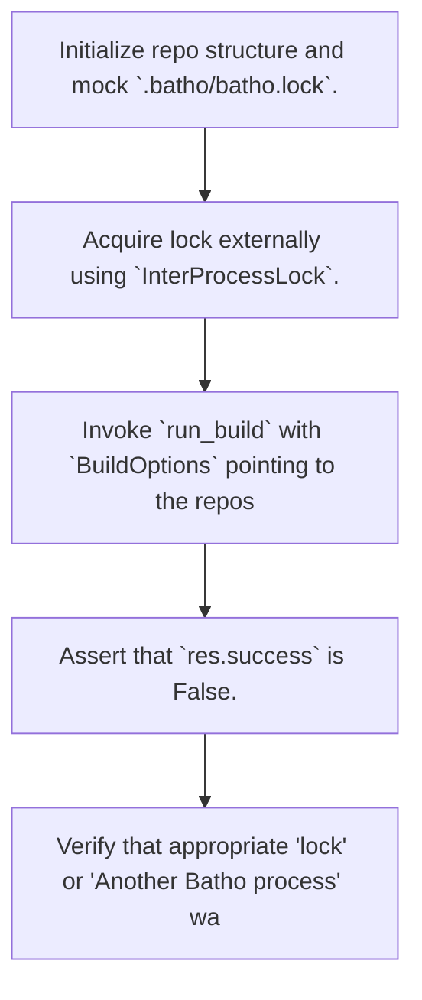

**Expectations:**
- Build gracefully exits with success=False.
    - Proper diagnostics are recorded in the build result warnings.

</details>

##### `test_build_failed_cleanup`
*Verify that on build failure, db.fail_run is called and store.cleanup_streams is called.*

<details>
<summary>View Test Details</summary>

**Scenario:**
The build process encounters an unexpected failure midway through indexing the codebase.
    The system must catch the error, mark the run as failed in the database with the
    appropriate error message, and clean up any partial Arrow files.

**Execution Flow:**
1. Create repo directory and write a basic `batho.yaml`.
    2. Mock `CodeGraphIndexer`'s `build_graph` method to raise a `ValueError`.
    3. Run `run_build` and assert `res.success` is False.
    4. Verify that the build run status in the SQLite database is recorded as "failed".
    5. Verify that the exception message is saved as the error message.

**Flowchart:**

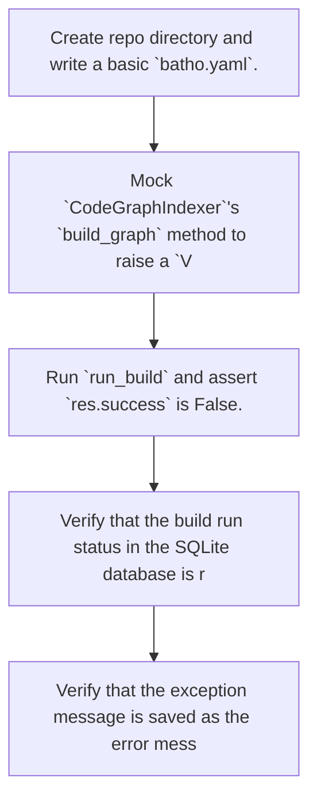

**Expectations:**
- Robust error handling: exceptions are caught and reported in the build result.
    - Run state is updated to "failed" on-disk to prevent downstream operations from reading corrupt runs.

</details>

##### `test_case_insensitive_collision_warning`
*Verify that case-insensitive duplicates issue a warning on build/patch.*

<details>
<summary>View Test Details</summary>

**Scenario:**
On a case-insensitive filesystem (or in an environment emulating one), two files exist
    whose paths differ only by case (e.g., `Index.py` and `index.py`).
    The build engine should proceed but emit a clear warning notifying the user of potential collisions.

**Execution Flow:**
1. Create two files `Index.py` and `index.py` with distinct contents.
    2. Mock filesystem walking to return both files.
    3. Mock `is_filesystem_case_insensitive` to return True.
    4. Run the build pipeline.
    5. Verify that the build succeeds but produces warnings referencing "Case-insensitive path collision".

**Flowchart:**

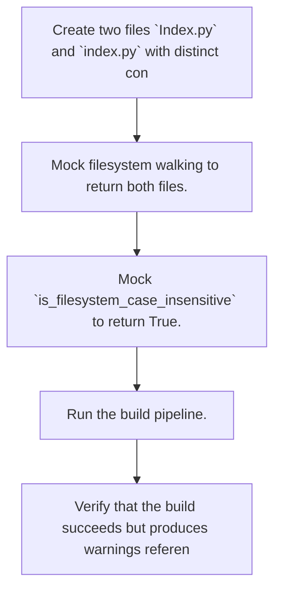

**Expectations:**
- Files are built successfully, but the potential filesystem conflict is logged as a warning.

</details>

##### `test_oversized_file_opaque_tracking`
*Verify that files exceeding max_file_size_kb are skipped from AST parsing, log warnings, and are saved as opaque snapshots.*

<details>
<summary>View Test Details</summary>

**Scenario:**
The repository contains a file whose size exceeds the user's or system's max file size limit (configured in KB).
    The build should not fail; instead, it should skip AST parsing for this file, log a warning,
    and write it as an "opaque snapshot" (is_indexed=False) in the file tracking records.

**Execution Flow:**
1. Write a small file (`small_file.py`) and an oversized file (`large_file.py`).
    2. Run build specifying `max_file_size_kb=1`.
    3. Assert that the build succeeds.
    4. Capture logger warnings and assert that "file_exceeds_max_size_limit" warning was emitted.
    5. Open the `BathoBundle` database and query tracking for the large file.
    6. Assert that the large file is indeed tracked but with `is_indexed` set to False.

**Flowchart:**

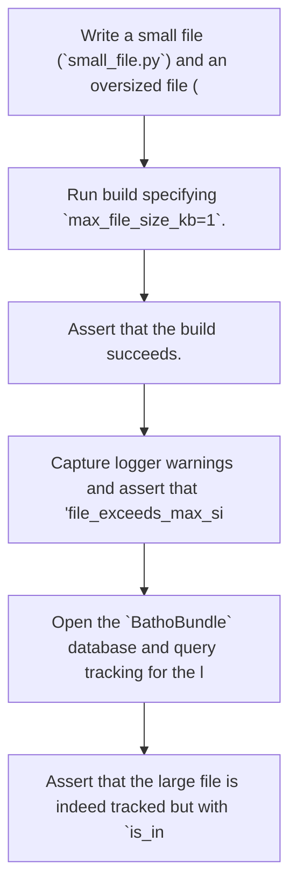

**Expectations:**
- Robust fallback for large files: they are not parsed but are still tracked in the index.
    - System warning is generated.

</details>


---

### `tests/orchestrator/test_build_patch_consistency.py`

Regression test for build/patch hash consistency bug.

This test verifies that `batho patch` reports 0 changes immediately after
`batho build` completes, ensuring hash computation is consistent between
the two operations.

Bug fixed: Previously, build.py used simple SHA256 for all files, while
patch.py used content-aware hashing that returned `size_mtime` format
for binary files instead of SHA256. This caused binary files to always
appear "modified" even when unchanged.

#### Standalone Tests

##### `test_repo_with_mixed_files`
*Create a test repo with text, binary, and special files.*


##### `test_build_then_patch_reports_no_changes`
*Verify patch reports 0 changes immediately after build.*

<details>
<summary>View Test Details</summary>

**Scenario:**
A repository with mixed text, binary, and archive files is built. Immediately after building,
    a patch operation is run to detect changes.

**Execution Flow:**
1. Clean up existing bundle directories under the repository root.
    2. Execute `run_build` with force_full set to True.
    3. Verify the build is successful and the metadata file exists.
    4. Execute `run_patch` and assert it is successful.
    5. Verify that no changes are detected by the patch.

**Flowchart:**

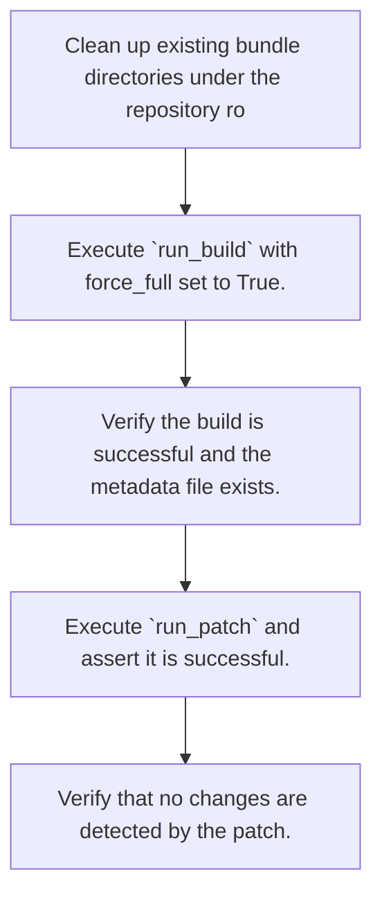

**Expectations:**
- The build completes successfully and produces a bundle meta.json.
    - The subsequent patch operation reports 0 changes applied (or raises a 'No changes detected' warning).

</details>

##### `test_build_then_patch_hash_scan_mode`
*Verify patch with hash scan mode works correctly after build.*

<details>
<summary>View Test Details</summary>

**Scenario:**
A repository is built, and then patch is run using the fallback hash scan mode (for non-git repositories).

**Execution Flow:**
1. Clean up existing bundle directories.
    2. Run build on the mixed-files test repository.
    3. Run patch in a non-git environment (which falls back to hash scan mode).
    4. Verify patch completes successfully.
    5. Verify no changes are detected.

**Flowchart:**

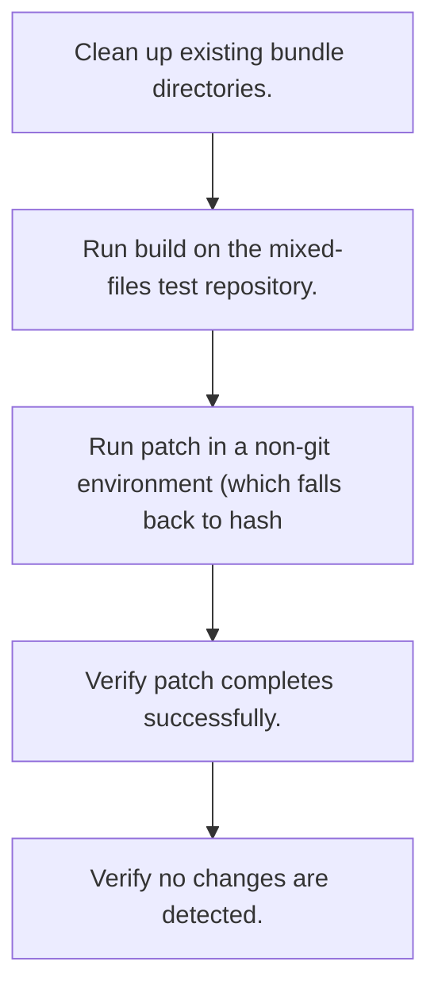

**Expectations:**
- The build and patch operations complete successfully.
    - The patch command reports 0 changes applied under hash scan mode.

</details>

##### `test_binary_file_hash_consistency`
*Verify binary files get consistent SHA256 hashes from both functions.*

<details>
<summary>View Test Details</summary>

**Scenario:**
A temporary binary file is created containing a mock PNG header and null bytes.

**Execution Flow:**
1. Create a binary temporary file.
    2. Compute the file's hash using `compute_file_hash`.
    3. Compute the file's expected SHA256 hash using the standard hashlib module.
    4. Compare the two computed hashes.
    5. Assert that the returned hash is not in size_mtime format.

**Flowchart:**

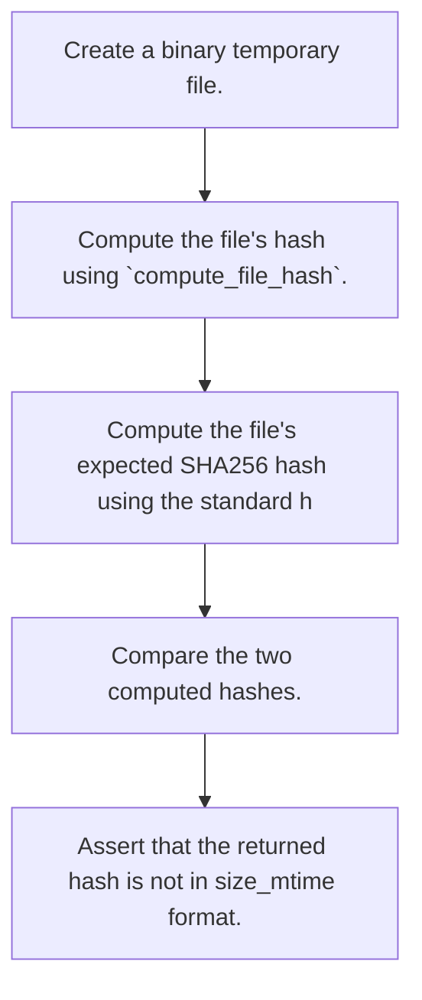

**Expectations:**
- The hash returned by `compute_file_hash` exactly matches the expected SHA256 hash.
    - The hash does not contain size/mtime indicators (e.g. "_" or "T").

</details>

##### `test_text_file_hash_consistency`
*Verify text files get consistent SHA256 hashes.*

<details>
<summary>View Test Details</summary>

**Scenario:**
A temporary text file containing simple string data is created.

**Execution Flow:**
1. Create a temporary text file.
    2. Compute the file's hash using `compute_file_hash`.
    3. Compute the expected SHA256 hash using hashlib.
    4. Assert that the two hashes match.

**Flowchart:**

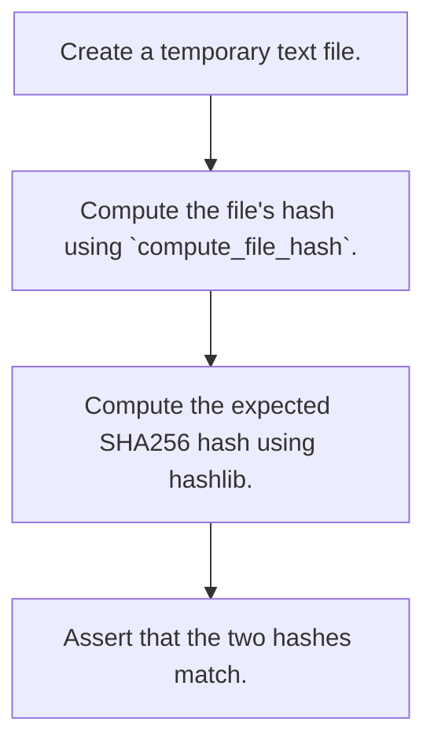

**Expectations:**
- The calculated hash from `compute_file_hash` is the exact SHA256 hex digest of the file's contents.

</details>

##### `test_build_git_metadata_and_file_tracking_run_id`
*Verify that build correctly records run metadata and populates file_tracking.*

<details>
<summary>View Test Details</summary>

**Scenario:**
A test repository is initialized as a git repo (if git is available) and built.

**Execution Flow:**
1. Attempt to initialize git, configure user identity, and commit files in the test repository.
    2. Clean up any existing bundle directory.
    3. Run build to create a bundle.
    4. Retrieve the bundle object and query the run metadata matching the build's run_id.
    5. Assert that git metadata fields (git_commit, git_branch) are populated correctly based on whether it is a git repository.
    6. Query the file_tracking records and assert they exist and reference the correct run_id.

**Flowchart:**

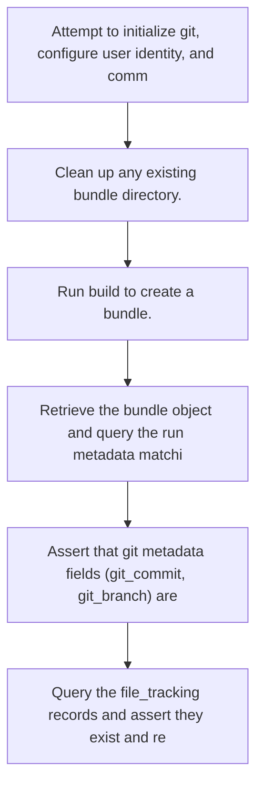

**Expectations:**
- The build completes successfully.
    - Git metadata (commit and branch) is captured if built inside a git repository, and is None otherwise.
    - Every file in file_tracking is mapped to the current run's UUID as the last_run_uuid.

</details>


---

### `tests/orchestrator/test_export_pack.py`

Tests for batho export default pack behavior (transport ZIP production).

#### Class `TestExportDefaultPack`

##### `test_default_produces_zip`
*Verify that running default export produces a valid ZIP archive.*

<details>
<summary>View Test Details</summary>

**Scenario:**
An export operation is invoked specifying a target ZIP output path on an existing bundle.

**Execution Flow:**
1. Bootstrap a minimal bundle with one completed run in the temp path.
    2. Define the output path pointing to `out.batho`.
    3. Run `run_export` with the configured ExportOptions.
    4. Verify the export is successful, the output file is created at the correct path, and it is a valid zipfile.

**Flowchart:**

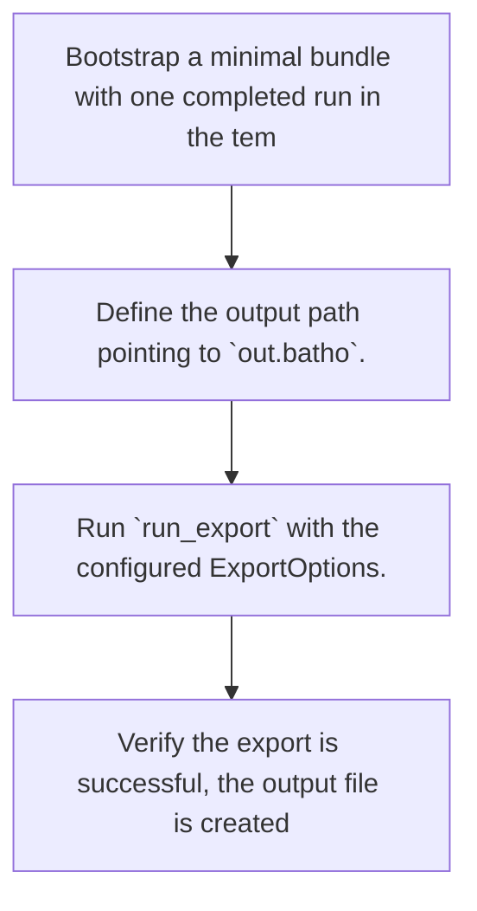

**Expectations:**
- The export returns a successful result with no errors.
    - The output file exists and is recognized as a valid zip file.

</details>

##### `test_default_zip_contains_manifest_and_ipc`
*Verify that the exported ZIP archive contains the manifest and IPC files.*

<details>
<summary>View Test Details</summary>

**Scenario:**
An export operation is run on an existing bundle, and the contents of the generated ZIP are inspected.

**Execution Flow:**
1. Bootstrap a minimal bundle.
    2. Run `run_export` to output `out.batho`.
    3. Open the output ZIP file and list its contents.
    4. Verify the ZIP includes "manifest.json" and at least one ".ipc.zst" member.

**Flowchart:**

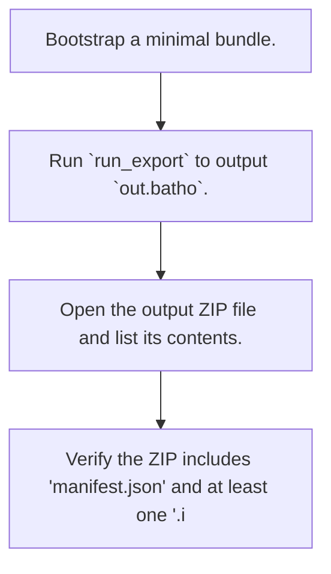

**Expectations:**
- The export is successful.
    - The export package contains both the bundle manifest and the compressed IPC database tables.

</details>

##### `test_default_manifest_schema_version`
*Verify that the manifest inside the export package contains the correct schema version.*

<details>
<summary>View Test Details</summary>

**Scenario:**
An export is performed, and the metadata in manifest.json inside the ZIP is loaded and checked.

**Execution Flow:**
1. Bootstrap a minimal bundle.
    2. Run `run_export` to output `out.batho`.
    3. Open the ZIP file, read the "manifest.json" entry, and parse it as JSON.
    4. Verify that schema_version is "batho-bundle.v1" and the generation value is at least 1.

**Flowchart:**

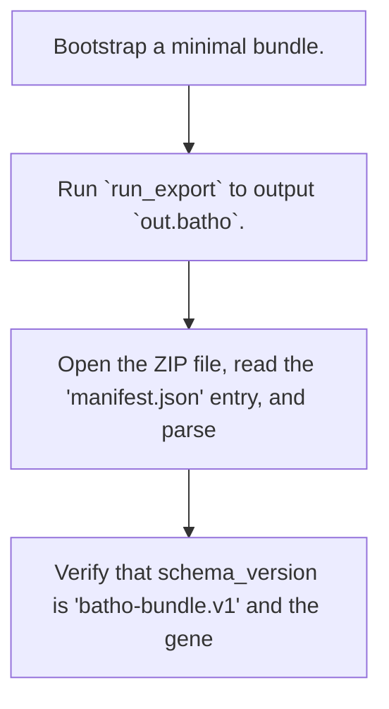

**Expectations:**
- The export manifest contains the expected schema version format and a positive generation number.

</details>

##### `test_default_ipc_members_are_zstd_compressed`
*Verify that IPC file members within the exported ZIP are zstd-compressed.*

<details>
<summary>View Test Details</summary>

**Scenario:**
An export package is generated, and its internal IPC files are decompressed using Zstd.

**Execution Flow:**
1. Bootstrap a minimal bundle.
    2. Run `run_export` to output `out.batho`.
    3. For each file in the ZIP ending with ".ipc.zst", extract and decompress it using a ZstdDecompressor.
    4. Verify that the decompressed byte array contains valid data (length &gt;= 8 bytes).

**Flowchart:**

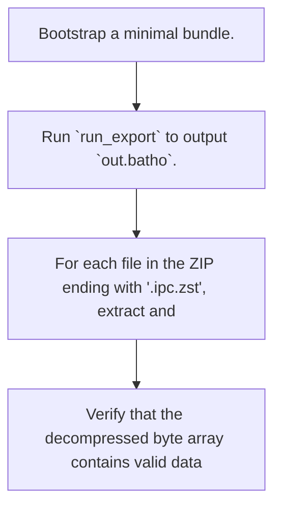

**Expectations:**
- All IPC tables inside the archive are compressed with ZStandard and can be successfully decompressed.

</details>

##### `test_default_output_path`
*Verify that export uses a default output path when none is explicitly specified.*

<details>
<summary>View Test Details</summary>

**Scenario:**
An export is run on an existing bundle without providing an output file path in the ExportOptions.

**Execution Flow:**
1. Bootstrap a minimal bundle.
    2. Initialize ExportOptions with only the bundle root directory.
    3. Run `run_export` with these options.
    4. Check that the returned output path has a ".batho" suffix and actually exists on disk.

**Flowchart:**

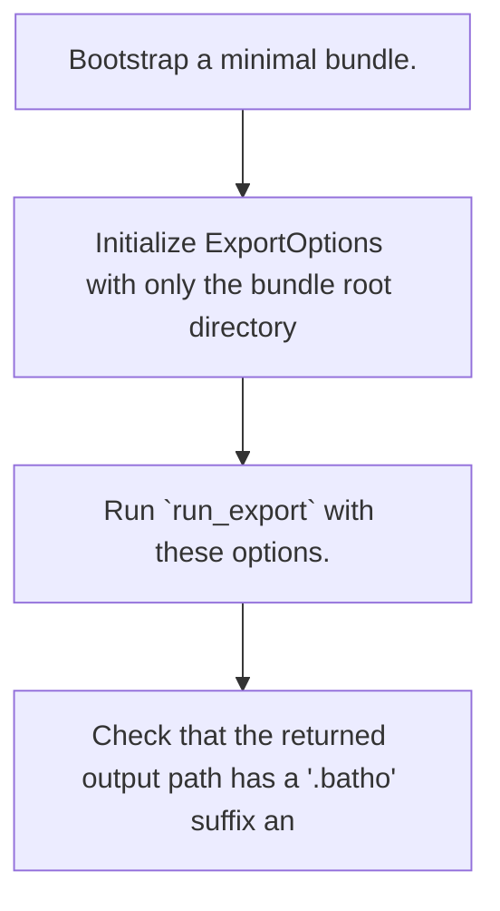

**Expectations:**
- The export successfully computes and creates the package at a default path.

</details>

##### `test_default_no_bundle_returns_error`
*Verify that exporting an empty or non-existent bundle root returns a failure error.*

<details>
<summary>View Test Details</summary>

**Scenario:**
Export options are configured with a root directory that does not contain a Batho bundle.

**Execution Flow:**
1. Initialize ExportOptions pointing to an empty temporary directory.
    2. Run `run_export`.
    3. Assert that the operation failed and the errors contain the expected "No artifact bundle" message.

**Flowchart:**

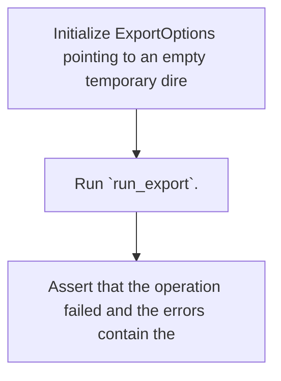

**Expectations:**
- The export result reports success as False.
    - An error message indicating the lack of an artifact bundle is returned.

</details>

##### `test_default_roundtrip_with_load`
*Pack then load should restore all IPC tables to a fresh directory.*

<details>
<summary>View Test Details</summary>

**Scenario:**
An exported bundle ZIP package is unpacked/loaded into a fresh destination directory using the BathoBundleManager.

**Execution Flow:**
1. Bootstrap a minimal bundle in a temp path.
    2. Export the bundle to `out.batho`.
    3. Create a fresh destination directory "restored".
    4. Use `BathoBundleManager` on the destination directory to unpack the exported ZIP package.
    5. Assert the unpacked manifest's schema version matches.
    6. Verify that IPC tables (such as runs) are correctly restored as files on disk.

**Flowchart:**

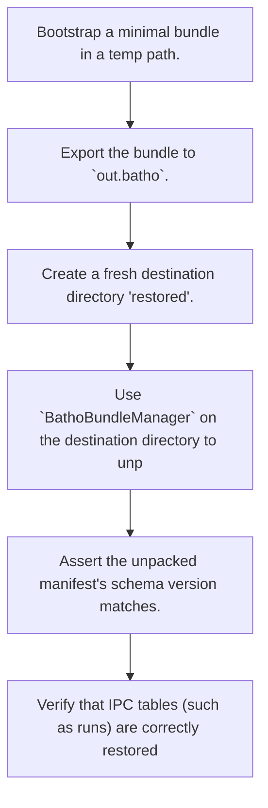

**Expectations:**
- Unpacking the export package successfully restores the manifest and active IPC table files.
    - Schema version is maintained in the restored manifest.

</details>


---

### `tests/orchestrator/test_gc.py`

Tests for batho gc orchestrator against the Arrow Bundle.

#### Class `TestGCStatus`

##### `test_status_returns_success`
*Verify that running the GC status command on a valid bundle returns successfully.*

<details>
<summary>View Test Details</summary>

**Scenario:**
A bundle exists with at least one completed run, and the GC 'status' command is executed.

**Execution Flow:**
1. Bootstrap a bundle with one completed run.
    2. Run GC with GCOptions command set to 'status'.
    3. Verify the operation succeeds and contains "Arrow generation" in the output message.

**Flowchart:**

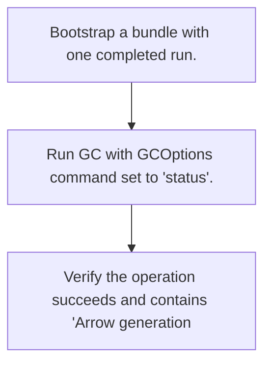

**Expectations:**
- The GC status execution succeeds.
    - The status message provides details about the current generation of Arrow files.

</details>

##### `test_status_missing_bundle`
*Verify that running GC status on a directory without a bundle returns an error.*

<details>
<summary>View Test Details</summary>

**Scenario:**
An empty directory has no Batho bundle, and a GC 'status' command is run.

**Execution Flow:**
1. Define GCOptions pointing to an empty temporary directory.
    2. Execute GC status.
    3. Verify the operation fails and the output message states "No artifact bundle".

**Flowchart:**

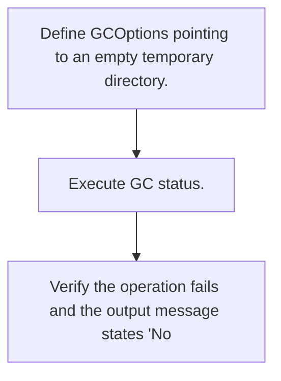

**Expectations:**
- The GC status run fails.
    - The failure message indicates the bundle was not found.

</details>

#### Class `TestGCDeleteRun`

##### `test_delete_existing_run`
*Verify that deleting an existing run via GC succeeds and removes the run.*

<details>
<summary>View Test Details</summary>

**Scenario:**
A bundle exists with a specific run UUID, and GC 'run' delete command is called for that UUID.

**Execution Flow:**
1. Bootstrap a bundle with a test run UUID.
    2. Execute GC with command set to 'run' and the target run UUID.
    3. Verify the GC command succeeds.
    4. Reopen the bundle and query the deleted run UUID.
    5. Assert that the run is no longer present.

**Flowchart:**

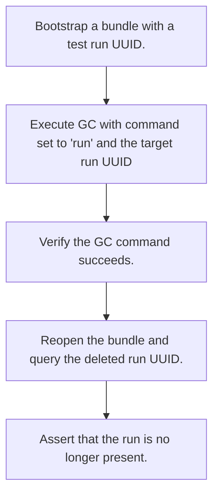

**Expectations:**
- The run deletion operation succeeds.
    - The database no longer contains records for the deleted run.

</details>

##### `test_delete_nonexistent_run`
*Verify that attempting to delete a nonexistent run returns an error.*

<details>
<summary>View Test Details</summary>

**Scenario:**
GC delete run command is executed for a UUID that does not exist in the bundle.

**Execution Flow:**
1. Bootstrap a bundle.
    2. Execute GC with command set to 'run' and a nonexistent run UUID.
    3. Assert that the command failed.
    4. Check that the error message indicates the run was not found.

**Flowchart:**

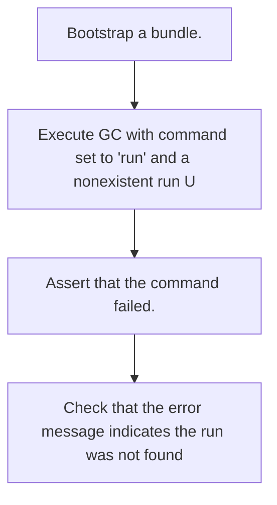

**Expectations:**
- The run deletion fails.
    - An error message is returned specifying that the run was not found.

</details>

##### `test_delete_run_missing_uuid`
*Verify that attempting to delete a run without providing a UUID returns an error.*

<details>
<summary>View Test Details</summary>

**Scenario:**
GC run deletion command is invoked with run_uuid set to None.

**Execution Flow:**
1. Bootstrap a bundle.
    2. Execute GC with command set to 'run' and run_uuid set to None.
    3. Assert that the command fails.

**Flowchart:**

```mermaid
flowchart TD
    S0["Bootstrap a bundle."]
    S1["Execute GC with command set to 'run' and run_uuid set to Non"]
    S0 --> S1
    S2["Assert that the command fails."]
    S1 --> S2
```

**Expectations:**
- The GC command reports a failure.

</details>

#### Class `TestGCVacuum`

##### `test_vacuum_removes_orphans`
*Verify that the GC vacuum command deletes orphan IPC files.*

<details>
<summary>View Test Details</summary>

**Scenario:**
An orphan IPC file (not registered in the active manifest) is placed in the bundle directory.

**Execution Flow:**
1. Bootstrap a bundle and get its directory.
    2. Write a dummy/fake orphan IPC file to the bundle directory.
    3. Execute GC with command set to 'vacuum'.
    4. Verify the GC command succeeds.
    5. Check if the orphan file was deleted.

**Flowchart:**

```mermaid
flowchart TD
    S0["Bootstrap a bundle and get its directory."]
    S1["Write a dummy/fake orphan IPC file to the bundle directory."]
    S0 --> S1
    S2["Execute GC with command set to 'vacuum'."]
    S1 --> S2
    S3["Verify the GC command succeeds."]
    S2 --> S3
    S4["Check if the orphan file was deleted."]
    S3 --> S4
```

**Expectations:**
- The vacuum command finishes successfully.
    - The orphan IPC file is deleted from the disk.

</details>

##### `test_orphans_subcommand`
*Verify that the GC orphans command identifies stale IPC files.*

<details>
<summary>View Test Details</summary>

**Scenario:**
An orphan IPC file exists in the bundle directory, and the 'orphans' status command is executed.

**Execution Flow:**
1. Bootstrap a bundle and create an orphan IPC file in the bundle directory.
    2. Execute GC with command set to 'orphans'.
    3. Verify the command succeeds.
    4. Assert that the returned message references the stale IPC file.

**Flowchart:**

```mermaid
flowchart TD
    S0["Bootstrap a bundle and create an orphan IPC file in the bund"]
    S1["Execute GC with command set to 'orphans'."]
    S0 --> S1
    S2["Verify the command succeeds."]
    S1 --> S2
    S3["Assert that the returned message references the stale IPC fi"]
    S2 --> S3
```

**Expectations:**
- The command reports success.
    - The output lists the stale/orphan IPC file.

</details>

#### Class `TestGCPruneOldRuns`

##### `test_prune_no_old_runs`
*Verify that pruning old runs does not delete new runs.*

<details>
<summary>View Test Details</summary>

**Scenario:**
A run was just created, and the GC 'runs' pruning command is run with a large older_than threshold.

**Execution Flow:**
1. Bootstrap a bundle with a new run.
    2. Run GC with command set to 'runs' and older_than set to 365 days.
    3. Verify the command succeeds and reports "No runs found" to prune.

**Flowchart:**

```mermaid
flowchart TD
    S0["Bootstrap a bundle with a new run."]
    S1["Run GC with command set to 'runs' and older_than set to 365 "]
    S0 --> S1
    S2["Verify the command succeeds and reports 'No runs found' to p"]
    S1 --> S2
```

**Expectations:**
- Pruning succeeds without deleting the recently created run.

</details>

##### `test_prune_invalid_threshold`
*Verify that pruning with an invalid negative threshold returns an error.*

<details>
<summary>View Test Details</summary>

**Scenario:**
The GC 'runs' pruning command is executed with an older_than parameter of -1.

**Execution Flow:**
1. Bootstrap a bundle.
    2. Execute GC with command set to 'runs' and older_than set to -1.
    3. Assert that the operation failed.

**Flowchart:**

```mermaid
flowchart TD
    S0["Bootstrap a bundle."]
    S1["Execute GC with command set to 'runs' and older_than set to "]
    S0 --> S1
    S2["Assert that the operation failed."]
    S1 --> S2
```

**Expectations:**
- The pruning run returns success as False.

</details>

#### Class `TestGCUnknownCommand`

##### `test_unknown_command`
*Verify that executing an unknown GC command returns a failure.*

<details>
<summary>View Test Details</summary>

**Scenario:**
GC command is invoked with a non-existent sub-command.

**Execution Flow:**
1. Bootstrap a bundle.
    2. Execute GC command with command set to 'noop'.
    3. Assert that the operation failed.
    4. Verify the message points out "Unknown gc command".

**Flowchart:**

```mermaid
flowchart TD
    S0["Bootstrap a bundle."]
    S1["Execute GC command with command set to 'noop'."]
    S0 --> S1
    S2["Assert that the operation failed."]
    S1 --> S2
    S3["Verify the message points out 'Unknown gc command'."]
    S2 --> S3
```

**Expectations:**
- The GC run fails due to an invalid command.

</details>


---

### `tests/orchestrator/test_load.py`

Tests for batho load orchestrator — pack/unpack round-trip.

#### Class `TestRunLoadSuccess`

##### `test_load_populates_bundle_dir`
*Verify that load successfully populates the destination bundle directory.*

<details>
<summary>View Test Details</summary>

**Scenario:**
An exported bundle ZIP package is loaded into a clean destination directory.

**Execution Flow:**
1. Create a source directory and export a minimal bundle ZIP into it.
    2. Create a clean destination directory.
    3. Run `run_load` on the destination directory with the exported ZIP.
    4. Verify that the operation succeeds and a meta.json file exists in the destination.

**Flowchart:**

```mermaid
flowchart TD
    S0["Create a source directory and export a minimal bundle ZIP in"]
    S1["Create a clean destination directory."]
    S0 --> S1
    S2["Run `run_load` on the destination directory with the exporte"]
    S1 --> S2
    S3["Verify that the operation succeeds and a meta.json file exis"]
    S2 --> S3
```

**Expectations:**
- The load operation returns success.
    - The destination bundle directory contains the unpacked meta.json metadata file.

</details>

##### `test_load_result_has_correct_tables_count`
*Verify that the load operation returns the correct count of loaded tables.*

<details>
<summary>View Test Details</summary>

**Scenario:**
A bundle is exported to ZIP and then loaded, and the table load count is inspected.

**Execution Flow:**
1. Export a minimal bundle ZIP from the source directory.
    2. Run `run_load` targeting a destination directory.
    3. Assert that the operation succeeded.
    4. Verify that `tables_loaded` in the result is at least 1.

**Flowchart:**

```mermaid
flowchart TD
    S0["Export a minimal bundle ZIP from the source directory."]
    S1["Run `run_load` targeting a destination directory."]
    S0 --> S1
    S2["Assert that the operation succeeded."]
    S1 --> S2
    S3["Verify that `tables_loaded` in the result is at least 1."]
    S2 --> S3
```

**Expectations:**
- The load result indicates success.
    - The number of tables successfully loaded is 1 or more.

</details>

##### `test_load_result_has_generation`
*Verify that the load result returns a valid bundle generation.*

<details>
<summary>View Test Details</summary>

**Scenario:**
A bundle ZIP package is loaded, and the generation attribute of the LoadResult is checked.

**Execution Flow:**
1. Export a minimal bundle ZIP from the source directory.
    2. Run `run_load` targeting a destination directory.
    3. Verify the generation in the result is greater than or equal to 1.

**Flowchart:**

```mermaid
flowchart TD
    S0["Export a minimal bundle ZIP from the source directory."]
    S1["Run `run_load` targeting a destination directory."]
    S0 --> S1
    S2["Verify the generation in the result is greater than or equal"]
    S1 --> S2
```

**Expectations:**
- The load result contains a valid generation integer (&gt;= 1).

</details>

##### `test_loaded_bundle_is_readable`
*Verify that the loaded bundle can be successfully read and queried.*

<details>
<summary>View Test Details</summary>

**Scenario:**
A bundle ZIP package is loaded into a destination directory, and then the BathoBundle reader is used to read the data.

**Execution Flow:**
1. Export a minimal bundle ZIP.
    2. Run `run_load` targeting a destination directory.
    3. Instanciate a `BathoBundle` on the destination directory.
    4. Query all runs from the database and check if the runs array length is 1 and the run UUID is 'build_001'.

**Flowchart:**

```mermaid
flowchart TD
    S0["Export a minimal bundle ZIP."]
    S1["Run `run_load` targeting a destination directory."]
    S0 --> S1
    S2["Instanciate a `BathoBundle` on the destination directory."]
    S1 --> S2
    S3["Query all runs from the database and check if the runs array"]
    S2 --> S3
```

**Expectations:**
- The database is readable post-load.
    - The runs table contains the correct, matching run details bootstrapped during export.

</details>

##### `test_load_then_export_roundtrip`
*Export -&gt; load into dst -&gt; export again -&gt; load into dst2 -&gt; still readable.*

<details>
<summary>View Test Details</summary>

**Scenario:**
Perform a full roundtrip: export a bundle, load it, export the loaded bundle again, and load it into a second directory.

**Execution Flow:**
1. Export the initial minimal bundle ZIP from the source.
    2. Load the ZIP into the first destination directory (dst1).
    3. Export a new ZIP from the first destination directory using `BathoBundleManager`.
    4. Load the second ZIP into a second destination directory (dst2) using `run_load`.
    5. Assert that the second load operation succeeds.
    6. Instantiate `BathoBundle` on dst2 and verify the run is readable and valid.

**Flowchart:**

```mermaid
flowchart TD
    S0["Export the initial minimal bundle ZIP from the source."]
    S1["Load the ZIP into the first destination directory (dst1)."]
    S0 --> S1
    S2["Export a new ZIP from the first destination directory using "]
    S1 --> S2
    S3["Load the second ZIP into a second destination directory (dst"]
    S2 --> S3
    S4["Assert that the second load operation succeeds."]
    S3 --> S4
    S5["Instantiate `BathoBundle` on dst2 and verify the run is read"]
    S4 --> S5
```

**Expectations:**
- Both load and export operations succeed in sequence.
    - The final bundle in dst2 remains fully readable with matching run records.

</details>

#### Class `TestRunLoadErrors`

##### `test_missing_root_fails`
*Verify that trying to load into a non-existent destination directory fails.*

<details>
<summary>View Test Details</summary>

**Scenario:**
The load operation is run pointing to a non-existent destination root.

**Execution Flow:**
1. Run `run_load` with a destination root directory path that does not exist.
    2. Verify that the operation returns a failure.
    3. Assert that the failure message reports that the destination does not exist.

**Flowchart:**

```mermaid
flowchart TD
    S0["Run `run_load` with a destination root directory path that d"]
    S1["Verify that the operation returns a failure."]
    S0 --> S1
    S2["Assert that the failure message reports that the destination"]
    S1 --> S2
```

**Expectations:**
- The load operation returns success as False.
    - An appropriate error message is returned pointing to the missing directory.

</details>

##### `test_missing_artifact_fails`
*Verify that loading a non-existent artifact ZIP package fails.*

<details>
<summary>View Test Details</summary>

**Scenario:**
The load operation is run with a path to a non-existent ZIP package.

**Execution Flow:**
1. Create a valid destination directory.
    2. Run `run_load` with a non-existent artifact path.
    3. Verify that the operation fails and the message contains "not found".

**Flowchart:**

```mermaid
flowchart TD
    S0["Create a valid destination directory."]
    S1["Run `run_load` with a non-existent artifact path."]
    S0 --> S1
    S2["Verify that the operation fails and the message contains 'no"]
    S1 --> S2
```

**Expectations:**
- The load operation fails.
    - The returned message reports that the artifact ZIP file was not found.

</details>

##### `test_existing_bundle_without_force_fails`
*Verify that loading into an already occupied bundle directory without force fails.*

<details>
<summary>View Test Details</summary>

**Scenario:**
A load operation is executed on a destination directory that already has a bundle directory.

**Execution Flow:**
1. Export a minimal bundle ZIP.
    2. Load the ZIP into the destination directory.
    3. Attempt to load the same ZIP into the destination directory again without the force option.
    4. Assert that the second load fails and the message contains "already exists".

**Flowchart:**

```mermaid
flowchart TD
    S0["Export a minimal bundle ZIP."]
    S1["Load the ZIP into the destination directory."]
    S0 --> S1
    S2["Attempt to load the same ZIP into the destination directory "]
    S1 --> S2
    S3["Assert that the second load fails and the message contains '"]
    S2 --> S3
```

**Expectations:**
- The second load operation returns success as False.
    - An error is returned indicating that the bundle already exists at the destination.

</details>

##### `test_force_overwrites_existing_bundle`
*Verify that loading with force=True overwrites an already occupied bundle directory.*

<details>
<summary>View Test Details</summary>

**Scenario:**
A load operation is executed with force=True on a destination directory that already contains a bundle.

**Execution Flow:**
1. Export a minimal bundle ZIP.
    2. Load the ZIP into the destination directory.
    3. Run `run_load` targeting the same destination directory with the ZIP and `force=True`.
    4. Assert that the second load succeeds.

**Flowchart:**

```mermaid
flowchart TD
    S0["Export a minimal bundle ZIP."]
    S1["Load the ZIP into the destination directory."]
    S0 --> S1
    S2["Run `run_load` targeting the same destination directory with"]
    S1 --> S2
    S3["Assert that the second load succeeds."]
    S2 --> S3
```

**Expectations:**
- The force load succeeds and overwrites the existing bundle.

</details>

##### `test_bad_zip_schema_version_fails`
*Verify that loading a ZIP package with an invalid schema version fails.*

<details>
<summary>View Test Details</summary>

**Scenario:**
A bundle ZIP package is loaded where the manifest.json contains a schema version mismatch.

**Execution Flow:**
1. Export a minimal bundle ZIP.
    2. Copy the ZIP, unpack manifest.json, modify the schema_version to an invalid value, and pack it back.
    3. Run `run_load` targeting a destination directory using the modified ZIP.
    4. Verify that the load fails.
    5. Assert that the returned error message indicates a schema mismatch.

**Flowchart:**

```mermaid
flowchart TD
    S0["Export a minimal bundle ZIP."]
    S1["Copy the ZIP, unpack manifest.json, modify the schema_versio"]
    S0 --> S1
    S2["Run `run_load` targeting a destination directory using the m"]
    S1 --> S2
    S3["Verify that the load fails."]
    S2 --> S3
    S4["Assert that the returned error message indicates a schema mi"]
    S3 --> S4
```

**Expectations:**
- The load fails due to schema version incompatibility.

</details>


---

### `tests/orchestrator/test_load_bsg_current.py`

Tests for bsg/current reconstruction from a packed .batho artifact.

#### Class `TestBsgCurrentReconstructed`

##### `test_bsg_current_dir_exists_after_load`
*Verify that the bsg/current directory is created after loading a bundle.*

<details>
<summary>View Test Details</summary>

**Scenario:**
A bundle with entities is exported and then loaded with BSG reconstruction enabled.

**Execution Flow:**
1. Setup a minimal bundle with entity data in the source directory.
    2. Pack the bundle to a ZIP file and load it into a destination directory (with rebuild_bsg=True).
    3. Check if the path `.batho` / `bsg` / `current` exists inside the destination.

**Flowchart:**

```mermaid
flowchart TD
    S0["Setup a minimal bundle with entity data in the source direct"]
    S1["Pack the bundle to a ZIP file and load it into a destination"]
    S0 --> S1
    S2["Check if the path `.batho` / `bsg` / `current` exists inside"]
    S1 --> S2
```

**Expectations:**
- The bsg/current directory is successfully created on disk.

</details>

##### `test_entity_dict_written`
*Verify that the reconstructed entity dictionary IPC table contains the correct rows.*

<details>
<summary>View Test Details</summary>

**Scenario:**
A bundle is loaded with BSG reconstruction enabled, and the resulting entity_dict.ipc is inspected.

**Execution Flow:**
1. Setup a minimal bundle, export it, and load it into the destination.
    2. Locate the `entity_dict.ipc` file in `.batho/bsg/current`.
    3. Assert that the file exists, read its contents into a table, and verify it contains at least 2 rows.

**Flowchart:**

```mermaid
flowchart TD
    S0["Setup a minimal bundle, export it, and load it into the dest"]
    S1["Locate the `entity_dict.ipc` file in `.batho/bsg/current`."]
    S0 --> S1
    S2["Assert that the file exists, read its contents into a table,"]
    S1 --> S2
```

**Expectations:**
- The entity_dict.ipc file exists and is populated with at least two entities.

</details>

##### `test_entities_ipc_written`
*Verify that the entities IPC table is written and contains the expected entities.*

<details>
<summary>View Test Details</summary>

**Scenario:**
A bundle is loaded, and the entities.ipc file is read to check entity names.

**Execution Flow:**
1. Setup a minimal bundle, export it, and load it into the destination.
    2. Check that the `entities.ipc` file exists in the reconstructed directory.
    3. Read the table from the file.
    4. Verify that the table has at least 2 rows, containing "MyClass" and "my_func" in the `entity_name` column.

**Flowchart:**

```mermaid
flowchart TD
    S0["Setup a minimal bundle, export it, and load it into the dest"]
    S1["Check that the `entities.ipc` file exists in the reconstruct"]
    S0 --> S1
    S2["Read the table from the file."]
    S1 --> S2
    S3["Verify that the table has at least 2 rows, containing 'MyCla"]
    S2 --> S3
```

**Expectations:**
- The entities.ipc file is successfully written.
    - Both mock entities "MyClass" and "my_func" are present in the table.

</details>

##### `test_relationships_ipc_written`
*Verify that the relationships IPC table is written and contains the expected relation types.*

<details>
<summary>View Test Details</summary>

**Scenario:**
A bundle is loaded, and the relationships.ipc file is read to verify relationships.

**Execution Flow:**
1. Setup a minimal bundle, export it, and load it into the destination.
    2. Check that `relationships.ipc` exists.
    3. Read the IPC file and assert the table has at least 1 row.
    4. Verify the `relation_type` column contains "contains".

**Flowchart:**

```mermaid
flowchart TD
    S0["Setup a minimal bundle, export it, and load it into the dest"]
    S1["Check that `relationships.ipc` exists."]
    S0 --> S1
    S2["Read the IPC file and assert the table has at least 1 row."]
    S1 --> S2
    S3["Verify the `relation_type` column contains 'contains'."]
    S2 --> S3
```

**Expectations:**
- The relationships.ipc file is successfully written.
    - The "contains" relationship between MyClass and my_func is preserved.

</details>

##### `test_dangling_ipc_written_empty`
*Verify that the dangling IPC table is written but is empty after load.*

<details>
<summary>View Test Details</summary>

**Scenario:**
A bundle is loaded, and the dangling.ipc file is inspected.

**Execution Flow:**
1. Setup a minimal bundle, export it, and load it into the destination.
    2. Check that `dangling.ipc` exists.
    3. Read the IPC file and assert that the number of rows is 0.

**Flowchart:**

```mermaid
flowchart TD
    S0["Setup a minimal bundle, export it, and load it into the dest"]
    S1["Check that `dangling.ipc` exists."]
    S0 --> S1
    S2["Read the IPC file and assert that the number of rows is 0."]
    S1 --> S2
```

**Expectations:**
- The dangling.ipc file is created.
    - The table in dangling.ipc contains 0 rows since there are no dangling relationships.

</details>

##### `test_meta_json_written`
*Verify that the bsg/current metadata file is written and contains valid attributes.*

<details>
<summary>View Test Details</summary>

**Scenario:**
A bundle is loaded, and the bsg/current/meta.json is inspected.

**Execution Flow:**
1. Setup a minimal bundle, export it, and load it.
    2. Check that `meta.json` exists in `bsg/current/`.
    3. Parse the JSON content of the file.
    4. Assert that `schema_version` is present and `entity_count` is at least 2.

**Flowchart:**

```mermaid
flowchart TD
    S0["Setup a minimal bundle, export it, and load it."]
    S1["Check that `meta.json` exists in `bsg/current/`."]
    S0 --> S1
    S2["Parse the JSON content of the file."]
    S1 --> S2
    S3["Assert that `schema_version` is present and `entity_count` i"]
    S2 --> S3
```

**Expectations:**
- The metadata JSON file is correctly written and contains the proper schema version and entity count.

</details>

##### `test_rebuild_bsg_false_skips_reconstruction`
*Verify that setting rebuild_bsg=False skips the bsg/current reconstruction.*

<details>
<summary>View Test Details</summary>

**Scenario:**
A load operation is run with `rebuild_bsg` explicitly set to False.

**Execution Flow:**
1. Setup a minimal bundle and export it to ZIP.
    2. Run `run_load` targeting the destination with `rebuild_bsg=False`.
    3. Assert that the `.batho/bsg/current` directory does not exist.

**Flowchart:**

```mermaid
flowchart TD
    S0["Setup a minimal bundle and export it to ZIP."]
    S1["Run `run_load` targeting the destination with `rebuild_bsg=F"]
    S0 --> S1
    S2["Assert that the `.batho/bsg/current` directory does not exis"]
    S1 --> S2
```

**Expectations:**
- The load operation succeeds but does not populate the bsg/current directory.

</details>

##### `test_bsg_current_entity_file_paths_populated`
*Verify that entity file paths are properly populated in the reconstructed entities.ipc table.*

<details>
<summary>View Test Details</summary>

**Scenario:**
A bundle is loaded, and the reconstructed `entities.ipc` is checked for correct `file_path` values.

**Execution Flow:**
1. Setup a minimal bundle, export it, and load it.
    2. Read `entities.ipc` from the bsg/current directory.
    3. Assert that the `file_path` column contains "src/foo.py".

**Flowchart:**

```mermaid
flowchart TD
    S0["Setup a minimal bundle, export it, and load it."]
    S1["Read `entities.ipc` from the bsg/current directory."]
    S0 --> S1
    S2["Assert that the `file_path` column contains 'src/foo.py'."]
    S1 --> S2
```

**Expectations:**
- The file paths mapping in the entities table matches the source file path "src/foo.py".

</details>

##### `test_patch_can_open_reconstructed_store`
*BsgScratchStore.open_for_patch should load the reconstructed current/.*

<details>
<summary>View Test Details</summary>

**Scenario:**
Open the reconstructed store for a patch operation and verify it has the correct entity/relationship counts.

**Execution Flow:**
1. Setup a minimal bundle, export it, and load it.
    2. Import `BsgScratchStore` and invoke `open_for_patch` on the destination's `.batho` directory.
    3. Assert that the returned current_store has an entity count of at least 2.
    4. Assert that the current_store has a relationship count of at least 1.

**Flowchart:**

```mermaid
flowchart TD
    S0["Setup a minimal bundle, export it, and load it."]
    S1["Import `BsgScratchStore` and invoke `open_for_patch` on the "]
    S0 --> S1
    S2["Assert that the returned current_store has an entity count o"]
    S1 --> S2
    S3["Assert that the current_store has a relationship count of at"]
    S2 --> S3
```

**Expectations:**
- The BsgScratchStore successfully opens the reconstructed directory.
    - The entity and relationship counts in the store match the loaded bundle counts.

</details>


---

### `tests/orchestrator/test_patch.py`

Integration and edge case tests for Batho's patch orchestrator.

This module validates that the patch pipeline:
1. Rejects execution and yields warning results if another process holds the lock.
2. Prevents concurrent patch runs on the same repository.

#### Standalone Tests

##### `test_patch_lock_contention`
*Verify that concurrent patch runs fail immediately and gracefully with a lock conflict error.*

<details>
<summary>View Test Details</summary>

**Scenario:**
The repository is initialized with a build. A process acquires and holds the repository's `.batho/batho.lock` file.
    While the lock is held, we trigger `run_patch`.
    The patch operation must fail gracefully immediately without corrupting the active on-disk indexes.

**Execution Flow:**
1. Initialize repo with a small python file.
    2. Run a full build to create the initial Batho bundle.
    3. Identify the lock file path: `.batho/batho.lock`.
    4. Acquire the lock via `InterProcessLock`.
    5. Within the lock context, make a modification to the file and execute `run_patch`.
    6. Assert that the patch result success is False.
    7. Verify that warnings about "already running" or "lock" are present in the patch result.

**Flowchart:**

```mermaid
flowchart TD
    S0["Initialize repo with a small python file."]
    S1["Run a full build to create the initial Batho bundle."]
    S0 --> S1
    S2["Identify the lock file path: `.batho/batho.lock`."]
    S1 --> S2
    S3["Acquire the lock via `InterProcessLock`."]
    S2 --> S3
    S4["Within the lock context, make a modification to the file and"]
    S3 --> S4
    S5["Assert that the patch result success is False."]
    S4 --> S5
    S6["Verify that warnings about 'already running' or 'lock' are p"]
    S5 --> S6
```

**Expectations:**
- Patch operations respect exclusive process-wide locking.
    - Failures are clean and prevent concurrent write contamination.

</details>


---

### `tests/orchestrator/test_root_isolation.py`

#### Standalone Tests

##### `test_build_artifact_in_root_not_cwd`
*Verify that build artifacts are created in the project root, not the current working directory.*

<details>
<summary>View Test Details</summary>

**Scenario:**
A build is triggered while the current working directory is a subdirectory of the project.
    The artifact bundle must still be placed under the project's root, not under the CWD.

**Execution Flow:**
1. Create a subdirectory "other" inside the temp project.
    2. Change the working directory to "other" using monkeypatch.
    3. Run `run_build` with the project root as the target.
    4. Assert the build succeeds and the bundle meta.json exists under the project root.
    5. Assert the bundle was NOT created under "other".

**Flowchart:**

```mermaid
flowchart TD
    S0["Create a subdirectory 'other' inside the temp project."]
    S1["Change the working directory to 'other' using monkeypatch."]
    S0 --> S1
    S2["Run `run_build` with the project root as the target."]
    S1 --> S2
    S3["Assert the build succeeds and the bundle meta.json exists un"]
    S2 --> S3
    S4["Assert the bundle was NOT created under 'other'."]
    S3 --> S4
```

**Expectations:**
- Build output is anchored to the specified root directory, unaffected by the process CWD.

</details>

##### `test_patch_uses_root_not_cwd`
*Verify that patch operations target the project root, not the current working directory.*

<details>
<summary>View Test Details</summary>

**Scenario:**
After a successful build, the CWD is changed to a subdirectory, and a file in the project is modified.
    The patch must still detect and apply changes to the project's root.

**Execution Flow:**
1. Run a full build on the temp project.
    2. Create and chdir into a subdirectory "other".
    3. Modify the project's main.py file.
    4. Run `run_patch` targeting the project root.
    5. Assert the patch succeeds and at least one change is applied.

**Flowchart:**

```mermaid
flowchart TD
    S0["Run a full build on the temp project."]
    S1["Create and chdir into a subdirectory 'other'."]
    S0 --> S1
    S2["Modify the project's main.py file."]
    S1 --> S2
    S3["Run `run_patch` targeting the project root."]
    S2 --> S3
    S4["Assert the patch succeeds and at least one change is applied"]
    S3 --> S4
```

**Expectations:**
- Patch detects changes in the root project regardless of the current working directory.

</details>

##### `test_export_output_defaults_to_root`
*Verify that export writes the artifact to the project root by default, not the CWD.*

<details>
<summary>View Test Details</summary>

**Scenario:**
After building, the CWD is changed to a subdirectory, and export is run without an explicit output path.
    The artifact must be placed in the project root.

**Execution Flow:**
1. Run a full build on the temp project.
    2. Create and chdir into a subdirectory "other".
    3. Run `run_export` with output=None.
    4. Assert the export succeeds and the artifact exists under the project root.
    5. Assert the artifact does NOT exist under "other".

**Flowchart:**

```mermaid
flowchart TD
    S0["Run a full build on the temp project."]
    S1["Create and chdir into a subdirectory 'other'."]
    S0 --> S1
    S2["Run `run_export` with output=None."]
    S1 --> S2
    S3["Assert the export succeeds and the artifact exists under the"]
    S2 --> S3
    S4["Assert the artifact does NOT exist under 'other'."]
    S3 --> S4
```

**Expectations:**
- Default export output is anchored to the project root directory.

</details>

##### `test_export_explicit_output_honoured`
*Verify that an explicit output path overrides the default root-based output.*

<details>
<summary>View Test Details</summary>

**Scenario:**
After building, export is run with a custom output file path in a different directory.
    The artifact must be written exactly to the specified path.

**Execution Flow:**
1. Run a full build on the temp project.
    2. Create and chdir into a subdirectory "other".
    3. Run `run_export` with a custom output path inside "other".
    4. Assert the export succeeds, the custom file exists, and no artifact was written to the project root.

**Flowchart:**

```mermaid
flowchart TD
    S0["Run a full build on the temp project."]
    S1["Create and chdir into a subdirectory 'other'."]
    S0 --> S1
    S2["Run `run_export` with a custom output path inside 'other'."]
    S1 --> S2
    S3["Assert the export succeeds, the custom file exists, and no a"]
    S2 --> S3
```

**Expectations:**
- Explicit output path is honored over the default root-based naming.

</details>

##### `test_config_loaded_from_root_batho_yaml`
*Verify that configuration is loaded from the project's batho.yaml, not the CWD.*

<details>
<summary>View Test Details</summary>

**Scenario:**
A custom batho.yaml exists in the project root, and the CWD is changed elsewhere.
    Config must still resolve from the project root.

**Execution Flow:**
1. Write a custom batho.yaml with a unique max_file_size_kb value to the project root.
    2. Create and chdir into a subdirectory "other".
    3. Call `set_active_root(temp_project)`.
    4. Fetch config via `get_config_cached()`.
    5. Assert the loaded config reflects the custom value from the project root.

**Flowchart:**

```mermaid
flowchart TD
    S0["Write a custom batho.yaml with a unique max_file_size_kb val"]
    S1["Create and chdir into a subdirectory 'other'."]
    S0 --> S1
    S2["Call `set_active_root(temp_project)`."]
    S1 --> S2
    S3["Fetch config via `get_config_cached()`."]
    S2 --> S3
    S4["Assert the loaded config reflects the custom value from the "]
    S3 --> S4
```

**Expectations:**
- Config file resolution is anchored to the active root, not the process CWD.

</details>

##### `test_two_projects_independent_artifacts`
*Verify that two separate projects in the same parent directory have independent artifacts.*

<details>
<summary>View Test Details</summary>

**Scenario:**
Two projects (proj_a, proj_b) exist as sibling directories under the same parent.
    Each is built independently, and their artifact bundles must not overlap or share run IDs.

**Execution Flow:**
1. Create two sibling project directories with distinct main.py files.
    2. Run a full build on each project.
    3. Assert both builds succeed and each has its own meta.json.
    4. Query the latest run ID from each project's bundle.
    5. Assert the run IDs are different.

**Flowchart:**

```mermaid
flowchart TD
    S0["Create two sibling project directories with distinct main.py"]
    S1["Run a full build on each project."]
    S0 --> S1
    S2["Assert both builds succeed and each has its own meta.json."]
    S1 --> S2
    S3["Query the latest run ID from each project's bundle."]
    S2 --> S3
    S4["Assert the run IDs are different."]
    S3 --> S4
```

**Expectations:**
- Each project maintains an isolated artifact bundle with unique run identifiers.

</details>

##### `test_set_active_root_clears_cache`
*Verify that calling set_active_root clears the config cache for the new root.*

<details>
<summary>View Test Details</summary>

**Scenario:**
Two projects have different batho.yaml configs. Switching the active root must
    reload the configuration rather than returning a stale cached value.

**Execution Flow:**
1. Create two projects with batho.yaml files containing different max_file_size_kb values.
    2. Set active root to proj_a and fetch cached config.
    3. Assert the value matches proj_a's config.
    4. Set active root to proj_b and fetch cached config.
    5. Assert the value matches proj_b's config.

**Flowchart:**

```mermaid
flowchart TD
    S0["Create two projects with batho.yaml files containing differe"]
    S1["Set active root to proj_a and fetch cached config."]
    S0 --> S1
    S2["Assert the value matches proj_a's config."]
    S1 --> S2
    S3["Set active root to proj_b and fetch cached config."]
    S2 --> S3
    S4["Assert the value matches proj_b's config."]
    S3 --> S4
```

**Expectations:**
- Config cache is invalidated and reloaded when the active root changes.

</details>

##### `test_root_with_symlink`
*Verify that build works correctly when the root path is a symlink.*

<details>
<summary>View Test Details</summary>

**Scenario:**
The project root is accessed through a symbolic link. The build must resolve the symlink
    and place artifacts in the real directory, while the active root tracks the resolved path.

**Execution Flow:**
1. Create a real project directory with a main.py file.
    2. Create a symbolic link pointing to the real directory.
    3. Change CWD to a different directory.
    4. Run build using the symlink path as the root.
    5. Assert artifacts exist in the real directory and the active root is the resolved real path.

**Flowchart:**

```mermaid
flowchart TD
    S0["Create a real project directory with a main.py file."]
    S1["Create a symbolic link pointing to the real directory."]
    S0 --> S1
    S2["Change CWD to a different directory."]
    S1 --> S2
    S3["Run build using the symlink path as the root."]
    S2 --> S3
    S4["Assert artifacts exist in the real directory and the active "]
    S3 --> S4
```

**Expectations:**
- Symlink roots are transparently resolved to their real paths for artifact placement.

</details>

##### `test_root_with_trailing_slash`
*Verify that a root path with a trailing slash is handled correctly.*

<details>
<summary>View Test Details</summary>

**Scenario:**
The root path is provided with a trailing slash, which should not cause path resolution
    errors or duplicate separators in artifact paths.

**Execution Flow:**
1. Construct a Path from the temp project string with an appended "/".
    2. Run build with this path as the root.
    3. Assert the build succeeds and the bundle meta.json exists.

**Flowchart:**

```mermaid
flowchart TD
    S0["Construct a Path from the temp project string with an append"]
    S1["Run build with this path as the root."]
    S0 --> S1
    S2["Assert the build succeeds and the bundle meta.json exists."]
    S1 --> S2
```

**Expectations:**
- Trailing slashes in the root path are normalized without affecting artifact placement.

</details>

##### `test_root_nonexistent_raises_clean_error`
*Verify that a non-existent root path produces a clean, descriptive error.*

<details>
<summary>View Test Details</summary>

**Scenario:**
A build is invoked with a root directory that does not exist on the filesystem.
    The operation should fail gracefully with a meaningful warning message.

**Execution Flow:**
1. Define a path to a non-existent directory.
    2. Run build with this path as the root.
    3. Assert the build fails.
    4. Assert the warnings contain "not exist" or "no such".

**Flowchart:**

```mermaid
flowchart TD
    S0["Define a path to a non-existent directory."]
    S1["Run build with this path as the root."]
    S0 --> S1
    S2["Assert the build fails."]
    S1 --> S2
    S3["Assert the warnings contain 'not exist' or 'no such'."]
    S2 --> S3
```

**Expectations:**
- Missing root directories are detected early and reported with a clean error message.

</details>

##### `test_root_is_file_not_dir`
*Verify that passing a file path instead of a directory as root produces a clean error.*

<details>
<summary>View Test Details</summary>

**Scenario:**
The root argument points to an existing file rather than a directory.
    The build must detect this and fail with an appropriate error message.

**Execution Flow:**
1. Use an existing file (main.py) as the root path.
    2. Run build with this file path as root.
    3. Assert the build fails.
    4. Assert the warnings contain "not a directory" or "directory".

**Flowchart:**

```mermaid
flowchart TD
    S0["Use an existing file (main.py) as the root path."]
    S1["Run build with this file path as root."]
    S0 --> S1
    S2["Assert the build fails."]
    S1 --> S2
    S3["Assert the warnings contain 'not a directory' or 'directory'"]
    S2 --> S3
```

**Expectations:**
- File paths provided as root are rejected with a descriptive error.

</details>

##### `test_concurrent_builds_different_roots_no_config_bleed`
*Verify that concurrent builds on different roots do not leak config values between threads.*

<details>
<summary>View Test Details</summary>

**Scenario:**
Two threads simultaneously set different active roots and read their respective configs.
    Each thread must see its own project's configuration without cross-contamination.

**Execution Flow:**
1. Create two projects with different batho.yaml values.
    2. Spawn two threads: worker_a sets root to proj_a, worker_b sets root to proj_b.
    3. Each thread reads its max_file_size_kb after a short sleep.
    4. Join both threads and assert each read the correct value.

**Flowchart:**

```mermaid
flowchart TD
    S0["Create two projects with different batho.yaml values."]
    S1["Spawn two threads: worker_a sets root to proj_a, worker_b se"]
    S0 --> S1
    S2["Each thread reads its max_file_size_kb after a short sleep."]
    S1 --> S2
    S3["Join both threads and assert each read the correct value."]
    S2 --> S3
```

**Expectations:**
- Per-thread active roots remain isolated; no config bleeding occurs between concurrent builds.

</details>

##### `test_patch_on_nonexistent_artifact_clean_error`
*Verify that patching a project with no existing artifact bundle produces a clean error.*

<details>
<summary>View Test Details</summary>

**Scenario:**
A patch is run on a directory that has never been built, so no artifact bundle exists.
    The patch must fail gracefully with a meaningful message.

**Execution Flow:**
1. Run patch on the temp project without ever building it first.
    2. Assert the patch fails.
    3. Assert the warnings contain "no artifact" or "bundle".

**Flowchart:**

```mermaid
flowchart TD
    S0["Run patch on the temp project without ever building it first"]
    S1["Assert the patch fails."]
    S0 --> S1
    S2["Assert the warnings contain 'no artifact' or 'bundle'."]
    S1 --> S2
```

**Expectations:**
- Missing bundles are detected and reported with a clean error before patching begins.

</details>

##### `test_diff_from_different_cwd`
*Verify that the diff command works correctly when invoked from a different working directory.*

<details>
<summary>View Test Details</summary>

**Scenario:**
After building, the CWD is changed to a subdirectory, and diff is run targeting the project root.
    The command must still operate on the project's artifact data.

**Execution Flow:**
1. Run a full build on the temp project.
    2. Create and chdir into a subdirectory "other".
    3. Invoke cmd_diff with the project root and a non-existent run UUID.
    4. Assert the command returns 1 and stderr contains "not found".

**Flowchart:**

```mermaid
flowchart TD
    S0["Run a full build on the temp project."]
    S1["Create and chdir into a subdirectory 'other'."]
    S0 --> S1
    S2["Invoke cmd_diff with the project root and a non-existent run"]
    S1 --> S2
    S3["Assert the command returns 1 and stderr contains 'not found'"]
    S2 --> S3
```

**Expectations:**
- CLI commands resolve the correct root artifact data regardless of the process CWD.

</details>

##### `test_fix_from_different_cwd`
*Verify that the fix command works correctly when invoked from a different working directory.*

<details>
<summary>View Test Details</summary>

**Scenario:**
After building, the CWD is changed to a subdirectory, and fix is run targeting the project root.
    The command must still operate on the project's artifact data.

**Execution Flow:**
1. Run a full build on the temp project.
    2. Create and chdir into a subdirectory "other".
    3. Invoke cmd_fix with the project root in dry-run mode.
    4. Assert the command returns 0 (success).

**Flowchart:**

```mermaid
flowchart TD
    S0["Run a full build on the temp project."]
    S1["Create and chdir into a subdirectory 'other'."]
    S0 --> S1
    S2["Invoke cmd_fix with the project root in dry-run mode."]
    S1 --> S2
    S3["Assert the command returns 0 (success)."]
    S2 --> S3
```

**Expectations:**
- CLI fix command resolves the correct root artifact data regardless of the process CWD.

</details>

##### `test_bundle_dir_based_on_root`
*Verify that the bundle directory path is derived correctly from the project root.*

<details>
<summary>View Test Details</summary>

**Scenario:**
Two different root paths must each map to their own unique artifact subdirectory.

**Execution Flow:**
1. Define two distinct project paths.
    2. Resolve the bundle directory for each using resolve_bundle_dir.
    3. Assert each resolves to `.batho/artifact` under its respective root.

**Flowchart:**

```mermaid
flowchart TD
    S0["Define two distinct project paths."]
    S1["Resolve the bundle directory for each using resolve_bundle_d"]
    S0 --> S1
    S2["Assert each resolves to `.batho/artifact` under its respecti"]
    S1 --> S2
```

**Expectations:**
- Bundle directories are always located at `&lt;root&gt;/.batho/artifact`.

</details>


---

