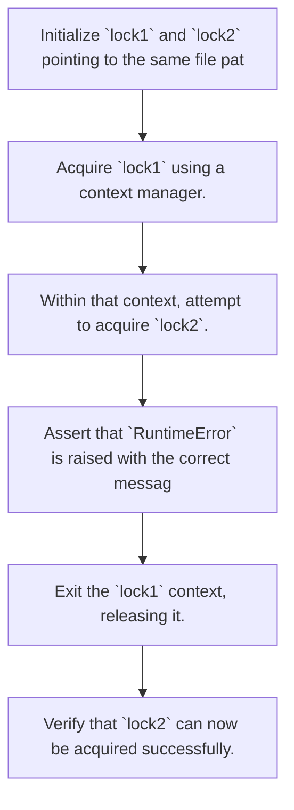
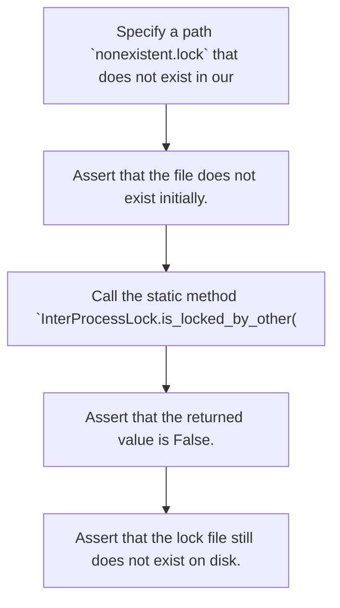

# Utility Tests

### `tests/utils/test_file_io.py`

Unit tests for Batho's file input/output and inter-process locking utilities.

This module validates that the lock mechanism works correctly across multiple processes or threads,
preventing concurrent builds or patches, and verifies that checking for locks does not
prematurely create files on the filesystem.

#### Standalone Tests

##### `test_interprocess_locking`
*Verify that InterProcessLock prevents concurrent acquisitions of the same lock file.*

View Test Details

**Scenario:**
Two separate lock manager instances try to acquire a lock on the exact same lock file.
    The first instance succeeds, while the second instance must fail with a RuntimeError
    indicating that another process or execution thread is active.

**Execution Flow:**
1. Initialize `lock1` and `lock2` pointing to the same file path `test.lock`.
    2. Acquire `lock1` using a context manager.
    3. Within that context, attempt to acquire `lock2`.
    4. Assert that `RuntimeError` is raised with the correct message.
    5. Exit the `lock1` context, releasing it.
    6. Verify that `lock2` can now be acquired successfully.

**Flowchart:**

**Expectations:**
- The lock file is exclusive: only one acquirer can hold it at any given time.
    - RuntimeError is raised during nested acquisition attempts.
    - Lock is fully re-acquirable once released by the previous holder.

##### `test_is_locked_by_other_no_file_creation`
*Verify that is_locked_by_other does not create a lock file if it does not exist.*

View Test Details

**Scenario:**
We query whether a lock file is held by another process before the file is even created.
    The query should return False, and the filesystem state must remain clean (the lock
    file should NOT be implicitly created by the query).

**Execution Flow:**
1. Specify a path `nonexistent.lock` that does not exist in our temporary directory.
    2. Assert that the file does not exist initially.
    3. Call the static method `InterProcessLock.is_locked_by_other(lock_file)`.
    4. Assert that the returned value is False.
    5. Assert that the lock file still does not exist on disk.

**Flowchart:**

**Expectations:**
- Querying lock status is a read-only operation.
    - No side-effects (file creations) are triggered on the filesystem.

---

