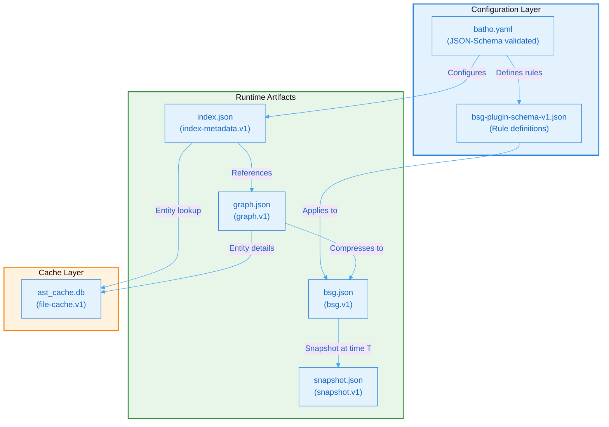

# 12. Appendix: Schema Reference

## 12.1 Schema Versions

| Artifact | Schema Version | File |
|----------|---------------|------|
| Graph | `graph.v1` | `.ctn/<id>/graph.json` |
| BSG | `bsg.v1` | `.ctn/<id>/bsg.json` |
| Snapshot | `snapshot.v1` | `.ctn/snapshots/<id>.json` |
| Index Metadata | `index-metadata.v1` | `.ctn/index.json` |
| File Cache | `file-cache.v1` | `.ctn/local/cache/ast_cache.db` |
| BSG Plugin | `bsg-plugin.v1` | `batho/bsg/schemas/bsg-plugin-schema-v1.json` |

### Schema Dependency Graph



**Figure 27: Schema Dependency Graph** - Dependency diagram showing the relationships between configuration schemas, runtime artifacts, and cache layers.

## 12.2 Directory Structure

```
.ctn/
├── index.json                    # Index metadata + history
├── local/
│   ├── cache/
│   │   └── ast_cache.db          # SQLite AST entity cache
│   ├── metrics/
│   │   └── metrics.json          # Indexing performance metrics
│   └── sync/
│       └── artifact_registry.db  # SQLite artifact registry
├── snapshots/
│   └── batho_<uuid>_<ts>.json   # Time Machine snapshots
└── <index_id>/
    ├── graph.json                # Entities + relationships
    ├── bsg.json                  # Structured symbol graph
    └── files.md                  # All files by category
```

## 12.3 Glossary

| Term | Definition |
|------|------------|
| **AST** | Abstract Syntax Tree — structured representation of source code |
| **BSG** | Batho Structured Graph — compressed, queryable code representation |
| **CTN** | Content directory — Batho's output workspace |
| **Entity** | A node in the code graph (function, class, etc.) |
| **Hypergraph** | Graph where edges can connect any number of nodes |
| **Patch** | Incremental update to a snapshot |
| **Relationship** | A directed edge between entities |
| **Snapshot** | Immutable point-in-time capture of the code graph |
| **Symbol Index** | Cross-file lookup table for imports and exports |

## 12.4 Error Codes

| Code | Description |
|------|-------------|
| `E001` | File not found |
| `E002` | Parse error |
| `E003` | Cache corruption |
| `E004` | Snapshot mismatch |
| `E005` | Permission denied |
| `E100` | Configuration error |
| `E200` | Plugin load failure |
| `E300` | Storage error |
