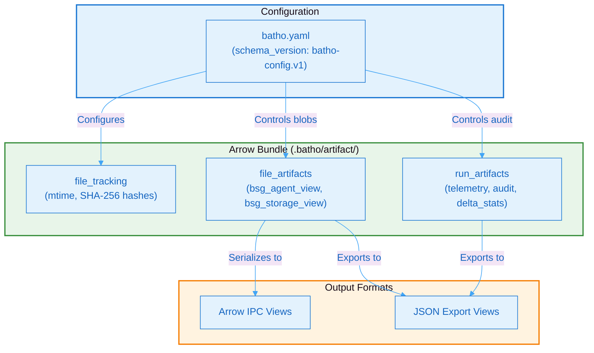

# 9. Appendix: Schema Reference

## 9.1 Schema Versions

| Artifact / Config | Schema Version | Description / Location |
|-------------------|----------------|------------------------|
| Configuration | `batho-config.v1` | Unified YAML configuration (`batho.yaml`) |
| Entity Schema | `pydantic.Entity` | Frozen Pydantic model (`batho/core/schemas.py`) |
| Relationship Schema | `pydantic.Relationship` | Frozen Pydantic model (`batho/core/schemas.py`) |
| Arrow Bundle | `batho-bundle.v1` | Arrow IPC tables: `file_tracking`, `file_artifacts`, `run_artifacts` |
| BSG View | `bsg.v1` | Memory-mapped Arrow IPC views |

### Schema Dependency Graph



**Figure 24: Schema Dependency Graph** - Diagram showing the relationships between configuration schemas, database tables, and output views.

---

## 9.2 Directory Structure

```
.batho/
├── artifact/
│   └── artifact_<dirname>.batho    # Arrow IPC transport artifact
└── cache/
    └── cache.json                  # Shared AST cache metadata
```

---

## 9.3 Glossary

| Term | Definition |
|------|------------|
| **AST** | Abstract Syntax Tree — structured representation of source code |
| **BSG** | Batho Structured Graph — compressed, queryable code representation |
| **Arrow Bundle** | High-performance binary database file containing entities, dependencies, and BSG views |
| **Entity** | A node in the code graph (function, class, variable, etc.) |
| **Hypergraph** | Graph where edges can connect any number of nodes |
| **Patch** | Incremental update to the database based on content-hash changes |
| **Relationship** | A directed edge between entities |
| **Symbol Index** | Cross-file lookup table for imports and exports |
| **Syntax Glue** | Whitespace, comments, braces, and non-semantic gaps recorded for lossless file reconstruction |

---

## 9.4 Error Codes

| Code | Description |
|------|-------------|
| `E001` | File not found |
| `E002` | Parse error |
| `E003` | Cache corruption |
| `E004` | Snapshot mismatch |
| `E005` | Permission denied |
| `E100` | Configuration error |
| `E200` | Plugin load failure |
| `E300` | Storage registry error |
