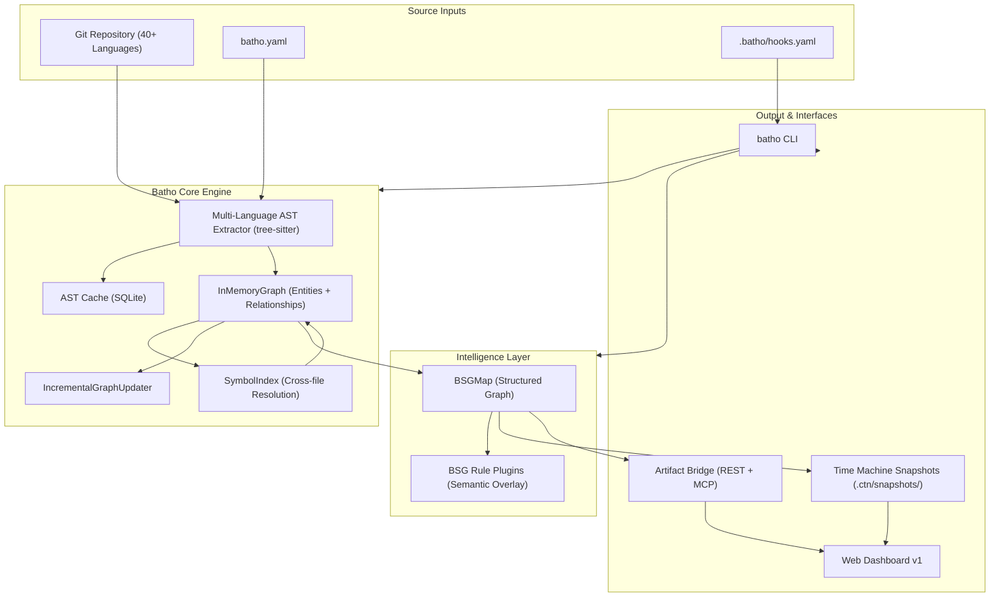
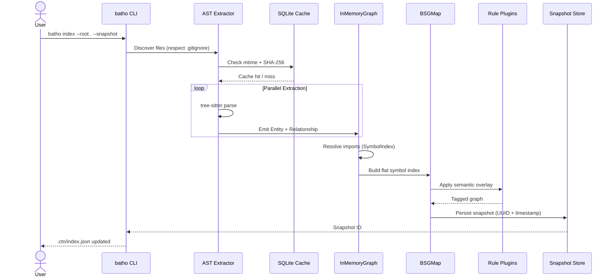

# 1. Architecture Overview

## 1.1 High-Level System Architecture

Batho's architecture follows a layered approach with clear separation between extraction, indexing, intelligence, and output layers. The system is designed for deterministic processing, enabling reliable caching and incremental updates.

## 1.2 Data Flow Pipeline

The data flow pipeline ensures deterministic processing with built-in caching and validation:

## 1.3 Component Responsibilities

### Core Engine Components

| Component | Purpose | Key Features |
|-----------|---------|--------------|
| **AST Extractor** | Multi-language parsing via tree-sitter | 40+ language support, parallel processing, mtime tracking |
| **InMemoryGraph** | Hypergraph storage | Lazy adjacency indexing, relationship deduplication, cross-file resolution |
| **AST Cache** | Persistent entity cache | SQLite-backed, SHA-256 validation, automatic invalidation |
| **SymbolIndex** | Cross-file symbol resolution | Two-pass resolution, unresolved target tracking |
| **IncrementalUpdater** | Patch application | Diff-based updates, chain validation, rollback support |

### Intelligence Layer Components

| Component | Purpose | Key Features |
|-----------|---------|--------------|
| **BSGMap** | Structured graph representation | Flat symbol index, priority scoring, rendering modes |
| **Rule Plugins** | Semantic analysis | YAML-defined rules, plugin architecture, tag-based annotation |

## 1.4 Output Interfaces

| Interface | Transport | Purpose |
|-----------|-----------|---------|
| **CLI** | Terminal | Direct control, scripting, automation |
| **Dashboard** | HTTP (port 8080) | Interactive exploration, visualization |
| **Bridge (REST)** | HTTP | Programmatic access, CI/CD integration |
| **Bridge (MCP)** | stdio/SSE | LLM context provisioning |
| **Snapshots** | JSON files | Time-travel, audit trail, backup |
