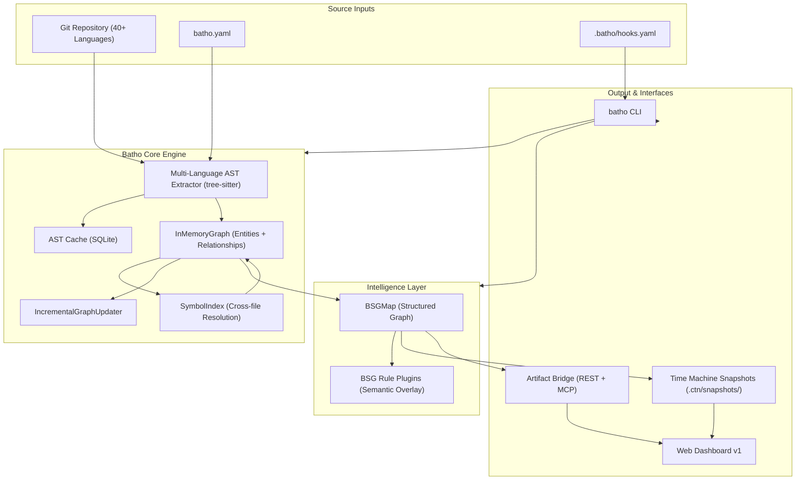
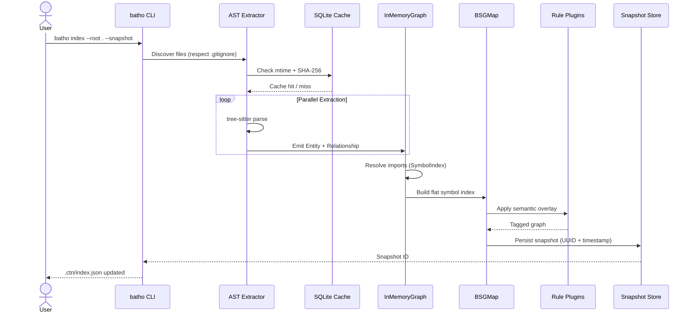

# 1. Architecture Overview

## 1.1 High-Level System Architecture

```mermaid
flowchart TB
    subgraph Sources["Source Inputs"]
        Repo["Git Repository (40+ Languages)"]
        Config["batho.yaml"]
        Hooks[".batho/hooks.yaml"]
    end

    subgraph Core["Batho Core Engine"]
        Extractor["Multi-Language AST Extractor (tree-sitter)"]
        Graph["InMemoryGraph (Entities + Relationships)"]
        Cache["AST Cache (SQLite)"]
        SymbolIndex["SymbolIndex (Cross-file Resolution)"]
        Incremental["IncrementalGraphUpdater"]
    end

    subgraph Intelligence["Intelligence Layer"]
        BSG["BSGMap (Structured Graph)"]
        Rules["BSG Rule Plugins (Semantic Overlay)"]
    end

    subgraph Output["Output & Interfaces"]
        Snapshots["Time Machine Snapshots (.ctn/snapshots/)"]
        Dashboard["Web Dashboard v1"]
        Bridge["Artifact Bridge (REST + MCP)"]
        CLI["batho CLI"]
    end

    Repo --> Extractor
    Config --> Extractor
    Extractor --> Cache
    Extractor --> Graph
    Graph --> SymbolIndex
    SymbolIndex --> Graph
    Graph --> Incremental
    Graph --> BSG
    BSG --> Rules
    BSG --> Snapshots
    Snapshots --> Dashboard
    BSG --> Bridge
    Bridge --> Dashboard
    CLI --> Core
    CLI --> Intelligence
    CLI --> Output
    Hooks --> CLI
```

## 1.2 Data Flow Pipeline

```mermaid
sequenceDiagram
    actor User
    participant CLI as batho CLI
    participant Extractor as AST Extractor
    participant Cache as SQLite Cache
    participant Graph as InMemoryGraph
    participant BSG as BSGMap
    participant Rules as Rule Plugins
    participant Snap as Snapshot Store

    User->>CLI: batho index --root . --snapshot
    CLI->>Extractor: Discover files (respect .gitignore)
    Extractor->>Cache: Check mtime + SHA-256
    Cache-->>Extractor: Cache hit / miss
    loop Parallel Extraction
        Extractor->>Extractor: tree-sitter parse
        Extractor->>Graph: Emit Entity + Relationship
    end
    Graph->>Graph: Resolve imports (SymbolIndex)
    Graph->>BSG: Build flat symbol index
    BSG->>Rules: Apply semantic overlay
    Rules-->>BSG: Tagged graph
    BSG->>Snap: Persist snapshot (UUID + timestamp)
    Snap-->>CLI: Snapshot ID
    CLI-->>User: .ctn/index.json updated
```
