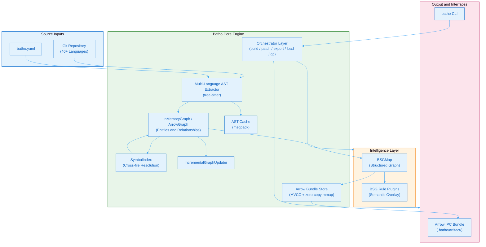
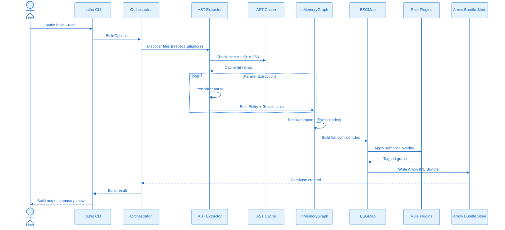

# 1. Architecture Overview

## 1.1 High-Level System Architecture

Batho's architecture follows a layered approach with clear separation between extraction, indexing, intelligence, and output layers. The system is designed for deterministic processing, enabling reliable caching and incremental updates.

Figure 2: High-Level System Architecture - Flowchart showing the layered architecture from source inputs through the core engine to output interfaces. Components include Source Inputs (Git Repository, batho.yaml), Batho Core Engine (AST Extractor, InMemoryGraph, AST Cache, SymbolIndex, IncrementalGraphUpdater), Intelligence Layer (BSGMap, BSG Rule Plugins), and Output Interfaces (Arrow IPC Bundle, batho CLI).

**Figure 2: High-Level System Architecture** - Detailed component view showing the layered architecture from source inputs through the core engine to output interfaces.

## 1.2 Data Flow Pipeline

The data flow pipeline ensures deterministic processing with built-in caching and validation:

Figure 3: Data Flow Pipeline - Sequence diagram showing the deterministic indexing process with caching and validation steps. Flow: User triggers batho CLI build command, CLI discovers files respecting gitignore, Extractor checks cache using mtime and SHA-256 hash, parallel extraction parses files with tree-sitter and emits entities to InMemoryGraph, Graph resolves imports via SymbolIndex, BSGMap builds flat symbol index, Rule Plugins apply semantic overlay, and the output is serialized to the Arrow Bundle Store.

**Figure 3: Data Flow Pipeline** - Sequence diagram showing the deterministic indexing process with caching and validation steps.

## 1.3 Component Responsibilities

### Core Engine Components

| Component | Purpose | Key Features |
|-----------|---------|--------------|
| **Orchestrator Layer** | High-level command implementations | Typed options/results, module delegation, error recovery |
| **AST Extractor** | Multi-language parsing via tree-sitter | 40+ language support, parallel processing, mtime tracking |
| **InMemoryGraph** | Hypergraph storage | Lazy adjacency indexing, relationship deduplication, cross-file resolution |
| **ArrowGraph** | Columnar graph storage | Memory-mapped IPC, CSR/CSC adjacency indexes, streaming compaction, auto-selection |
| **AST Cache** | Persistent entity cache | msgpack-backed, SHA-256 validation, automatic invalidation |
| **SymbolIndex** | Cross-file symbol resolution | Two-pass resolution, unresolved target tracking |
| **IncrementalUpdater** | Patch application | Diff-based updates, content-hash comparisons, rollback support |
| **Arrow Bundle Store** | Persistent artifact storage | MVCC generation commit, zero-copy memory-mapped reads, O(1) point lookup |

### Intelligence Layer Components

| Component | Purpose | Key Features |
|-----------|---------|--------------|
| **BSGMap** | Structured graph representation | Flat symbol index, priority scoring, rendering modes |
| **Rule Plugins** | Semantic analysis | YAML-defined rules, plugin architecture, tag-based annotation |

## 1.4 Output Interfaces

| Interface | Transport | Purpose |
|-----------|-----------|---------|
| **CLI** | Terminal | Direct control, scripting, automation, history diffs, integrity repair, gc |
| **Arrow IPC Bundle** | Arrow / IPC (.batho) | High-performance serialized storage of entities, dependencies, and BSG views |
| **JSON Export** | JSON Stream | Standard representation for LLM context injection and downstream tool integrations |
