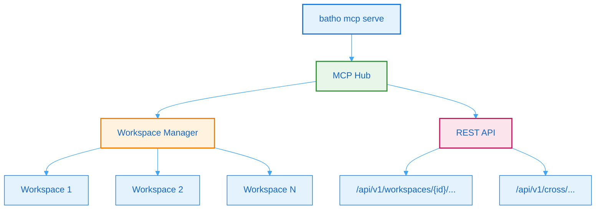

# 8. Artifact Bridge & MCP Hub

## 8.1 Overview

The Batho MCP Hub provides multi-workspace context serving for coding agents. It supports multiple `.ctn` directories simultaneously with lazy mounting, LRU residency, and cross-repo search capabilities.



**Figure 11: MCP Hub Architecture** - Multi-workspace context server with REST and MCP transports.

## 8.2 MCP Hub Features

### Multi-Workspace Support
- Register multiple `.ctn` directories in one hub
- Lazy mounting - workspaces load on demand
- LRU eviction - configurable max resident workspaces (default: 32)
- Workspace pinning - prevent eviction for critical workspaces

### Cross-Repo Search
- Search BSG entities across all workspaces
- Symbol resolution across repos
- Dependency tracking across workspaces

## 8.3 MCP Tools

### Workspace Introspection

| Tool | Description |
|------|-------------|
| `workspace.list` | List all registered workspaces |
| `workspace.health` | Get workspace health status |
| `workspace.stats` | Get registry statistics |

### Index & Artifact Access

| Tool | Description |
|------|-------------|
| `index.list` | List all available index IDs |
| `index.get` | Get specific index metadata |
| `artifact.list` | List artifact records by type |
| `artifact.get` | Load full JSON for artifact type |
| `artifact.get_by_path` | Load artifact by logical path |
| `artifact.search` | Fuzzy search artifacts |

### BSG & Context

| Tool | Description |
|------|-------------|
| `bsg.get` | Get BSG JSON artifact |
| `bsg.search` | Search BSG nodes by name/fqn |
| `context.overview` | Get context overview JSON |
| `context.files` | Get context files JSON |
| `graph.get` | Get graph JSON artifact |

### File Access

| Tool | Description |
|------|-------------|
| `file.read` | Read file content with BSG overlay |
| `file.list` | List tracked files in workspace |

### Cross-Repo Tools

| Tool | Description |
|------|-------------|
| `cross.search` | Search across multiple workspaces |
| `cross.symbols` | Locate symbol across repos |
| `cross.dependencies` | Find package consumers |
| `cross.workspaces_with_artifact` | Find workspaces with artifact type |

## 8.4 REST API Endpoints

### Workspace-Scoped Endpoints

| Endpoint | Method | Description |
|----------|--------|-------------|
| `/api/v1/workspaces` | GET | List all workspaces |
| `/api/v1/workspaces/{id}/health` | GET | Workspace health |
| `/api/v1/workspaces/{id}/stats` | GET | Registry statistics |
| `/api/v1/workspaces/{id}/indexes` | GET | List indexes |
| `/api/v1/workspaces/{id}/artifacts` | GET | List artifacts |
| `/api/v1/workspaces/{id}/file-content` | GET | File content with BSG |

### Cross-Repo Endpoints

| Endpoint | Method | Description |
|----------|--------|-------------|
| `/api/v1/cross/search` | GET | Search across workspaces |
| `/api/v1/cross/symbols` | GET | Find symbol across repos |
| `/api/v1/cross/dependencies` | GET | Find package consumers |

### Legacy Endpoints (Backward Compatible)

| Endpoint | Method | Description |
|----------|--------|-------------|
| `/api/v1/bridge/*` | GET | Legacy single-workspace (deprecated) |

### Health & Metrics

| Endpoint | Method | Description |
|----------|--------|-------------|
| `/healthz` | GET | Health check |
| `/metrics` | GET | Prometheus metrics |

## 8.5 Configuration

### User Config (~/.batho/mcp.yaml)

```yaml
schema_version: 1

server:
  bind: "127.0.0.1"
  http_port: 8770
  rest_port: 8771
  default_workspace: "batho"

residency:
  max_resident_workspaces: 32
  idle_evict_seconds: 600
  max_total_cache_bytes: 1073741824  # 1 GiB
  max_per_workspace_cache_bytes: 134217728  # 128 MiB
  prefetch_default_workspace: true

concurrency:
  global_inflight_limit: 256
  per_workspace_inflight_limit: 16
  request_timeout_seconds: 30

discovery:
  ctn_dir_globs:
    - "~/projects/*/.ctn"
    - "~/repos/*/build/.ctn"
  watch: true
  ignore_ids: []

cross_repo:
  enabled: true
  max_results_per_workspace: 25
  merge_strategy: "score_desc"

workspaces:
  - id: "batho"
    ctn_dir: "/path/to/batho/.ctn"
    label: "Batho Core"
    tags: ["core", "python"]
    pinned: true
```

### Workspace Config

```yaml
- id: string          # unique ID (a-z0-9_-)
  ctn_dir: string     # path to .ctn directory
  label: string       # display label
  tags: [string]      # workspace tags
  enabled: bool       # enable/disable
  pinned: bool        # prevent eviction
  read_only: bool     # read-only mode
  default_index_id: string  # optional index
  description: string # workspace description
```

## 8.6 CLI Commands

### Start MCP Hub

```bash
# Start with stdio transport (for IDE integration)
batho mcp serve --transport stdio

# Start with SSE transport
batho mcp serve --transport sse --bind 127.0.0.1 --http-port 8770

# Start with HTTP transport
batho mcp serve --transport http --config ~/.batho/mcp.yaml
```

### Workspace Management

```bash
# List workspaces
batho mcp list

# Add workspace
batho mcp add --ctn /path/to/repo/.ctn --id my-workspace --label "My Workspace"

# Remove workspace
batho mcp remove --id my-workspace

# Discover workspaces from globs
batho mcp discover

# Show workspace status
batho mcp status --id my-workspace

# Pin/unpin workspace
batho mcp pin --id my-workspace
batho mcp unpin --id my-workspace
```

## 8.7 Transport Modes

| Mode | Command | Use Case |
|------|---------|----------|
| **stdio** | `batho mcp serve --transport stdio` | MCP client integration (Claude, Cursor, etc.) |
| **SSE** | `batho mcp serve --transport sse` | Server-Sent Events for web clients |
| **HTTP** | `batho mcp serve --transport http` | Streamable HTTP transport |

## 8.8 Response Format

All MCP tools return JSON envelopes:

```json
{
  "ok": true,
  "workspace_id": "batho",
  "data": { ... },
  "meta": { "duration_ms": 12 }
}
```

Errors:
```json
{
  "ok": false,
  "error": {
    "code": "workspace_not_found",
    "message": "Workspace 'xyz' not found",
    "detail": {}
  }
}
```
