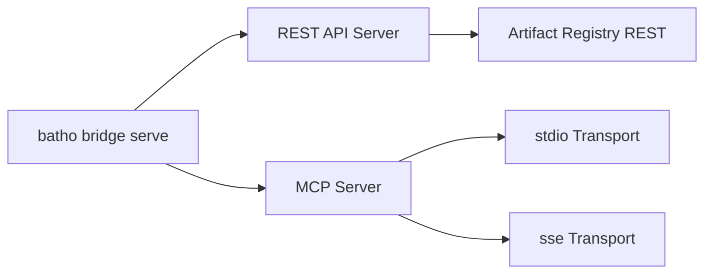

# 8. Artifact Bridge & MCP Integration

## 8.1 Bridge Modes

## 8.2 REST API Endpoints

| Endpoint | Method | Description |
|----------|--------|-------------|
| `/indexes` | GET | List all indexes |
| `/indexes/{index_id}` | GET | Get specific index metadata |
| `/index-meta` | GET | Current index metadata |
| `/artifacts` | GET | List registered artifacts |
| `/artifacts/{artifact_type}` | GET | Retrieve artifacts by type |
| `/artifacts/{artifact_type}/content` | GET | Artifact content by path |
| `/file-content` | GET | File content with BSG enrichment |
| `/stats` | GET | Registry statistics |
| `/patches` | GET | List patch operations |
| `/patches/{operation_id}` | GET | Patch operation detail |
| `/snapshots/diff` | GET | Diff two snapshots (base + new) |

## 8.3 MCP Server Capabilities

The MCP server exposes Batho's graph as a model context provider:

| Tool | Description |
|------|-------------|
| `bridge_list_indexes` | List all available index IDs and timestamps |
| `bridge_get_index` | Get metadata for a specific index |
| `bridge_list_artifacts` | List artifact records, optionally filtered |
| `bridge_get_artifact` | Load full JSON content for an artifact type |
| `bridge_get_artifact_by_path` | Load artifact content by exact logical path |
| `bridge_search_artifacts` | Fuzzy search artifacts by logical path |
| `bridge_get_stats` | Return registry statistics |
