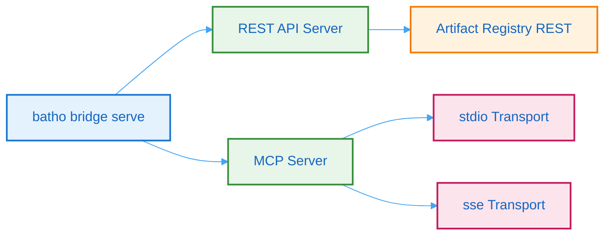

# 8. Artifact Bridge & MCP Integration

## 8.1 Bridge Modes

The Artifact Bridge provides multiple access modes:



**Figure 11: Bridge Modes** - Flowchart showing the dual-mode operation of the Artifact Bridge (REST API and MCP server).

## 8.2 REST API Endpoints

| Endpoint | Method | Description |
|----------|--------|-------------|
| `/indexes` | GET | List all indexes |
| `/indexes/{index_id}` | GET | Get specific index metadata |
| `/index-meta` | GET | Current index metadata |
| `/artifacts` | GET | List registered artifacts |
| `/artifacts/{artifact_type}` | GET | Retrieve artifacts by type |
| `/artifacts/{artifact_type}/content` | GET | Artifact content by path |
| `/file-content` | GET | File content with BSG enrichment |
| `/stats` | GET | Registry statistics |
| `/patches` | GET | List patch operations |
| `/patches/{operation_id}` | GET | Patch operation detail |
| `/snapshots/diff` | GET | Diff two snapshots (base + new) |

### Example: Get File Content with BSG Enrichment

```bash
curl "http://localhost:8080/file-content?path=src/services/user.py"
```

Response:
```json
{
  "file_path": "src/services/user.py",
  "content": "# File content...",
  "entities": [
    {
      "id": "UserService",
      "type": "CLASS",
      "start_line": 10,
      "end_line": 50
    }
  ]
}
```

## 8.3 MCP Server Capabilities

The MCP server exposes Batho's graph as a model context provider for LLMs:

| Tool | Description |
|------|-------------|
| `bridge_list_indexes` | List all available index IDs and timestamps |
| `bridge_get_index` | Get metadata for a specific index |
| `bridge_list_artifacts` | List artifact records, optionally filtered |
| `bridge_get_artifact` | Load full JSON content for an artifact type |
| `bridge_get_artifact_by_path` | Load artifact content by exact logical path |
| `bridge_search_artifacts` | Fuzzy search artifacts by logical path |
| `bridge_get_stats` | Return registry statistics |

### MCP Usage Example

```python
# In an MCP client
tools = await mcp.list_tools()
indexes = await mcp.call_tool("bridge_list_indexes")
artifact = await mcp.call_tool("bridge_get_artifact_by_path", {
    "artifact_type": "bsg",
    "path": "bsg.json"
})
```

## 8.4 Transport Modes

| Mode | Command | Use Case |
|------|---------|----------|
| **stdio** | `batho bridge serve --transport stdio` | MCP client integration |
| **SSE** | `batho bridge serve --transport sse --port 8080` | Web-based LLM access |

## 8.5 Configuration

```yaml
# batho.yaml
bridge:
  rest:
    enabled: true
    port: 8080
    host: "0.0.0.0"
  mcp:
    enabled: true
    transport: "stdio"  # or "sse"
```
