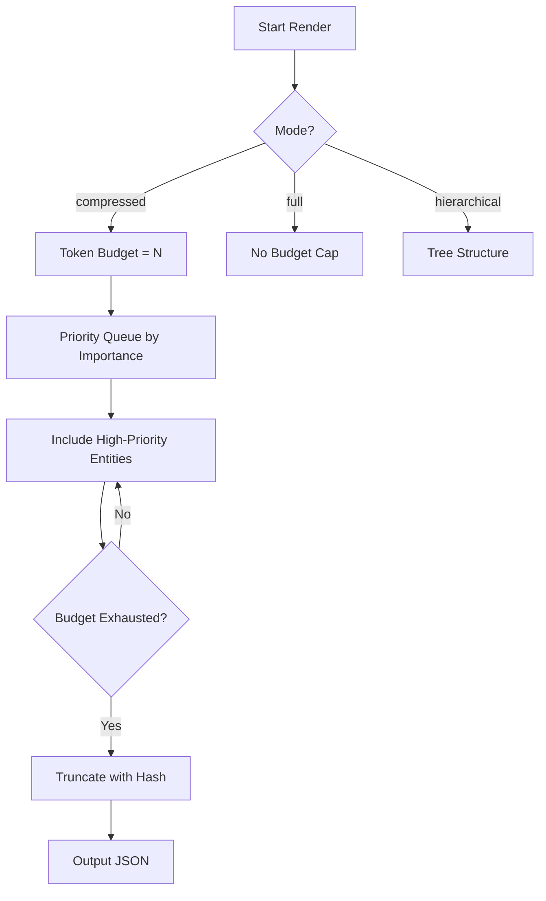

# 4. BSG Compression & LLM Injection

## 4.1 Rendering Modes

| Mode | Budget | Use Case | Output |
|------|--------|----------|--------|
| `full` | Unlimited | Developer reference | `bsg_full.json` |
| `hierarchical` | Unlimited | Directory overviews | `bsg_hierarchical.json` |
| `compressed` | 4K–40K tokens | LLM prompt injection | `bsg_compressed.json` |

## 4.2 Token Budget Algorithm

Priority scoring considers:
- Public API surface (functions starting without `_`)
- Import fan-in (how many files reference this entity)
- Semantic tags from rule plugins (`api`, `auth`, `orm`, `db`)

## 4.3 Plugin-Based Semantic Overlay

BSG Plugins are YAML-defined rule sets that annotate the graph with semantic tags:

| Plugin Category | Plugins | Purpose |
|-----------------|---------|---------|
| Foundation | `bsg_graph_foundation` | Core graph structure |
| Security | `bsg_hardcoded_secret_catcher`, `bsg_auth_boundary_shield` | Detect secrets, auth boundaries |
| Performance | `bsg_nplus1_query_catcher`, `bsg_resource_leak_preventer` | Find perf anti-patterns |
| Reliability | `bsg_dependency_blast_radius`, `bsg_silent_failure_catcher` | Impact analysis |
| Infrastructure | `bsg_iac_drift_sentinel`, `bsg_schema_migration_enforcer` | IaC / schema governance |
| API | `bsg_api_contract_guardian` | API contract enforcement |
