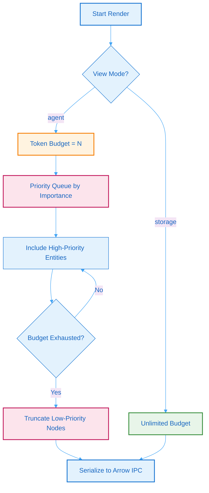
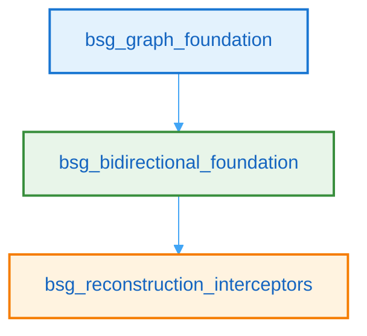

# 5. BSG Compression & LLM Injection

## 5.1 Dual-Mode Rendering

Batho Structured Graph (BSG) outputs support dual-mode rendering to align database footprint and ingestion latency with downstream use cases:

| View Mode | Target Audience | Key Characteristics | Emits `SYNTAX_GLUE`? |
|-----------|-----------------|---------------------|----------------------|
| `storage` | Downstream parsers, recovery scripts | Full-fidelity representation. Includes raw source text, byte offsets, and syntactic gaps. | Yes |
| `agent` | LLM prompts, context providers | Highly compressed representation. Includes structural definitions and signatures only. | No |

### View Selection Guidelines

- **Storage View**: Used when you need complete codebase context, cross-file references, or 100% byte-for-byte source reconstruction. It guarantees a lossless round trip.
- **Agent View**: Used when presenting the codebase structure to a Large Language Model (LLM). It filters out comment blocks, whitespace, and formatting anomalies, reducing token footprints by up to 10x.

## 5.2 Token Budget Algorithm

To prevent LLM context windows from being overwhelmed, the `agent` view supports token budgeting. When exporting, the engine filters and prioritizes entities using an importance-based scoring mechanism:

**Figure 7: Token Budget Algorithm** - Flowchart showing how the compressed agent rendering mode prioritizes entities within token constraints.

### Priority Scoring Factors

Entities are scored for the agent view using the following criteria:

| Factor | Weight | Description |
|--------|--------|-------------|
| **Public API** | 30% | Functions, methods, and classes not prefixed with `_`. |
| **Import Fan-in** | 25% | How many other modules reference this entity. |
| **Semantic Tags** | 25% | Annotations from rule plugins (e.g. `api`, `auth`, `db`). |
| **Complexity** | 10% | Cyclomatic complexity estimate of the AST node. |
| **Recency** | 10% | Node changed in recent patch cycles. |

## 5.3 Arrow IPC Serialization

Both `storage` and `agent` views are serialized and stored inside the `.batho` database. To ensure high-speed reads and minimize memory overhead when downstream tools consume these graphs:

- **Arrow IPC Format**: Relational data (such as entity adjacency indices and dependencies) are mapped directly to Arrow IPC table schemas, permitting memory-mapped reads without full JSON deserialization overhead.
- **Binary Blobs**: Compression-friendly chunks (such as individual file BSGs and relationship graphs) are compressed using `zstd` and stored as binary blobs in Arrow files, loaded on-demand.

## 5.4 BSG Plugin Catalog

Batho ships with 38 declarative YAML plugin files. Plugins are divided into two categories: **foundation plugins** (detection, categorization, and tagging) and **interceptor plugins** (security, reliability, and architectural risk detection).

### Plugin Schema Versions

| Schema | Status |
|--------|--------|
| `bsg-plugin-schema-v1` | Legacy (backward compatible) |
| `bsg-plugin-schema-v2` | Current (supports `bidirectional`, `ast_edges`, `depends_on`) |

### Foundation Plugins (28 files)

Foundation plugins run during graph construction to detect languages, frameworks, and file categories, and to apply baseline semantic tags.

#### Core Detection & Categorization

| Plugin ID | Name | Description |
|-----------|------|-------------|
| `bsg_detection_foundation` | BSG Detection Foundation | Language, framework, package manager, and infrastructure detection |
| `bsg_file_categorization` | BSG File Categorization | Categorize files into TEST, DOCS, CONFIG, SOURCE by path patterns and extensions |
| `bsg_graph_foundation` | BSG Graph Foundation | Baseline deterministic node tagging for category, scope, and service metadata |
| `bsg_token_optimization` | BSG Token Optimization | Docstring truncation, test fixture detection, entry point normalization, metadata cleanup (60–80% token reduction) |
| `bsg_bidirectional_foundation` | Bidirectional Foundation | Gap coverage validation, file integrity verification, reconstruction flagging |

#### Language-Specific Detection

| Plugin ID | Language | Description |
|-----------|----------|-------------|
| `bsg_detection_cpp` | C/C++ | Detect C/C++ projects from source files and build configs |
| `bsg_detection_csharp` | C# | Detect C#/.NET projects from `.csproj`, `.sln` files |
| `bsg_detection_dart` | Dart | Detect Dart/Flutter projects from `pubspec.yaml` |
| `bsg_detection_elixir` | Elixir | Detect Elixir projects from `mix.exs` |
| `bsg_detection_kotlin` | Kotlin | Detect Kotlin/JVM projects from `build.gradle.kts` |
| `bsg_detection_php` | PHP | Detect PHP projects from `composer.json` |
| `bsg_detection_ruby` | Ruby | Detect Ruby projects from `Gemfile` |
| `bsg_detection_scala` | Scala | Detect Scala projects from `build.sbt` |
| `bsg_detection_swift` | Swift | Detect Swift/iOS projects from `Package.swift` |

#### Framework Detection

| Plugin ID | Framework | Description |
|-----------|-----------|-------------|
| `bsg_framework_angular` | Angular | Detect Angular components, services, and modules |
| `bsg_framework_django` | Django | Detect Django views, models, and middleware |
| `bsg_framework_flask` | Flask | Detect Flask routes, blueprints, and decorators |
| `bsg_framework_nodejs` | Node.js | Detect Node.js patterns: Express, Fastify, middleware chains |
| `bsg_framework_python` | Python | Detect Python-specific patterns: dataclasses, Pydantic, async |
| `bsg_framework_react` | React | Detect React components, hooks, and contexts |
| `bsg_framework_vue` | Vue | Detect Vue components, composables, and stores |
| `bsg_framework_other` | Other | Detect patterns for Spring, Rails, Laravel, Gin, and more |

#### Specialized Detection

| Plugin ID | Description |
|-----------|-------------|
| `bsg_detection_cicd` | Detect CI/CD pipeline configurations (GitHub Actions, GitLab CI, Jenkins) |
| `bsg_detection_cloud_providers` | Detect cloud provider SDKs (AWS, GCP, Azure) |
| `bsg_detection_test_frameworks` | Detect test frameworks (pytest, Jest, JUnit, Go testing) |

#### Test Plugins (Bidirectional)

| Plugin ID | Description |
|-----------|-------------|
| `test_bidirectional_gap_coverage` | Validate gap entity coverage for bidirectional reconstruction |
| `test_bidirectional_integrity` | Verify content hash consistency for bidirectional mode |
| `test_bidirectional_reconstruction` | End-to-end reconstruction verification tests |

### Interceptor Plugins (10 files)

Interceptor plugins run as a non-blocking enricher pipeline during graph construction. Detections are tagged, not blocked, allowing the build to continue while surfacing issues.

| Plugin ID | Name | Severity | Detects |
|-----------|------|----------|---------|
| `bsg_hardcoded_secret_catcher` | Hardcoded Secret Catcher | **High** | API keys, tokens in string literals |
| `bsg_auth_boundary_shield` | Auth Boundary Shield | **High** | Missing auth decorators on API route handlers |
| `bsg_silent_failure_catcher` | Silent Failure Catcher | Medium | Bare `except:`, swallowed exceptions |
| `bsg_dependency_blast_radius` | Dependency Blast Radius | Low | High fan-out modules (>N dependents) |
| `bsg_api_contract_guardian` | API Contract Guardian | **Block** | Backend API contract changes with downstream dependents |
| `bsg_iac_drift_sentinel` | IaC Drift Sentinel | Warning | Config drift between app env references and IaC definitions |
| `bsg_nplus1_query_catcher` | N+1 Query Catcher | Warning | Database execution patterns inside loop structures |
| `bsg_resource_leak_preventer` | Resource Leak Preventer | Warning | Resource allocations without cleanup paths |
| `bsg_schema_migration_enforcer` | Schema Migration Enforcer | **Block** | ORM/schema changes requiring migration companions |
| `bsg_reconstruction_interceptors` | Reconstruction Interceptors | Warning/Block | Coverage gap detection and reconstruction integrity verification |

### Plugin Dependency Graph

Foundation plugins declare dependencies via `depends_on`:

**Figure 32: Plugin Dependency Graph** — Bidirectional foundation and reconstruction interceptors depend on the graph foundation plugin.
