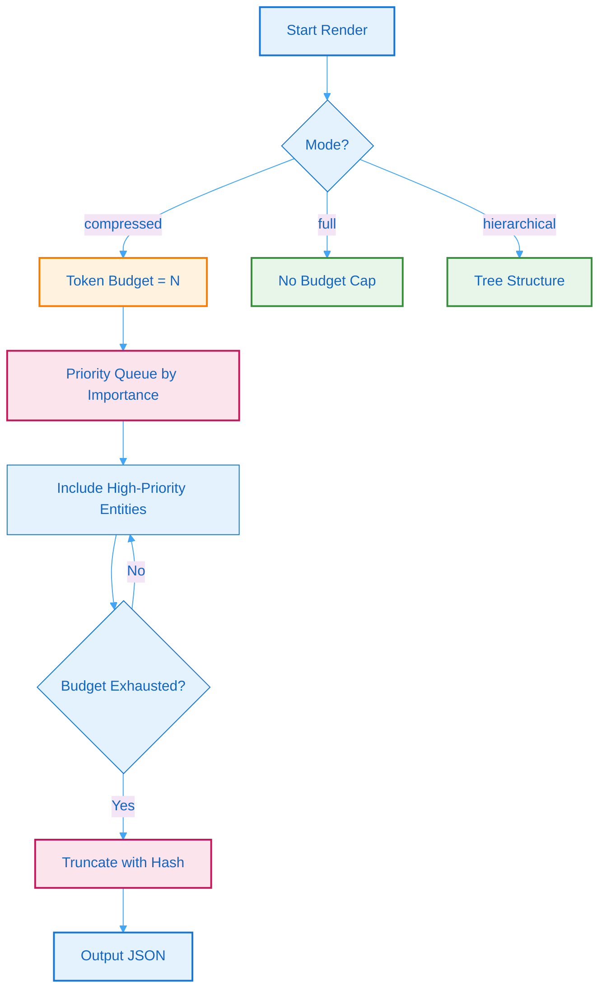

# 4. BSG Compression & LLM Injection

## 4.1 Rendering Modes

Batho Structured Graph (BSG) supports multiple rendering modes to accommodate different use cases:

| Mode | Budget | Use Case | Output |
|------|--------|----------|--------|
| `full` | Unlimited | Developer reference | `bsg_full.json` |
| `hierarchical` | Unlimited | Directory overviews | `bsg_hierarchical.json` |
| `compressed` | 4K–40K tokens | LLM prompt injection | `bsg_compressed.json` |

### Mode Selection Guidelines

- **Full**: When you need complete context for debugging or deep analysis
- **Hierarchical**: For directory-level understanding or architectural reviews
- **Compressed**: For LLM interactions where token budget is constrained

## 4.2 Token Budget Algorithm

The compressed rendering algorithm prioritizes entities based on importance scoring:



<div class="sr-only">Figure 7: Token Budget Algorithm - Flowchart showing how the compressed rendering mode prioritizes entities within token constraints. Start Render, check Mode. If compressed, set Token Budget to N and use Priority Queue by Importance. Include High-Priority Entities until Budget Exhausted. If budget exhausted, Truncate with Hash and Output JSON. If full mode, No Budget Cap and Output JSON. If hierarchical, Tree Structure and Output JSON.</div>

**Figure 7: Token Budget Algorithm** - Flowchart showing how the compressed rendering mode prioritizes entities within token constraints.

### Priority Scoring Factors

Entities are scored based on:

| Factor | Weight | Description |
|--------|--------|-------------|
| **Public API** | 30% | Functions/methods not starting with `_` |
| **Import Fan-in** | 25% | How many files reference this entity |
| **Semantic Tags** | 25% | Tags from rule plugins (`api`, `auth`, `orm`, `db`) |
| **Complexity** | 10% | Cyclomatic complexity estimate |
| **Recency** | 10% | Recently modified entities |

### Example: Compressed Output

```json
{
  "version": "bsg.v1",
  "metadata": {
    "render_mode": "compressed",
    "token_budget": 8000,
    "entities_included": 1542,
    "truncated": 89
  },
  "entities": [
    {
      "id": "UserService.create",
      "type": "METHOD",
      "tags": ["api", "auth"],
      "summary": "Creates a new user with hashed password"
    }
  ]
}
```

## 4.3 Plugin-Based Semantic Overlay

BSG Plugins are YAML-defined rule sets that annotate the graph with semantic tags:

| Plugin Category | Plugins | Purpose |
|----------------|---------|---------|
| Foundation | `bsg_graph_foundation` | Core graph structure |
| Security | `bsg_hardcoded_secret_catcher`, `bsg_auth_boundary_shield` | Detect secrets, auth boundaries |
| Performance | `bsg_nplus1_query_catcher`, `bsg_resource_leak_preventer` | Find perf anti-patterns |
| Reliability | `bsg_dependency_blast_radius`, `bsg_silent_failure_catcher` | Impact analysis |
| Infrastructure | `bsg_iac_drift_sentinel`, `bsg_schema_migration_enforcer` | IaC / schema governance |
| API | `bsg_api_contract_guardian` | API contract enforcement |

### Plugin Configuration Example

```yaml
# batho.yaml
rules:
  enabled: true
  auto_load_all_plugins: true
  builtin_plugins:
    - bsg_core
    - bsg_silent_failure_catcher
    - bsg_dependency_blast_radius
    - bsg_hardcoded_secret_catcher
```

## 4.4 LLM Integration

BSG output is optimized for LLM consumption:

| Aspect | Optimization |
|--------|--------------|
| **Format** | JSON with minimal whitespace |
| **Structure** | Flat entity list with summaries |
| **References** | UUID-based cross-links |
| **Tags** | Semantic category markers |
| **Encoding** | UTF-8 with ASCII-safe fallback |
