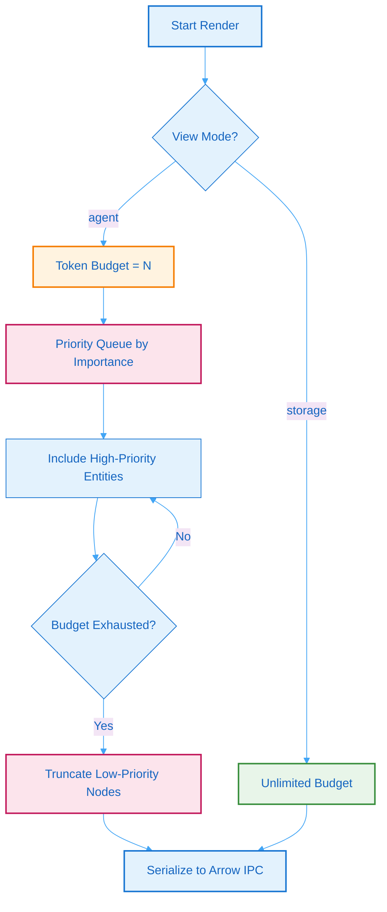

# 4. BSG Compression & LLM Injection

## 4.1 Dual-Mode Rendering

Batho Structured Graph (BSG) outputs support dual-mode rendering to align database footprint and ingestion latency with downstream use cases:

| View Mode | Target Audience | Key Characteristics | Emits `SYNTAX_GLUE`? |
|-----------|-----------------|---------------------|----------------------|
| `storage` | Downstream parsers, recovery scripts | Full-fidelity representation. Includes raw source text, byte offsets, and syntactic gaps. | Yes |
| `agent` | LLM prompts, context providers | Highly compressed representation. Includes structural definitions and signatures only. | No |

### View Selection Guidelines

- **Storage View**: Used when you need complete codebase context, cross-file references, or 100% byte-for-byte source reconstruction. It guarantees a lossless round trip.
- **Agent View**: Used when presenting the codebase structure to a Large Language Model (LLM). It filters out comment blocks, whitespace, and formatting anomalies, reducing token footprints by up to 10x.

## 4.2 Token Budget Algorithm

To prevent LLM context windows from being overwhelmed, the `agent` view supports token budgeting. When exporting, the engine filters and prioritizes entities using an importance-based scoring mechanism:

**Figure 7: Token Budget Algorithm** - Flowchart showing how the compressed agent rendering mode prioritizes entities within token constraints.

### Priority Scoring Factors

Entities are scored for the agent view using the following criteria:

| Factor | Weight | Description |
|--------|--------|-------------|
| **Public API** | 30% | Functions, methods, and classes not prefixed with `_`. |
| **Import Fan-in** | 25% | How many other modules reference this entity. |
| **Semantic Tags** | 25% | Annotations from rule plugins (e.g. `api`, `auth`, `db`). |
| **Complexity** | 10% | Cyclomatic complexity estimate of the AST node. |
| **Recency** | 10% | Node changed in recent patch cycles. |

## 4.3 Arrow IPC Serialization

Both `storage` and `agent` views are serialized and stored inside the `.batho` database. To ensure high-speed reads and minimize memory overhead when downstream tools consume these graphs:

- **Arrow IPC Format**: Relational data (such as entity adjacency indices and dependencies) are mapped directly to Arrow IPC table schemas, permitting memory-mapped reads without full JSON deserialization overhead.
- **Binary Blobs**: Compression-friendly chunks (such as individual file BSGs and relationship graphs) are compressed using `zstd` and stored as binary blobs in Arrow files, loaded on-demand.
