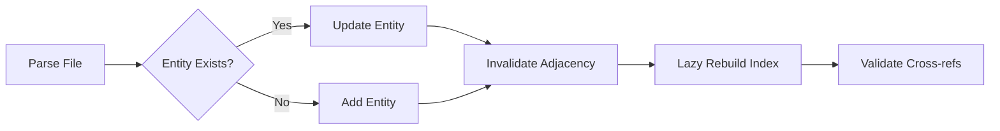

# 3. Deterministic Code Graph Engine

## 3.1 Entity Model

The graph is built on two primitives: **Entities** and **Relationships**.

### Entity Types

| Type | Description | Example |
|------|-------------|---------|
| `FUNCTION` | Standalone function | `def process_data():` |
| `METHOD` | Class/instance method | `def save(self):` |
| `CLASS` | Class definition | `class UserManager:` |
| `STRUCT` | Struct (Rust/Go) | `type Config struct` |
| `INTERFACE` | Interface/protocol | `interface Repository` |
| `TRAIT` | Rust trait | `trait Sendable` |
| `FIELD` | Attribute/field | `name: str` |
| `ENUM` | Enumeration | `enum Status` |
| `TYPE_ALIAS` | Type alias | `type ID = string` |
| `CONSTANT` | Constant declaration | `const MAX = 100` |
| `MODULE` | Module/package | `package main` |
| `NAMESPACE` | Namespace | `namespace App` |
| `ENTRY_POINT` | Program entry point | `main()` |

### Relationship Types

| Type | Direction | Semantics |
|------|-----------|-----------|
| `IMPORTS` | File → Module | File imports a module |
| `CALLS` | Entity → Entity | Function/method invocation |
| `USES` | Entity → Entity | Variable/type usage |
| `INHERITS` | Class → Class | Inheritance |
| `IMPLEMENTS` | Class → Interface | Interface implementation |
| `DEFINES` | File → Entity | Container definition |

## 3.2 Graph Consistency Model

The `InMemoryGraph` uses lazy adjacency indexing:
- Index built on first `neighbors()` call
- Invalidated on every relationship mutation
- Duplicate relationships silently deduplicated via `has_relationship()`

## 3.3 Cross-File Resolution

The `SymbolIndex` performs a two-pass resolution:
1. **Local pass**: Resolve symbols within each file
2. **Global pass**: Match unresolved imports against exported symbols across the repository

Unresolved targets are tagged with `unresolved:` prefix and tracked for later resolution.
