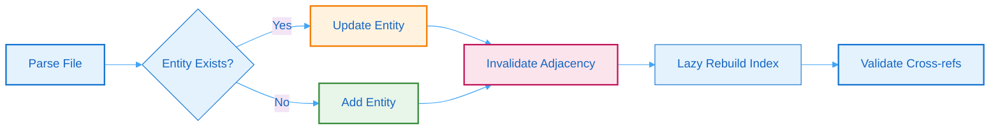
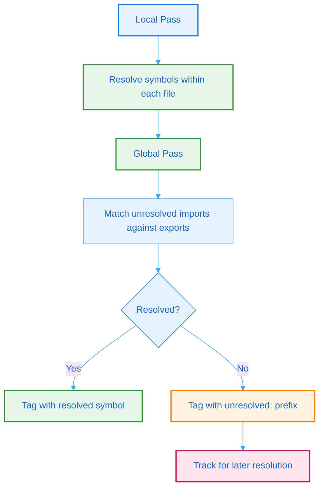

# 4. Deterministic Code Graph Engine

## 4.1 Entity Model

The graph is built on two primitives: **Entities** and **Relationships**. This model enables efficient querying and cross-referencing across large codebases.

### Entity Types

| Type | Description | Example |
|------|-------------|---------|
| `FUNCTION` | Standalone function | `def process_data():` |
| `METHOD` | Class/instance method | `def save(self):` |
| `CLASS` | Class definition | `class UserManager:` |
| `STRUCT` | Struct (Rust/Go) | `type Config struct` |
| `INTERFACE` | Interface/protocol | `interface Repository` |
| `TRAIT` | Rust trait | `trait Sendable` |
| `FIELD` | Attribute/field | `name: str` |
| `ENUM` | Enumeration | `enum Status` |
| `TYPE_ALIAS` | Type alias | `type ID = string` |
| `CONSTANT` | Constant declaration | `const MAX = 100` |
| `MODULE` | Module/package | `package main` |
| `NAMESPACE` | Namespace | `namespace App` |
| `ENTRY_POINT` | Program entry point | `main()` |
| `EXTERNAL_SYMBOL` | Strict SCIP external reference node | Reference to external packages |
| `SYNTAX_GLUE` | Whitespace, comments, braces, or non-semantic code segments | (For bidirectional reconstruction) |

### Relationship Types

| Type | Direction | Semantics |
|------|-----------|-----------|
| `IMPORTS` | File → Module | File imports a module |
| `CALLS` | Entity → Entity | Function/method invocation |
| `USES` | Entity → Entity | Variable/type usage |
| `INHERITS` | Class → Class | Inheritance |
| `IMPLEMENTS` | Class → Interface | Interface implementation |
| `DEFINES` | File → Entity | Container definition |

## 4.2 Graph Consistency Model

The `InMemoryGraph` ensures deterministic processing through lazy indexing and automatic deduplication:



**Figure 5: Graph Consistency Model** - Flowchart showing the lazy indexing and consistency validation process in InMemoryGraph.

**Key Guarantees:**
- Index built on first `neighbors()` call.
- Invalidated on every relationship mutation.
- Duplicate relationships silently deduplicated via `has_relationship()`.

## 4.3 Cross-File Resolution

The `SymbolIndex` performs a two-pass resolution to enable cross-module references:



**Figure 6: Cross-File Resolution Process** - Two-pass resolution flow showing how SymbolIndex resolves imports across files.

**Resolution Process:**
1. **Local pass**: Resolve symbols within each file's scope.
2. **Global pass**: Match unresolved imports against exported symbols across the repository.
3. **Tracking**: Unresolved targets are tagged with `unresolved:` prefix and tracked for later resolution.

## 4.4 Example: Cross-File Reference

Consider a Python project with two files:

**models.py:**
```python
class User:
    def __init__(self, name: str):
        self.name = name
```

**services.py:**
```python
from models import User

def create_user(name: str) -> User:
    return User(name)
```

**Graph Representation:**
```json
{
  "entities": [
    {"id": "models.py::User", "type": "CLASS", "file": "models.py"},
    {"id": "models.py::User.__init__", "type": "METHOD", "file": "models.py"},
    {"id": "services.py::create_user", "type": "FUNCTION", "file": "services.py"}
  ],
  "relationships": [
    {"from": "services.py", "to": "models", "type": "IMPORTS"},
    {"from": "services.py::create_user", "to": "models.py::User", "type": "USES"}
  ]
}
```

## 4.5 Bidirectional Traversal & Lossless Reconstruction

Batho v1.2.0 supports lossless, bidirectional graph-to-code reconstruction, allowing a developer or LLM agent to rebuild the exact source file from the graph.

### The Role of `SYNTAX_GLUE`
When `bsg.bidirectional.enabled` is `true`, the parser identifies not only AST elements (e.g. classes, functions) but also all intervening segments, such as whitespace, braces, skipped comments, and other non-semantic structures. These are emitted as `SYNTAX_GLUE` entities.

### Verification and Integrity
By retaining complete byte coverage, Batho can reconstruct source code files byte-for-byte. The configuration keys under `bsg.bidirectional` control this behavior:
- `enabled`: Activates bidirectional AST traversal.
- `include_gaps`: Emits `SYNTAX_GLUE` entities to guarantee 100% byte coverage.
- `verify_integrity`: Cryptographically compares the SHA-256 hash of the reconstructed file against the original stored hash, throwing an `IntegrityError` if they differ.
- `storage_view`: Specifies if the original raw content is explicitly kept in the storage view.
