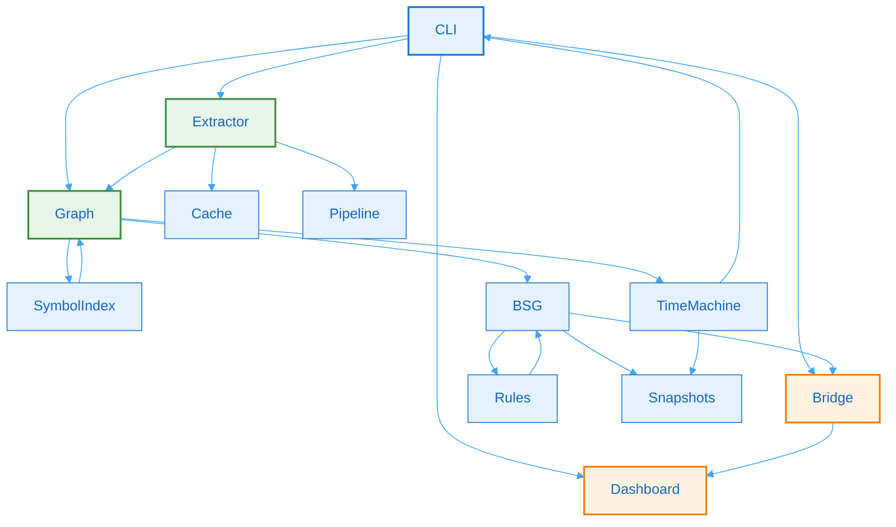

# 2. Core Subsystems

## 2.1 Subsystem Inventory

Batho is composed of tightly-integrated subsystems that work together to provide code intelligence capabilities. Each subsystem has a well-defined responsibility and can be tested independently.

| Subsystem | Module Path | Purpose | Status |
|-----------|-------------|---------|--------|
| AST Extraction | `batho/context/extractor.py` | tree-sitter based multi-language parsing | Production |
| Language Registry | `batho/context/languages/` | Detector + per-language extractors | Production |
| Code Graph | `batho/context/codegraph.py` | In-memory hypergraph with adjacency indexing | Production |
| Symbol Index | `batho/context/symbol_index.py` | Cross-file import resolution | Production |
| AST Cache | `batho/context/cache.py` | SQLite-backed entity caching | Production |
| Pipeline | `batho/context/pipeline.py` | Parallel graph construction | Production |
| BSG Map | `batho/context/bsg_map.py` | Flat symbol index + renderers | Production |
| BSG Rules | `batho/bsg/rules.py` | Plugin loader + semantic overlay | Production |
| Time Machine | `batho/time_machine.py` | Snapshots, diffs, incremental patches | Production |
| Hooks | `batho/hooks/` | Git hook management | Production |
| Dashboard | `batho/dashboard/` | Interactive web UI | Production |
| Bridge | `batho/bridge/` | REST API + MCP server | Production |
| Cloud Sync | `batho/cloud_sync/` | Artifact synchronization | Production |
| Config | `batho/config.py` | Pydantic-validated configuration | Production |
| Storage | `batho/context/storage.py` | SQLite artifact registry | Production |
| Query Service | `batho/context/query.py` | Persisted graph indexes | Production |
| Synthesizer | `batho/synthesizer.py` | Evolution ledger + failure rule synthesis | Production |

## 2.2 Technology Stack

### Runtime Environment

| Layer | Technology | Version |
|-------|------------|---------|
| Language Runtime | Python | 3.11+ |
| AST Parsing | tree-sitter | 0.25+ |
| Language Pack | tree-sitter-language-pack | Latest |
| Configuration | Pydantic | 2.x |

### Interface Layer

| Layer | Technology | Purpose |
|-------|------------|---------|
| CLI Framework | argparse (stdlib) | Command-line interface |
| Web Dashboard | Vanilla JS + Static HTML | Interactive visualization |
| REST API | stdlib http.server | Programmatic access |
| MCP Server | stdio / sse transport | LLM integration |

### Data Layer

| Layer | Technology | Purpose |
|-------|------------|---------|
| Cache / Registry | SQLite | 3.x |
| Snapshots | JSON files | Time-travel storage |
| Metrics | JSON files | Performance tracking |

### Development & Testing

| Layer | Technology | Purpose |
|-------|------------|---------|
| Testing | pytest + pytest-cov | 8.x / 5.x |
| Build Tool | uv | Latest |
| Type Checking | TypeScript | 6.x |
| Linting | ruff, mypy | Code quality |

## 2.3 Subsystem Interactions

Subsystems communicate through well-defined interfaces:

Figure 4: Subsystem Interactions - Dependency graph showing how Batho subsystems communicate through well-defined interfaces. CLI connects to Extractor, Graph, Bridge, and Dashboard. Extractor connects to Cache, Graph, and Pipeline. Graph connects to SymbolIndex, BSG, and TimeMachine. SymbolIndex provides feedback to Graph. BSG connects to Rules, Bridge, and Snapshots. Rules provides feedback to BSG. TimeMachine connects to Snapshots and CLI. Bridge connects to Dashboard.

**Figure 4: Subsystem Interactions** - Dependency graph showing how Batho subsystems communicate through well-defined interfaces.

## 2.4 Data Flow Between Subsystems

1. **Extraction Phase**: CLI → Extractor → Cache + Graph
2. **Resolution Phase**: Graph → SymbolIndex → Graph (cross-file resolution)
3. **Intelligence Phase**: Graph → BSG → Rules → BSG (semantic tagging)
4. **Output Phase**: BSG → Snapshots + Bridge + Dashboard
