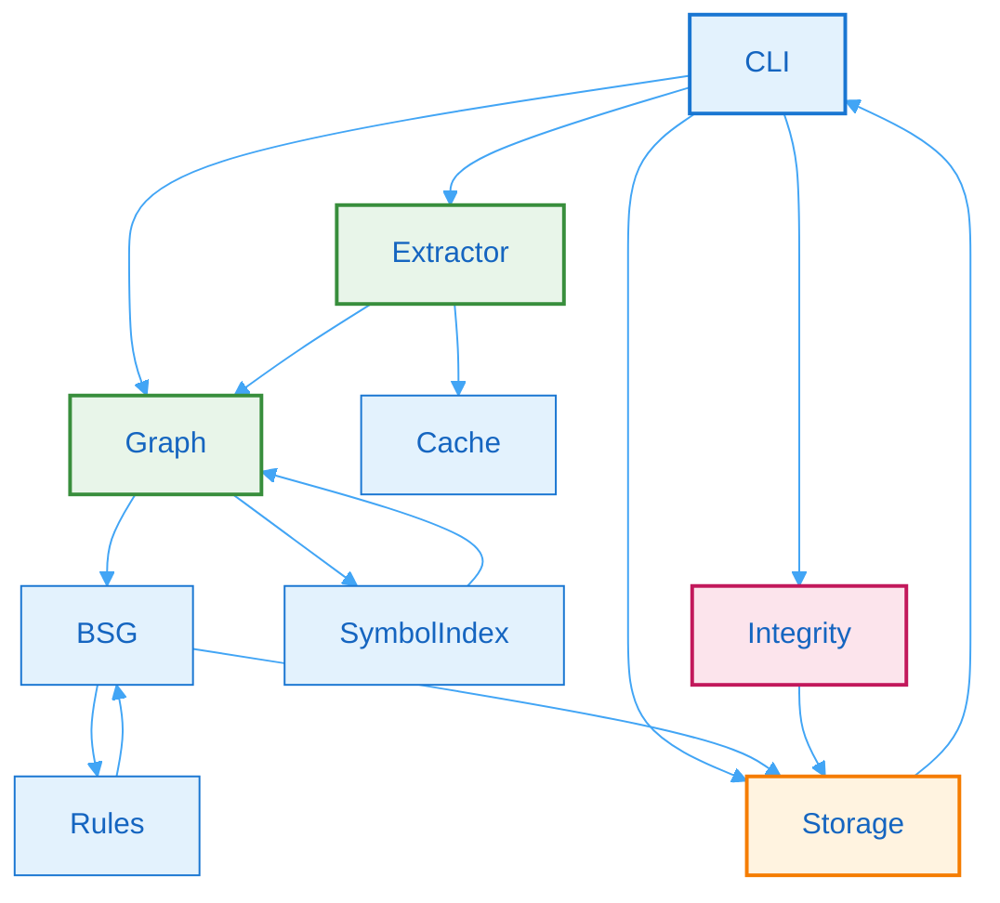

# 2. Core Subsystems

## 2.1 Subsystem Inventory

Batho is composed of tightly-integrated subsystems that work together to provide code intelligence capabilities. Each subsystem has a well-defined responsibility and can be tested independently.

| Subsystem | Module Path | Purpose | Status |
|-----------|-------------|---------|--------|
| **AST Extraction** | `batho/modules/extraction/` | tree-sitter based multi-language parsing | Production |
| **Code Graph** | `batho/modules/graph/` | In-memory hypergraph with adjacency indexing | Production |
| **BSG Map & Compression** | `batho/modules/compression/` | Flat symbol index, priority token budgeting, and rule loaders | Production |
| **Dependency Indexer** | `batho/modules/dependency/` | stdlib and installed virtual environment dependency indexer | Production |
| **Integrity Verification** | `batho/modules/integrity/` | Database checker, repair engine, and report generation | Production |
| **Storage Registry** | `batho/modules/storage/` | Arrow IPC database manager | Production |
| **CLI Command Suite** | `batho/cli/` | Command interface parsing and subcommand orchestration | Production |

## 2.2 Technology Stack

### Runtime Environment

| Layer | Technology | Version |
|-------|------------|---------|
| Language Runtime | Python | 3.11+ |
| AST Parsing | tree-sitter | 0.25+ |
| Language Pack | tree-sitter-language-pack | Latest |
| Configuration | Pydantic | 2.x |

### Interface Layer

| Layer | Technology | Purpose |
|-------|------------|---------|
| CLI Framework | argparse (stdlib) | Command-line interface |
| Data Export | JSON / Pretty | Programmatic data output |

### Data Layer

| Layer | Technology | Purpose |
|-------|------------|---------|
| Registry / Cache | msgpack + Arrow IPC | Durable database storage and high-speed memory-mapping |
| Artifact Bundle | ZIP ZSTD Archive | Transport packaging format |

### Development & Testing

| Layer | Technology | Purpose |
|-------|------------|---------|
| Testing | pytest + pytest-cov | 8.x / 5.x |
| Build Tool | uv | Latest |
| Linting | ruff, mypy | Code quality |

## 2.3 Subsystem Interactions

Subsystems communicate through well-defined interfaces:

**Figure 4: Subsystem Interactions** - Dependency graph showing how Batho subsystems communicate through well-defined interfaces.

## 2.4 Data Flow Between Subsystems

1. **Extraction Phase**: CLI → Extractor → Cache + Graph
2. **Resolution Phase**: Graph → SymbolIndex → Graph (cross-file resolution)
3. **Intelligence Phase**: Graph → BSG → Rules → BSG (semantic tagging)
4. **Storage & Serialization**: BSG → Storage Registry (Arrow IPC views)
5. **Output Phase**: Storage Registry → CLI (Command output / JSON Export)
