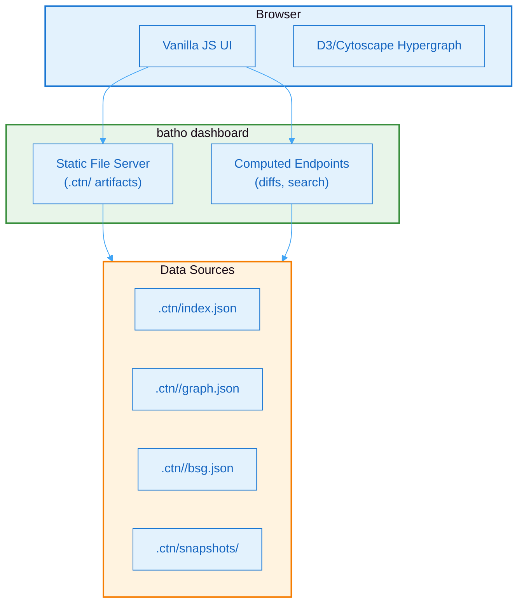

# 7. Interactive Dashboard

## 7.1 Dashboard Architecture

The dashboard provides an interactive interface for code intelligence exploration:



**Figure 10: Dashboard Architecture** - Three-tier architecture showing browser client, server components, and data sources.

## 7.2 Dashboard Pages

| Page | Function | Data Source |
|------|----------|-------------|
| **Overview** | Repo stats, language breakdown | `index.json` |
| **Hypergraph** | 3-level drill-down: files → symbols → neighborhood | `graph.json` |
| **Files** | Hierarchical file browser with entity counts | `graph.json` |
| **File Viewer** | Syntax-highlighted source + entity sidebar | `graph.json` + raw files |
| **Relationships** | Filtered tables (imports, calls, extends) | `graph.json` |
| **Rules** | Loaded BSG rule plugins and metadata | `batho.yaml` + plugin registry |
| **Metrics** | Indexing performance, cache hit rates | `metrics.json` |
| **Snapshots** | Time Machine list with diff capabilities | `snapshots/` |
| **Search** | Full-text entity and file search | Computed endpoint |

## 7.3 Launch Options

```bash
# Default launch
batho dashboard --root .

# Custom port
batho dashboard --root . --port 3000

# External access
batho dashboard --root . --host 0.0.0.0

# Skip browser auto-open
batho dashboard --root . --no-browser
```

## 7.4 Keyboard Shortcuts

| Shortcut | Action |
|----------|--------|
| `Ctrl/Cmd + K` | Global search |
| `Ctrl/Cmd + D` | Toggle dark mode |
| `Ctrl/Cmd + 0` | Reset zoom (graph) |
| `Ctrl/Cmd + +` | Zoom in (graph) |
| `Ctrl/Cmd + -` | Zoom out (graph) |
| `G` | Toggle grid (graph) |
| `F` | Fit to screen (graph) |

## 7.5 Export Options

| Format | Command |
|--------|---------|
| PNG | Right-click graph → Export PNG |
| SVG | Right-click graph → Export SVG |
| JSON | `batho export --format json --root .` |
| CSV | `batho export --format csv --root .` |
