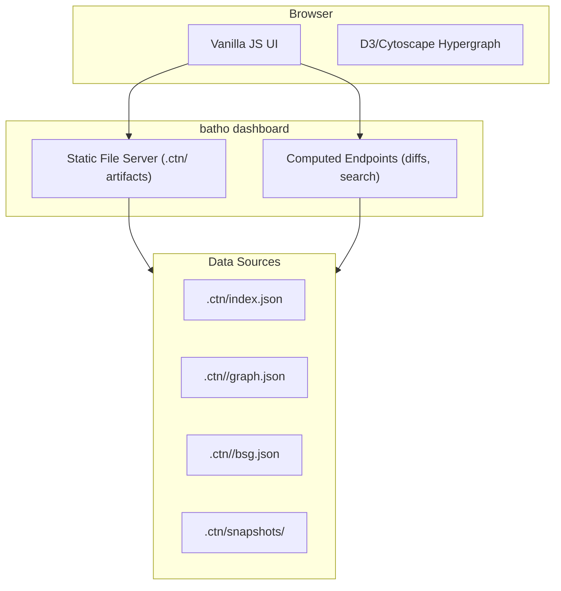

# 7. Interactive Dashboard

## 7.1 Dashboard Architecture



## 7.2 Dashboard Pages

| Page | Function | Data Source |
|------|----------|-------------|
| **Overview** | Repo stats, language breakdown | `index.json` |
| **Hypergraph** | 3-level drill-down: files → symbols → neighborhood | `graph.json` |
| **Files** | Hierarchical file browser with entity counts | `graph.json` |
| **File Viewer** | Syntax-highlighted source + entity sidebar | `graph.json` + raw files |
| **Relationships** | Filtered tables (imports, calls, extends) | `graph.json` |
| **Rules** | Loaded BSG rule plugins and metadata | `batho.yaml` + plugin registry |
| **Metrics** | Indexing performance, cache hit rates | `metrics.json` |
| **Snapshots** | Time Machine list with diff capabilities | `snapshots/` |
| **Search** | Full-text entity and file search | Computed endpoint |

## 7.3 Launch Options

```bash
batho dashboard --root .                    # Default: port 8080
batho dashboard --root . --port 3000        # Custom port
batho dashboard --root . --host 0.0.0.0    # External access
batho dashboard --root . --no-browser       # Skip auto-open
```
