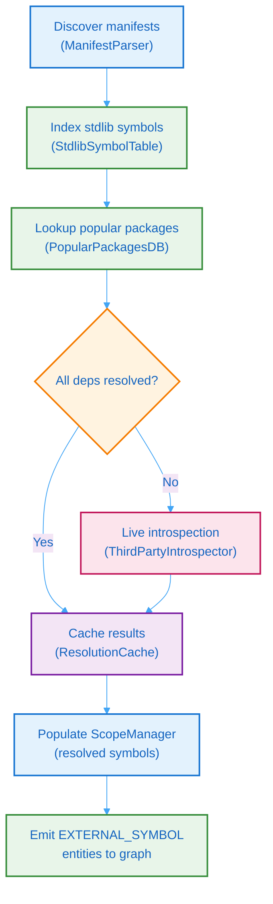

# 6. Dependency Intelligence

Batho's dependency subsystem resolves and indexes third-party and standard-library dependencies across 40+ languages. It populates the scope manager with resolved symbols, enabling cross-file reference resolution and external symbol entity creation. Stdlib symbol tables cover 27 languages and live introspection covers every package ecosystem with an offline install store — Python, npm, Cargo, Go, Maven, Gradle, Ruby gems, Composer, NuGet, Dart pub, Julia, CRAN, cabal, Swift SPM, zigmod, rebar3, opam, luarocks, and CPAN.

## 6.1 Indexing Pipeline

The dependency indexer orchestrates a five-stage pipeline that transforms raw manifest files into a fully populated scope manager:



**Figure 29: Dependency Indexing Pipeline** — Five-stage flow from manifest discovery through scope manager population.

### Per-Dependency Gate Chain

Every unique declared dependency `(manager, name, version_spec)` passes through a pinned gate order and reaches **exactly one** terminal bucket:

```text
① cache     hit                                   → deps_cached
② popular   full_scan=false and not in popular DB → deps_gate_dropped
③ managers  disabled by introspection.managers    → deps_manager_disabled
④ route     no offline store (bash, verilog, c,
            cpp, objc, agda)                       → deps_no_ecosystem
⑤ env       skip_missing_env (default true) and
            env not found                         → deps_skipped_no_env
⑥ introspect symbols found                        → deps_introspected
            none found                            → deps_no_symbols
```

**`full_scan` contract**: `true` attempts every declared dep (subject to gates ③④⑤); `false` attempts only popular-DB members. `full_scan` is the only declared-dep bypass. Gate ② runs before ④, so a non-popular no-ecosystem dep counts as `gate_dropped` when `full_scan=false` and as `no_ecosystem` when `full_scan=true`.

**Completeness invariant** (asserted after every indexing run, log-only warning `introspection_accounting_mismatch` on violation):

```
deps_unique = deps_cached + deps_gate_dropped + deps_manager_disabled
            + deps_no_ecosystem + deps_skipped_no_env
            + deps_introspected + deps_no_symbols
```

### Pipeline Statistics

Pipeline statistics track metrics throughout the process:

| Metric | Description |
|--------|-------------|
| `manifests_found` | Number of manifest files detected |
| `deps_declared` | Total dependencies parsed from manifests (raw rows) |
| `deps_unique` | Unique (manager, name, version_spec) dependency identities |
| `deps_cached` | Dependencies resolved from cache (no introspection needed) |
| `deps_introspected` | Dependencies resolved via live introspection |
| `deps_gate_dropped` | Dependencies dropped by the popular-DB gate (only when `full_scan=false`) |
| `deps_manager_disabled` | Dependencies rejected by per-manager config overrides |
| `deps_skipped_no_env` | Dependencies skipped because their env/store was not found (skip policy) |
| `deps_no_symbols` | Dependencies attempted but yielding no symbols |
| `deps_no_ecosystem` | Dependencies on languages with no offline package store |
| `symbols_indexed` | Total symbols added to ScopeManager |
| `stdlib_modules_indexed` | Standard library modules indexed |
| `duration_ms` | Total pipeline execution time |
| `errors` | Non-fatal errors encountered |

---

## 6.2 Manifest Parser

The manifest parser detects and parses dependency manifest files across seven package ecosystems:

| Ecosystem | Manifest Files | Package Manager |
|-----------|---------------|-----------------|
| Python | `requirements*.txt`, `pyproject.toml`, `Pipfile` | pip, poetry, setuptools |
| JavaScript/TypeScript | `package.json` | npm, yarn, pnpm |
| Rust | `Cargo.toml` | cargo |
| Go | `go.mod` | go modules |
| Java (JVM) | `build.gradle`, `pom.xml` | gradle, maven |

### DependencySpec

Each parsed dependency is returned as a structured specification:

| Field | Type | Example |
|-------|------|---------|
| `name` | `str` | `"requests"`, `"express"`, `"tokio"` |
| `version_spec` | `str` | `">=2.28.0"`, `"^1.2.3"`, `"*"` |
| `manager` | `PackageManager` | `PIP`, `NPM`, `CARGO`, `GO`, `GRADLE`, `MAVEN` |
| `language` | `str` | `"python"`, `"javascript"`, `"rust"`, `"go"`, `"java"` |
| `source_file` | `str` | Relative path to the manifest file |

The parser uses pre-compiled regex patterns for each manifest format, ensuring high throughput on large monorepos with many manifest files.

---

## 6.3 Standard Library Symbol Tables

Batho ships with curated, static symbol tables for standard libraries that ship with each language runtime. These are bundled directly with Batho and require no network access. As of v1.4.0, stdlib tables cover 27 languages.

| Language | Modules Covered | Example Symbols |
|----------|----------------|-----------------|
| Python | `json`, `os`, `os.path`, `pathlib`, `re`, `datetime`, `sys`, `typing`, `collections`, `math`, `time`, `threading`, `subprocess`, `logging` | `dumps`, `Path`, `compile`, `Thread` |
| JavaScript | `fs`, `path`, `http`, `https`, `crypto`, `stream`, `events`, `os`, `util`, `process` | `readFile`, `join`, `createServer` |
| TypeScript | `fs`, `path`, `http`, `crypto`, `stream`, `events` | `readFile`, `join`, `createServer` |
| Go | `fmt`, `strings`, `io`, `net/http`, `encoding/json`, `os`, `time` | `Println`, `Reader`, `HandleFunc` |
| Rust | `std::collections`, `std::io`, `std::fs`, `std::path` | `HashMap`, `Read`, `PathBuf` |
| C | `stdio`, `stdlib`, `string`, `math`, `time` | `printf`, `malloc`, `strcpy` |
| C++ | `std::vector`, `std::string`, `std::map`, `std::iostream`, `std::algorithm` | `vector`, `string`, `sort` |
| Java | `java.util`, `java.io`, `java.net` | `List`, `InputStream`, `Socket` |
| Ruby | `Enumerable`, `File`, `Dir`, `JSON`, `Net::HTTP` | `each`, `open`, `parse` |
| C# | `System`, `System.IO`, `System.Collections`, `System.Net` | `Console`, `File`, `List` |
| PHP | `stdClass`, `array`, `string`, `json`, `curl` | `json_encode`, `curl_init` |
| Kotlin | `kotlin.collections`, `kotlin.io`, `kotlin.text` | `listOf`, `println`, `split` |
| Swift | `Foundation`, `Swift`, `Dispatch`, `Combine` | `URL`, `Data`, `Task` |
| Scala | `scala.collection`, `scala.io`, `scala.util` | `List`, `Map`, `Try` |
| Dart | `dart:core`, `dart:io`, `dart:convert`, `dart:async` | `List`, `File`, `jsonDecode` |
| Haskell | `Prelude`, `Data.List`, `Data.Map`, `System.IO` | `map`, `filter`, `foldr` |
| Lua | `table`, `string`, `math`, `io`, `os` | `insert`, `format`, `open` |
| R | `base`, `stats`, `utils`, `graphics` | `c`, `mean`, `plot` |
| Perl | `strict`, `warnings`, `File::Spec`, `JSON` | `bless`, `catfile` |
| Julia | `Base`, `Stdlib`, `LinearAlgebra`, `Dates` | `push!`, `length`, `Date` |
| Zig | `std`, `std.mem`, `std.io`, `std.fs` | `alloc`, `print`, `open` |
| Bash | `builtin`, `test`, `read`, `echo` | `echo`, `read`, `test` |
| Objective-C | `Foundation`, `UIKit`, `CoreFoundation` | `NSObject`, `NSString` |
| Erlang | `erlang`, `lists`, `io`, `os` | `length`, `foreach`, `format` |
| OCaml | `Stdlib`, `List`, `Map`, `String` | `map`, `fold`, `length` |
| Hack | `HH\\Lib\\C`, `HH\\Lib\\Str`, `HH\\Lib\\Vec` | `map`, `filter`, `length` |
| Verilog | `$display`, `$finish`, `$monitor` | `display`, `finish` |

Languages with lighter stdlib coverage (e.g. Bash, Verilog) register their built-in functions and pragmas so that imports are tracked even when full module hierarchies are not applicable.

---

## 6.4 Popular Packages Database

The popular packages database is a bundled catalog covering the top third-party packages across five ecosystems. It uses set-based lookup for O(1) performance and caches package name sets in memory.

- **Singleton pattern**: Avoids reloading the catalog across multiple indexer invocations.
- **Configurable path**: Can be overridden via the `BATHO_POPULAR_PACKAGES_PATH` environment variable.
- **Default location**: Bundled with Batho's built-in data files.

When a declared dependency is found in the popular packages database, its symbols are loaded from the curated set without requiring live introspection, significantly reducing indexing time for common packages.

---

## 6.5 Third-Party Introspector

The third-party introspector performs live introspection of installed third-party packages across every ecosystem with an offline install store. It is subprocess-isolated to maintain Batho's zero-code-execution guarantee on untrusted code — the introspected packages are the developer's own installed dependencies, not the analyzed source code.

### Supported Ecosystems

| Ecosystem | Introspector | Environment | Method |
|-----------|-------------|-------------|--------|
| Python | `introspect_python` | Project venv (`.venv`/`venv`/`env`) | `dir()` + `inspect` in subprocess |
| npm | `introspect_npm` | `node_modules/` (walk-up) | Parse `package.json` exports + `.d.ts` |
| Cargo | `introspect_crate` | `CARGO_HOME` → `~/.cargo/registry/` | Parse `pub` items from crate source |
| Go | `introspect_go_module` | `GOPATH` → `~/go/pkg/mod/` | Parse exported declarations |
| Maven | `introspect_jar` | `~/.m2/repository/` | Parse `-sources.jar` / binary jar entries |
| Gradle | `introspect_jar` | `GRADLE_USER_HOME` → `~/.gradle/caches/modules-2` | Same jar parsing (covers Kotlin/Scala) |
| Ruby gems | `introspect_gem` | `GEM_HOME`/`BUNDLE_PATH` → `~/.gem` → `gem env gemdir` | Parse `module`/`class`/`def` from `lib/**/*.rb` |
| Composer (PHP/Hack) | `introspect_composer` | `vendor/` (walk-up) | PSR-4 + `namespace`-qualified class extraction |
| NuGet (C#) | `introspect_nuget` | `NUGET_PACKAGES` → `~/.nuget/packages` | XML doc `T:` members; `.nuspec` fallback |
| Dart pub | `introspect_pub` | `.dart_tool/package_config.json` → `PUB_CACHE` | Parse `lib/**/*.dart` declarations |
| Julia | `introspect_julia` | `JULIA_DEPOT_PATH` → `~/.julia` | `export` lists (explicit API) + defs |
| R (CRAN) | `introspect_cran` | renv library → `R_LIBS_USER` → platform default | `NAMESPACE` `export()` directives |
| Haskell (cabal) | `introspect_cabal` | `~/.cabal` | `exposed-modules:`; `ghc-pkg` fallback |
| Swift SPM | `introspect_spm` | `.build/checkouts` (walk-up) | `public`/`open` declarations |
| Zig (zigmod) | `introspect_zigmod` | `.zigmod/deps` → zig global cache | `pub` declarations; zon `.name` matching |
| Erlang (rebar3) | `introspect_rebar3` | `_build/default/lib` (walk-up) | `-export([...]).` lists + `-module` |
| OCaml (opam) | `introspect_opam` | `OPAMROOT` → `~/.opam` | `.mli` interfaces (`val`/`type`/`module`) |
| Lua (luarocks) | `introspect_luarocks` | `LUAROCKS` → `~/.luarocks` | `function M.f`-style module tables |
| Perl (cpan) | `introspect_cpan` | `PERL5LIB` → `~/perl5/lib/perl5` | `package` + `sub` from `.pm` files |

Languages without an offline package store (`bash`, `verilog`, `c`, `cpp`, `objc`, `agda`) have no introspector by design — the bundled stdlib tables are their coverage story, and their deps are classified as `no_ecosystem` rather than stubbed.

### Skip-When-Env-Missing Policy

When a dependency's environment cannot be resolved (no venv, no `node_modules`, no user package store), the dependency is **skipped**:

- No introspection attempt is made (the env check happens before thread-pool submission).
- No fallback `{name: [name]}` stub symbols are registered — stubs inflate resolution metrics with unresolvable package-name symbols.
- The resolution cache is never written for skipped deps.
- The build stats expose `skipped_no_env`, and one warning per manager is logged with a hint.

This policy is controlled by `dependency.introspection.skip_missing_env` (default `true`). Python specifically never falls back to Batho's own interpreter (`sys.executable`) — introspecting the wrong environment produces symbols that cannot resolve and is worse than no symbols.

### Python Introspection Modes

| Mode | Behavior | Use Case |
|------|----------|----------|
| `shallow` | Lists public symbols via `dir()` + `inspect` | Fast indexing, default mode |
| `deep` | Recursively inspects classes and module hierarchy | Comprehensive symbol extraction |

**Safety guarantees:**
- Runs in a subprocess with a timeout (default: 5 seconds).
- Uses a pre-compiled script template injected with the package name.
- Extracts only public symbols (filters `_`-prefixed names).
- All package/module/crate names are validated with `_is_safe_dependency_name` before any filesystem path is constructed, preventing traversal attacks outside the package cache.
- Reports failures as non-fatal errors; unresolved packages are tagged as `unresolved:` in the graph.

---

## 6.6 Resolution Cache

The resolution cache provides a flat-file msgpack cache for indexed dependency symbols, avoiding redundant introspection on subsequent builds.

| Property | Value |
|----------|-------|
| **Key** | SHA-256 hash of `(package_name, version, manager)` |
| **Format** | msgpack flat-file under `.batho/cache/dep/` |
| **Index** | `dep_manifests.idx` — manifest-level metadata index |
| **Thread safety** | `RLock` for concurrent access |
| **TTL** | 90 days (configurable) |

The cache is checked before live introspection. On cache hit, symbols are loaded directly from the msgpack file, reducing indexing time by 80–95% for repositories with stable dependencies.
