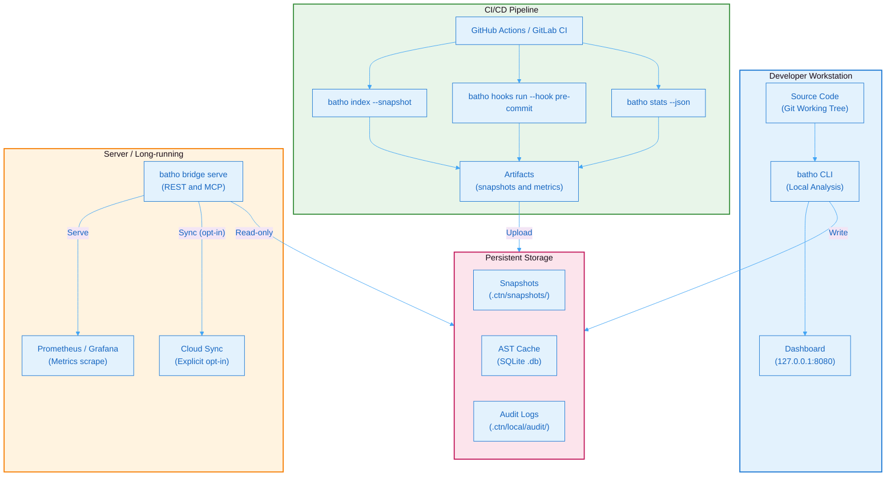
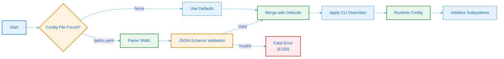
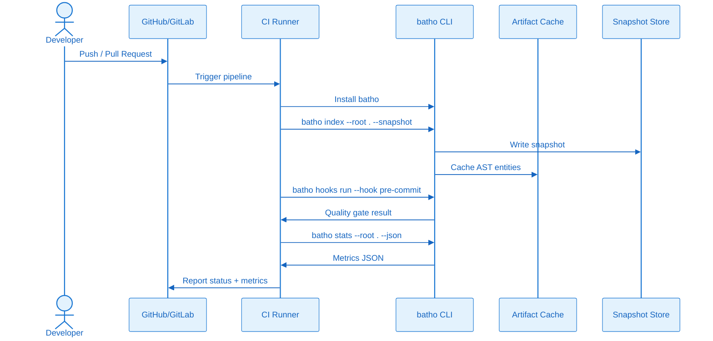
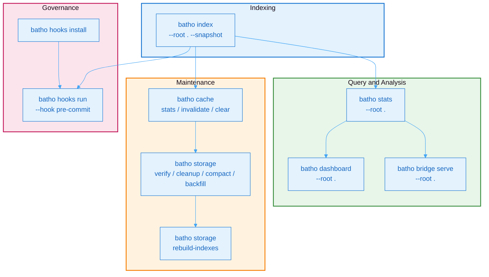
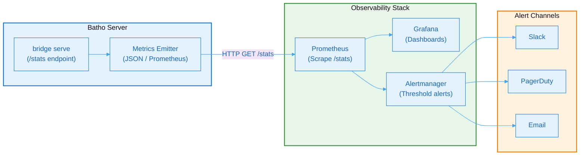
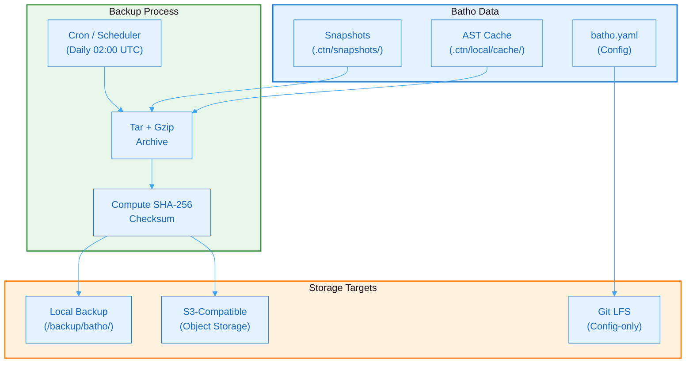

# 11. Deployment & Operations

## 11.1 Deployment Architecture

Batho is designed for flexible deployment across local development, CI/CD pipelines, and long-running server environments. The following architecture diagram illustrates the recommended production topology:



**Figure 21: Deployment Architecture** - Recommended production topology showing deployment modes across development, CI/CD, server, and storage layers.

### Deployment Modes

| Mode | Use Case | Network | Storage |
|------|----------|---------|---------|
| **Local CLI** | Developer analysis, ad-hoc queries | None | Local `.ctn/` |
| **CI/CD Agent** | Automated indexing on PR/push | None | Ephemeral + artifact upload |
| **Server (Bridge)** | Team dashboard, IDE integration | Localhost or TLS | Local `.ctn/` |
| **Cloud Sync** | Cross-repo artifact aggregation | Explicit outbound | Remote registry |

---

## 11.2 Installation

```bash
# Via uv (recommended)
uv add batho

# Via pip
pip install batho

# From source
uv sync
uv run pytest
```

---

## 11.3 Configuration

### Configuration Loading Flow



**Figure 22: Configuration Loading Flow** - Flowchart showing the configuration loading and validation process with JSON-Schema validation.

### Minimal `batho.yaml`

```yaml
batho_version: "1.0"

indexer:
  max_file_size_kb: 500
  max_workers: 0  # auto
  metrics_output: ".ctn/local/metrics/metrics.json"

logging:
  level: INFO
  json_format: false

rules:
  enabled: true
  auto_load_all_plugins: true
  builtin_plugins:
    - bsg_core
    - bsg_silent_failure_catcher
    - bsg_dependency_blast_radius

storage:
  retention:
    snapshot_days: 90
    patch_days: 90
    max_snapshots: 500
    max_patches: 5000
```

---

## 11.4 CI/CD Integration

### CI/CD Pipeline Flow



**Figure 23: CI/CD Pipeline Flow** - Sequence diagram showing Batho integration in CI/CD pipelines for automated analysis and quality gates.

### Platform Integration Matrix

| Platform | Integration | File | Trigger |
|----------|-------------|------|---------|
| GitHub Actions | Workflow template | `.github/workflows/batho.yml` | `push`, `pull_request` |
| GitLab CI | Pipeline template | `.gitlab-ci.yml` | `merge_request`, `push` |
| Pre-commit | Hook stages | `.pre-commit-config.yaml` | `git commit` |
| Jenkins | Pipeline step | `Jenkinsfile` | Webhook |

### GitHub Actions Example

```yaml
# .github/workflows/batho.yml
name: Batho Analysis
on: [push, pull_request]

jobs:
  analyze:
    runs-on: ubuntu-latest
    steps:
      - uses: actions/checkout@v4
      - uses: actions/setup-python@v5
        with:
          python-version: '3.11'
      - run: pip install batho
      - run: batho index --root . --snapshot
      - run: batho stats --root .
```

---

## 11.5 Operational Commands

### Command Taxonomy



**Figure 24: Command Taxonomy** - Flowchart showing the hierarchical organization of Batho CLI commands across functional categories.

### Health Check

```bash
batho stats --root .
```

### Cache Management

```bash
batho cache stats
batho cache invalidate "*.pyc"
batho cache clear
```

### Storage Maintenance

```bash
batho storage verify --root . --repair
batho storage cleanup --root . --apply
batho storage compact --root . --apply
batho storage backfill --root .
```

### Registry Rebuild

```bash
batho storage rebuild-indexes --root .
```

---

## 11.6 Monitoring & Observability

### Monitoring Stack



**Figure 25: Monitoring Stack** - Flowchart showing the metrics collection pipeline from Batho server to observability tools and alert channels.

### Metrics Endpoint

```bash
curl http://localhost:8080/stats
```

### Health Check Script

```bash
#!/bin/bash
batho stats --root . > /dev/null 2>&1
if [ $? -eq 0 ]; then
  echo "healthy"
else
  echo "unhealthy"
fi
```

### Key Operational Metrics

| Metric | Type | Threshold | Action |
|--------|------|-----------|--------|
| `index_duration_seconds` | Histogram | > 300s | Alert: slow indexing |
| `cache_hit_rate` | Gauge | < 90% | Alert: cache warming needed |
| `snapshot_count` | Gauge | > 450 | Alert: cleanup required |
| `error_rate` | Counter | > 1% | Alert: investigate logs |
| `api_request_latency` | Histogram | > 500ms | Alert: scale bridge |

---

## 11.7 Backup & Disaster Recovery

### Backup Flow



**Figure 26: Backup Flow** - Flowchart showing the automated backup process for snapshots, cache, and configuration to multiple storage targets.

### Backup Strategy

| Component | Backup Frequency | Retention | Method |
|-----------|------------------|-----------|--------|
| Snapshots | Daily | 90 days | `tar czf` + upload |
| Cache | Weekly | 30 days | `sqlite3 .backup` |
| Config | On change | Indefinite | Git commit |
| Audit Logs | Daily | 1 year | `logrotate` + compress |

### Recovery Procedures

```bash
# Restore from backup archive
tar xzf batho-backup-2026-05-17.tar.gz -C /path/to/restore
batho storage verify --root . --repair

# Rebuild indexes after restore
batho storage rebuild-indexes --root .
batho storage backfill --root .
```

---

## 11.8 Scaling Guidelines

### Resource Requirements by Repository Size

| Repository Size | RAM | Disk | Workers | Index Time |
|---------------|-----|------|---------|------------|
| < 10K files | 512 MB | 100 MB | 2 | < 30s |
| 10K–50K files | 2 GB | 500 MB | 4 | < 3 min |
| 50K–100K files | 4 GB | 1 GB | 8 | < 10 min |
| 100K–200K files | 8 GB | 2 GB | 16 | < 30 min |

### Horizontal Scaling for Monorepos

For repositories approaching the 200K file limit, use repository sharding:

```yaml
# batho.yaml — monorepo shard config
indexer:
  max_workers: 16
  include:
    - "services/auth/**"
    - "services/billing/**"
  exclude:
    - "vendor/**"
    - "node_modules/**"
    - "*.min.js"

storage:
  retention:
    snapshot_days: 30   # Shorter for large repos
    max_snapshots: 100
```
