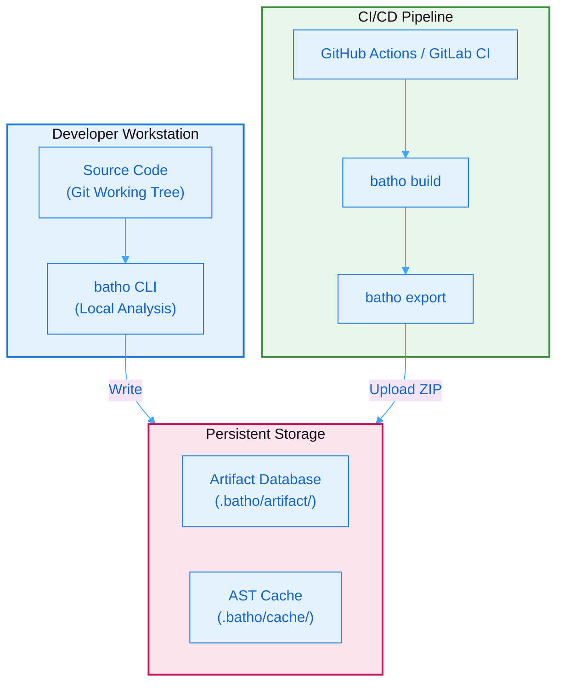
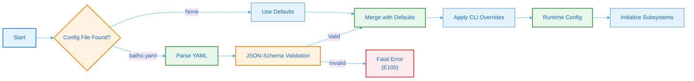
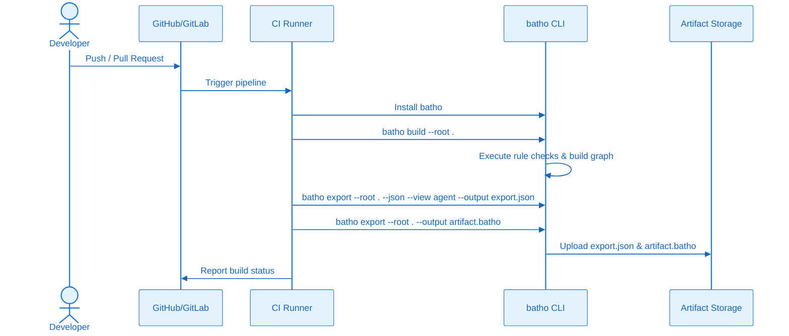
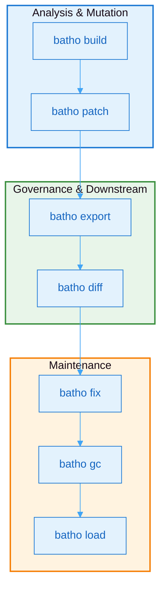

# 12. Deployment & Operations

## 12.1 Deployment Architecture

Batho is designed for flexible deployment across local developer workstations and automated CI/CD pipelines. The following architecture diagram illustrates the production topology:



**Figure 18: Deployment Architecture** - Recommended topology showing deployment modes across development, CI/CD, and storage layers.

### Deployment Modes

- **Local CLI**: Runs directly on the developer's machine to build indexes (`batho build`), perform patches (`batho patch`), or run queries. All database state is stored locally inside `.batho/`.
- **CI/CD Pipeline**: Runs as a static code analysis job in CI. It builds a database artifact from scratch or from a cached copy, evaluates rules, and uploads the `.batho` database package for downstream consumers.

---

## 12.2 Installation

Install the `batho` package directly from PyPI.

```bash
# Via uv (recommended for speed)
uv add batho

# Via pip
pip install batho
```

---

## 12.3 Configuration Loading Flow



**Figure 19: Configuration Loading Flow** - Flowchart showing the configuration loading and validation process with JSON-Schema validation.

---

## 12.4 CI/CD Integration

Integrate Batho into CI pipelines to automate graph generation and rule verification.

### CI/CD Pipeline Flow



**Figure 20: CI/CD Pipeline Flow** - Sequence diagram showing Batho integration in CI/CD pipelines for automated analysis.

### GitHub Actions Template

Create `.github/workflows/batho.yml` in your repository:

```yaml
name: Batho Analysis
on: [push, pull_request]

jobs:
  analyze:
    runs-on: ubuntu-latest
    steps:
      - uses: actions/checkout@v4
      - name: Set up Python
        uses: actions/setup-python@v5
        with:
          python-version: '3.11'
      - name: Install Batho
        run: pip install batho
      - name: Run Build
        run: batho build --root .
      - name: Export Code Intelligence
        run: batho export --root . --json --view agent --output bsg_agent.json
      - name: Pack Artifact Database
        run: batho export --root . --output artifact.batho
      - name: Archive Code Intelligence
        uses: actions/upload-artifact@v4
        with:
          name: batho-artifacts
          path: |
            bsg_agent.json
            artifact.batho
```

---

## 12.5 Operational Command Taxonomy

Batho's command suite is divided into three functional categories:



**Figure 21: Command Taxonomy** - Flowchart showing the categories of Batho CLI commands.

### Key Maintenance Tasks

#### Database Health Diagnostics
```bash
batho fix --dry-run
```

#### Sweep Stale Runs
```bash
batho gc runs --older-than 30
```

#### Bundle Vacuum
```bash
batho gc vacuum
```
