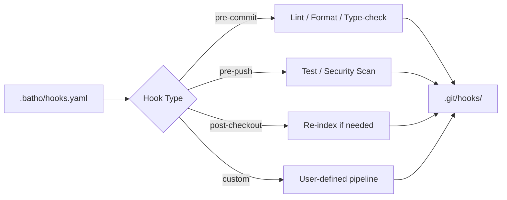

# 6. Git Hooks Enterprise

## 6.1 Architecture

## 6.2 Hook Lifecycle

| Stage | Command | Action |
|-------|---------|--------|
| Define | Edit `.batho/hooks.yaml` | Configure stages and commands |
| Plan | `batho hooks list` | Show supported + configured hooks |
| Install | `batho hooks install --all` | Generate scripts in `.git/hooks/` |
| Execute | Git trigger or `batho hooks run --hook NAME` | Run stage pipeline |
| Remove | `batho hooks remove --all` | Clean managed scripts |

## 6.3 Supported Git Hooks

All standard Git client-side hooks are supported:

| Hook | Typical Use Case |
|------|----------------|
| `applypatch-msg` | Patch message validation |
| `pre-commit` | Lint, format, type-check |
| `prepare-commit-msg` | Auto-generate commit messages |
| `commit-msg` | Commit message policy enforcement |
| `post-commit` | Notifications, metrics |
| `pre-rebase` | Prevent dangerous rebases |
| `post-checkout` | Environment reset, re-index |
| `post-merge` | Dependency updates |
| `pre-push` | Test suite, security scans |
| `pre-receive` | Server-side validation stub |
| `update` | Branch-specific policies |
| `post-update` | Deploy triggers |
