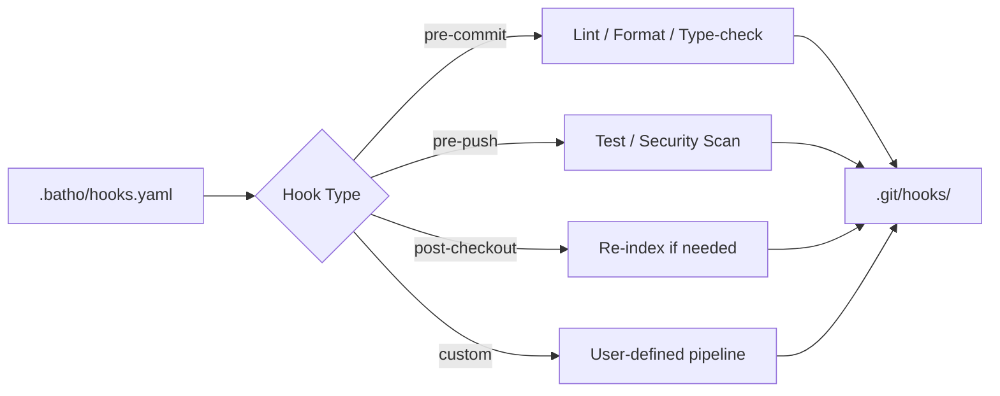

# 6. Git Hooks Enterprise

## 6.1 Architecture

Batho's Git hooks provide automated quality gates and workflow enforcement:



## 6.2 Hook Lifecycle

The hook lifecycle provides a consistent workflow for configuration and management:

| Stage | Command | Action |
|-------|---------|--------|
| Define | Edit `.batho/hooks.yaml` | Configure stages and commands |
| Plan | `batho hooks list` | Show supported + configured hooks |
| Install | `batho hooks install --all` | Generate scripts in `.git/hooks/` |
| Execute | Git trigger or `batho hooks run --hook NAME` | Run stage pipeline |
| Remove | `batho hooks remove --all` | Clean managed scripts |

## 6.3 Supported Git Hooks

All standard Git client-side hooks are supported:

| Hook | Typical Use Case |
|------|----------------|
| `applypatch-msg` | Patch message validation |
| `pre-commit` | Lint, format, type-check |
| `prepare-commit-msg` | Auto-generate commit messages |
| `commit-msg` | Commit message policy enforcement |
| `post-commit` | Notifications, metrics |
| `pre-rebase` | Prevent dangerous rebases |
| `post-checkout` | Environment reset, re-index |
| `post-merge` | Dependency updates |
| `pre-push` | Test suite, security scans |
| `pre-receive` | Server-side validation stub |
| `update` | Branch-specific policies |
| `post-update` | Deploy triggers |

## 6.4 Configuration Example

```yaml
# .batho/hooks.yaml
hooks:
  pre-commit:
    - name: "Check formatting"
      command: "ruff format --check ."
    - name: "Lint"
      command: "ruff check ."
    - name: "Type check"
      command: "mypy ."
  
  pre-push:
    - name: "Run tests"
      command: "pytest"
    - name: "Security scan"
      command: "bandit -r src/"
  
  post-checkout:
    - name: "Re-index"
      command: "batho index --root ."
```

## 6.5 Best Practices

1. **Fast pre-commit**: Keep pre-commit hooks under 2 seconds
2. **Cache dependencies**: Use cached virtual environments
3. **Parallel execution**: Run independent checks in parallel
4. **Fail fast**: Order checks by likelihood of failure
