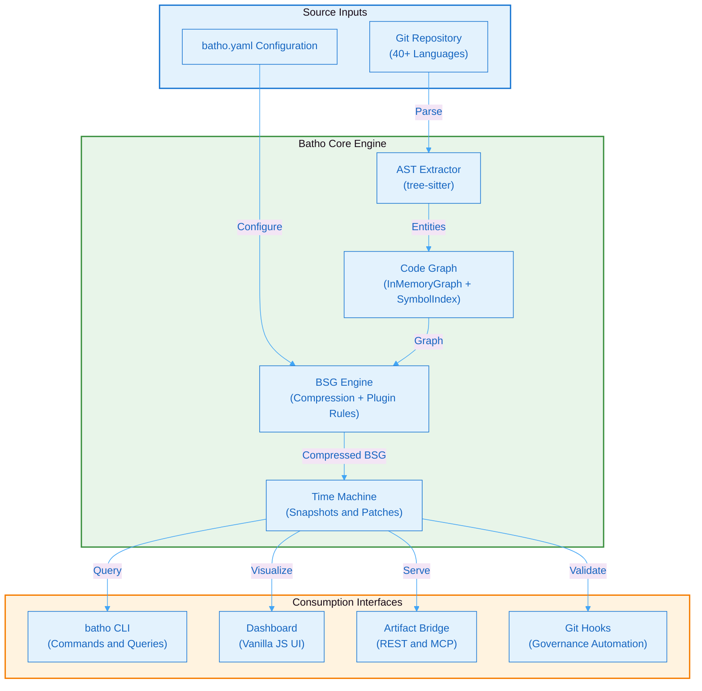

# Batho v1 Technical Whitepaper

## Bidirectional AST Traversal & Hypergraph Orchestrator

**Document Version:** 1.0.0  
**Date:** May 2026  
**Classification:** Public — Enterprise Technical Reference  
**Author:** Batho Core Team  
**Status:** Production-Ready

---

## Executive Summary

Batho (Bidirectional AST Traversal & Hypergraph Orchestrator) is a deterministic, production-grade code intelligence engine that transforms raw codebases into queryable, time-aware structured hypergraphs. Version 1 delivers a complete toolchain for AST extraction, semantic graph construction, LLM-optimized context compression, temporal versioning, and governance automation — designed for polyglot enterprises managing millions of lines of code across hundreds of repositories.

**Key Value Propositions**

| Metric | Value |
|--------|-------|
| Supported Languages | 40+ via tree-sitter |
| Context Compression | Up to 10x for LLM injection |
| Incremental Patch Speed | 10–100x faster than full re-index |
| Test Coverage | 859+ automated tests |
| Cache Hit Rate | >95% on typical PR-sized changes |
| Snapshot Retention | 90 days default, configurable |
| Max Indexed Files | 200,000 per repository |

---

## System Architecture at a Glance

**Figure 1: Batho v1 System Architecture Overview** - High-level data flow from source inputs through the core engine to consumption interfaces.

---

## List of Figures

| Figure | Title | Section |
|--------|-------|---------|
| Figure 1 | Batho v1 System Architecture Overview | Overview |
| Figure 2 | High-Level System Architecture | Architecture Overview |
| Figure 3 | Data Flow Pipeline | Architecture Overview |
| Figure 4 | Subsystem Interactions | Core Subsystems |
| Figure 5 | Graph Consistency Model | Code Graph Engine |
| Figure 6 | Cross-File Resolution Process | Code Graph Engine |
| Figure 7 | Token Budget Algorithm | BSG Compression |
| Figure 8 | Incremental Patch Lifecycle | Time Machine |
| Figure 9 | Git Hooks Architecture | Git Hooks Enterprise |
| Figure 10 | Dashboard Architecture | Interactive Dashboard |
| Figure 11 | Bridge Modes | Artifact Bridge & MCP |
| Figure 12 | Security Architecture Overview | Security & Governance |
| Figure 13 | Zero-Code-Execution Guarantee | Security & Governance |
| Figure 14 | BSG Interceptor Pipeline | Security & Governance |
| Figure 15 | Interceptor Sequence | Security & Governance |
| Figure 16 | Audit Logging Pipeline | Security & Governance |
| Figure 17 | Integrity Chain | Security & Governance |
| Figure 18 | Chain of Custody Flow | Security & Governance |
| Figure 19 | Threat Model | Security & Governance |
| Figure 20 | Cache Strategy | Performance & Scalability |
| Figure 21 | Deployment Architecture | Deployment & Operations |
| Figure 22 | Configuration Loading Flow | Deployment & Operations |
| Figure 23 | CI/CD Pipeline Flow | Deployment & Operations |
| Figure 24 | Command Taxonomy | Deployment & Operations |
| Figure 25 | Monitoring Stack | Deployment & Operations |
| Figure 26 | Backup Flow | Deployment & Operations |
| Figure 27 | Schema Dependency Graph | Appendix |

---

## Table of Contents

1. [Architecture Overview](/docs/whitepaper/architecture)
2. [Core Subsystems](/docs/whitepaper/core-subsystems)
3. [Deterministic Code Graph Engine](/docs/whitepaper/code-graph)
4. [BSG Compression & LLM Injection](/docs/whitepaper/bsg-compression)
5. [Time Machine & Incremental Patching](/docs/whitepaper/time-machine)
6. [Git Hooks Enterprise](/docs/whitepaper/git-hooks)
7. [Interactive Dashboard](/docs/whitepaper/dashboard)
8. [Artifact Bridge & MCP Integration](/docs/whitepaper/bridge-mcp)
9. [Security & Governance](/docs/whitepaper/security)
10. [Performance & Scalability](/docs/whitepaper/performance)
11. [Deployment & Operations](/docs/whitepaper/deployment)
12. [Appendix: Schema Reference](/docs/whitepaper/appendix)

---

## Document Control

| Version | Date | Author | Changes |
|---------|------|--------|---------|
| 1.0.0 | 2026-05-17 | Batho Core Team | Initial whitepaper for Batho v1 |

---

*For the latest documentation, visit:*
- CLI Reference: `batho --help`
- Dashboard: `batho dashboard --root .`
- API Docs: `batho bridge serve --root .`
