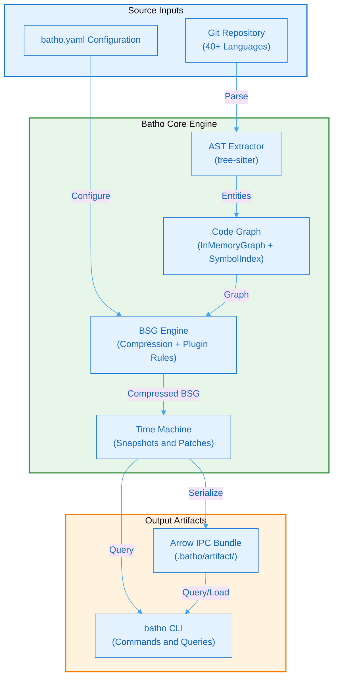

# Batho v1.1.0 Technical Whitepaper

## Bidirectional AST Traversal & Hypergraph Orchestrator

**Document Version:** 1.1.0  
**Date:** June 2026  
**Classification:** Public — Enterprise Technical Reference  
**Author:** Batho Core Team  
**Status:** Production-Ready

---

## Executive Summary

Batho (Bidirectional AST Traversal & Hypergraph Orchestrator) is a deterministic, production-grade code intelligence engine that transforms raw codebases into queryable, time-aware structured hypergraphs. Version 1.1.0 delivers a unified configuration schema (`batho.yaml`), a high-performance Arrow IPC Bundle storage format, lossless bidirectional traversal support, and a streamlined 7-command CLI interface. Batho is designed for polyglot enterprises managing millions of lines of code across hundreds of repositories.

**Key Value Propositions**

| Metric | Value |
|--------|-------|
| Supported Languages | 40+ via tree-sitter |
| Context Compression | Up to 10x for LLM injection |
| Incremental Patch Speed | 10–100x faster than full re-index |
| Test Coverage | 381 automated tests |
| Cache Hit Rate | >95% on typical PR-sized changes |
| Snapshot Retention | 90 days default, configurable |
| Max Indexed Files | 200,000 per repository |

---

## System Architecture at a Glance

**Figure 1: Batho v1.1.0 System Architecture Overview** - High-level data flow from source inputs through the core engine to consumption interfaces.

---

## List of Figures

| Figure | Title | Section |
|--------|-------|---------|
| Figure 1 | Batho v1.1.0 System Architecture Overview | Overview |
| Figure 2 | High-Level System Architecture | Architecture Overview |
| Figure 3 | Data Flow Pipeline | Architecture Overview |
| Figure 4 | Subsystem Interactions | Core Subsystems |
| Figure 5 | Graph Consistency Model | Code Graph Engine |
| Figure 6 | Cross-File Resolution Process | Code Graph Engine |
| Figure 7 | Token Budget Algorithm | BSG Compression |
| Figure 8 | Incremental Patch Lifecycle | Time Machine |
| Figure 9 | Security Architecture Overview | Security & Governance |
| Figure 10 | Zero-Code-Execution Guarantee | Security & Governance |
| Figure 11 | BSG Interceptor Pipeline | Security & Governance |
| Figure 12 | Interceptor Sequence | Security & Governance |
| Figure 13 | Audit Logging Pipeline | Security & Governance |
| Figure 14 | Integrity Chain | Security & Governance |
| Figure 15 | Chain of Custody Flow | Security & Governance |
| Figure 16 | Threat Model | Security & Governance |
| Figure 17 | Cache Strategy | Performance & Scalability |
| Figure 18 | Deployment Architecture | Deployment & Operations |
| Figure 19 | Configuration Loading Flow | Deployment & Operations |
| Figure 20 | CI/CD Pipeline Flow | Deployment & Operations |
| Figure 21 | Command Taxonomy | Deployment & Operations |
| Figure 22 | Monitoring Stack | Deployment & Operations |
| Figure 23 | Backup Flow | Deployment & Operations |
| Figure 24 | Schema Dependency Graph | Appendix |
| Figure 25 | Arrow Bundle Architecture | Storage & Persistence Layer |
| Figure 26 | MVCC Generation Lifecycle | Storage & Persistence Layer |
| Figure 27 | Arrow Store Compaction Pipeline | Storage & Persistence Layer |
| Figure 28 | Unified Cache Architecture | Storage & Persistence Layer |
| Figure 29 | Dependency Indexing Pipeline | Dependency Intelligence |
| Figure 30 | Integrity Check & Repair Pipeline | Integrity & Repair System |
| Figure 31 | Orchestrator → Module Delegation Flow | Infrastructure & Shared Services |
| Figure 32 | Plugin Dependency Graph | BSG Compression |

---

## Table of Contents

1. [Architecture Overview](/docs/whitepaper/architecture)
2. [Core Subsystems](/docs/whitepaper/core-subsystems)
3. [Storage & Persistence Layer](/docs/whitepaper/storage)
4. [Deterministic Code Graph Engine](/docs/whitepaper/code-graph)
5. [BSG Compression & LLM Injection](/docs/whitepaper/bsg-compression)
6. [Dependency Intelligence](/docs/whitepaper/dependency)
7. [Time Machine & Incremental Patching](/docs/whitepaper/time-machine)
8. [Integrity & Repair System](/docs/whitepaper/integrity)
9. [Security & Governance](/docs/whitepaper/security)
10. [Performance & Scalability](/docs/whitepaper/performance)
11. [Infrastructure & Shared Services](/docs/whitepaper/infrastructure)
12. [Deployment & Operations](/docs/whitepaper/deployment)
13. [Appendix: Schema Reference](/docs/whitepaper/appendix)

---

## Document Control

| Version | Date | Author | Changes |
|---------|------|--------|---------|
| 1.1.1 | 2026-06-29 | Batho Core Team | Added Storage, Dependency, Integrity, and Infrastructure sections; added BSG plugin catalog; renumbered sections |
| 1.1.0 | 2026-06-10 | Batho Core Team | Refactored to v1.1.0 (unified batho.yaml, 7 CLI commands, Arrow IPC format, removed legacy subsystems) |
| 1.0.0 | 2026-05-17 | Batho Core Team | Initial whitepaper for Batho v1 |

---

*For the latest documentation, visit:*
- CLI Reference: `batho --help`
