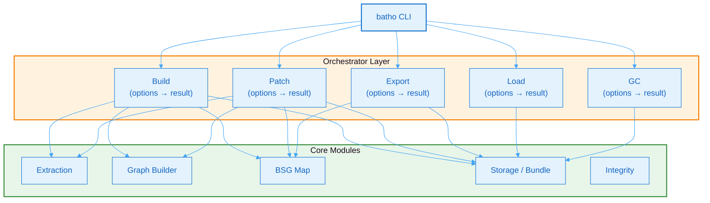

# 11. Infrastructure & Shared Services

Batho's infrastructure layer sits between the CLI interface and the core modules. It consists of the **Orchestrator** layer, which implements high-level command logic, and the **Shared Utilities**, which provide cross-cutting services used by all subsystems.

## 11.1 Orchestrator Layer

The orchestrator layer implements the business logic for each CLI command. Each orchestrator defines typed options and result structures, delegates to the appropriate modules, and handles error recovery.



**Figure 31: Orchestrator → Module Delegation Flow** — Each CLI command dispatches to its orchestrator, which coordinates multiple core modules to complete the operation.

### Build Orchestrator

The build orchestrator performs a full baseline index build:

| Aspect | Detail |
|--------|--------|
| **Options** | Root path, force full rebuild, verbosity, worker count, max file size |
| **Result** | Success status, run ID, entity/relationship/file counts, duration |
| **Flow** | Load config → Discover files → Parallel extraction → Build graph → Build BSG → Write Arrow Bundle |
| **Precompiled batches** | Decodes compressed blobs into entity, storage, and relationship dictionaries for the bundle writer |
| **Early exit** | If artifact already exists, directs user to `batho patch` (unless `--full`) |

### Patch Orchestrator

The patch orchestrator performs incremental updates using native hash-based change detection:

| Aspect | Detail |
|--------|--------|
| **Options** | Root path, verbosity, max file size |
| **Result** | Success status, run ID, snapshot IDs, changes applied (added/modified/deleted counts) |
| **Change detection** | Reads file tracking table, compares filesystem modification time + SHA-256 |
| **Change records** | Path, change type (added/modified/deleted), old hash, new hash |
| **Atomicity** | All changes committed as a single new run; rollback on failure |

### Export Orchestrator

The export orchestrator produces transportable artifacts and JSON views:

| Aspect | Detail |
|--------|--------|
| **Options** | Root path, view type, output path, format, filter pattern, category, token budget, pack mode |
| **Result** | Success status, entity/file counts, output path, optional stream generator |
| **Views** | Storage, agent, overview, files, symbols, dependencies, delta |
| **Pack mode** | Produces ZIP artifact (`.batho` file) with ZSTD compression |
| **Streaming** | Optional streaming mode for large repositories |

### Load Orchestrator

The load orchestrator unpacks a transport artifact ZIP into the artifact directory:

| Aspect | Detail |
|--------|--------|
| **Options** | Root path, artifact path, force overwrite, rebuild BSG flag |
| **Result** | Success status, message, generation number, tables loaded, errors |
| **Safety** | Refuses to overwrite existing bundle unless `--force` is specified |

### GC Orchestrator

The GC orchestrator handles garbage collection and bundle maintenance:

| Aspect | Detail |
|--------|--------|
| **Options** | Root path, command, run UUID, age threshold, verbosity |
| **Commands** | Delete specific run, delete runs older than N days, vacuum orphaned files, storage status metrics |

---

## 11.2 Shared Utilities

The shared utilities provide cross-cutting services used by all Batho subsystems:

| Utility | Purpose | Key Capabilities |
|---------|---------|------------------|
| **Hashing** | SHA-256 content hashing and binary file detection | File/bytes/string hashing, cached hashing, binary detection |
| **File I/O** | Unified file reading/writing with size limits, encoding normalization, and atomic writes | Read bytes, inter-process locking, atomic writes |
| **Encoding** | Multi-encoding fallback for reading files with unknown encodings | UTF-8 normalization, fallback decoding |
| **Ignore Patterns** | Unified `.gitignore` + default patterns handling | Pattern loading, ignore checking |
| **Logging** | Structured logging via structlog | Context-bindable loggers, console/JSON renderers |
| **Path Sanitizer** | Path traversal prevention and security validation | Path validation, security error raising |
| **Memory Monitor** | Memory usage monitoring with warning/critical thresholds | RSS/VMS reporting, scoped monitoring |
| **CLI Output** | User-facing CLI messages with stdout/stderr separation | Quiet mode, JSON mode, color detection |

### Hashing

Provides unified SHA-256 hashing for files, bytes, and strings. Binary file detection uses two strategies:

- **Magic bytes**: Checks against 20+ known binary file signatures (PNG, JPEG, PDF, ZIP, etc.)
- **Entropy analysis**: Computes Shannon entropy on a 4KB window (threshold: 7.30 bits/byte) for unknown formats
- **Null byte ratio**: Files with >1% null bytes are classified as binary

Cached hashing avoids rehashing the same file within a single session.

### File I/O

Consolidates all file operations with:

- **Size limits**: Enforces configurable max file size (default: 500KB)
- **Encoding normalization**: Delegates to the encoding utility for multi-fallback decoding
- **Binary detection**: Returns `None` for binary files when binary detection is enabled
- **Atomic writes**: Uses atomic rename for file replacement
- **Inter-process locking**: Cross-process synchronization via lock files

### Encoding

Handles the reality of polyglot codebases with files in various encodings:

| Fallback Order | Encoding | Behavior |
|----------------|----------|----------|
| 1 | UTF-8 | Strict decode |
| 2 | ASCII | Strict decode |
| 3 | CP1252 | Strict decode |
| 4 | Latin-1 | Never fails (maps bytes 0–255 to Unicode) |

The normalization function decodes with fallback then re-encodes to UTF-8, ensuring consistent encoding across all downstream processing.

### Ignore Patterns

Unifies `.gitignore` file handling with Batho's built-in default patterns:

- **Default patterns**: Loaded from Batho's built-in configuration files
- **gitignore spec**: Uses Git-compatible pattern matching
- **Merged spec**: Default patterns + `.gitignore` patterns are merged into a single compiled spec
- **Cached**: The compiled spec is cached per repository root for performance

### Structured Logging

All Batho modules use structlog for structured, context-bindable logging:

```python
logger = get_logger(__name__, component="orchestrator.build")
logger.info("build_started", root=str(root), workers=max_workers)
```

- **Console renderer**: Human-readable colored output for CLI usage
- **JSON renderer**: Machine-readable for CI/CD log aggregation
- **Lazy initialization**: Logger creation is deferred so import-time module loggers don't lock in defaults before configuration runs

### Path Sanitizer

Prevents path traversal attacks when handling user-provided or configuration-specified paths:

- **Base directory enforcement**: Resolves relative paths against a base directory
- **Absolute path rejection**: Optionally rejects absolute paths
- **Traversal detection**: Detects `..` sequences that escape the base directory
- **Raises security error**: On any unsafe path, with descriptive error message

### Memory Monitor

Tracks memory usage during large repository operations:

| Threshold | Default | Action |
|-----------|---------|--------|
| Warning | 500 MB | Log warning with current usage |
| Critical | 1000 MB | Log critical + trigger GC |

Uses `psutil` when available for accurate RSS/VMS reporting. Falls back to the `resource` module on systems without psutil. Provides a context manager for scoped monitoring of specific operations.

### CLI Output

The CLI output service provides structured user-facing output with:

- **stdout/stderr separation**: Errors and warnings go to stderr, info and success to stdout
- **Quiet mode**: Suppresses all non-error output
- **JSON mode**: Emits structured JSON instead of formatted text
- **Color support**: Auto-detects terminal capability, respects `NO_COLOR` environment variable
- **Message classification**: Categorizes messages as `error`, `warning`, `success`, or `info` based on content
