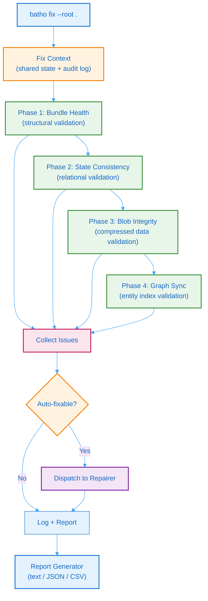

# 8. Integrity & Repair System

Batho's integrity subsystem provides a comprehensive, automated check-and-repair pipeline for the Arrow Bundle artifact database. It detects corruption, validates data structures, and repairs issues where possible — all exposed through the `batho fix` CLI command.

## 8.1 Fix Engine Architecture

The fix engine orchestrates a four-phase check pipeline with optional parallel execution and automatic repair:



**Figure 30: Integrity Check & Repair Pipeline** — Four-phase pipeline from bundle health through graph sync, with automatic repair dispatch and multi-format reporting.

### Fix Context

The fix context is the shared state object passed to all checkers and repairers:

| Property | Description |
|----------|-------------|
| Root path | Repository root path |
| Bundle instance | Active Arrow Bundle |
| Deep mode | Decompress and validate every blob (slow) |
| Dry run | Check only, do not perform repairs |
| Audit log | Append-only audit trail |
| Session ID | Unique identifier for this fix session |

It lazily loads index runs and the latest run from the bundle, caching results across all checkers.

---

## 8.2 Data Models

### Severity Levels

| Level | Description | Action |
|-------|-------------|--------|
| `CRITICAL` | Data loss risk | Immediate fix required |
| `ERROR` | Corruption detected | Auto-fix attempted |
| `WARNING` | Anomaly detected | May be transient |
| `INFO` | FYI | No action needed |

### Check Status

| Status | Description |
|--------|-------------|
| `PASSED` | No issues found |
| `FAILED` | Issues detected, not repaired |
| `FIXED` | Issues detected and automatically repaired |
| `SKIPPED` | Check skipped (e.g., empty database) |

### Issue

Each issue captures a single integrity problem with its type, severity, affected table, identifier, description, repair strategy, and whether it is auto-fixable.

---

## 8.3 Checkers

### Phase 1: Bundle Health Checker

The bundle health checker verifies the structural integrity of the Arrow Bundle artifact directory:

- **meta.json validity**: Ensures `active_files` entries exist and are parseable.
- **Active IPC files**: Verifies all referenced `.vN.ipc` files exist on disk.
- **Schema version**: Checks `BUNDLE_SCHEMA_VERSION` matches expected version.

### Phase 2: State Consistency Checker

The state consistency checker validates relational consistency and state anomalies:

- **Stuck runs**: Finds runs marked `running` for more than 24 hours, or stale due to process termination. Checks for inter-process lock conflicts.
- **File tracking desync**: Detects files in `file_tracking` that no longer exist on disk.
- **Orphaned strings**: Identifies `string_dict` entries not referenced by any table.

### Phase 3: Blob Integrity Checker

The blob integrity checker validates compressed blob data in the database:

- **zstd magic header**: Verifies blob starts with `0x28B52FFD` (zstd magic number).
- **Decompression test** (deep mode): Fully decompresses and validates JSON payload.
- **JSON validity** (deep mode): Parses decompressed content and validates JSON structure.

### Phase 4: Graph Sync Checker

The graph sync checker verifies hypergraph entity index synchronization:

- **Entity sync**: Compares BSG scratch-store entities against bundle `agent_view` rows.
- **Dangling references**: Detects relationships pointing to non-existent entities.
- **Cross-reference validation**: Ensures `file_id` mappings are consistent across tables.

---

## 8.4 Repairers

Each checker is paired with a repairer that can automatically fix detected issues:

### Blob Repairer

| Repair Strategy | Action |
|----------------|--------|
| `delete_corrupt_file_artifact` | Remove corrupted file artifact row from bundle |
| `clear_corrupt_run_artifact` | Null out corrupted JSON column in `run_artifacts` |
| `delete_corrupt_changelog` | Remove corrupted changelog entry |

### Graph Repairer

| Repair Strategy | Action |
|----------------|--------|
| `resolve_dangling` | Attempt to resolve dangling references via the shared Arrow current/ store |
| `delete_invalid_relationship` | Remove relationship with non-existent target entity |

### State Repairer

| Repair Strategy | Action |
|----------------|--------|
| `fail_stuck_run` | Mark stuck run as `failed` with error message |
| `delete_orphaned_string` | No-op (strings are lazily cleaned during compaction) |
| `reset_file_tracking` | Reset `is_indexed` flag for desynced file tracking rows |

---

## 8.5 Checks Framework

The checks framework defines a protocol-based interface for extensible integrity checks:

```python
class IntegrityCheck(Protocol):
    name: str
    description: str
    def run(self, ctx: FixContext) -> CheckResult: ...
    def supports_quick_mode(self) -> bool: ...
```

**Registered checks:**

| Check | Description |
|-------|-------------|
| Database integrity | Database-level structural validation |
| Index integrity | Index consistency and coverage validation |
| BSG integrity | BSG view integrity and completeness |
| View integrity | Arrow IPC view schema and data validation |

Each check returns a result with findings, metrics, and duration, enabling the engine to aggregate results across all phases.

---

## 8.6 Report Generation

The report generator produces integrity reports in three formats:

| Format | Purpose | Output |
|--------|---------|--------|
| `text` | Human-readable console output | Colored summary with issue details |
| `json` | Machine-readable for CI/CD integration | Structured `FixReport` JSON |
| `csv` | Spreadsheet analysis | One row per finding |

The fix report captures the complete fix session:

| Field | Description |
|-------|-------------|
| Timestamps | Session start and completion times |
| Paths | Repository and artifact paths |
| Mode | Dry-run or fix |
| Summary | Counts by severity level |
| Check results | Per-phase check reports |
| Repairs | Attempted repair results |
| Findings by severity | Count of findings at each severity level |

---

## 8.7 CLI Interface

```bash
# Dry-run: check only, no repairs
batho fix --dry-run

# Deep mode: decompress and validate every blob
batho fix --deep

# Target specific phase
batho fix --target blobs
batho fix --phase 3

# Run checks in parallel
batho fix --parallel

# Output report as JSON to file
batho fix --format json --output report.json
```

### CLI Flags

| Flag | Description |
|------|-------------|
| `--dry-run` | Check only, do not perform repairs |
| `--deep` | Decompress and validate every blob (slow) |
| `--target` | Run specific checker: `db`, `state`, `blobs`, `graph`, `all` |
| `--phase` | Run specific phase (1–4) |
| `--parallel` | Run independent checks in parallel |
| `--format` | Report format: `text`, `json`, `csv` |
| `--output` | Write report to file instead of stdout |
