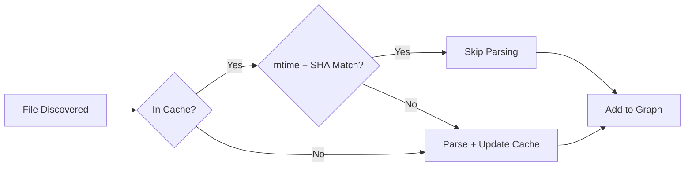

# 10. Performance & Scalability

## 10.1 Benchmarks

| Metric | Value | Notes |
|--------|-------|-------|
| Indexing throughput | ~1,000 files/sec | 8 workers, cached |
| Full index (100K files) | ~3 minutes | Cold start, Python repo |
| Incremental patch (50 files) | ~2 seconds | Snapshot-based |
| Cache hit rate | >95% | PR-sized changes |
| Memory footprint | ~2GB | 100K Python files |
| Graph JSON size | ~150MB | 100K files, uncompressed |
| BSG compressed | ~5MB | 12K token budget |

## 10.2 Scaling Dimensions

| Dimension | Strategy | Limit |
|-----------|----------|-------|
| Files | Parallel extraction + caching | 200,000 default |
| Workers | CPU × 2, capped at 32 | Auto-detected |
| File size | Configurable max (default 500KB) | Per-file |
| Snapshots | Deduplication + retention policy | 500 default |
| Patches | Chain compression + retention | 5,000 default |

## 10.3 Cache Strategy

