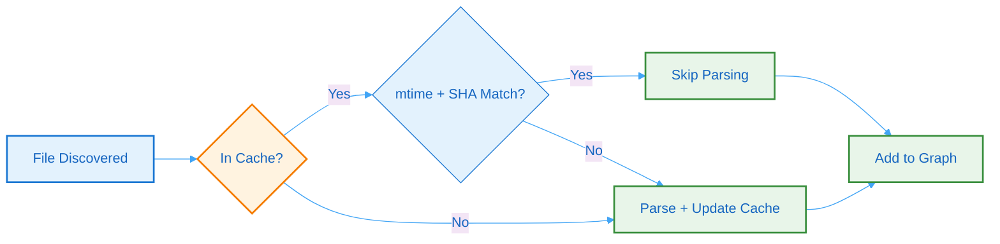

# 10. Performance & Scalability

## 10.1 Benchmarks

Performance metrics from production workloads:

| Metric | Value | Notes |
|--------|-------|-------|
| Indexing throughput | ~1,000 files/sec | 8 workers, cached |
| Full index (100K files) | ~3 minutes | Cold start, Python repo |
| Incremental patch (50 files) | ~2 seconds | Snapshot-based |
| Cache hit rate | >95% | PR-sized changes |
| Memory footprint | ~2GB | 100K Python files |
| Graph JSON size | ~150MB | 100K files, uncompressed |
| BSG compressed | ~5MB | 12K token budget |

## 10.2 Scaling Dimensions

| Dimension | Strategy | Limit |
|-----------|----------|-------|
| Files | Parallel extraction + caching | 200,000 default |
| Workers | CPU × 2, capped at 32 | Auto-detected |
| File size | Configurable max (default 500KB) | Per-file |
| Snapshots | Deduplication + retention policy | 500 default |
| Patches | Chain compression + retention | 5,000 default |

### Resource Requirements

| Repository Size | CPU | Memory | Disk |
|-----------------|-----|--------|------|
| Small (≤10K files) | 2 cores | 512MB | 1GB |
| Medium (10K-50K) | 4 cores | 1GB | 5GB |
| Large (50K-200K) | 8+ cores | 4GB+ | 20GB+ |

## 10.3 Cache Strategy

The caching strategy minimizes redundant work:



**Figure 20: Cache Strategy** - Flowchart showing the caching logic that minimizes redundant parsing through mtime and SHA-256 validation.

### Cache Layers

| Layer | Technology | TTL | Purpose |
|-------|------------|-----|---------|
| **AST Cache** | SQLite | 90 days | Parsed entity cache |
| **Symbol Cache** | SQLite | 90 days | Cross-file resolution |
| **BSG Cache** | JSON files | 90 days | Rendered graphs |
| **Snapshot Cache** | JSON files | Configurable | Time-travel snapshots |

### Cache Invalidation

- **mtime-based**: Skip unchanged files
- **SHA-256 validation**: Detect content changes
- **Manual invalidation**: `batho cache invalidate "*.pyc"`
- **Full clear**: `batho cache clear`

## 10.4 Performance Tuning

### Worker Configuration

```yaml
# batho.yaml
indexer:
  max_workers: 8  # Default: CPU count × 2
  batch_size: 100  # Files per batch
```

### Memory Optimization

```bash
# Limit memory usage
batho index --root . --max-memory 2G

# Enable streaming mode for large repos
batho index --root . --stream
```
