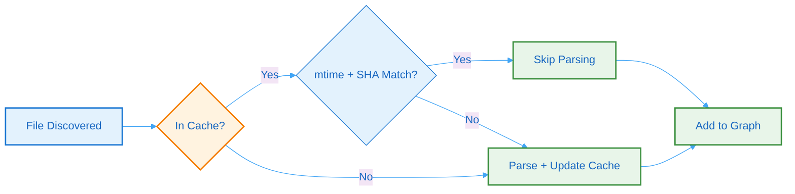

# 7. Performance & Scalability

## 7.1 Benchmarks

Performance metrics from production workloads in Batho v1.1.0:

| Metric | Value | Notes |
|--------|-------|-------|
| Indexing throughput | ~1,000 files/sec | 8 workers, cached AST |
| Full build (100K files) | ~3 minutes | Cold start, Python repository |
| Incremental patch (50 files) | ~1.5 seconds | Content-hash based patch |
| AST Cache hit rate | >95% | Typical pull request size |
| Memory footprint | ~1.5GB | 100K Python files |
| Arrow Bundle size | ~45MB | Compressed Arrow IPC Bundle database |
| Agent BSG export size | ~3.5MB | 12K token budget |

## 7.2 Scaling Dimensions

| Dimension | Strategy | Limit |
|-----------|----------|-------|
| Files | Parallel extraction + caching | 200,000 default |
| Workers | CPU × 2, capped at 32 | Auto-detected |
| File size | Configurable max (default 500KB) | Per-file |
| Runs | GC cleanup & vacuum policies | Configurable retention |

### Resource Requirements

| Repository Size | CPU | Memory | Disk |
|-----------------|-----|--------|------|
| Small (≤10K files) | 2 cores | 512MB | 100MB |
| Medium (10K-50K) | 4 cores | 1.5GB | 500MB |
| Large (50K-200K) | 8+ cores | 4GB+ | 2GB |

## 7.3 Cache Strategy

The caching strategy minimizes redundant work:

**Figure 17: Cache Strategy** - Flowchart showing the caching logic that minimizes redundant parsing through mtime and SHA-256 validation.

### Cache Layers

| Layer | Technology | TTL | Purpose |
|-------|------------|-----|---------|
| **AST Cache** | msgpack | 30 days | Persisted tree-sitter parsed entity structure |
| **Dependency Cache** | msgpack | 90 days | Shared third-party symbol resolution mapping |
| **BSG Cache** | Arrow IPC | 30 days | Rendered views stored in `file_artifacts` |

### Cache Invalidation & Maintenance

- **mtime + SHA-256 Verification**: Changes in files are caught by comparing filesystem markers and file content hashes against the database tracking schema.
- **Garbage Collection**: Outdated runs and cache entries are cleaned up using `batho gc`. Running `batho gc vacuum` frees up database sectors by triggering vacuum operations on Arrow IPC files.
