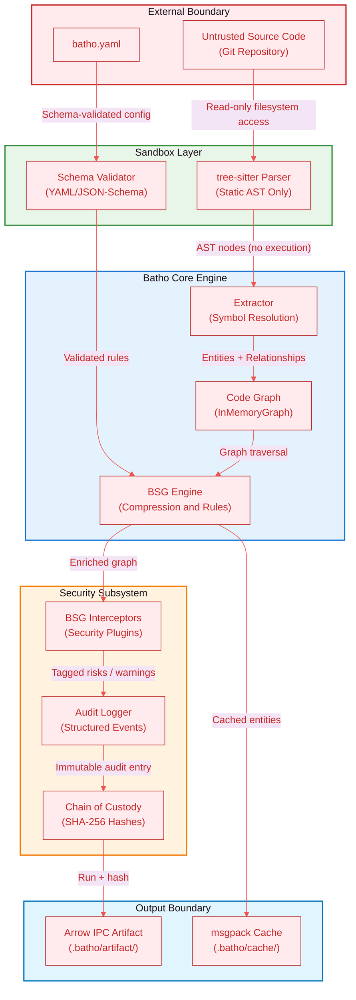
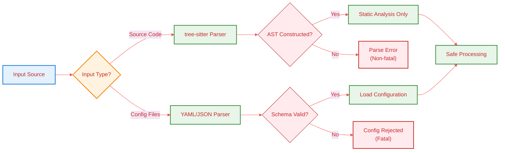
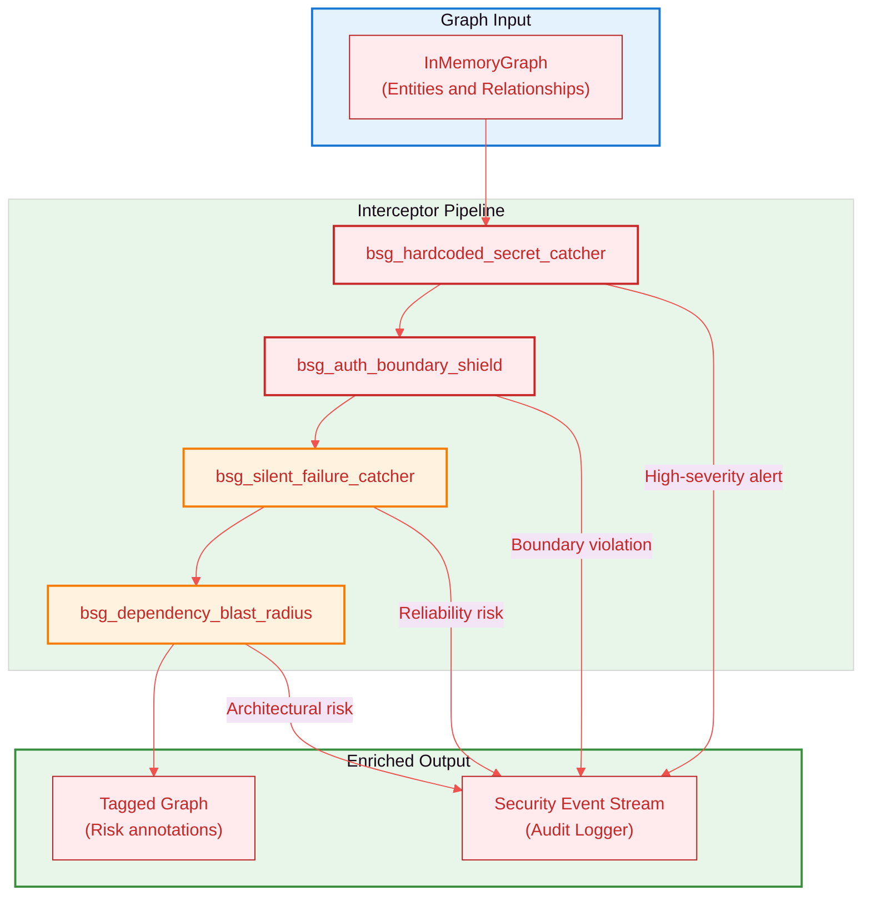
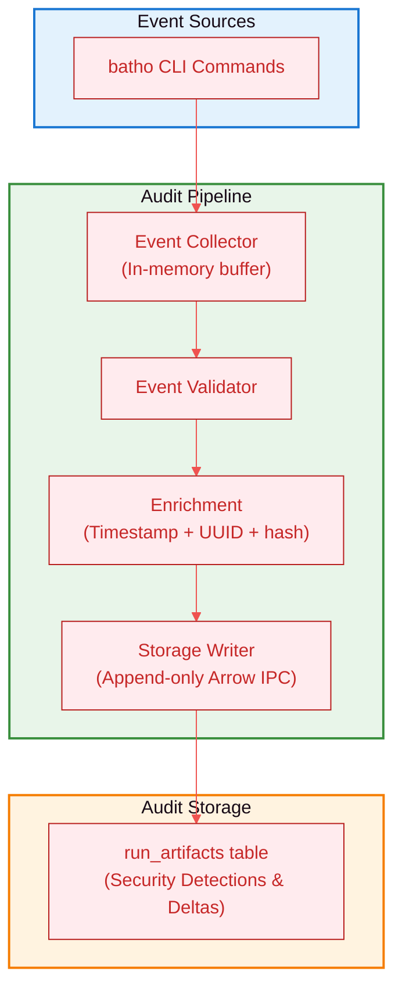
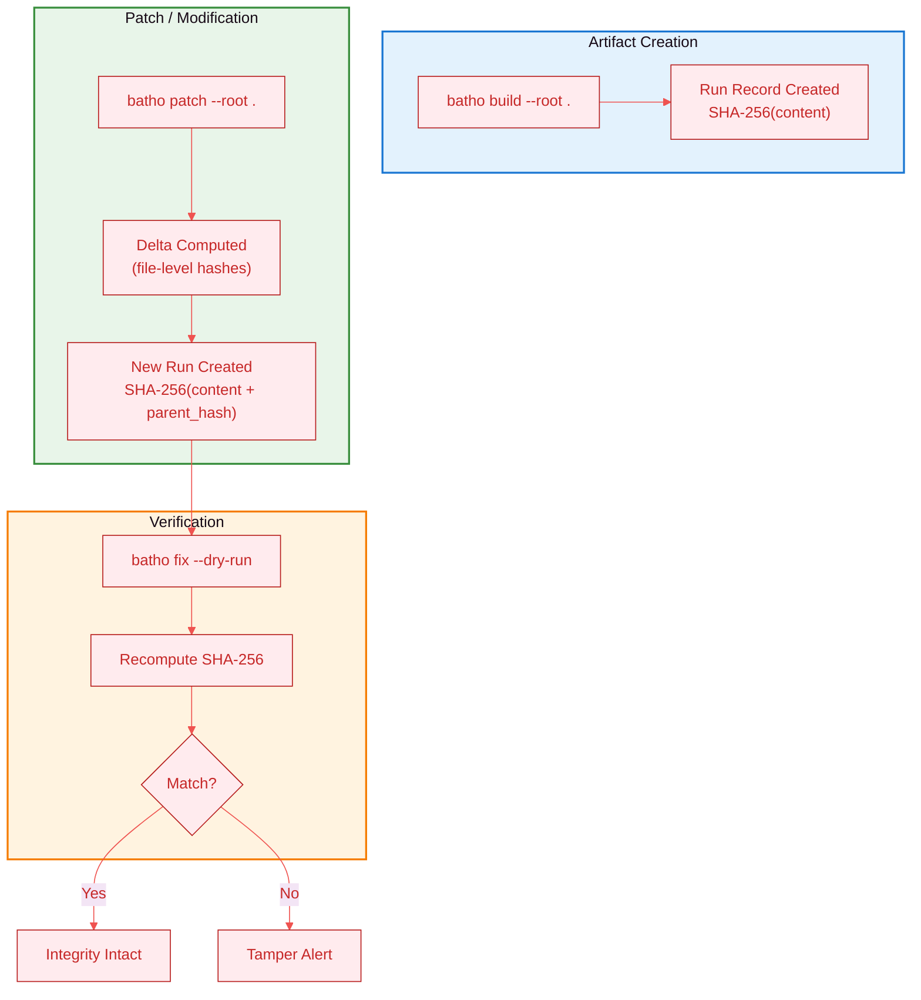

# 9. Security & Governance

## 9.1 Security Architecture Overview

Batho's security model is built on a **zero-code-execution guarantee** with defense-in-depth layers spanning static analysis, plugin-based interception, immutable audit trails, and cryptographic integrity verification. The following architecture diagram illustrates the trust boundaries and data flow through each security layer:



**Figure 9: Security Architecture Overview** - Trust boundaries and data flow through security layers from untrusted input to protected output.

### Trust Boundary Summary

| Boundary | Mechanism | Assurance |
|----------|-----------|-----------|
| **Input** | Read-only filesystem scan | No write access to source code during analysis. |
| **Parsing** | tree-sitter static AST | Zero code execution (no module imports or script evaluations). |
| **Configuration** | JSON-Schema validation | Reject malformed or unauthorized config keys. |
| **Plugin Execution** | Declarative YAML rules only | No custom code paths or script engines permitted. |
| **Storage** | Local Arrow IPC | Localized storage inside `.batho/`, preventing cloud exfiltration. |

---

## 9.2 Zero-Code-Execution Guarantee

Batho operates entirely via static analysis, ensuring safe operation on untrusted codebases. The following flow diagram details the input sanitization and processing pipeline that maintains this guarantee:



**Figure 10: Zero-Code-Execution Guarantee** - Input sanitization pipeline ensuring safe processing of untrusted code and configurations.

### Processing Guarantees by Input Category

- **Source files**: Passed strictly to tree-sitter. No files are executed, imported, or dynamically run.
- **Config files**: Checked against a JSON-schema. Malformed configurations fail immediately.
- **BSG Plugins**: Declarative selectors match node patterns (e.g. naming conventions, signatures) rather than running python scripts.

---

## 9.3 BSG Interceptor Plugins

Security-focused plugins run during graph construction to detect and tag risks before they enter the compressed output. The interceptor pipeline operates as a non-blocking enricher — detections are tagged, not blocked, allowing the build to continue while surfacing issues.



**Figure 11: BSG Interceptor Pipeline** - Security plugin pipeline that enriches the graph with risk annotations and emits security events.

### Interceptor Catalog

| Plugin | Detects | Severity | Action |
|--------|---------|----------|--------|
| `bsg_hardcoded_secret_catcher` | API keys, tokens in string literals | **High** | Tag entity + log warning + emit security event |
| `bsg_auth_boundary_shield` | Missing auth decorators on API route handlers | **High** | Tag risk boundary + emit governance event |
| `bsg_silent_failure_catcher` | Bare `except:`, swallowed exceptions | Medium | Tag reliability risk + emit quality event |
| `bsg_dependency_blast_radius` | High fan-out modules (>N dependents) | Low | Tag architectural risk + emit advisory event |

---

## 9.4 Audit Logging

All patch operations produce a comprehensive, append-only audit trail in the database if `flags.audit_log_enabled` is set in `batho.yaml`. The audit subsystem captures structured events at every phase of the patch lifecycle, enabling post-hoc forensic analysis and compliance reporting.



**Figure 13: Audit Logging Pipeline** - Event collection, validation, enrichment, and storage flow for comprehensive audit trail.

---

## 9.5 Compliance & Cryptographic Verification

Batho maintains a complete chain of custody for all code intelligence artifacts, enabling regulatory compliance scenarios such as SOC 2 and ISO 27001 audits.



**Figure 15: Chain of Custody Flow** - Artifact lifecycle from creation through modification, verification, and retention with cryptographic integrity checks.

### Compliance Feature Matrix

| Feature | Mechanism | Standard Mapping |
|---------|-----------|-----------------|
| **Durable Runs** | Run metadata with SHA-256 content hashes | SOC 2 CC6.1, ISO 27001 A.12.4 |
| **Chain of Custody** | Parent run hash linkage across patches | SOC 2 CC7.2, ISO 27001 A.12.5 |
| **Integrity Verification** | `batho fix --dry-run` and `batho fix` | SOC 2 CC6.7, ISO 27001 A.12.4 |

### Running Database Integrity Verification

```bash
# Verify the integrity of the artifact database
batho fix --dry-run

# Expected output for healthy database
[INFO] Arrow database: verified
[INFO] Run history chain: verified
[INFO] Blob contents: verified
[SUCCESS] Database integrity intact: 4 runs verified
```
