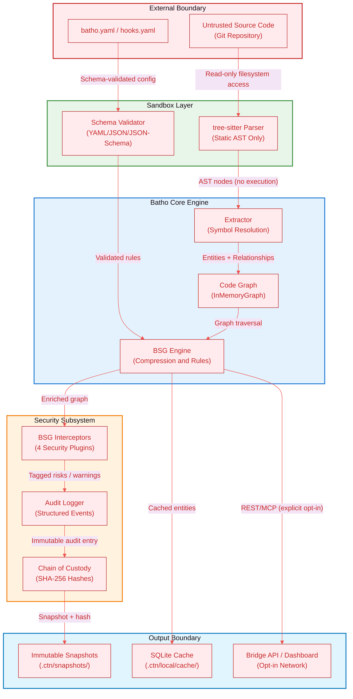
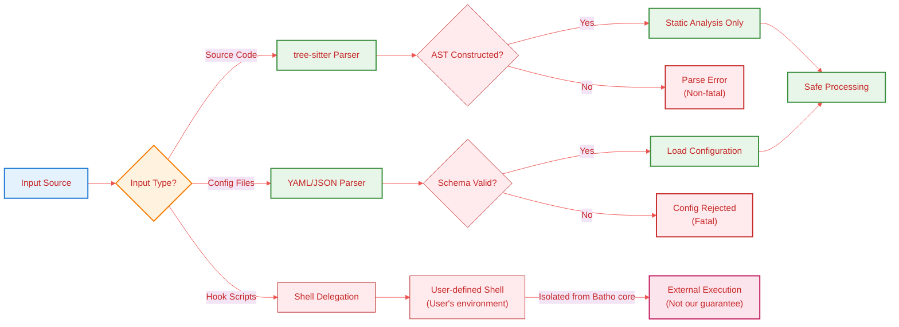
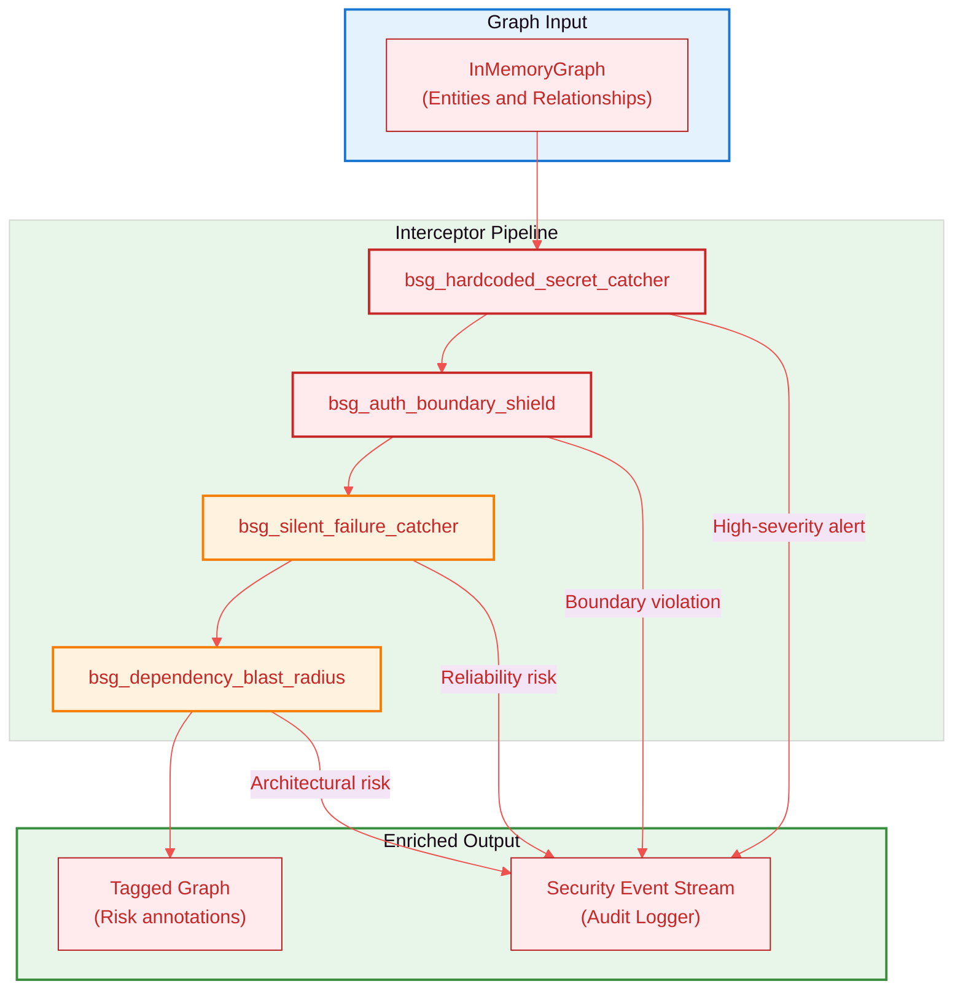
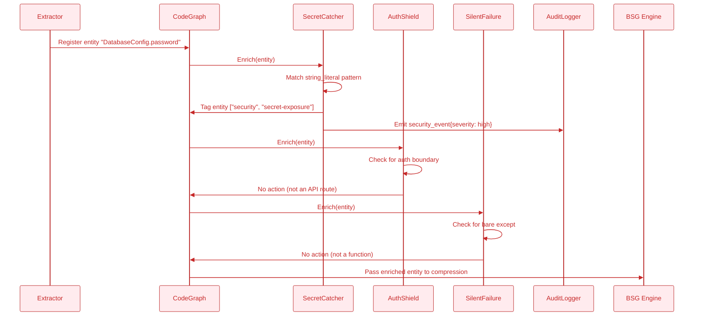
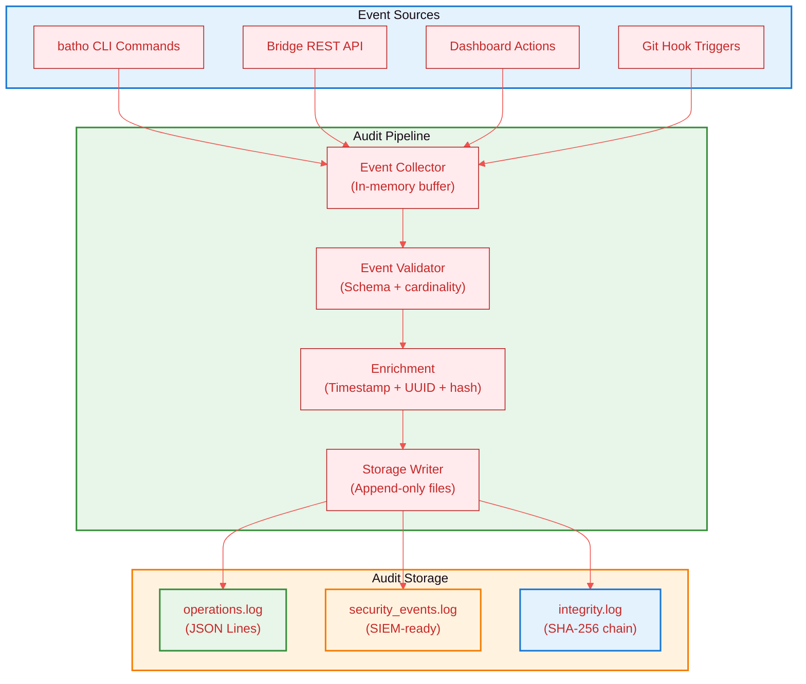
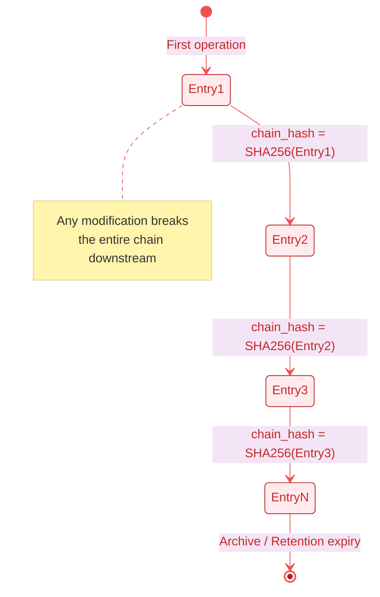
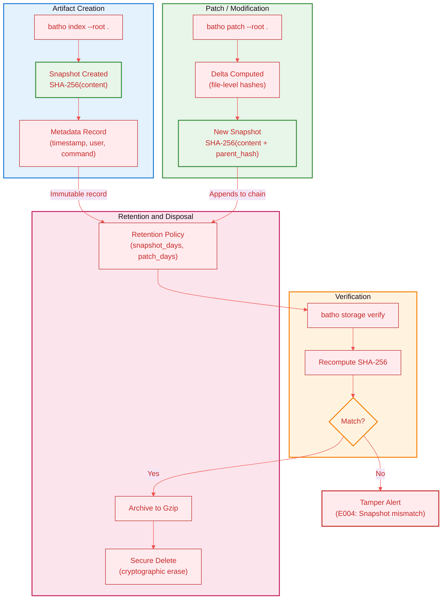
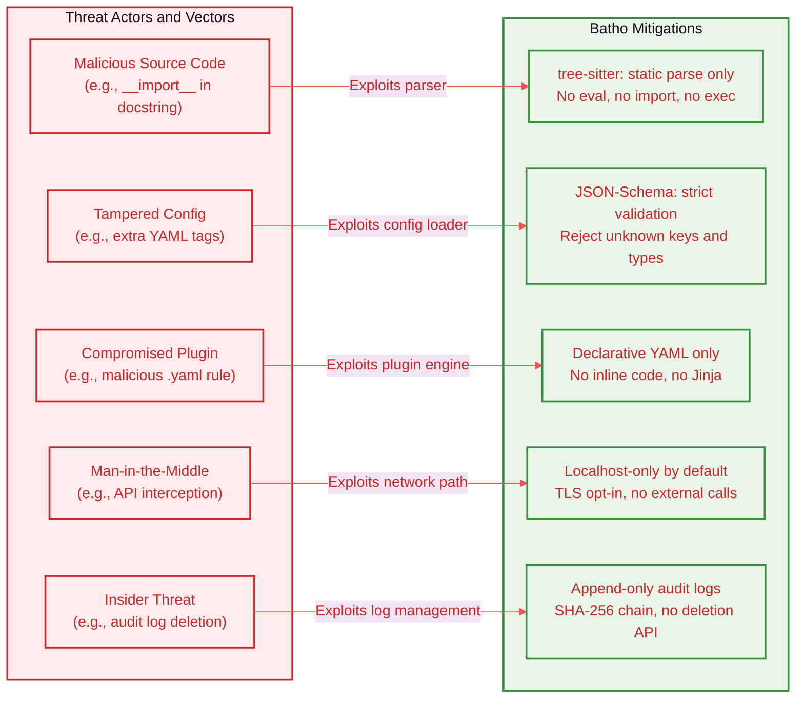

# 9. Security & Governance

## 9.1 Security Architecture Overview

Batho's security model is built on a **zero-code-execution guarantee** with defense-in-depth layers spanning static analysis, plugin-based interception, immutable audit trails, and cryptographic integrity verification. The following architecture diagram illustrates the trust boundaries and data flow through each security layer:



**Figure 12: Security Architecture Overview** - Trust boundaries and data flow through security layers from untrusted input to protected output.

### Trust Boundary Summary

| Boundary | Mechanism | Assurance |
|----------|-----------|-----------|
| **Input** | Read-only filesystem scan | No write access to source |
| **Parsing** | tree-sitter static AST | Zero code execution |
| **Configuration** | JSON-Schema validation | Reject malformed/malicious config |
| **Plugin Execution** | Declarative YAML rules only | No arbitrary code in BSG plugins |
| **Network** | Explicit opt-in per bridge | No outbound by default |
| **Storage** | Local SQLite + JSON files | No cloud exfiltration |

---

## 9.2 Zero-Code-Execution Guarantee

Batho operates entirely via static analysis, ensuring safe operation on untrusted codebases. The following flow diagram details the input sanitization and processing pipeline that maintains this guarantee:



**Figure 13: Zero-Code-Execution Guarantee** - Input sanitization pipeline ensuring safe processing of untrusted code and configurations.

### Processing Guarantees by Input Category

| Input | Processor | Guarantee |
|-------|-----------|-----------|
| Source files | tree-sitter parse only | No execution |
| Config files | YAML/JSON parse + JSON-Schema | Schema validated, no code paths |
| Hook scripts | Shell command delegation | User-defined, auditable, isolated |
| BSG Plugins | Declarative YAML matchers | No imperative logic |

### Security Boundaries

- **Parsing**: No code execution, only syntax tree construction
- **Caching**: SQLite database with parameterized queries (no SQL injection vector)
- **Networking**: Explicit opt-in, no outbound connections by default
- **Storage**: Local filesystem only, no cloud access

---

## 9.3 BSG Interceptor Plugins

Security-focused plugins run during graph construction to detect and tag risks before they enter the compressed output. The interceptor pipeline operates as a non-blocking enricher — detections are tagged, not blocked, allowing the build to continue while surfacing issues.



**Figure 14: BSG Interceptor Pipeline** - Security plugin pipeline that enriches the graph with risk annotations and emits security events.

### Interceptor Catalog

| Plugin | Detects | Severity | Action |
|--------|---------|----------|--------|
| `bsg_hardcoded_secret_catcher` | API keys, tokens in string literals | **High** | Tag entity + log warning + emit security event |
| `bsg_auth_boundary_shield` | Missing auth decorators on API route handlers | **High** | Tag risk boundary + emit governance event |
| `bsg_silent_failure_catcher` | Bare `except:`, swallowed exceptions | Medium | Tag reliability risk + emit quality event |
| `bsg_dependency_blast_radius` | High fan-out modules (>N dependents) | Low | Tag architectural risk + emit advisory event |

### Interceptor Sequence

The following sequence diagram shows how an entity flows through the interceptor pipeline:



**Figure 15: Interceptor Sequence** - Sequence diagram showing how an entity flows through the security interceptor pipeline with enrichment and event emission.

### Plugin Output Schema

```json
{
  "entity_id": "DatabaseConfig.password",
  "entity_type": "variable",
  "tags": ["security", "secret-exposure"],
  "severity": "high",
  "plugin": "bsg_hardcoded_secret_catcher",
  "message": "Hardcoded secret detected in string literal",
  "timestamp": "2026-05-17T14:32:01Z",
  "file_path": "src/config.py",
  "line_number": 42
}
```

---

## 9.4 Audit Logging

All patch operations produce a comprehensive, append-only audit trail. The audit subsystem captures structured events at every phase of the patch lifecycle, enabling post-hoc forensic analysis and compliance reporting.



**Figure 16: Audit Logging Pipeline** - Event collection, validation, enrichment, and storage flow for comprehensive audit trail.

### Audit Event Types

| Event | Fields | Retention |
|-------|--------|-----------|
| `patch_operation_start` | base_snapshot_id, change_count, initiator | 90 days |
| `patch_progress` | processed, total, progress_pct, eta_seconds | 30 days |
| `incremental_patch_complete` | new_snapshot_id, elapsed_seconds, entity_delta | 90 days |
| `security_interceptor_triggered` | plugin, entity_id, severity, message | 1 year |
| `audit_complete` | operation_id, success, metadata_hash | 90 days |
| `api_access` | endpoint, method, client_ip, user_agent | 30 days |

### Audit Log Directory Structure

```
.ctn/local/audit/
├── operations.log          # All patch/index operations
├── security_events.log     # Interceptor + governance events
├── integrity.log          # SHA-256 chain for tamper detection
└── archive/
    ├── operations-2026-04.log.gz
    └── security-2026-04.log.gz
```

### Integrity Chain

Each audit entry includes a chain hash linking to the previous entry, creating a cryptographic tamper-evident log:



**Figure 17: Integrity Chain** - State diagram showing the cryptographic tamper-evident log structure with SHA-256 hash chaining.

---

## 9.5 Compliance & Chain of Custody

Batho maintains a complete chain of custody for all code intelligence artifacts, enabling regulatory compliance scenarios such as SOC 2, ISO 27001, and internal governance audits.



**Figure 18: Chain of Custody Flow** - Artifact lifecycle from creation through modification, verification, and retention with cryptographic integrity checks.

### Compliance Feature Matrix

| Feature | Mechanism | Standard Mapping |
|---------|-----------|-----------------|
| **Immutable Snapshots** | Write-once JSON files with SHA-256 | SOC 2 CC6.1, ISO 27001 A.12.4 |
| **Chain of Custody** | Parent hash linkage across snapshots | SOC 2 CC7.2, ISO 27001 A.12.5 |
| **Integrity Verification** | `batho storage verify --root . --repair` | SOC 2 CC6.7, ISO 27001 A.12.4 |
| **Access Logging** | All API/dashboard access logged | SOC 2 CC6.2, ISO 27001 A.12.4 |
| **Retention Policies** | Configurable `snapshot_days`, `patch_days` | GDPR Article 5(1)(e) |
| **Cryptographic Erasure** | `batho storage cleanup --apply` | GDPR Article 17 |

### Snapshot Integrity Verification

```bash
# Verify all snapshots in the chain
batho storage verify --root . --repair

# Expected output for healthy chain
[INFO] snapshot-v1: SHA-256 verified
[INFO] snapshot-v2: SHA-256 verified (parent: snapshot-v1)
[INFO] snapshot-v3: SHA-256 verified (parent: snapshot-v2)
[SUCCESS] Chain of custody intact: 3 snapshots verified
```

---

## 9.6 Threat Model

The following threat model maps potential risks to Batho components and their mitigations:



**Figure 19: Threat Model** - Mapping of potential security threats to their corresponding Batho mitigations.

### Risk Register

| Risk ID | Threat | Likelihood | Impact | Mitigation | Residual Risk |
|---------|--------|------------|--------|------------|---------------|
| SEC-001 | Parser exploited by polyglot file | Low | High | tree-sitter sandboxed parse | Low |
| SEC-002 | YAML deserialization attack | Low | High | Safe loader + JSON-Schema | Low |
| SEC-003 | Malicious BSG plugin injection | Low | Medium | Declarative-only rules | Low |
| SEC-004 | Audit log tampering | Low | High | SHA-256 chain + append-only | Very Low |
| SEC-005 | Sensitive data in cache | Medium | Medium | Local SQLite, no cloud sync | Low |

---

## 9.7 Security Configuration Reference

Minimal security-hardened `batho.yaml`:

```yaml
batho_version: "1.0"

indexer:
  max_file_size_kb: 500
  max_workers: 0
  metrics_output: ".ctn/local/metrics/metrics.json"

logging:
  level: INFO
  json_format: true          # Structured logs for SIEM ingestion
  audit_enabled: true         # Enable full audit trail

rules:
  enabled: true
  auto_load_all_plugins: false  # Explicit allowlist only
  builtin_plugins:
    - bsg_hardcoded_secret_catcher
    - bsg_auth_boundary_shield
    - bsg_silent_failure_catcher
    - bsg_dependency_blast_radius

storage:
  retention:
    snapshot_days: 90
    patch_days: 90
    max_snapshots: 500
    max_patches: 5000
    audit_days: 365           # Extended audit retention

bridge:
  enabled: false              # Explicit opt-in for network exposure
  host: "127.0.0.1"          # Bind localhost only
  port: 8080
  auth_required: true        # Require API key for all endpoints
```
