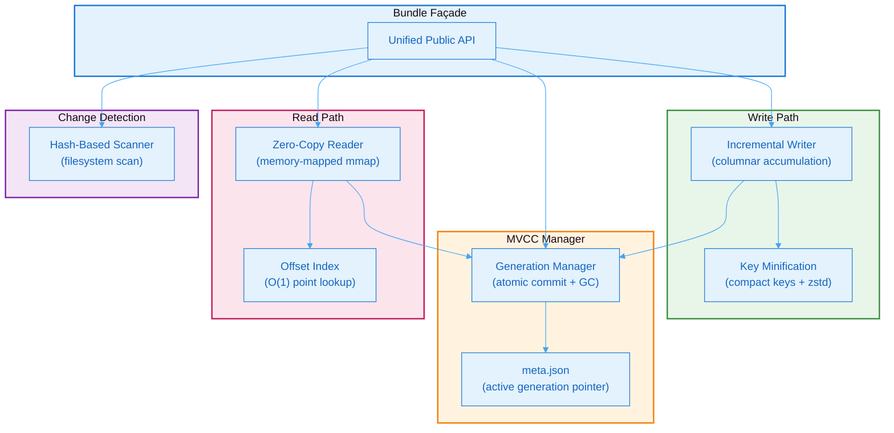
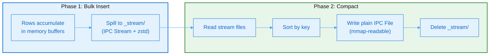
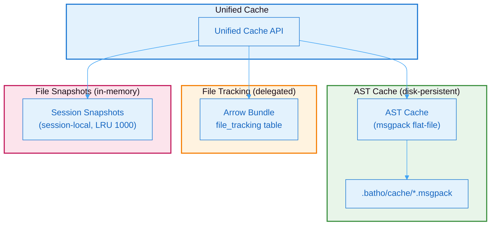

# 3. Storage & Persistence Layer

Batho's storage subsystem provides a pure Apache Arrow IPC-based persistence layer that replaces all SQLite dependencies. It is organized into three components: the **Arrow Bundle** (transport artifact and working copy), the **Arrow Store** (BSG graph scratch space), and the **Unified Cache** (cross-session AST and file tracking).

## 3.1 Arrow Bundle

The Arrow Bundle is the primary durable artifact format. It stores all code intelligence data — entities, relationships, BSG views, file tracking, run metadata, and changelogs — as memory-mappable Arrow IPC files under `.batho/artifact/`.

### Architecture



**Figure 25: Arrow Bundle Architecture** — Component view showing the Bundle façade delegating to writer, MVCC manager, reader, and change detection engine.

### Bundle Façade

The Arrow Bundle exposes a unified public API that replaces the legacy database interface. All Batho commands — build, patch, export, gc, diff, and fix — interact exclusively through this façade. A single shared instance is maintained per repository, ensuring consistent state across all operations.

### MVCC Generation Lifecycle

The Bundle Manager implements a multi-version concurrency control (MVCC) pattern for atomic writes:


**Figure 26: MVCC Generation Lifecycle** — Atomic commit process ensuring zero-copy readers never observe partial writes.

**Key guarantees:**
- Writers commit new Arrow IPC generations atomically by writing to `.tmp` files, renaming to `.v<N>.ipc`, then swapping `meta.json`.
- Active readers continue to hold their memory map on the old generation.
- Old generations are cleaned by `batho gc`.
- Transport ZIP artifacts (`.batho` files) are produced by `batho export --pack`.

### Zero-Copy Reader

The Arrow Bundle reader provides zero-copy, memory-mapped reads with O(1) point lookup:

1. On first access to a logical table, reads the active generation path from `meta.json`.
2. Opens it via memory-mapped I/O (zero-copy).
3. Builds an offset index mapping file IDs to table slices.

Subsequent lookups use the index for O(1) slice operations, avoiding full table scans.

### Incremental Writer

The writer accumulates rows into in-memory column buffers and flushes them as unified, uncompressed IPC files sorted by file ID. A flush threshold of 50,000 rows prevents excessive memory usage during large builds. Remaining rows are flushed before the manager commits the generation.

### Table Schemas

The Arrow Bundle defines seven logical tables under schema version `batho-bundle.v1`:

| Table | Purpose | Key Columns |
|-------|---------|-------------|
| `runs` | Index run metadata | `run_uuid`, `status`, `git_commit`, `entity_count`, `rel_count` |
| `string_dict` | Global string deduplication | `id` (int64), `val` (large_utf8) |
| `file_tracking` | File → hash/mtime/inode/size mapping | `file_id`, `file_path`, `content_hash`, `mtime_ns`, `is_indexed` |
| `agent_views` | BSG agent view entities (compressed) | `file_id`, `entity_id`, `name`, `entity_type`, `signature`, `fqn` |
| `storage_views` | BSG storage view entities (full fidelity) | `file_id`, `entity_id`, `raw_content`, `raw_bytes`, `start_byte`, `end_byte` |
| `rels_views` | BSG relationship view | `file_id`, `source_id`, `target_id`, `relation_type`, `metadata_json` |
| `file_changelog` | Flattened NodeDiff rows for incremental patches | `run_uuid`, `file_id`, `entity_id`, `change_kind`, `changed_fields` |
| `run_artifacts` | Telemetry/metrics/audit JSON per run | `run_uuid`, `context_overview_json`, `telemetry_json`, `security_audit_json` |

### Key Minification

Entity and relationship dictionaries use compact key mapping to reduce serialized payload sizes by 30–40%. For example, `entity_type` is stored as `ty`, `name` as `n`, and `start_line` as `sl`. The `syntax_glue` object is similarly minified.

### Incremental Change Detection

The change detection engine performs native hash-based scanning against the file tracking table. It replaces the legacy Git-based change detection and compares filesystem modification times and SHA-256 hashes:

1. **Unchanged files**: Skipped immediately.
2. **Added/Modified files**: Parsed and merged into the hypergraph.
3. **Deleted files**: Removed from the active index.

---

## 3.2 Arrow Store

The Arrow Store is a persistent Arrow IPC scratch store that replaces the four legacy SQLite scratch tables (`entity_dict`, `query_entities`, `query_relationships`, `dangling_references`).

### Directory Layout

```
.batho/bsg/
├── current/                    ← shared store (build + patch update in-place)
│   ├── entity_dict.ipc         # integer key ↔ entity ID string
│   ├── entities.ipc            # query_entities equivalent (columnar)
│   ├── relationships.ipc       # query_relationships equivalent (columnar)
│   ├── dangling.ipc            # dangling_references equivalent (columnar)
│   ├── meta.json
│   └── _stream/                # staging during bulk-insert (transient)
│       ├── entities_stream.ipc.zst
│       ├── relationships_stream.ipc.zst
│       └── dangling_stream.ipc.zst
│
└── <patch_uuid>/               ← per-patch delta sidecar (changed-file rows only)
    ├── entities.ipc
    ├── relationships.ipc
    └── meta.json
```

### Two-Phase Compaction



**Figure 27: Arrow Store Compaction Pipeline** — Two-phase design separating append-friendly streaming writes from final memory-mapped compacted files.

**Why IPC File format for at-rest files:**
- Supports random access and memory-mapping (zero-copy reads).
- No decompression overhead on every read.
- OS pages in only touched columns/rows.

The `_stream/` staging files use IPC Stream + zstd during bulk-insert because they are append-friendly and transient (deleted after compaction).

### Scratch Store Tables

Schema version: `bsg-arrow-store.v1`

| Table | Purpose | Key Columns |
|-------|---------|-------------|
| `entity_dict` | Integer key ↔ opaque entity ID string | `id` (int64), `val` (large_utf8) |
| `entities` | Columnar entity store | `entity_key`, `entity_name` (dictionary), `entity_type` (dictionary), `fqn`, `file_path` (dictionary), `line_number`, `signature`, `is_exported` |
| `relationships` | Columnar relationship store | `source_key`, `target_key`, `relation_type` (dictionary), `metadata_json` |
| `dangling` | Dangling/unresolved references | `source_key`, `unresolved_target_name` (dictionary), `relation_type` (dictionary) |

Dictionary-encoded columns (`entity_name`, `entity_type`, `file_path`, `relation_type`) reduce memory footprint by 60–80% compared to plain string storage.

### In-Process Metrics

Run metrics are computed in-process using Arrow column operations, replacing 8 SQL queries. The metrics engine reads compacted IPC files and the bundle's file artifacts table to produce context overview, structural metrics, and artifact payload dictionaries.

---

## 3.3 Unified Cache

The Unified Cache service provides disk-persistent AST caching, file tracking delegation, and in-memory file snapshots.

### Cache Architecture



**Figure 28: Unified Cache Architecture** — Delegation layers showing how the Unified Cache routes AST results to msgpack flat-files, file tracking to the Arrow Bundle, and snapshots to in-memory storage.

### Cache Variant System

AST cache entries are tagged with a variant key derived from parsing configuration. This ensures that cache entries produced with different parsing configurations (e.g., bidirectional mode with gap entities vs. standard mode) do not collide. The variant key is a short hash of the schema version, gap inclusion flag, and parsing parameters.

### Pattern-Based Cache Invalidation

Cache invalidation supports three modes:

| Pattern | Behavior | Example |
|---------|----------|---------|
| `*` or `**` | Clear entire cache | All entries removed |
| Exact path | Delete single entry | One file's cache entry removed |
| Directory prefix | Delete by path prefix | All files under a directory removed |
| Glob pattern | Pattern scan + delete | All matching files removed |

The entire read+delete sequence for glob patterns is kept inside a manifest lock to prevent TOCTOU races where freshly written entries could be deleted after the manifest snapshot but before per-file deletion.

### Cache Statistics

Cache statistics provide a unified view across all cache layers:

| Metric | Source |
|--------|--------|
| `ast_cache_enabled` | Whether AST cache directory is configured |
| `snapshot_count` | In-memory snapshot dict size |
| `file_tracking_count` | Rows in bundle `file_tracking` table |
| `bundle_dir` | Active artifact directory path |
