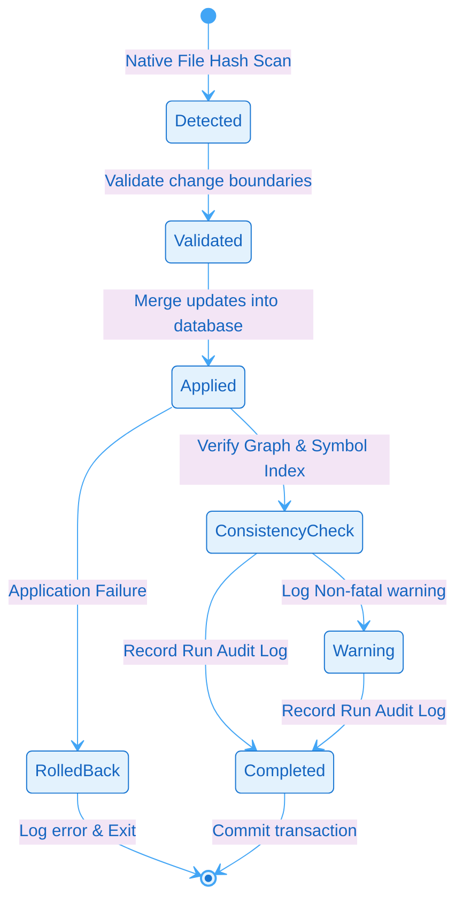

# 7. Time Machine & Incremental Patching

## 7.1 Arrow Bundle Run Format

Batho manages index runs and history inside a unified Arrow IPC database (`.batho` directory). Each time code is analyzed (via `build` or `patch`), a new run record is created with its corresponding metadata.

### Run Schema Structure
A run record is written with the following schema:
- `run_uuid`: Unique identifier for the run.
- `base_run_uuid`: Parent run ID (null for baseline builds).
- `created_at`: Creation timestamp.
- `completed_at`: Completion timestamp.
- `commit_hash`: Git commit hash at the time of indexing.
- `metadata`: JSON blob containing context overviews, metrics, and file category stats.

## 7.2 Incremental Patch Lifecycle

The patch lifecycle ensures atomic, content-hash-based updates:

**Figure 8: Incremental Patch Lifecycle** - State diagram showing the atomic update process using content-hash comparisons.

### Native Change Detection
Unlike legacy versions of Batho, which delegated change detection to Git status, Batho v1.2.0 reads the `file_tracking` table in the Arrow database. It compares the current filesystem modification time (`mtime`) and SHA-256 hash of each file:
1. **Unchanged files**: Skipped immediately (saving tree-sitter parsing cycles).
2. **Added/Modified files**: Parsed and merged into the hypergraph.
3. **Deleted files**: Removed from the active nodes and relations index.

This native tracking eliminates false positives caused by untracked or uncommitted files in developer environments.

## 7.3 CLI Commands

Under the v1.2.0 command taxonomy, the Time Machine is controlled by the following commands:

### `batho build`
Performs the initial baseline build. If the database already exists, it prompts the developer to run `batho patch`. Use the `--full` option to wipe the database and perform a clean baseline build.

### `batho patch`
Triggers the native content-hash scan. It compares files on disk with the `file_tracking` table, parses only the modifications, and commits the incremental changes as a new run in the database.

### `batho diff`
Queries node-level changes. Developers can inspect what specific classes, functions, or variables changed in a given run, across file revisions, or throughout an entity's history.

### `batho gc`
Cleans up the database. Includes subcommands to delete specific runs (`gc run`), delete runs older than N days (`gc runs --older-than`), sweep orphaned files (`gc vacuum`), or view storage metrics (`gc status`).
